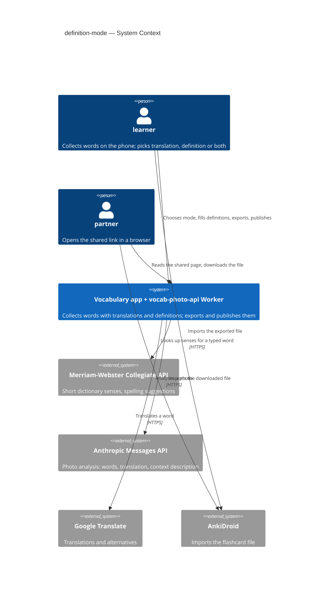
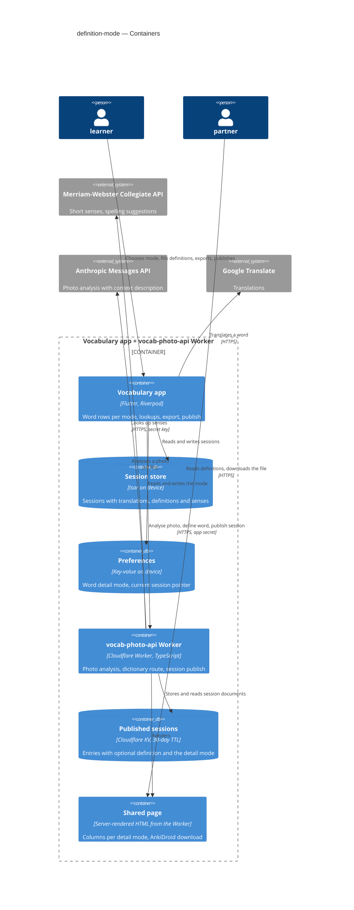
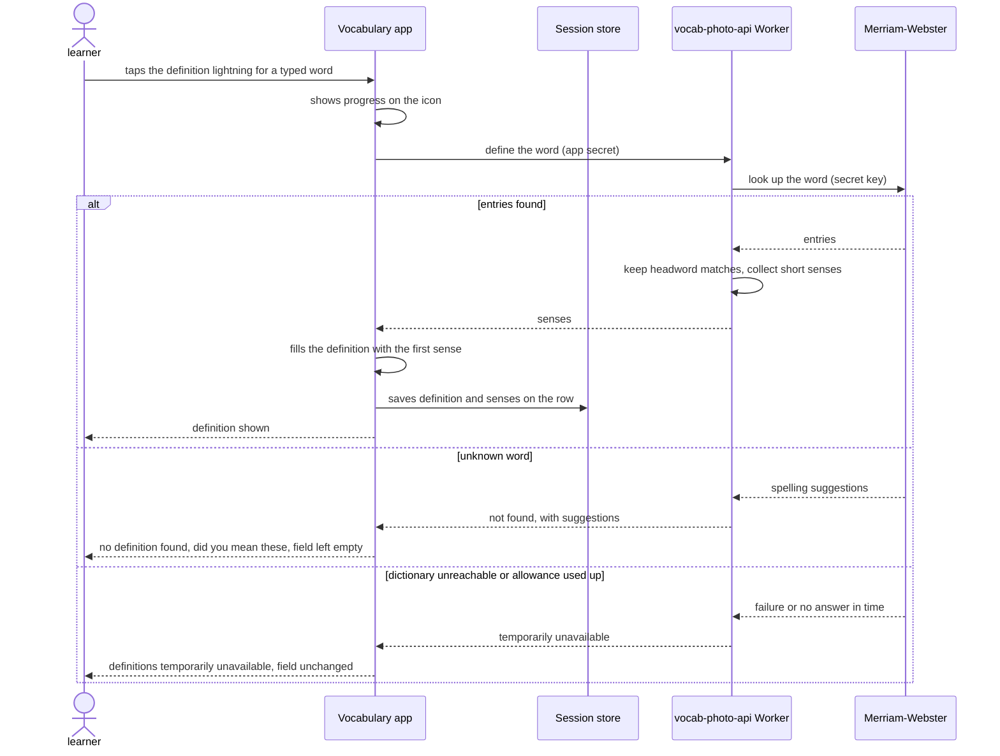
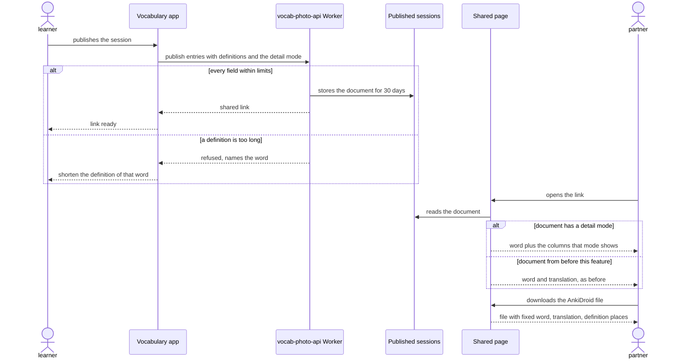

# Software Architecture Document — definition-mode

<!-- 12 Arc42 sections. Empty section → <!-- N/A: <one-line reason> -->. -->
<!-- C4 Context (L1) lives inline in §3. C4 Container (L2) lives inline in §5. -->
<!-- Numbers in §10 come VERBATIM from spec.md §6 NFR — no inventing, no rounding. -->

## 1. Introduction and goals

**Intent.** Let the learner see a word's English definition beside or instead of its translation — filled from the photo analysis for photo words, or from the dictionary on demand for typed words — and carry it into the words table, the AnkiDroid file and the partner's shared page, all following one learner-chosen word detail mode ([spec §1–§2](./spec.md)).

**Top-3 quality goals (1-liners; full scenarios in §10):**

1. **Data integrity and compatibility** — switching the word detail mode never loses a translation or definition, and sessions and shared links created before this feature keep working (spec AC-11, AC-13, AC-17).
2. **Graceful degradation and quota safety** — dictionary lookups happen only on a learner tap, and a dictionary outage or exhausted allowance never breaks the screen or the translation features (spec AC-07, §6 "Dictionary lookups").
3. **Responsiveness** — lightning fill ≤ 1,000 ms p95 and senses list ≤ 1,500 ms p95 (spec §6).

**Stakeholders.**

| Role | Interest | Sign-off owner? |
|---|---|---|
| learner | chooses the mode, fills and studies definitions, exports and publishes | No |
| partner | reads definitions on the shared page and downloads the AnkiDroid file from it | No |
| Tech Lead (Maksym, app owner) | SAD approval, D10 key decision, licence check | Yes |

- Decision override: no separate security review, despite spec §6.1 "Security review: Required" — rationale: the new secret lives only as a Worker secret (ADR-0002), never in the app or git, and all new text reuses the existing page and file escaping plus the Worker's 500-character limit; one-owner project (critic resolution, 2026-09-27).

## 2. Constraints

**Technical.**
- App: Flutter, Dart SDK `>=3.0.0 <4.0.0`; `flutter_riverpod` / `riverpod_annotation` 2.6.x with `riverpod_generator` (providers in `lib/core/providers.dart`); `go_router` 17.2.3 with typed routes.
- Persistence: `isar_community` **pinned exactly to `3.3.0-dev.1`** (the last release on `build 2.x`, see [`docs/architecture.md`](../../architecture.md) rule 6) — any new field on `WordPair` means a `build_runner` regeneration and committed `.g.dart`; `shared_preferences` 2.5.5 already holds the `current_session_id` pointer.
- Network: `http` 1.2.2 — the only HTTP client; the dictionary call uses it (no new package).
- Worker (`vocab-photo-api/`): TypeScript 5.6, `wrangler` 4, `compatibility_date` 2025-01-01. Published sessions live in the `SESSIONS` KV namespace with a 30-day TTL; `parseEntries` (`src/session/types.ts`) keeps **only** `word` and `translation`, caps each field at 500 characters and a session at 500 entries. The photo endpoint already supports `with_desc=true`, and the app already requests it.
- Worker verification: no test runner — `npm run typecheck` plus `wrangler dev` + curl.

**Organisational.**
- One owner (Maksym) builds, reviews and deploys; no deadline; effort budget ≈ 1 week.
- Worker deploy is a manual `wrangler deploy` by the owner.

**Conventions.**
- [`CLAUDE.md`](../../../CLAUDE.md) rules 1–6 and [`docs/architecture.md`](../../architecture.md) §2: typed routes only; services via providers; screen data in a `@riverpod` notifier, controllers/focus/loading flags in widget `State`; no new or removed packages; no new domain models (a new field on `WordPair` is not a new model).
- Override — CLAUDE.md rule 3 ("do not change how anything looks") is scoped to structural refactors. This feature changes the row layout **only in definition and both modes**, as the spec asks; translation mode stays pixel-identical (spec AC-02) and its code is branched around, not rewritten. Risk tracked in §11.
- Override — CLAUDE.md rule 5 ("no new domain models — ask first"): `DefinitionResult` (§5) is a plain response type beside its service, like `translation_result.dart`, not a stored domain model; approved by the owner during design (2026-09-27). Tracked in §11.
- Verification per [`docs/tasks/README.md`](../../tasks/README.md) "How to check a task": `dart run build_runner build --delete-conflicting-outputs`, `flutter analyze`, `flutter test`, the `CLAUDE.md` greps, and `npm run typecheck` in `vocab-photo-api/`.

**Regulatory / external.**
- The dictionary's free key is non-commercial, 1,000 calls/day; whether its text may appear on a public shared link and in exported files is an open question (spec §8) — tracked in §11.
- No personal data added (spec §6.1). Published sessions stay readable by anyone holding the link for 30 days (D4).

## 3. Context and scope

The learner collects English words on their phone — from a photo of a highlighted page or by typing — and now sees each word's definition beside or instead of its translation, according to one word detail mode. Definitions come from two places: the photo analysis writes a context-fitting one for photo words, and an external dictionary supplies senses for typed words on demand. Definitions then leave the phone the same ways words already do: in the AnkiDroid file and on the partner's shared page.

<!-- brownfield: Flutter app (feature folders, Riverpod providers, Isar sessions, typed go_router routes) + a Cloudflare Worker (`vocab-photo-api/`) that analyses photos via an AI model and publishes sessions to a 30-day KV-backed shared page; the Worker's publish validation currently keeps only word + translation. No architecture-map.md; scanned 2026-09-27. -->

**External systems (in / out):**

| Actor or system | Type | Interaction |
|---|---|---|
| learner | Person | chooses the word detail mode; captures, types, fills and edits definitions; exports and publishes |
| partner | Person | opens the shared link in a browser; reads definitions; downloads the AnkiDroid file from the page |
| Merriam-Webster Collegiate API | System (external) | answers a word with short senses, or with spelling suggestions for an unknown word — **new** in this feature |
| Anthropic Messages API | System (external) | photo analysis: returns highlighted words with translation and a context-fitting description — unchanged, already asked for descriptions |
| Google Translate endpoint | System (external) | translations and alternative translations — unchanged by this feature |
| AnkiDroid | System (external) | imports the exported file on the learner's or the partner's device — file format changes (a definition column) |

**Trust boundary.** Everything returned by the dictionary and the photo analysis, and everything the learner types, is untrusted text: it is escaped wherever it is rendered as HTML (shared page, AnkiDroid file) and bounded in length where it crosses into the Worker.

**C4 Context (L1):**



## 4. Solution strategy

**Target surfaces:** `mobile-app` (the Flutter app), `backend-service` (the vocab-photo-api Worker: publish API and the new dictionary route), `web-frontend` (the partner's shared page and its AnkiDroid download) — [ADR-0001](./adr/0001-change-app-worker-and-shared-page-as-three-surfaces.md). UI architecture per surface is fixed by the repo, not re-decided: the app stays Flutter (cross-platform, feature folders, Riverpod); the page stays server-rendered HTML from the Worker with no client-side build.

**Top strategic choices (the seeds for ADRs):**

1. **One word detail mode drives every view, never the data** — the mode is a learner preference (kept across restarts on the device, outside sessions) that decides what rows show and what the table, file and page carry; it never adds or deletes a stored translation or definition, and "filled" is mode-independent (word plus translation or definition). Serves quality goal 1. Inline decision — the preference lives beside the drag-mode preference, persisted with the store the app already uses for small settings.
2. **Dictionary behind our Worker** — the app asks the Worker for a word's senses; the Worker holds the dictionary key as a secret and normalises the answer (headword filter, spelling suggestions). Serves quality goals 2 and 3 — [ADR-0002](./adr/0002-proxy-dictionary-lookups-through-the-worker.md).
3. **Definitions stored like translations** — each row keeps the chosen definition text and the senses already fetched, so reopening the senses list costs no lookup; photo descriptions are stored instead of discarded. Serves quality goals 1 and 2 — [ADR-0003](./adr/0003-store-definition-text-and-senses-on-the-word-row.md).
4. **A versioned-by-default shared contract** — published sessions carry an optional definition per entry and the mode at publishing time; documents without a mode read as translation-only, so old links render as today; the Worker ships before the app — [ADR-0004](./adr/0004-record-the-detail-mode-in-the-published-session.md). The AnkiDroid file gains a fixed definition column, identical from the app and from the page — [ADR-0005](./adr/0005-export-anki-files-with-a-fixed-definition-column.md).

Each tactical decision in later sections should trace to one of these seeds. Tactical decisions that *contradict* a strategic choice are red flags — surface them in §11.

## 5. Building block view

The app keeps its existing style — feature folders over a shared `core/` (models, services, providers), Riverpod for services and screen data, controllers and per-row flags in widget `State` ([`docs/architecture.md`](../../architecture.md)). The feature **extends existing modules** rather than adding a feature folder: definitions are a detail of the word row, so the row, the settings screen, the words table and the publish service grow in place, and the one new service sits in `core/services/` next to the translation service it mirrors. The Worker keeps its route-per-module layout: one new route module for dictionary lookups, and the existing `session/` module extended.

**Internal decomposition:**

```
lib/
├── core/
│   ├── models/word_pair.dart          + definition, definitionOptionsJson, definitionMarkedFilled
│   ├── models/definition_result.dart  NEW  senses + spelling suggestions for one word
│   ├── services/dictionary_service.dart NEW  asks the Worker's dictionary route (ADR-0002)
│   ├── services/session_publish_service.dart  + definition per entry, + detail mode (ADR-0004)
│   └── providers.dart                 + dictionaryServiceProvider, + wordDetailModeProvider (persisted)
├── features/
│   ├── settings/settings_screen.dart  + three-way word detail mode
│   ├── word_input/
│   │   ├── word_input_screen.dart     + per-row definition state; photo description → definition
│   │   └── widgets/
│   │       ├── word_row_item.dart     layout branches per mode (translation branch untouched)
│   │       ├── definition_dots_button.dart      NEW  senses popup trigger (popup_menu_2, as translation)
│   │       └── definition_options_content.dart  NEW  the senses list
│   └── words_table/
│       ├── words_table_screen.dart    columns per mode; filled = word + translation or definition
│       └── anki_export.dart           fixed definition column (ADR-0005)
vocab-photo-api/src/
├── define.ts                          NEW  dictionary route: key from secret, headword filter, suggestions
├── index.ts, routing.ts               register the new route
└── session/
    ├── types.ts                       optional definition (≤500 chars), detail mode, blank = all three empty
    ├── page.ts                        columns per detail mode; old documents = translation only; "Definitions: Merriam-Webster" attribution when definitions are shown
    └── anki.ts                        fixed definition column (ADR-0005)
```

**C4 Container (L2):**



## 6. Runtime view

Participants are the §5 containers. Messages are semantic; the endpoint-level contract arrives at the `api` stage.

**Critical flow 1: filling a typed word's definition (lightning), with the not-found and unavailable branches** — spec AC-05, AC-06, AC-07; the senses list (AC-08) reuses the stored senses and takes the same path only when none are stored.



**Critical flow 2: publishing in definition mode and the partner opening the link** — spec AC-16, AC-17, AC-19, AC-20.



## 7. Deployment view

The app is built and installed on the owner's phone as today; the Worker is deployed with `wrangler deploy` from `vocab-photo-api/`. This feature adds one Worker secret — the dictionary key, stored with `wrangler secret put MW_API_KEY`, never in git or in the app — and one KV namespace, `DEFINITIONS`, declared in `wrangler.jsonc` beside `SESSIONS`. **Deploy order: Worker first, then the app** (ADR-0004): an older Worker silently drops definitions and has no dictionary route.

**Dictionary cache (inline decision, not an ADR).** The Worker caches each **successful** lookup — the word's short senses — in `DEFINITIONS`, keyed by the lowercased word, for **30 days** (the same lifetime as published sessions; KV expiry, no clean-up job). "Not found" and failures are never cached, so an outage cannot stick. The alternative, no cache, was rejected to stretch the 1,000/day allowance across repeated words. If the licence check (§11) rules out storing dictionary text, the fix is deleting the namespace and the cache read/write — about an hour. *Note: §5 (container diagram and file tree) and §6 flow 1 were approved before this decision, so neither draws the cache: `DEFINITIONS` is a second KV store owned by the Worker beside "Published sessions"; `define.ts` reads it before calling the dictionary and writes it after a successful lookup; flow 1 gains a cache-hit branch (served without a dictionary call) — drawn by the `sequences` stage.*

**Monitoring:**
- One Worker log line per lookup: outcome (`cache hit` / `found` / `not found` / `unavailable`) and duration — read with `npx wrangler tail`.
- Daily lookups that reached the dictionary = `found` + `not found` + `unavailable`; the provider's own dashboard is the authority on the 1,000/day count.
- App side: the existing debug-log timing pattern (a stopwatch around the request, as the photo request does) around the definition lookup, for the spec §6 latency checks.

**Scaling thresholds:**
- Comfortable while dictionary-reaching lookups stay under ~500/day (half the free allowance).
- Above ~500/day on any day: check cache hit rate first; if the free allowance is still at risk, a paid plan or a per-day cap in the Worker becomes an owner decision.
- `DEFINITIONS` stays small: one entry per distinct word looked up in 30 days.

## 8. Crosscutting concepts

| Concept | Convention | Where defined |
|---|---|---|
| Services and state | Services via providers in `lib/core/providers.dart`; screen data in a `@riverpod` notifier; controllers, focus nodes, loading flags in widget `State` | [`docs/architecture.md`](../../architecture.md) §2 |
| Word detail mode | One keep-alive provider, persisted under a single preferences key (`word_detail_mode`), default translation; never stored on a session | here, §4 seed 1 |
| "Filled" row | One helper decides filled = non-empty word **and** (translation **or** definition), mode-independent; used by the words table, export, publish and the auto-added empty row | here, spec AC-12 |
| Data never deleted by mode | Mode only changes what is shown and exported; hidden translation/definition stay stored | feature `CONTEXT.md` invariant |
| Worker authentication | `x-app-secret` header on every app → Worker call, including the new dictionary route | existing, `vocab-photo-api` |
| Dictionary outcomes | The Worker returns exactly three outcomes — senses / not found with suggestions / temporarily unavailable — never the dictionary's raw format; headword filter applied in the Worker | here, ADR-0002, §6 flow 1 |
| Timeouts | Worker → dictionary 4 s; app → Worker dictionary route 6 s (existing: translate 15 s, publish 20 s) | here |
| Field limits | Word, translation and definition each ≤ 500 characters, checked in the Worker; a row is blank only when all three are empty | `src/session/types.ts`, ADR-0004 |
| Escaping | All dictionary, photo and typed text is escaped as HTML on the page (`escapeHtml`) and in the AnkiDroid file (`ankiField`) | existing, `page.ts` / `anki_export.dart` / `anki.ts` |
| Error handling | `SessionStore` never throws; a failed lookup leaves the field unchanged and shows a plain message (snackbar) | existing, [`docs/architecture.md`](../../architecture.md) §3 |
| Logging | Worker: one line per lookup with outcome + duration; app: debug-log stopwatch around the lookup | §7 |
| Internationalisation | N/A — UI copy stays in its current English/Ukrainian mix; definitions are English by nature | — |

## 9. Architecture decisions

| # | Title | Status | Section |
|---|---|---|---|
| [0001](./adr/0001-change-app-worker-and-shared-page-as-three-surfaces.md) | Change the app, the Worker API and the shared page as three surfaces | Accepted | §4 |
| [0002](./adr/0002-proxy-dictionary-lookups-through-the-worker.md) | Proxy dictionary lookups through the Worker | Accepted | §4 |
| [0003](./adr/0003-store-definition-text-and-senses-on-the-word-row.md) | Store the definition text and its senses on the word row | Accepted | §4 |
| [0004](./adr/0004-record-the-detail-mode-in-the-published-session.md) | Record the detail mode in the published session | Accepted | §4 |
| [0005](./adr/0005-export-anki-files-with-a-fixed-definition-column.md) | Export AnkiDroid files with a fixed definition column | Accepted | §4 |

ADR files live under `docs/features/definition-mode/adr/NNNN-<title>.md`. Inline decisions (no ADR, below the blast-radius gate): the mode preference's storage (§4 seed 1), extending existing modules (§5), the 30-day dictionary cache (§7), the §8 conventions.

## 10. Quality requirements

**QG-1. Data integrity and compatibility**
- **When:** the learner switches both → definition → translation → both on a session with translations and definitions; opens a session created before this feature; or the partner opens a link published before this feature.
- **Then:** every translation and definition is exactly as before (spec AC-11); the older session opens normally with empty definitions (AC-13); the old link shows word and translation as before, and its AnkiDroid download works (AC-17). Rows with a word and a definition but no translation count as filled in every mode (AC-12).
- **How verify:** unit tests on `WordPair` (JSON round trip, copy, empty defaults) and on the "filled" helper; a session-store test that loads a pre-feature session; against `wrangler dev`, store a document without `detail` or `definition` and fetch its page and file.

**QG-2. Graceful degradation and quota safety**
- **When:** the dictionary cannot be reached or its daily allowance is used up, and the learner taps the definition lightning or opens the senses list; or the learner takes a photo in any mode.
- **Then:** the definition stays as it was, the learner is told definitions are temporarily unavailable, and translation features keep working (AC-07). Dictionary lookups happen "only on a learner tap — 0 per photo, 0 per keystroke" (spec §6).
- **How verify:** a unit test of the dictionary service with the Worker answering "temporarily unavailable" and timing out; a widget check that the field is unchanged; the Worker log shows no lookup lines during a photo capture.

**QG-3. Responsiveness**
- **When:** the learner taps the lightning for a typed word, or opens the senses list, on mobile data.
- **Then:** "lightning tap until definition filled" ≤ 1,000 ms p95, and "senses list open until senses shown" ≤ 1,500 ms p95 (spec §6).
- **How verify:** "on-device timing log around the lookup, 20 taps over a week" (spec §6), split by cache hit vs dictionary call from the Worker log.

## 11. Risks and technical debt

| Risk / debt | Severity | Mitigation | Owner |
|---|---|---|---|
| Deploy-order skew: an app released before the Worker publishes definitions that the old Worker silently drops, and has no dictionary route | Medium | Worker first, then the app — a checklist step in the Worker task; the app shows "temporarily unavailable" if the route is missing | Maksym |
| Translation-mode layout regression (CLAUDE.md rule 3 scoped by the §2 override) | Medium | Translation branch left untouched in `word_row_item.dart`; screenshot comparison before/after on one device (spec AC-02) | Maksym |
| A third field per row adds to the fragile dots popup / focus logic around row 0 | Medium | Widget tests for the definition dots and lightning; re-run the existing close-race and row-0 tests; same popup package and controller pattern as translation | Maksym |
| Dictionary allowance exhausted (abuse or heavy use) | Low | Tap-only lookups, stored senses per row, 30-day Worker cache, per-lookup log lines (§7) | Maksym |
| AnkiDroid needs a 3-field note type once for the new column | Low | Import steps in `vocab-photo-api/README.md` and the app's share sheet copy | Maksym |
| `lib/config/vocab_api_config.dart` is tracked by git despite CLAUDE.md rule 4 | Low | Accepted — the dictionary key goes to a Worker secret instead (ADR-0002); untracking the file is a separate clean-up | Maksym |
| Open architectural decision: may the free dictionary's text be cached, shown on a public shared link and exported? | Open question | Resolve before the first Worker deploy (owner moved this from spec §8's "before sdd:design" on 2026-09-27: it blocks deploying, not building); default: yes, with "Definitions: Merriam-Webster" attribution on the page; if no, drop the cache (§7) and keep dictionary senses on the device only | Maksym |
| `DefinitionResult` is a new type despite CLAUDE.md rule 5 | Low | Owner-approved override (§2): response type only, never stored; the row stores text + JSON (ADR-0003) | Maksym |
| A hidden translation or definition can go stale after the word is edited | Low | Resolved 2026-09-27 (spec §8): the hidden text is kept; its stored alternatives (translation options, dictionary senses) are dropped on word change, so the dots offer a reload | Maksym |

**Accepted debt (acceptable in v1, plan to fix later):**
- `lib/features/word_input/word_input_screen.dart` grows beyond its ~1,300 lines with parallel per-row definition lists; the parallel-lists clean-up stays optional ([`docs/architecture.md`](../../architecture.md) §3).
- Photo definitions (one contextual sentence from the photo analysis) read differently from dictionary senses (short, generic); both are stored as the same field.

## 12. Glossary

| Term | Meaning |
|---|---|
| learner | The phone owner who collects words into sessions and exports them ([`CONTEXT.md`](../../../CONTEXT.md)). |
| partner | Opens a session's shared link; no app, no account. |
| session | A set of words collected together, stored on the learner's device. |
| word row | One line of a session: an English word with its details. |
| translation | The Ukrainian equivalent of an English word in a word row. |
| definition | A short English explanation of a word's meaning — from the photo analysis or picked from the dictionary's senses ([feature `CONTEXT.md`](./CONTEXT.md)). |
| word detail mode | The learner's choice in Settings — translation, definition or both — applied to every word row and every output. |
| senses | The dictionary's short meanings for a word; stored on the row and cached by the Worker; the senses list lets the learner pick one. |
| detail | The word detail mode recorded in a published session; absent in documents from before this feature, which read as translation. |
| filled row | A word row with a non-empty word and a translation or a definition — the same rule in every mode. |
| dictionary route | The Worker path the app calls to get a word's senses; it holds the dictionary key and returns one of three outcomes. |
| dictionary cache | The Worker's 30-day store of successful lookups, keyed by the lowercased word. |

