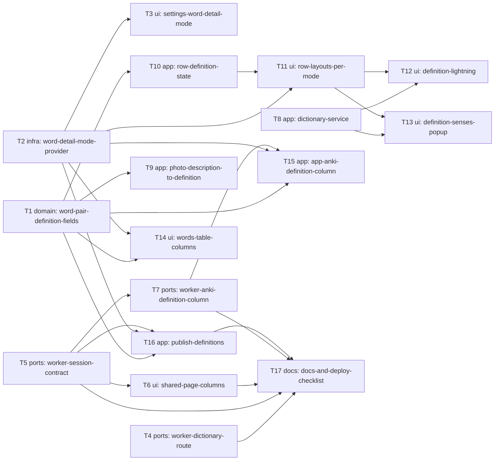

# Epic — definition-mode

> **Spec:** [spec.md](../spec.md) · **Design:** [sad.md](../sad.md) · **ADRs:** [adr/](../adr/) · Data model / API: not produced (optional stages skipped on route `standard`; the contract lives in ADR-0002 and ADR-0004)

## Goal

The learner chooses translation, definition or both; every word row shows that detail, photo words arrive with a context definition, typed words get one from the dictionary in a tap or a pick, and definitions reach the words table, the AnkiDroid file and the partner's shared page ([spec §2](../spec.md)).

## Scope

- **In:** the app (`mobile-app`: settings, word rows, lookups, table, export, publish), the Worker (`backend-service`: dictionary route + cache, session contract, Anki file), the shared page (`web-frontend`) — per `sad.md` `target_surfaces`.
- **Out:** changing how translations are sourced; dictionary audio; a "fill all definitions" action; back-filling old sessions (spec §3).

## Task map

Parallel lanes at the start: T1 (model), T2 (mode), T4 (Worker dictionary), T5 (Worker sessions) and T8 (app dictionary service) have no dependencies. Tasks sharing `word_input_screen.dart` (T9–T13) or `words_table_screen.dart` (T14–T16) serialize by file overlap.

## Tasks

See [tracker.md](./tracker.md) for status. Machine contract: [tasks.json](../tasks.json).

| # | Task | Layer | Blocked by | DoD (short) |
|---|---|---|---|---|
| T1 | Add definition fields and the filled-row helper to WordPair | domain | — | Unit tests: JSON round trip and `copy()` keep all three new fields; defaults are empty/nul… |
| T2 | Add the persisted word detail mode provider | infra | — | Unit test: fresh preferences → `translation`; after `set(definition)` a new container read… |
| T3 | Add the three-way word detail mode to Settings | ui | T2 | Widget test: three options shown, Translation selected on a fresh install; tapping Definit… |
| T4 | Add the Worker dictionary route with the 30-day cache | ports | — | `npm run typecheck` clean. |
| T5 | Accept definitions and the detail mode in published sessions | ports | — | `npm run typecheck` clean. |
| T6 | Render shared-page columns from the detail mode | ui | T5 | `npm run typecheck` clean. |
| T7 | Write the fixed definition column in the Worker AnkiDroid file | ports | T5 | `npm run typecheck` clean. |
| T8 | Add DictionaryService and DefinitionResult in the app | app | — | Unit tests with `MockClient`: senses parsed; not-found returns suggestions; a 5xx, malform… |
| T9 | Store photo descriptions as definitions | app | T1 | Test: a photo result with translation + description fills both; one with description only… |
| T10 | Keep per-row definition state in the input screen and notifier | app | T1 | Notifier tests: definition saved and restored; reorder and remove keep definitions aligned… |
| T11 | Lay out word rows per word detail mode | ui | T2, T10 | Widget tests: each mode builds the expected fields and hides the others. |
| T12 | Fill a definition from the lightning icon | ui | T8, T11 | Widget tests with a fake service: fills first sense; not-found leaves the field empty and… |
| T13 | Pick a sense from the definition dots popup | ui | T8, T11 | Widget tests: stored senses open without a lookup; tapping a sense replaces the text; with… |
| T14 | Show words-table columns per mode with the filled rule | ui | T1, T2 | Widget test: a definition-only row is listed in every mode; columns match each mode. |
| T15 | Write the fixed definition column in the app AnkiDroid export | app | T1, T2, T7 | Byte-level tests for each mode, including a definition with tabs, newlines and markup; out… |
| T16 | Publish definitions and the detail mode | app | T1, T2, T5 | MockClient tests: body carries definitions and `detail` per mode; the too-long refusal sur… |
| T17 | Update architecture docs and the deploy checklist | docs | T4, T5, T6, T7, T16 | Checklist followed once end to end on the real Worker; an existing pre-feature link render… |

## Risks / Hard rules

- **Deploy order:** T5 (and T4, T6, T7) deployed before any app build that publishes definitions or calls the dictionary route (ADR-0004, sad §11).
- **Translation mode unchanged:** T11 branches around the translation layout; screenshot comparison is part of its DoD (spec AC-02, sad §2 override).
- **No new packages**; `DefinitionResult` is the one owner-approved new type (sad §2).
- **Lookups only on a tap:** no task may call the dictionary from the photo path or on keystrokes (spec §6).
- **Licence open question** (sad §11) must be answered before T17's deploy.
