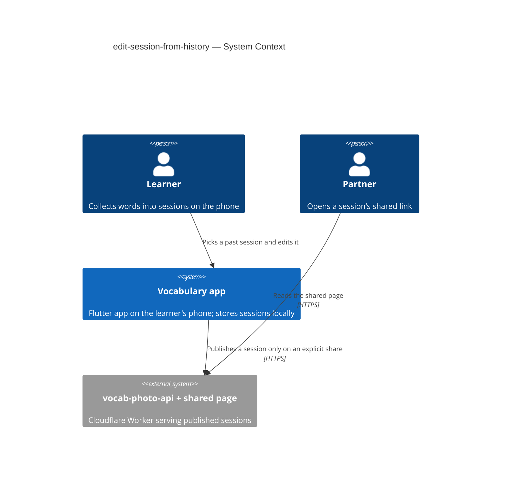
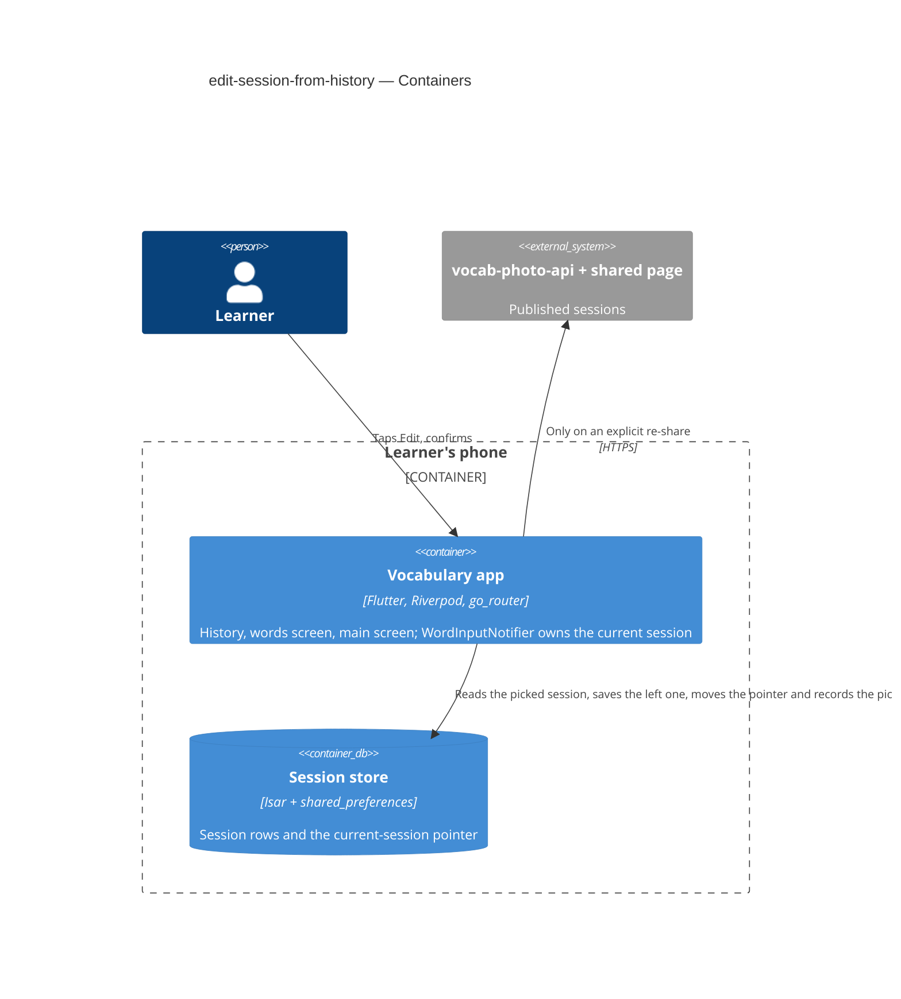
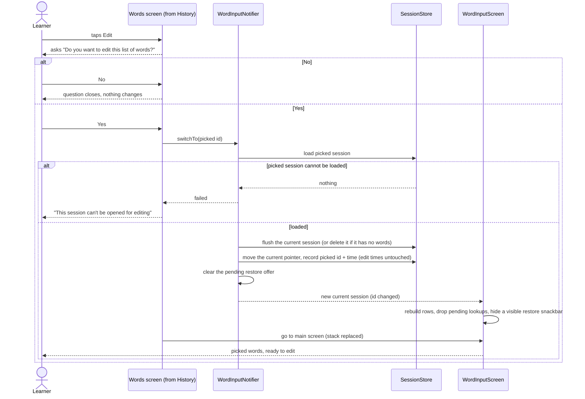
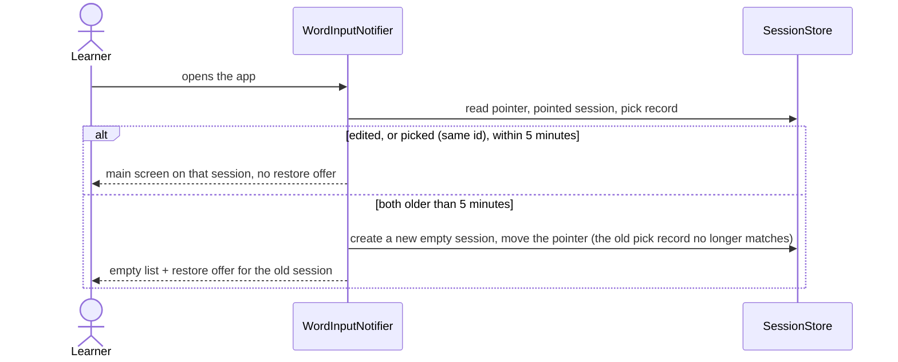

# Software Architecture Document — edit-session-from-history

<!-- 12 Arc42 sections. Empty section → <!-- N/A: <one-line reason> -->. -->
<!-- C4 Context (L1) lives inline in §3. C4 Container (L2) lives inline in §5. -->
<!-- Numbers in §10 come VERBATIM from spec.md §6 NFR — no inventing, no rounding. -->

## 1. Introduction and goals

**Intent.** Let the learner carry on with any earlier session: the words screen opened from a History row gets a red Edit button that, after a Yes, makes that session the current session and opens it on the main screen, without losing a word from either session ([spec](./spec.md) §2).

**Top-3 quality goals (1-liners; full scenarios in §10):**

1. No word is lost across a switch — neither from the session left nor from the one picked, and no late lookup lands in the wrong one.
2. The switch feels instant: Yes → main screen with the picked words in ≤ 1 s.
3. Nothing that exists today looks different — the only visual additions are the button and the question.

**Stakeholders.**

| Role | Interest | Sign-off owner? |
|---|---|---|
| learner | switches sessions and keeps editing on the phone | No |
| partner | an open shared page does not change unless the learner shares again | No |
| Tech Lead (Maksym) | SAD approval | Yes |

## 2. Constraints

**Technical.**
- Flutter, Dart SDK `>=3.0.0 <4.0.0`; `flutter_riverpod` / `riverpod_annotation` 2.6.x with `riverpod_generator`; `go_router` 17.2.3 with typed routes (`lib/router/routes.dart`).
- Persistence: `isar_community` pinned to `3.3.0-dev.1` holds `Session` rows; `shared_preferences` holds the `current_session_id` pointer (`SessionStore`). This feature adds **no field** to any Isar model — only one more `shared_preferences` entry beside the pointer: the picked session's id plus the pick time (ADR-0002).
- `WordInputNotifier` (`keepAlive`) owns the current session; `WordInputScreen` mirrors it into its own per-row lists and already rebuilds them when the notifier's session id changes (the RESTORE path, `word_input_screen.dart` `ref.listen` → `_restoreFromStore`).

**Organisational.**
- One owner builds, reviews and ships; no deadline; effort budget ≤ 1 day (XS).

**Conventions.**
- [`CLAUDE.md`](../../../CLAUDE.md) rules 1–6 and [`docs/architecture.md`](../../architecture.md): typed routes only (no `Navigator.push`); services via providers; screen data in the `@riverpod` notifier, controllers/focus/loading flags in widget `State`; no new packages; no new domain models; rule 3 — only the new button and question change the look.
- Verification per [`docs/tasks/README.md`](../../tasks/README.md): `build_runner`, `flutter analyze`, `flutter test`, the `CLAUDE.md` greps.

**Regulatory / external.**
- <!-- N/A: no data leaves the phone; no personal data added (spec §6.1). -->

## 3. Context and scope

The learner uses the app on their phone. Sessions are already stored on the phone and listed in History; this feature only changes which stored session is current. Nothing new crosses the phone's boundary: the Worker and the shared page are untouched, and the partner sees a change only when the learner shares again through the existing flow.

<!-- brownfield: the RESTORE swap in WordInputNotifier.restorePrevious() + WordInputScreen's session-id listener already implement "make stored session X current and reload the main screen"; this feature reuses that path. -->

**External systems (in / out):**

| Actor or system | Type | Interaction |
|---|---|---|
| learner | Person | opens a past session from History, taps Edit, confirms |
| partner | Person | reads the shared page; no interaction with this feature |
| vocab-photo-api (Worker) + shared page | System (internal) | untouched; receives a session only on an explicit re-share |

**C4 Context (L1):**



## 4. Solution strategy

**Target surface:** `mobile-app` only — the change lives entirely in the Flutter app; the Worker and shared page are not touched (spec §3). Single existing surface, no new container ⇒ no ADR. UI architecture is the app's existing one (Flutter + Riverpod + go_router), unchanged.

**Top strategic choices:**

1. **Reuse the RESTORE swap, generalised** — a new `WordInputNotifier.switchTo(sessionId)` does what `restorePrevious()` does for any stored session, and the main screen reloads through its existing session-id listener. No second editing surface, no copying words between sessions. → [ADR-0001](./adr/0001-make-a-history-session-current-by-swapping-the-notifiers-session.md)
2. **Remember the pick beside the pointer, not in the session** — the switch saves the picked session's id and a "switched at" time next to the current-session pointer; the launch rule treats the session it opens as warm if it was edited **or** picked (ids match) within 5 minutes. Edit times — and so History order — change only on real edits. → [ADR-0002](./adr/0002-remember-the-switch-time-beside-the-current-session-pointer.md)
3. **Late lookups are dropped, not redirected** — every async result on the main screen checks it still belongs to the current session before writing. → [ADR-0003](./adr/0003-ignore-lookup-results-that-return-after-a-switch.md)

## 5. Building block view

The existing feature-folder layout; the change is additive inside three folders and touches no service or model.

**Internal decomposition:**

```
lib/
├── core/services/session_store.dart      + switchedAt(sessionId) → the pick time only if that session was the one picked;
│                                           setSwitched(sessionId, at) — written by switchTo, never cleared
├── features/words_table/words_table_screen.dart   + red Edit FAB (only when sessionId != null and != current),
│                                           the Yes/No question, the error snackbar, WordInputRoute().go()
├── features/word_input/word_input_notifier.dart   + switchTo(sessionId): load → flush/drop current → pointer + setSwitched
│                                                   → clear restorableSessionId → state; launch rule case 3 also honours
│                                                   switchedAt(prev.sessionId)
├── features/word_input/word_input_screen.dart     + session-id guard after every awaited lookup/photo result (ADR-0003);
│                                                   hides a visible RESTORE snackbar when the session id changes
└── features/history/history_screen.dart           unchanged (already reads nonEmptySessionsProvider, marks "current")
```

**C4 Container (L2):**



## 6. Runtime view

**Critical flow 1: switch to a past session**



**Critical flow 2: relaunch after a switch**



## 7. Deployment view

<!-- N/A: reuses the existing app build; no Worker, storage or infra change. -->

## 8. Crosscutting concepts

| Concept | Convention | Where defined |
|---|---|---|
| Navigation | `const WordInputRoute().go(context)` — `go` replaces the stack, so Back leaves the app | `lib/router/routes.dart`, CLAUDE.md rule 1 |
| State ownership | The switch lives in `WordInputNotifier`; the button, question and error snackbar live in the words screen's widget | `docs/architecture.md` §2 |
| Error handling | `switchTo` returns false when the picked session is missing; the screen shows a snackbar; the store never throws | `session_store.dart` class doc |
| Async result guard | Capture the current session id before an `await`; after it, write only if the id is unchanged | ADR-0003 |
| Timestamps | Edit times (`updatedAt`, `lastLocalModifiedAt`) change only on a real edit; a switch records the picked id + time beside the pointer; the launch rule honours it only for that id | ADR-0002 |

## 9. Architecture decisions

| # | Title | Status | Section |
|---|---|---|---|
| 0001 | Make a History session current by swapping the notifier's session | Accepted | §4 |
| 0002 | Remember the switch time beside the current-session pointer | Accepted | §4 |
| 0003 | Ignore lookup results that return after a switch | Accepted | §4 |

ADR files live under `docs/features/edit-session-from-history/adr/NNNN-<title>.md`.

## 10. Quality requirements

**QG-1. No lost words**
- **When:** the learner types a word and switches within the save delay, or a lookup is still running at the switch.
- **Then:** Words lost across a switch: 0 — the left session keeps every typed word, and no late result appears in the picked session.
- **How verify:** widget test: type a word, switch within the save delay, check both sessions; plus a notifier test that a result written after a switch is ignored.

**QG-2. Switch time**
- **When:** the learner taps Yes on a session of ≤100 words.
- **Then:** the main screen shows the picked words in ≤ 1 s.
- **How verify:** manual check on the learner's phone, release build.

**QG-3. No visual change**
- **When:** History, the words screen and the main screen are compared before and after.
- **Then:** 0 differing areas outside the new button and question.
- **How verify:** side-by-side screenshots of History, words screen and main screen before/after (CLAUDE.md rule 3).

## 11. Risks and technical debt

| Risk / debt | Severity | Mitigation | Owner |
|---|---|---|---|
| A lookup path on the main screen is missed by the ADR-0003 guard and still writes into the picked session | Medium | Enumerate every `await` that ends in a notifier write during the task; one test per path kind (translation, definition, photo) | Maksym |
| The red FAB conflicts with the "no visual change" rule if another FAB is later added to the words screen | Low | The words screen has no FAB today; revisit if one is added | Maksym |

| The launch rule gains a second time source; a stale pick could keep a wrong session warm | Low | The pick record carries its session id and counts only for that session, so no clearing is needed; launch-rule tests per case, including two relaunches within 5 minutes of a pick and a dangling pointer falling back to the newest session | Maksym |

**Accepted debt:**
- `restorePrevious()` and `switchTo()` overlap; `restorePrevious` may later become `switchTo(restorableSessionId)`. Not refactored now (CLAUDE.md rule 3 — no rewrites beyond the task).
- RESTORE still re-stamps `lastLocalModifiedAt` (task-03), so a restored session jumps to the top of History while a switched one does not. Left as is; aligning RESTORE with ADR-0002 is a later cleanup.

## 12. Glossary

| Term | Meaning |
|---|---|
| current session | The one session the main screen is editing; History marks it "current" ([CONTEXT](../../../CONTEXT.md)) |
| switch | Making a past session the current session through the Edit button |
| late result | A translation, definition or photo answer that returns after the session it was requested for stopped being current |
