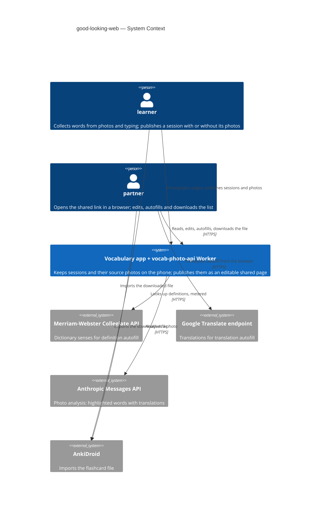
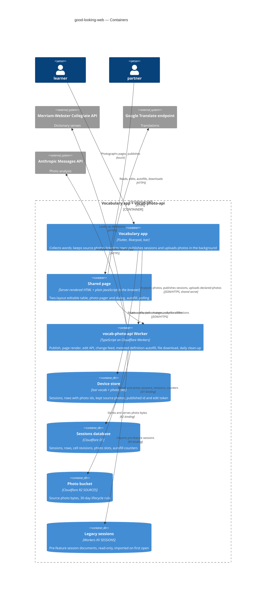
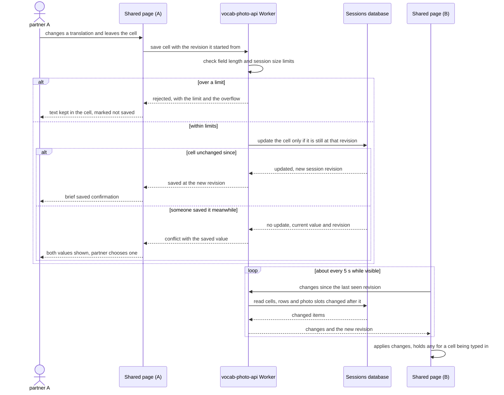
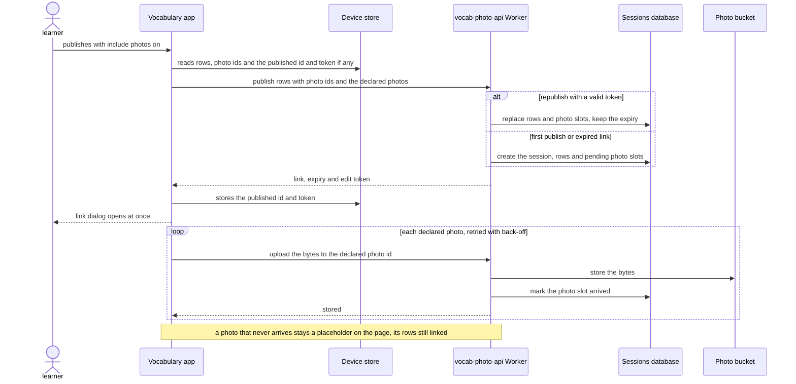
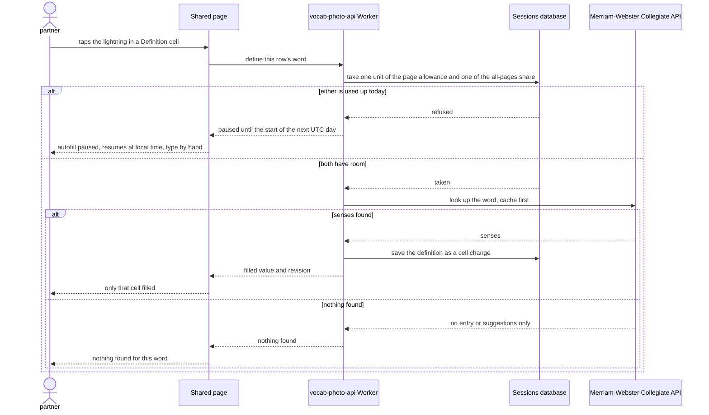

# Software Architecture Document — good-looking-web

<!-- 12 Arc42 sections. Empty section → <!-- N/A: <one-line reason> -->. -->
<!-- C4 Context (L1) lives inline in §3. C4 Container (L2) lives inline in §5. -->
<!-- Numbers in §10 come VERBATIM from spec.md §6 NFR — no inventing, no rounding. -->

## 1. Introduction and goals

**Intent.** Turn the shared page from a read-only printout into a working tool for the partner at the learner's table: a spreadsheet-like word table that anyone holding the link can edit, whose columns take the width their content needs up to a per-column maximum, in a wide layout (table beside a photo pager that highlights each photo's rows) and a phone layout (table scrolling both ways, photos in a swipeable dialog). Translation and definition cells, and each of those two columns, get a lightning for autofill; definition autofill is bounded by a per-page allowance so shared pages can never use the app's share of the dictionary quota. On the app side, the learner's phone keeps each source photo with the rows recognised from it and publishes the photos only when "include photos" is on. Edits live only on the shared page and in the AnkiDroid file downloaded from it — nothing flows back into the app (spec §2, §3).

**Top-3 quality goals (1-liners; full scenarios in §10):**

1. **Edit integrity under concurrent editing** — no lost edits: every save either lands or comes back as a conflict the partner resolves; other partners' saved edits appear within 10 s without reload.
2. **A bounded public write surface** — shared pages never use the app's reserved share of the dictionary quota; the per-page allowance, the row / field / session-size limits and a write rate limit hold; photos of a session published without them cannot be reached at all.
3. **Readable on any device** — a 100-row table renders readably on a phone on 4G within the spec's first-render target, with no page-level sideways scroll at 360 px.

**Stakeholders.**

| Role | Interest | Sign-off owner? |
|---|---|---|
| partner | Reads, edits, adds, deletes and autofills words on the shared page; downloads the AnkiDroid file | No |
| learner | Publishes a session, chooses whether its source photos go out; receives the corrected list through the downloaded file | No |
| Tech Lead (Maksym) | SAD approval | Yes |
| Security Lead (Maksym) | Security review of the new public write surface and the published photos (spec §6.1) | Yes |

<!-- Decision overrides (¶4) — populated by the critic resolution loop, empty otherwise. -->

## 2. Constraints

**Technical.**
- Worker (`vocab-photo-api/`): TypeScript 5.6, `wrangler` 4, `compatibility_date` 2025-01-01, **no runtime npm dependencies** (only `typescript`, `wrangler`, `@cloudflare/workers-types` as dev dependencies).
- Worker bindings today (`wrangler.jsonc`): `SESSIONS` KV — one JSON `SessionDocument` per published session under `session:<id>`, written with a 30-day `expirationTtl` (D4); `DEFINITIONS` KV — the dictionary cache (30-day TTL); `SOURCES` R2 — photo bytes under `sessions/<sessionId>/sources/<sourceId>`, an optional binding (photo routes answer 503 without it); `RATE_LIMITER` — 20 requests / 60 s per IP, applied to the secret-gated routes only (the public page and its sources are not rate-limited).
- Photo publishing half-exists: `POST /sessions/<id>/sources` (secret-gated) stores a photo in R2 and appends a `PhotoSource` to the document; `GET /s/<id>/sources/<sourceId>` serves it publicly. The app has never called the upload route.
- Session limits live in `src/session/types.ts`: `MAX_ENTRIES` 500, `MAX_FIELD_CHARS` 500, `MAX_SESSION_JSON_BYTES` 256 KB, `MAX_SOURCES` 10 — spec §6 keeps them unchanged.
- **Workers KV semantics:** eventually consistent (a write can take up to ~60 s to be visible at other edge locations), last-write-wins with no compare-and-swap, about 1 write per second per key. On KV alone, spec AC-11 / AC-12 and the "0 lost edits" NFR cannot be guaranteed; the store for editable sessions is a §4 decision.
- Shared page (`src/session/page.ts`): HTML built from template strings with inline CSS; every value passes `escapeHtml`; **no client-side JavaScript and no bundler** today. The AnkiDroid file (`src/session/anki.ts`) is built on the fly from the stored document, with definition-mode ADR-0005's fixed column places.
- Dictionary: Merriam-Webster Collegiate free key — 1,000 calls/day, non-commercial; `/define` (secret-gated) caches hits in `DEFINITIONS`; the daily limit is not counted in code today.
- App: Flutter, Dart SDK `>=3.0.0 <4.0.0`; `flutter_riverpod` / `riverpod_annotation` 2.6.x with `riverpod_generator`; `go_router` typed routes; `isar_community` **pinned exactly to `3.3.0-dev.1`** ([`docs/architecture.md`](../../architecture.md) rule 6) — any new field on `Session` / `WordPair` needs a `build_runner` regeneration and committed `.g.dart`; `http` is the only HTTP client; `image_picker` + `screenshot` capture photos.
- App photo handling today: a photo is scaled (`PhotoScaler`), sent to `/analyze`, then discarded; `WordPair` has no link to a photo and `Session` has no photo list.
- Worker verification: no test runner — `npm run typecheck` plus `wrangler dev` + curl.

**Organisational.**
- One owner (Maksym) builds, reviews and deploys; no deadline; the Worker deploy is a manual `wrangler deploy`.
- Size kept at M by the spec's decision override (spec §1), with the photo-publishing half expected to get its own ADRs here.

**Conventions.**
- [`CLAUDE.md`](../../../CLAUDE.md) rules 1–6 and [`docs/architecture.md`](../../architecture.md) §2: typed routes only; services via providers in `lib/core/providers.dart`; screen data in a `@riverpod` notifier, controllers/focus/loading flags in widget `State`; no new or removed packages without asking.
- Override — CLAUDE.md rule 3 ("do not change how anything looks") is scoped to structural refactors. This feature redesigns the shared page by intent and adds an "include photos" switch to the app's share sheet (spec US-11); the app's input screen and words table stay pixel-identical. Tracked in §11.
- Override — CLAUDE.md rule 5 ("no new domain models — ask first"): the app must remember a session's source photos — a photo reference on `WordPair` and a photo list on `Session`; the exact shape is decided in §5. Approved by the owner during design (2026-09-27). Tracked in §11.
- Verification per [`docs/tasks/README.md`](../../tasks/README.md): `dart run build_runner build --delete-conflicting-outputs`, `flutter analyze`, `flutter test`, the `CLAUDE.md` greps, and `npm run typecheck` in `vocab-photo-api/`.

**Regulatory / external.**
- Source photos may show incidental personal data and are public to anyone with the link for 30 days (spec §6.1, D4); they are published only with the learner's "include photos" switch on.
- R2 has no per-object TTL: the 30-day age-out of photos depends on a bucket lifecycle rule that the README asks for but the repo cannot prove is configured — tracked in §11.
- The dictionary's non-commercial key and whether its text may appear on a public page remain open from definition-mode — tracked in §11.
- No new identity fields: edits are anonymous (D6).

## 3. Context and scope

The learner collects English words on the phone, from a photo of a book page or by typing, and publishes a session as a time-limited link. The partner opens that link in a browser at the learner's table, reads the words beside the pages they came from, corrects, adds and removes words, fills missing translations and definitions with a tap, and downloads the corrected list as an AnkiDroid file. The learner's own copy in the app never changes; the downloaded file is the only way the page's edits come back.

<!-- brownfield: Flutter app (feature folders, Riverpod providers, Isar sessions, typed go_router routes; photos discarded after /analyze) + a Cloudflare Worker (`vocab-photo-api/`) with SESSIONS/DEFINITIONS KV, a SOURCES R2 bucket and a per-IP rate limiter; the shared page is a server-rendered template with no client JS; a photo upload route exists but is unused. No architecture-map.md; scanned 2026-09-27. -->

**External systems (in / out):**

| Actor or system | Type | Interaction |
|---|---|---|
| partner | Person | Opens the shared link in any browser; reads, edits, adds, deletes and autofills words; views source photos; downloads the AnkiDroid file |
| learner | Person | Takes photos and types words in the app; publishes a session with or without its source photos; imports the downloaded file |
| Merriam-Webster Collegiate API | System (external) | Definition autofill — reached only through the Worker, which meters it (per-page allowance + the app's reserved share of 1,000 calls/day) |
| Google Translate endpoint (`translate.googleapis.com/translate_a/single`) | System (external) | Translation autofill on the shared page (spec OQ-1 default: called from the partner's browser, not metered); the app's own translations are unchanged |
| Anthropic Messages API | System (external) | Photo analysis in the app — unchanged; the photo it analysed is now kept and linked to the rows it produced |
| AnkiDroid | System (external) | Imports the file downloaded from the shared page — fixed column places unchanged (definition-mode ADR-0005) |

**Trust boundary.** The link is the only credential, now for writing as well as reading. Everything that arrives from a browser — cell text, row operations, autofill requests — is untrusted: validated against the session limits and rate-limited in the Worker, and rendered only as text on the page and in the file (spec §6.1). Text returned by the dictionary and the translation endpoint is equally untrusted and is treated the same way.

**C4 Context (L1):**



## 4. Solution strategy

**Top strategic choices (the seeds for ADRs):**

1. **Three surfaces: the app, the Worker API and the shared page** ([ADR-0001](adr/0001-change-app-worker-api-and-shared-page-as-three-surfaces.md)) — `target_surfaces: [mobile-app, backend-service, web-frontend]`. The app keeps and publishes photos (US-11, US-12), the Worker stores editable sessions and meters autofill, and the page becomes an editing client. The app stays Flutter (cross-platform, no UI-architecture change); the page's UI architecture is choice 2.
2. **Server-rendered table, enhanced with plain JavaScript** ([ADR-0002](adr/0002-render-the-table-on-the-server-and-enhance-it-with-plain-javascript.md)) — the Worker still renders the complete table, so it is readable before any script runs (quality goal 3); one framework-free script served by the Worker adds editing, conflicts, Undo, polling, the pager and the dialog. The two layouts are CSS media queries on one DOM, so a width change never re-renders or loses typed text (AC-36). No new package, no build step.
3. **Editable sessions and autofill counters in D1** ([ADR-0003](adr/0003-store-editable-sessions-and-autofill-counters-in-d1.md)) — KV cannot give "0 lost edits" (sad §2), so sessions, rows, cell revisions, photo slots and both counters move to one D1 database with conditional writes. New publishes go to D1; links published before this feature are imported from `SESSIONS` KV on first open. A daily cron trigger deletes sessions past their 30 days (D4).
4. **Optimistic concurrency with a revision per cell** ([ADR-0004](adr/0004-detect-edit-conflicts-with-a-revision-per-cell.md)) — every write raises the session's revision; each cell remembers the revision of its last change; a save applies only if the cell is still at the revision the partner started from, else both values come back for the partner to choose (AC-11). Delete-with-Undo is client-side: the delete is sent after 5 s with the row's three cell revisions, so a change made meanwhile cancels it (AC-15, AC-15b).
5. **Polling for changes since the last seen revision** ([ADR-0005](adr/0005-poll-for-changes-since-the-last-seen-revision.md)) — every ~5 s, paused while the tab is hidden; the answer carries changed cells, new rows, deleted-row tombstones and newly arrived photos (AC-12, AC-37).
6. **Photos declared at publish, bytes uploaded after** ([ADR-0006](adr/0006-declare-source-photos-in-the-publish-payload-and-upload-bytes-after.md)) — the app ids each photo when it is taken; the publish request lists up to 10 photos and each row's photo id; the link dialog opens at once and the bytes follow in the background with retries; an undelivered photo is a placeholder in its place (AC-37). With "include photos" off, nothing about photos is sent (AC-24).
7. **Translation autofill from the partner's browser** ([ADR-0007](adr/0007-call-the-translation-endpoint-from-the-partners-browser.md)) — the page calls the same free translation endpoint the app uses, unmetered (spec OQ-1 default); a spike in Chrome and Safari is the first task, with a Worker proxy as the fallback if it fails.
8. **Republishing overwrites the same link** ([ADR-0008](adr/0008-overwrite-the-same-link-when-a-session-is-republished.md)) — the app keeps the published id and an edit token on its `Session`; a republish replaces the page's rows and photos under the same link and expiry, after a warning in the share sheet (spec OQ-4 default).

**Tactical decisions that follow (inline, no ADR):**

- **Metering** lives in D1 beside the data (ADR-0003): a definition lookup from a page first takes one unit of that page's allowance (50 per UTC day) and one unit of the all-pages share (500 per UTC day), both as "increment only while below the limit"; if either is spent, the page gets "paused until 00:00 UTC" (AC-18, AC-18b). Every lookup counts, found or not; a column autofill counts one per cell (AC-20). The app's own `/define` calls are not counted — pages simply stop at 500 of the 1,000 (AC-29). Translation autofill is not metered (choice 7).
- **Column autofill** runs in the browser as a sequence of single-cell lookups in table order (AC-19, AC-20), each saved like a partner's edit (choice 4), so it reports progress and stops cleanly when the allowance runs out.
- **Columns shown** are derived from the data, not from the published detail mode (spec §1 decision revising definition-mode ADR-0004 for the page): a column with no text collapses to an "add" control local to that partner's page (AC-21, AC-22). The downloaded file keeps definition-mode ADR-0005's fixed places and is built from D1 (AC-30, AC-31).
- **Numbers kept at the spec's defaults:** 50 lookups per page per day and 500 for all pages (spec OQ-2), the first 10 photos taken (spec OQ-3), the layout breakpoint and column maximum widths chosen at `screens` (spec OQ-5) — see §11.

Each tactical decision in later sections should trace to one of these seeds. Tactical decisions that *contradict* a strategic choice are red flags — surface them in §11.

## 5. Building block view

The feature extends the two existing codebases in their own styles rather than adding a new one. The Worker keeps its flat module layout (`index.ts` routing table → handler modules → store functions): the `session/` module grows an editing API, a D1-backed store and a browser script, and a small `autofill/` module holds metering. The app keeps its feature-folder layout (CLAUDE.md, [`docs/architecture.md`](../../architecture.md)): photo keeping and upload are services behind providers in `core/`, the models gain fields plus one embedded type, and only the input screen and the words table's share sheet change. The shared page is the third container: server-rendered HTML from the Worker plus one plain-JavaScript file the Worker serves (ADR-0002).

**Internal decomposition:**

```
vocab-photo-api/
├── wrangler.jsonc          + d1_databases: DB; + triggers.crons (daily clean-up); SESSIONS KV kept read-only
├── migrations/             D1 SQL migrations (written at data-model)
└── src/
    ├── index.ts            routing table: + edit, change-feed, autofill, script routes; + scheduled() handler
    ├── define.ts           dictionary lookup, reused by page autofill (unchanged contract for the app)
    ├── autofill/
    │   └── meter.ts        per-page allowance + all-pages share: conditional increments in D1
    └── session/
        ├── types.ts        + declared sources, sourceId per row, cell revisions, limits unchanged
        ├── handlers.ts     publish (declared photos, republish with edit token), photo upload to a declared id
        ├── edit.ts         save cell / add row / delete row / change feed — revision checks (ADR-0004, ADR-0005)
        ├── store.ts        D1 repository: sessions, rows, cells, photo slots; lazy import of legacy KV documents
        ├── page.ts         SSR table: data-driven columns, wide + phone layouts in CSS, pager / thumbnail markup
        ├── client/page.js  the browser script (JSDoc + checkJs), served as a text module
        ├── anki.ts         AnkiDroid file from D1 rows (fixed column places, ADR-0005 of definition-mode)
        └── cleanup.ts      cron: delete expired sessions and their rows, slots and counters

lib/ (Flutter app)
├── core/models/
│   ├── session.dart        + sources: List<SourcePhoto>; + publishedId, editToken (ADR-0008)
│   ├── word_pair.dart      + sourceId (null for typed rows)
│   └── source_photo.dart   NEW @embedded: id, file name, taken-at (the rule-5 override, sad §2)
├── core/services/
│   ├── source_photo_store.dart     NEW: writes / reads / deletes kept photo files in the app documents dir
│   ├── photo_upload_service.dart   NEW: background upload of declared photos with retries (AC-37)
│   └── session_publish_service.dart  + sources, sourceId, republish token; returns the token
├── core/providers.dart     + sourcePhotoStoreProvider, photoUploadServiceProvider
└── features/
    ├── word_input/         on a photo: keep its file, tag recognised rows with its id
    └── words_table/        share sheet: "include photos (N)" switch + 30-day notice; republish warning
```

**Kept photo copy (inline decision).** When a photo is taken, `PhotoScaler` produces two copies in its background isolate: the existing 640 px (shorter side, JPEG 85) copy that goes to `/analyze`, and a 1600 px (shorter side, JPEG 80, roughly 300–500 KB) copy that `source_photo_store` keeps as a file in the app documents directory and that is published. The larger copy keeps small book print readable when the partner zooms in the photo dialog (AC-07) while three photos still upload within the spec's 30 s on 4G. Kept photos live as long as their session; device storage growth is tracked in §11. A photo with no linked row at publishing time is not a source photo and is not declared (CONTEXT: source photo).

**C4 Container (L2):**



## 6. Runtime view

Three flows are seeded here, one per strategic risk; the `sequences` stage adds the rest (every spec §5 AC as a flow or a branch). Participants are the §5 containers.

**Critical flow 1: a partner saves a cell, and another partner's page picks it up** (AC-09, AC-10, AC-11, AC-12 — ADR-0004, ADR-0005)



**Polling stops when nobody is using the page** (owner's remark during design, 2026-09-27). The page polls only while it is visible **and** the partner has interacted with it in the last 5 minutes: a tap, click, key press, scroll or focus on a cell counts as activity, and so does the partner's own save or autofill. After 5 minutes without activity the page stops polling and shows a quiet "updates paused" hint, so a forgotten or abandoned tab stops sending empty requests. The first interaction after that resumes polling with an immediate catch-up poll from the last seen revision, so nothing is missed (ADR-0004's revisions make the catch-up exact). A hidden tab pauses at once, as before. The hint's look is decided at `screens`.

**Critical flow 2: the learner publishes a session with its photos** (AC-23, AC-25, AC-37 — ADR-0006, ADR-0008)



**Critical flow 3: definition autofill on the shared page** (AC-16, AC-17, AC-18, AC-18b, AC-20, AC-29 — ADR-0003)



## 7. Deployment view

One Worker (`vocab-photo-api`), deployed by hand with `wrangler deploy`, gains a D1 database bound as `DB` (migrations applied with `wrangler d1 migrations apply --remote`) and a daily cron trigger at 03:00 UTC that deletes expired sessions (ADR-0003). `SESSIONS` KV stays bound read-only for links published before this feature and is removed 30 days after release, when every such link has expired. Photo bytes stay in the `SOURCES` R2 bucket; its 30-day lifecycle rule must be confirmed in the dashboard before release (§11). The app ships through the usual store build; the shared page's script is served by the Worker itself, so there is no separate static hosting.

**Release order (each step backward compatible):**
1. Create the D1 database and apply the migrations.
2. Deploy the Worker — older app builds keep publishing as today (no photos, no token); old links import from KV on first open.
3. Release the app build with photo keeping, the "include photos" switch and republish.

**Monitoring:**
- Metrics — Workers observability (already enabled) for request counts, errors and CPU per route; the spec §6 timings (cell save p95 ≤ 1.0 s, single-cell autofill p95 ≤ 3.0 s) are read from Cloudflare analytics for the save and autofill routes.
- Log lines — structured lines for: cell saved / conflict / rejected by a limit; row deleted / delete refused; write rate-limit refusal; autofill filled / nothing found / paused (page allowance or all-pages share); dictionary unavailable (spec §7 KPI "days the app's lightning failed"); cron clean-up counts.
- KPIs — plain SQL against D1: share of sessions with ≥1 write, share of publishes with photos, autofill fill rate (spec §7).
- Alerts — none automated (one owner); a weekly manual check of the KPI queries and the error rate. Expired sessions are hidden at read time, so a missed cron run delays clean-up but never exposes an expired list.

**Scaling thresholds:**
- Workers free plan: 100,000 requests/day. Polling is about 720 requests per active tab-hour (ADR-0005), about 130 active tab-hours/day at the limit; idle tabs stop after 5 minutes. Above 50,000 requests/day on any day → move to the paid plan or raise the poll interval to 8 s (still inside the 10 s target).
- D1 free plan: 5 M rows read and 100 k rows written per day, 5 GB — far above a single owner's sessions (a full session is at most 500 rows and 256 KB).
- Dictionary: 1,000 calls/day by contract of the free key; pages capped at 500 (§4).

## 8. Crosscutting concepts

Everything inherits the repo's conventions (CLAUDE.md, [`docs/architecture.md`](../../architecture.md), the Worker's `routing.ts` / `http.ts`) except the rows marked **new**, which this feature's public write surface requires (spec §6.1).

| Concept | Convention | Where defined |
|---|---|---|
| Authentication — app routes | `x-app-secret` shared secret + the per-IP `RATE_LIMITER`, as today. Republish additionally needs the session's edit token; D1 keeps only its SHA-256 hash (ADR-0008). | `src/index.ts`; ADR-0008 |
| Authorization — page routes (**new**) | Edit, change-feed, autofill and script routes are `public: true` — the link is the credential. Every session route first loads the session and checks it has not expired; an unknown and an expired id get one identical "gone" response that does not reveal whether the list existed (AC-32). A photo is served only when its session declared it and its bytes have arrived (AC-24). | `src/session/*`; here |
| Write rate limit (**new**, sized here per spec §6.1) | A second `ratelimits` binding, `PAGE_WRITE_LIMITER`: 60 writes per 60 s per IP, applied to save cell, add row, delete row and define. Column autofill saves in batches of up to 25 cells per request (500 cells = 20 requests), so a normal pace never meets the limit (AC-35). Polling and page reads are not rate-limited, as today. Partners sharing one network share one IP's budget. | `wrangler.jsonc`, `src/index.ts` |
| Output escaping + content security (**new** for the script) | Server-rendered values pass `escapeHtml` as today; the browser script writes text only through `textContent`, never `innerHTML` (AC-33). The page sends a Content-Security-Policy: scripts only from its own origin, `connect-src` its own origin plus `https://translate.googleapis.com` (ADR-0007), images only from its own origin. The AnkiDroid file keeps `anki.ts`'s existing field sanitising. | `src/session/page.ts`, `src/http.ts` |
| Error handling | Worker: `jsonResponse({ error, code }, status)` — `error` in plain words for the page, `code` machine-readable (`conflict`, `field_too_long`, `list_full`, `rows_full`, `autofill_paused`, `nothing_found`, `rate_limited`, `gone`); status codes are fixed at the `api` stage. App: typed exceptions in the `SessionPublishException` pattern; background upload failures are retried, then left as placeholders (AC-37), never surfaced as errors. | `src/http.ts`; `lib/core/services/` |
| ID strategy | Session: `crypto.randomUUID()` (unchanged, never sequential). Row: a UUID generated by whoever creates the row (the app at publish, the page on "add"). Photo: a UUID generated by the app when the photo is taken (ADR-0006). Edit token: 32 random bytes, base64url. | here |
| Time | Autofill counters and the "paused until" moment use the UTC day; the page converts the resume time to the partner's local time (AC-18). Session expiry stays 30 days from first publish (D4). | here |
| Logging | Structured `console.log` lines per event, read through Workers observability (§7). No cell text in logs — ids, codes and counts only. | §7 |
| Caching | The page stays `cache-control: no-store`; the browser script is served at a versioned URL with a one-year immutable cache; photos keep today's headers. | `src/http.ts` |
| Internationalisation | Page interface text stays English, as today; the content (Ukrainian translations, English definitions) is data. | — |
| App state + DI | New services behind `@riverpod` providers in `lib/core/providers.dart`; the upload queue lives in a `keepAlive` provider so it survives screen changes; no `static instance`. | CLAUDE.md rule 2 |

## 9. Architecture decisions

| # | Title | Status | Section |
|---|---|---|---|
| 0001 | Change the app, the Worker API and the shared page as three surfaces | Accepted | §4 |
| 0002 | Render the table on the server and enhance it with plain JavaScript | Accepted | §4 |
| 0003 | Store editable sessions and autofill counters in D1 | Accepted | §4 |
| 0004 | Detect edit conflicts with a revision per cell | Accepted | §4 |
| 0005 | Poll for changes since the last seen revision | Accepted | §4, §6 |
| 0006 | Declare source photos in the publish payload and upload their bytes after | Accepted | §4 |
| 0007 | Call the translation endpoint from the partner's browser | Accepted | §4 |
| 0008 | Overwrite the same link when a session is republished | Accepted | §4 |

ADR files live under `docs/features/good-looking-web/adr/NNNN-<title>.md`. Earlier decisions this feature revises for the shared page only: definition-mode ADR-0004 (columns now follow the data — spec §1); definition-mode ADR-0005 still holds (fixed file column places).

## 10. Quality requirements

Each top-3 goal from §1 expanded into a full scenario. Numbers are spec §6 NFR verbatim.

**Worker verification harness (inline decision).** Worker behaviour is tested with Node's built-in test runner (`node --test`, no new package) sending real requests to a local `wrangler dev`, which simulates D1, KV, R2 and the rate limiters; `npm test` in `vocab-photo-api/` starts `wrangler dev`, runs the tests and stops it. Pure functions (parsers, limit checks) are tested directly. `npm run typecheck` stays, now also covering the browser script through `checkJs`.

**QG-1. Edit integrity under concurrent editing**
- **When:** 3 clients edit the same and different cells of one session 100 times; two browsers have the same session open while one of them saves edits.
- **Then:** Lost edits under concurrent editing = 0 — every save either lands or comes back as a conflict the partner resolves; other partners' saved edits appear on an open page ≤ 10 s, without reload (while that page is in use — polling stops after 5 minutes without interaction, §6); cell save p95 (edit leaves the cell → "saved" shown) ≤ 1.0 s.
- **How verify:** a `node --test` concurrency test — 3 clients edit the same and different cells of one session 100 times, then every edit is checked to have either landed or received a conflict; two browsers on one session, 20 edits timed; Worker request timing for the save action from Cloudflare analytics.

**QG-2. A bounded public write surface**
- **When:** partners autofill definitions on one or many shared pages, write content up to and over the session limits, or try to reach photos of a session published with "include photos" off.
- **Then:** definition autofill allowance per shared page per day = 50 definition lookups (every lookup counts, found or not; a column autofill counts one per cell looked up; translation autofill is not metered); share of daily dictionary quota kept for the app ≥ 50% — all shared pages together stop at 500 of the 1,000 daily calls; session content limits ≤ 500 rows, ≤ 500 characters per field, ≤ 256 KB per session; photos per published session ≤ 10; no photo of a session published without photos can be seen (AC-24); two partners editing for 15 minutes at a normal pace are never turned away (AC-35).
- **How verify:** Worker counter per session per UTC day and across all sessions per UTC day (`node --test`, including the 51st lookup on one page and the 501st across pages); Worker validation tests at each limit + 1; publish test with 11 source photos — the page shows 10 and the app names the one left out; requests for guessed photo ids of a photo-less session answer "gone"; a scripted 15-minute two-client session with one column autofill sees no rate-limit refusal.

**QG-3. Readable on any device**
- **When:** a partner opens a 100-row shared page on a phone on 4G, and at phone widths.
- **Then:** shared page first render p95, 100 rows, phone on 4G ≤ 2.0 s to a readable table; no page-level sideways scroll at 360 px viewport width — only the table scrolls sideways.
- **How verify:** Lighthouse mobile profile run against a 100-row session before release; visual check at 360, 390 and 414 px.

**Supporting scenarios (spec §6 rows not covered above):**
- Single-cell autofill p95 ≤ 3.0 s — Worker request timing for the autofill action.
- Publish with photos, 3 photos on 4G: link dialog p95 ≤ 3 s after tap, whatever the photos do; all 3 photos on the page p95 ≤ 30 s in the background — manual timing on device, 10 runs.

## 11. Risks and technical debt

<!-- 🎯 Why: ⭐ collects EVERYTHING that can break — not only the technical. Without §11 risks get
     discussed at standups and lost; debt lives only in the head of whoever accepted it.
     📋 Write: a risk/debt table — severity — mitigation — owner. Accepted debt in its own block.
     📌 The first risk is often a product risk, not a technical one. That's normal. -->

<!-- Severity literals: Low / Medium / High for regular risks; "Open question" for rows created by
     a Save-as-OQ resolution during the Socratic walk (see references/socratic.md). -->

| Risk / debt | Severity | Mitigation | Owner |
|---|---|---|---|
| <e.g. Worker lag may reach hours during a downstream outage> | Medium | <alert >10 min, on-call playbook, retry backoff> | <DevOps> |
| <e.g. No event-schema versioning in v1> | Medium | <ADR-NNNN planned for v2, tolerate unknown fields> | <Backend> |
| Open architectural decision: <decision-headline> | Open question | Resolve before <stage trigger or YYYY-MM-DD>; <inline rationale from the Save-as-OQ> | <owner> |

**Accepted debt (acceptable in v1, plan to fix later):**
- <e.g. the entity is immutable / unversioned — OK for v1, may need audit versioning in v2>

## 12. Glossary

<!-- 🎯 Why: ⭐ the DOMAIN GLOSSARY that ends arguments a year later («checkpoint — weekly or
     biweekly? quarter — calendar or fiscal?»).
     📋 Write: a term / meaning table. Business + technical terms mixed.
     📌 e.g. «Lesson | a unit inside a course made of blocks (text, video)». -->

| Term | Meaning |
|---|---|
| <e.g. domain object A> | <its meaning in this domain> |
| <e.g. domain object B> | <its meaning> |
| <e.g. domain invariant name> | <the rule, in plain language> |
