# UX flows — good-looking-web

> User flows for every UI-touching §4 user story of [spec.md](./spec.md), produced by `ux-flows` (after `clarify`, before `design`) and read by `design` (evidence for the target-surface + UI-architecture decisions), `sequences` (UI-driven flows align on SCR ids), `screens` (details every inventory row) and `plan-tests` (the e2e-through-UI paths). **Always markdown + mermaid `flowchart`**, whatever the design tool — this artifact is flow-altitude, not visual design.

## Platform decisions

- **Posture:** responsive-both, **desktop-first** — the owner's choice (2026-09-27); there is no `docs/design-system.md` yet. Each flow's main path is the wide layout; the phone layout appears as a branch where it differs (photos, highlighting).
- **Two surfaces:** the shared page (a browser, opened by anyone holding the link) and the learner's phone app (publishing and photo keeping). No flow crosses from the page back into the app — edits never sync back (spec §3).
- **Layout by width only:** one shared page switches between the wide and the phone layout by the width of the screen, live, without reload (AC-36). The breakpoint is spec OQ-5.
- **Editing is in place:** cells are edited directly in the table and save when the partner leaves the cell. There is no edit screen and no save button. A conflict (AC-11), the row-changed notice (AC-15b), "nothing found" and "autofill paused" are in-page states of the shared page, not separate screens.
- **Modality:** photos on a phone open in a dialog over the table; on a wide screen they live in a pager beside the table. Undo after a delete is a transient in-page notice.
- **Design input flagged, not decided here:** other partners' saved edits must appear within 10 s without reload (AC-12). That requires the page to learn about remote changes, and `design` decides how.

## Screen inventory

| ID | Screen | Purpose | Entry | Exit |
|---|---|---|---|---|
| SCR-01 | Word input screen (app) | The learner photographs a page; recognised words arrive as rows linked to that photo | App launch, or a session reopened from History | SCR-02 through the words table's Share |
| SCR-02 | Share sheet (app) | Choose "link", see the "include photos (N)" switch and its 30-day notice | Share on the words table | SCR-03 on publish; back to the words table on cancel |
| SCR-03 | Link dialog (app) | Shows the link as soon as the word list is published; photos keep uploading in the background | Publish from SCR-02 | Link copied or shared; closed back to the words table |
| SCR-04 | Shared page, wide layout | Full table with editing and autofill, and the photo pager in the right corner with rows highlighted | Opening the link on a wide screen, or widening the window | SCR-05 when the window narrows; the downloaded file; closing the tab |
| SCR-05 | Shared page, phone layout | Scrollable table with editing and autofill, and the stacked-thumbnail photo button | Opening the link on a narrow screen, or narrowing the window | SCR-06 from the photo button; SCR-04 when the screen widens; the downloaded file |
| SCR-06 | Photo dialog (phone) | Swipe between the source photos and zoom into one | The stacked-thumbnail button on SCR-05 | Closed back to SCR-05 at the same scroll position |
| SCR-07 | "This word list is gone" page | Replaces the shared page for an expired or unknown link; nothing to read, see or edit | Opening an expired or mistyped link | Closing the tab |

## Flows

### Flow: US-01 — Read the list on a wide screen

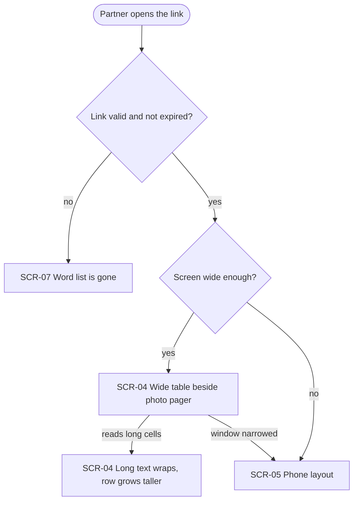

The partner opens the link. An expired or mistyped link goes to the "gone" page (SCR-07). A valid link on a wide screen shows the wide layout (SCR-04): each column is capped at its maximum width, typical words and translations sit on one line, and anything longer wraps inside its cell, so the row grows taller instead of the table growing wider. A narrow screen, or narrowing the window, goes to the phone layout (SCR-05).

### Flow: US-02 — Read the list on a phone

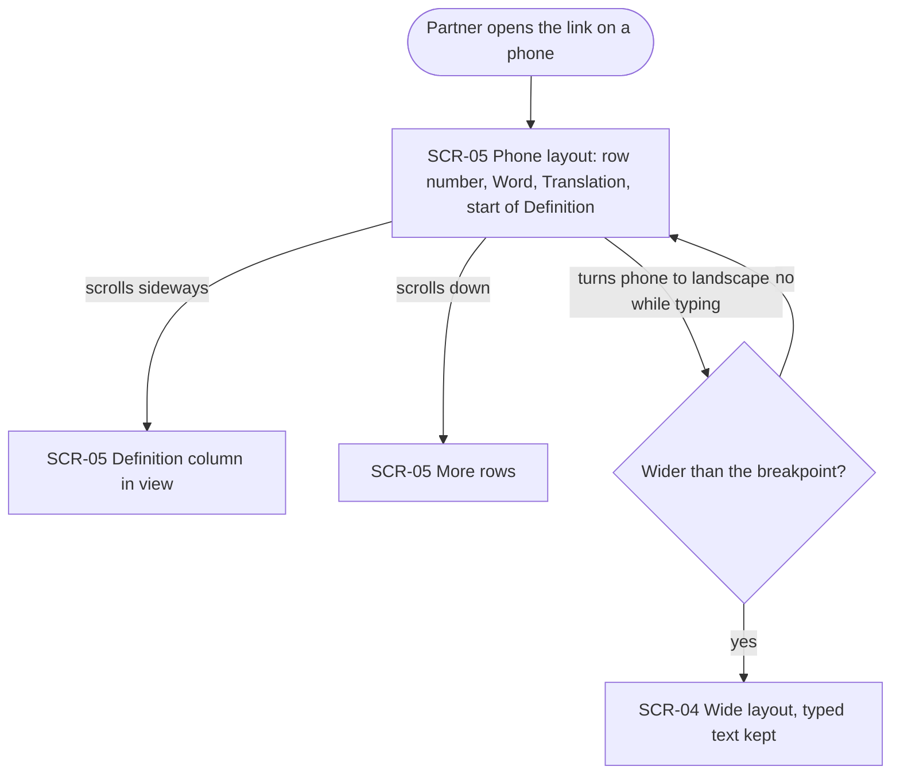

On a phone the partner lands on the phone layout (SCR-05): a narrow row-number column, Word and Translation at their maximum widths, and the start of the Definition column. Scrolling sideways brings Definition into view, and a long definition wraps within its maximum width. Scrolling down shows more rows, and only the table scrolls sideways, never the page. Turning the phone to landscape switches to the wide layout (SCR-04) when the screen is past the breakpoint, and text being typed is kept.

### Flow: US-03 — See where words came from on a wide screen

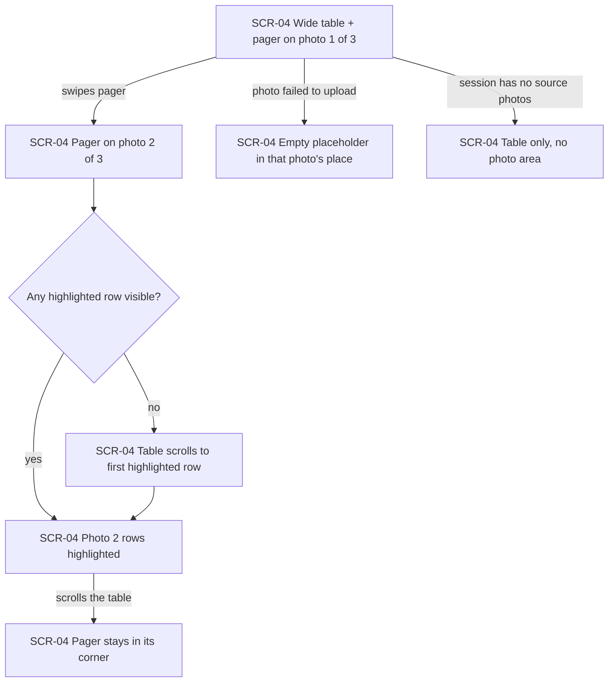

On a wide screen the pager sits in the right corner. Swiping to photo 2 of 3 highlights the rows recognised from that photo. If none of them is on screen, the table scrolls to the first one. Typed rows and rows added on the page are never highlighted. The pager stays in its corner while the table scrolls. A photo that never uploaded shows as an empty placeholder in its place, and its rows stay linked to it. A session without photos shows the table alone, with no photo area.

### Flow: US-04 — Look at the photos on a phone

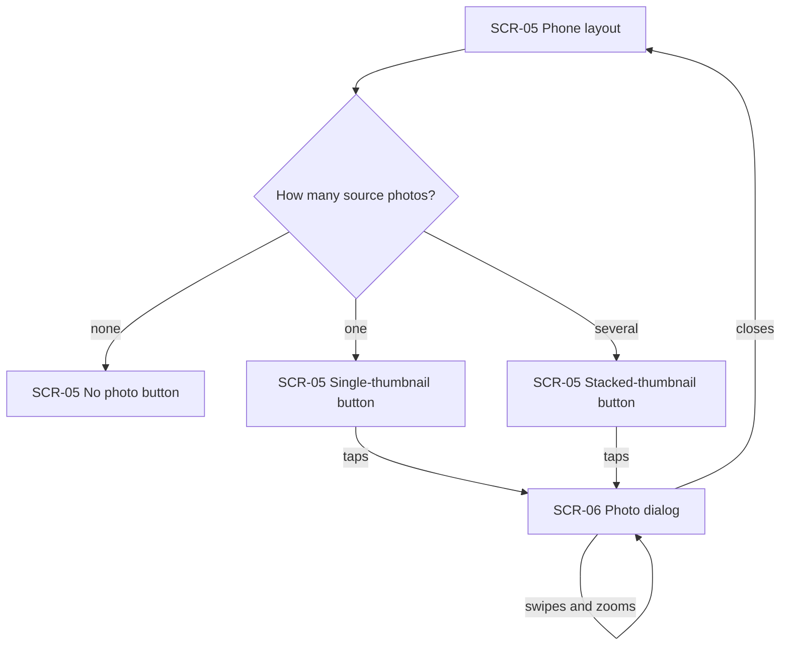

On a phone, the photo button depends on the number of source photos: none means no button, one shows a single thumbnail, and several show a slightly rotated stack. Tapping it opens the photo dialog (SCR-06), where the partner swipes between photos and zooms into one. Closing it returns to the table at the same scroll position. There is no row highlighting on a phone.

### Flow: US-05 — Correct a cell

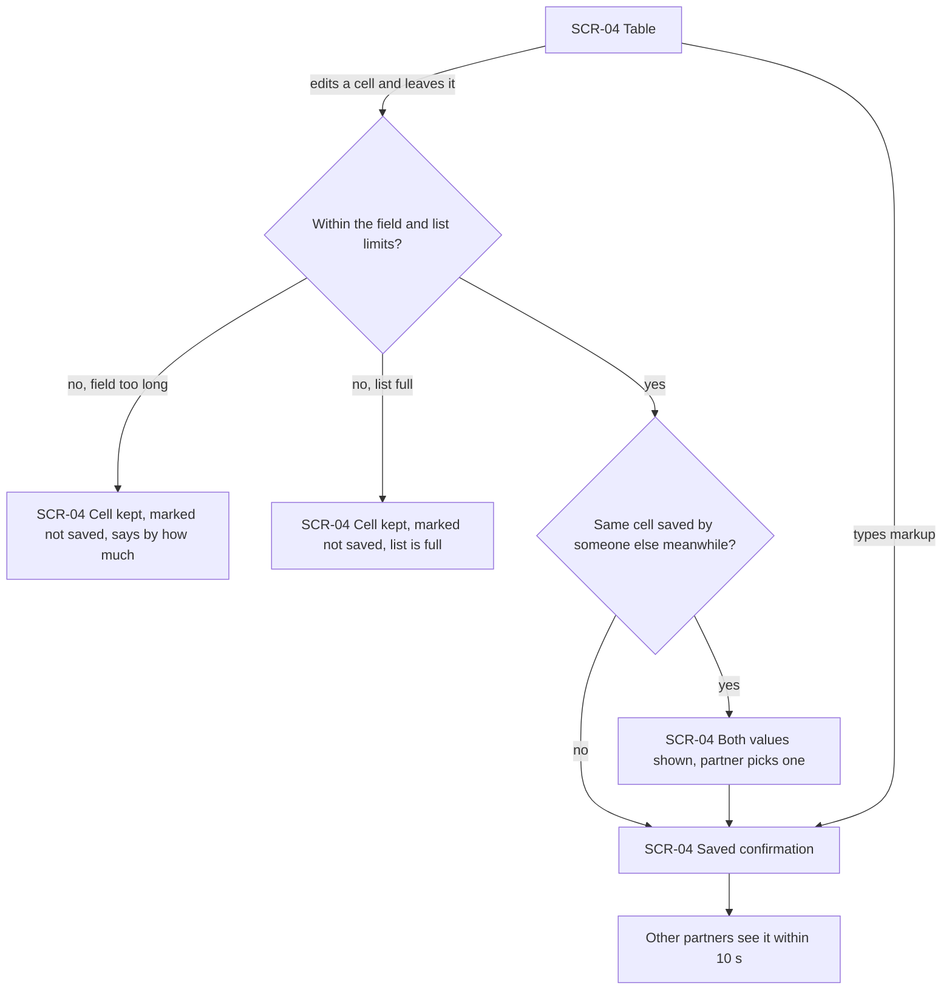

The partner edits a cell in place, and it saves when they leave it. Text over the field limit stays in the cell, marked as not saved, and the page says by how much, so the partner can shorten it without losing anything. An edit that would take the list over its size limit stays unsaved with a "list is full" notice. If someone else saved the same cell meanwhile, both values are shown and the partner picks one, so nothing is lost silently. A saved edit shows a brief "saved" and reaches the other open pages within 10 s. An edited row keeps its source photo. Markup typed into a cell saves and shows as plain text. The phone layout (SCR-05) follows the same path.

### Flow: US-06 — Add a word

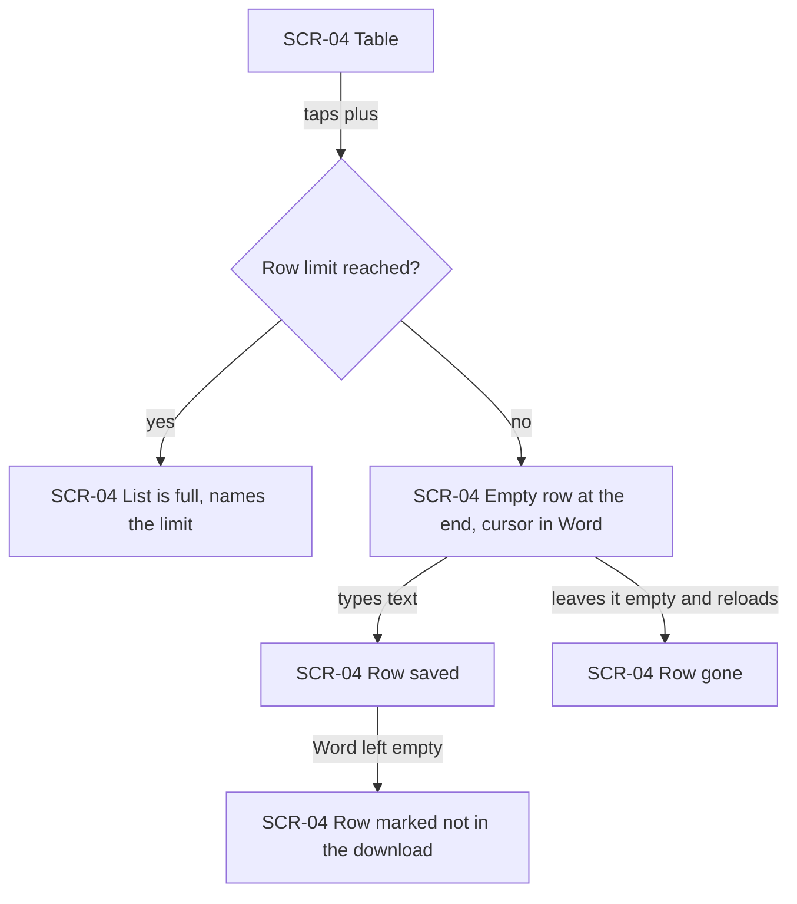

Tapping the plus button adds one empty row at the end of the table, with the cursor in its Word cell. When the list already holds the maximum number of rows, no row is added and the page names the limit. The row saves as soon as any of its cells has text. A row that never received text is gone after a reload. A saved row with an empty word is marked "not in the download — needs a word".

### Flow: US-07 — Remove a word, with undo

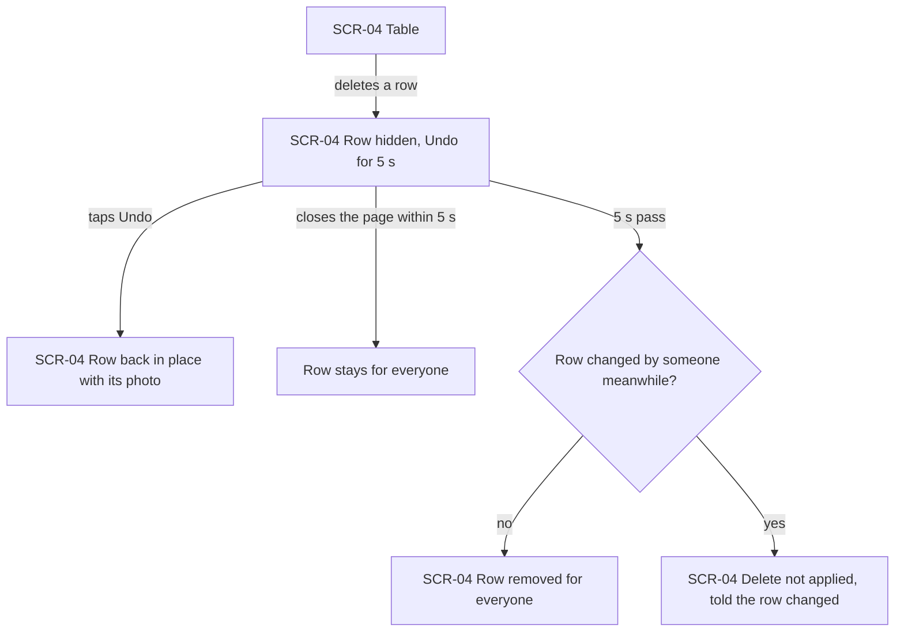

Deleting a row hides it and shows Undo for 5 seconds. Undo puts the row back in the same place with its source photo. Closing the page within those seconds leaves the row for everyone. When the 5 seconds pass, the row is removed for everyone, unless another partner saved a change to it meanwhile. In that case the delete is not applied, and the partner who deleted it is told the row changed.

### Flow: US-08 — Autofill one cell

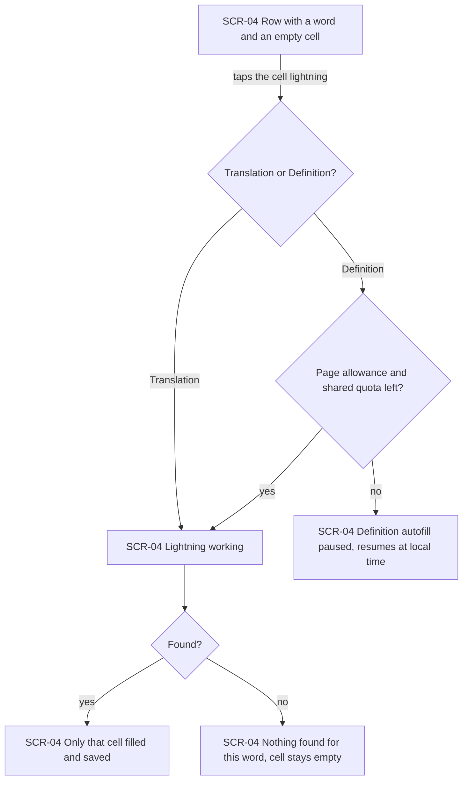

The partner taps the lightning in a Translation or Definition cell. A translation lightning always runs, because it is not metered. A definition lightning runs only while both this page's allowance and all pages' shared quota have room. Otherwise the page says definition autofill is paused, gives the local time it resumes, and the cell can still be typed by hand. While running, the lightning shows it is working. If found, only that cell fills and saves. If not, the cell stays empty with a "nothing found for this word" note. A definition lookup uses one unit of the allowance whether or not it finds something. The app's own lightning is unaffected.

### Flow: US-09 — Autofill a whole column

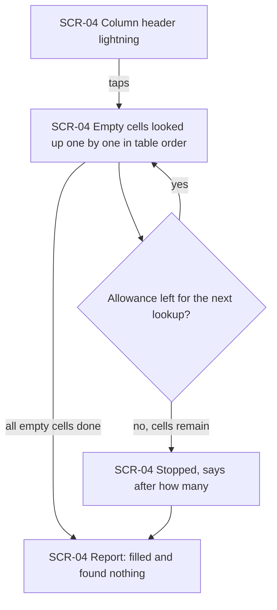

The lightning in the Translation or Definition header looks up that column's empty cells one by one, in table order, and never touches filled cells. For Definition, each lookup uses one unit of the allowance. When the allowance runs out before the column is done, it stops and says after how many lookups. Either way the page reports how many cells were filled and how many found nothing. A normal editing session with one column autofill never hits the request-rate limit.

### Flow: US-10 — Bring back a missing column

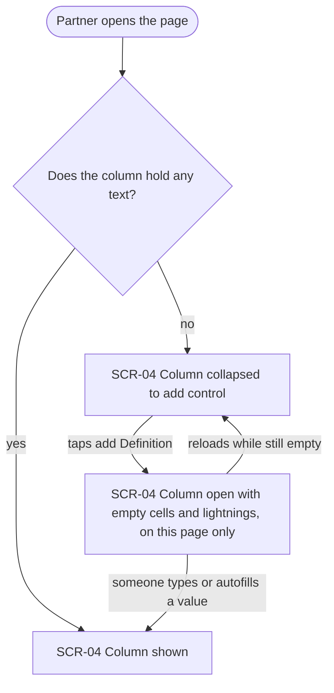

On opening, every column that holds text is shown, whatever mode the learner published with. An all-empty column is collapsed into a narrow "add" control. Tapping it opens the column with empty cells and their lightnings, on this partner's page only. Once any cell has text, everyone sees the column. If it is still empty on reload, it collapses again.

### Flow: US-11 — Choose whether photos are published

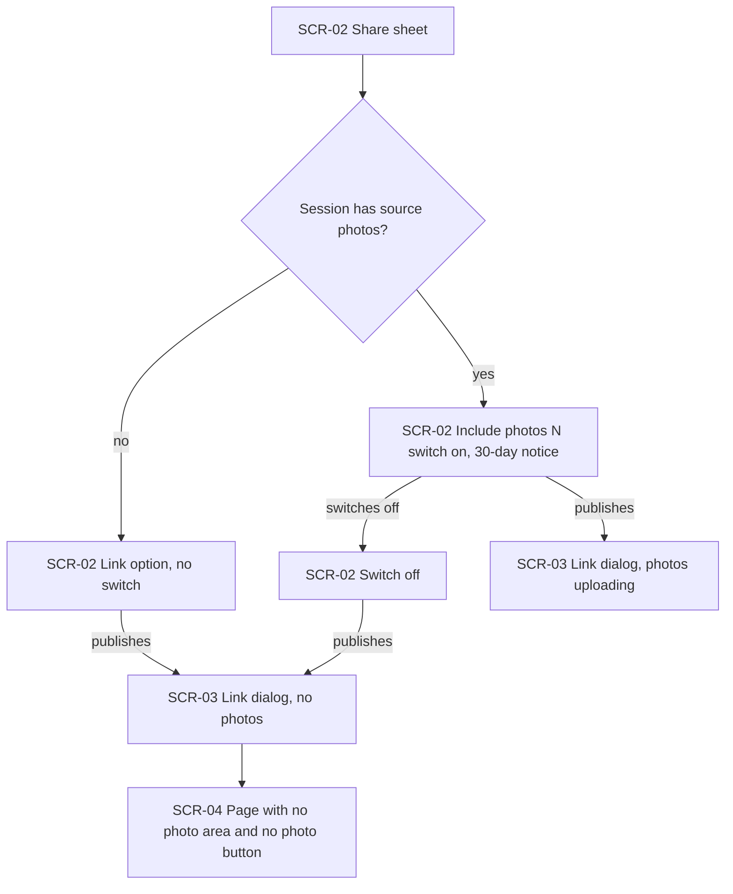

In the share sheet (SCR-02), a session with source photos shows the "include photos (N)" switch, on by default, with the notice that included photos are visible to anyone with the link for 30 days. N counts only photos with at least one linked word. Publishing with the switch on opens the link dialog while the photos upload. Switched off, or with no source photos, the page never shows a photo area or button, and none of the session's photos can be seen by anyone.

### Flow: US-12 — Photo words keep their photo

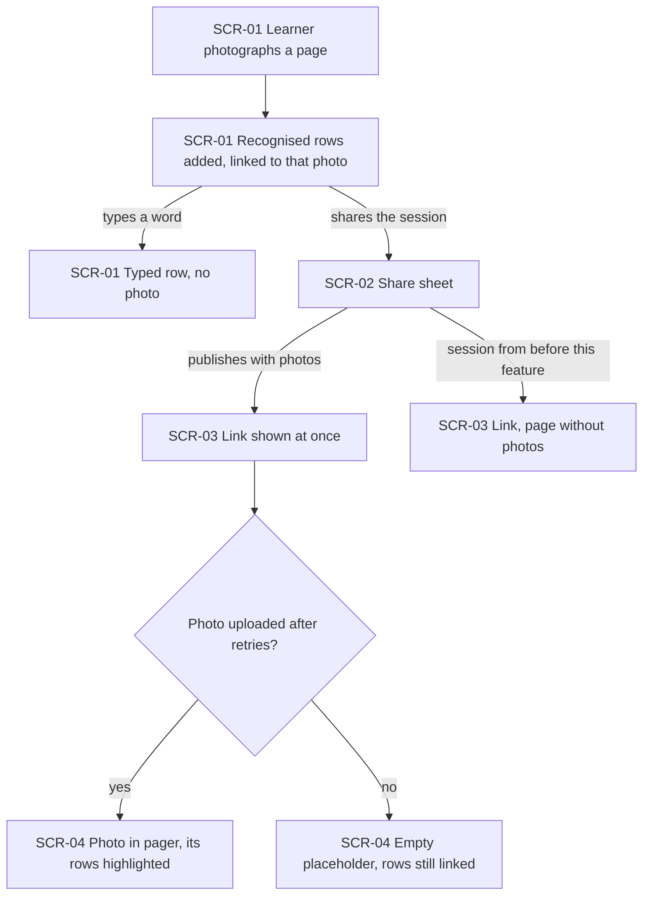

The learner photographs a page on the input screen (SCR-01), and the recognised rows arrive linked to that photo. Typed rows have no photo. Publishing with photos shows the link at once (SCR-03), and the photos upload in the background with several retries, never blocking the app. On the page, each uploaded photo appears in the pager with its rows highlighted. A photo that never arrived is an empty placeholder whose rows stay linked. A session collected before this feature publishes normally, and its page has no photos. The app's copy of the session never changes because of page edits.

### Flow: US-13 — Download what I see

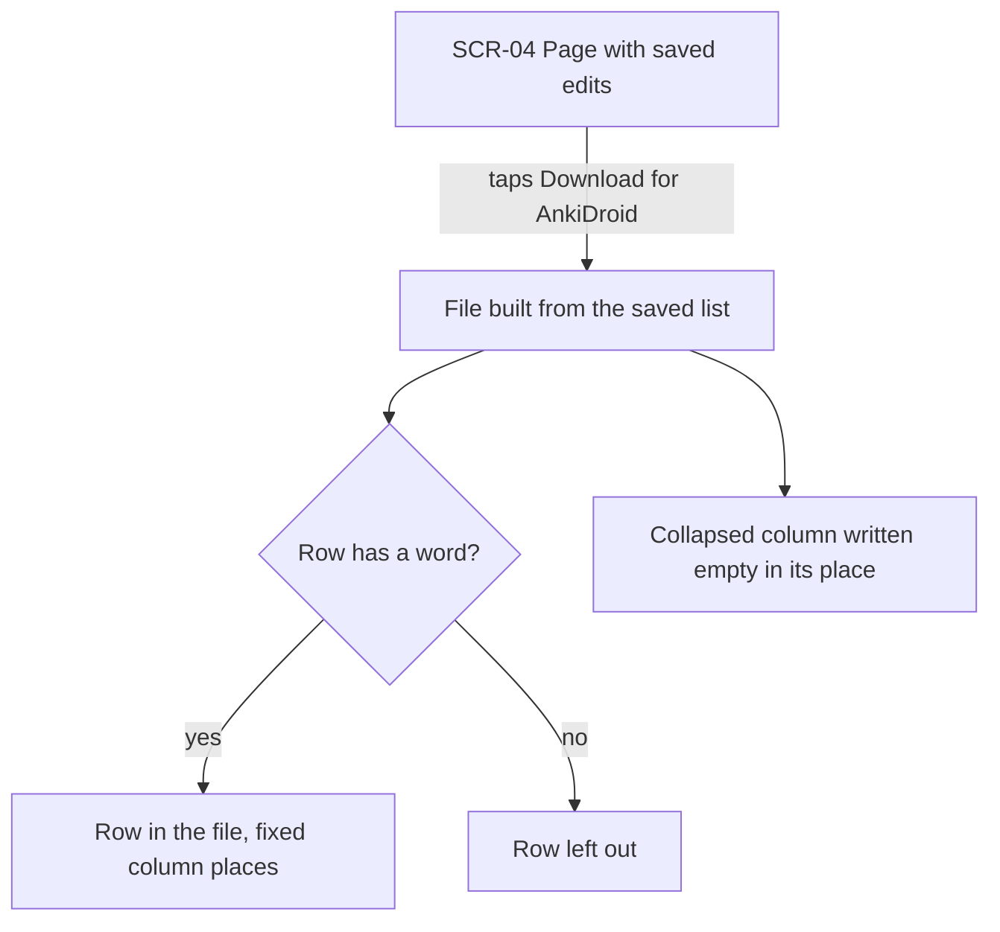

"Download for AnkiDroid" builds the file from the saved list, so it includes every partner's saved edits and no unsaved text. Word, translation and definition sit in their fixed places. A column collapsed on the page is written empty in its place. Rows without a word, including rows whose cells were all cleared, are left out. The phone layout (SCR-05) offers the same download.

### Out of scope (no UI)

- None. All 13 user stories touch a screen. The server-side guarantees inside them (the app's reserved quota, AC-29; the rate limit, AC-35) are shown as outcomes on the flows above, not as separate flows.

## AC coverage

| AC | Shown by | Notes |
|---|---|---|
| AC-01 | Flow US-01 → SCR-04 wide table | |
| AC-02 | Flow US-01 → long text wraps | also SCR-05 (Flow US-02) |
| AC-03 | Flow US-02 → SCR-05 phone layout, scrolls sideways and down | |
| AC-04 | Flow US-02 → Definition column in view | |
| AC-05 | Flow US-03 → pager swipe, highlight, scroll to first, pager stays | |
| AC-06 | Flow US-03 → prose: typed and page-added rows never highlighted | node-level: no highlight on those rows |
| AC-07 | Flow US-04 → SCR-06 photo dialog, swipe, zoom, close | |
| AC-08 | Flow US-04 → single-thumbnail / no-button branches; Flow US-03 → no photo area | |
| AC-09 | Flow US-05 → saved confirmation | |
| AC-10 | Flow US-05 → field too long branch | |
| AC-11 | Flow US-05 → both values shown, partner picks one | |
| AC-12 | Flow US-05 → others see it within 10 s | remote-update mechanism is design input |
| AC-13 | Flow US-06 → empty row at the end, saved on text, gone on reload | |
| AC-14 | Flow US-06 → row limit reached | |
| AC-15 | Flow US-07 → Undo, 5 s, closing the page keeps the row | |
| AC-15b | Flow US-07 → row changed meanwhile, delete not applied | |
| AC-16 | Flow US-08 → only that cell filled | |
| AC-17 | Flow US-08 → nothing found branch | |
| AC-18 | Flow US-08 → autofill paused, resumes at local time | |
| AC-18b | Flow US-08 → shared quota branch of the same decision | |
| AC-19 | Flow US-09 → report filled and found nothing | |
| AC-20 | Flow US-09 → stopped after N lookups | |
| AC-21 | Flow US-10 → collapsed, add control, local to this page, collapses on reload | |
| AC-22 | Flow US-10 → column shown whatever the mode | |
| AC-23 | Flow US-11 → switch on, N source photos, 30-day notice | |
| AC-24 | Flow US-11 → page with no photo area and no photo button | "cannot be seen by guessing" is a server guarantee, verified in design |
| AC-25 | Flow US-12 → rows linked to photo; typed rows no photo | |
| AC-26 | Flow US-12 → session from before this feature | |
| AC-27 | Flow US-10 → column shown whatever the mode | the app publishing every stored field is not visible on a screen; it is verified in design |
| AC-28 | Flow US-12 → prose: the app's copy never changes | N/A as a node: no screen shows the absence of sync-back |
| AC-29 | Flow US-08 → prose: the app's own lightning unaffected | N/A as a node: the outcome is on the app side, which no page flow reaches |
| AC-30 | Flow US-13 → fixed column places, collapsed column empty | |
| AC-31 | Flow US-13 → row left out; Flow US-06 → row marked not in the download | |
| AC-32 | Flow US-01 → SCR-07 Word list is gone | |
| AC-33 | Flow US-05 → types markup, saved as plain text | |
| AC-34 | Flow US-05 → prose: edited row keeps its source photo | |
| AC-35 | Flow US-09 → prose: normal session never hits the rate limit | N/A as a node: a limit that is never hit has no screen |
| AC-36 | Flow US-02 → landscape switch, typed text kept; Flow US-01 → window narrowed | |
| AC-37 | Flow US-12 → link shown at once, retries, placeholder | |
| AC-38 | Flow US-05 → list full branch | |
