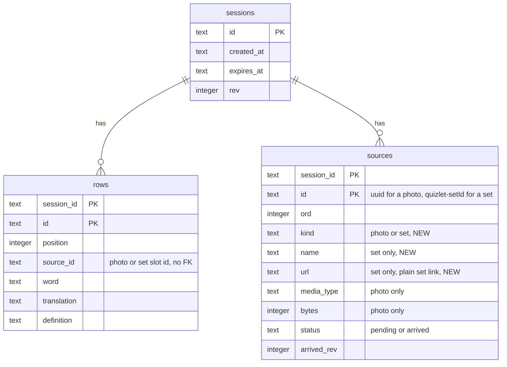

# Data model — import-from-quizlet

> **Inputs:** [spec](./spec.md) §5–§6.1 · [sad](./sad.md) §4–§6 (F3 and F4 persist notes) · [ADR-0005](adr/0005-keep-photos-and-sets-in-one-source-list-with-a-kind.md) · [ADR-0006](adr/0006-publish-set-sources-in-the-sources-list-with-a-kind.md) · precedent `vocab-photo-api/migrations/0001_sessions.sql` (`sources`), `lib/core/models/source_photo.dart`.

The feature changes **one stored shape in two places**: a session's source becomes "a photo or a Quizlet set" (ADR-0005, ADR-0006).

- **Server — D1 `vocab-sessions`, table `sources`:** gains `kind`, `name`, `url` and the checks that tie them together. One staged migration (rebuild, owner's choice at this stage).
- **Phone — Isar `vocab`, embedded `SourcePhoto` → `SessionSource`:** gains `kind`, `name`, `url`. No SQL; a `build_runner` regeneration, with the stored schema name kept so existing sessions read unchanged.
- **Unchanged:** `WordPair` (its `sourceId` now also points at a set source), `Session` apart from its list's element type, D1 `sessions` and `rows` (`rows.source_id` links to a set slot exactly as to a photo slot), R2 (a set has no bytes).
- **Never stored:** card text before Done, the pasted text, the link's sharing extras, page material (sad §8).

Aggregate root on both sides: the **session** owns its ordered sources and its word rows; a source lives exactly as long as its session (Isar: embedded; D1: `ON DELETE CASCADE`).

## ER diagram

## Entities

### Server — D1 `sources` (child of `sessions`)

Conventions followed from `0001_sessions.sql`: `snake_case`, `TEXT` keys, composite natural PK `(session_id, id)`, `CHECK` constraints for enumerations and cross-column rules, `ON DELETE CASCADE` from `sessions`, no audit columns, text length limits in code (`MAX_FIELD_CHARS`), not in the schema.

| Column | Type | Constraints | Notes |
|---|---|---|---|
| `session_id` | TEXT | NOT NULL, FK → `sessions(id)` ON DELETE CASCADE, PK part 1 | unchanged |
| `id` | TEXT | NOT NULL, PK part 2 | Photo: app UUID (good-looking-web ADR-0006). Set: `quizlet-<setId>` (ADR-0005), within `ID_PATTERN` |
| `ord` | INTEGER | NOT NULL | Place in the pager across photos and sets (AC-13 "3 of 3") |
| `kind` | TEXT | NOT NULL DEFAULT `'photo'`, `CHECK (kind IN ('photo','set'))` | **new**; existing rows become `photo` |
| `name` | TEXT | set only (table check) | **new**; the set's name as read, ≤ 500 characters checked in `types.ts`; shown only as text (sad §8) |
| `url` | TEXT | set only (table check) | **new**; plain set link `https://quizlet.com/<id>/<slug>/`, format checked in `types.ts` (ADR-0006) |
| `media_type` | TEXT | photo only once arrived | unchanged |
| `bytes` | INTEGER | `CHECK (bytes IS NULL OR bytes >= 0)` | unchanged |
| `status` | TEXT | NOT NULL DEFAULT `'pending'`, `CHECK IN ('pending','arrived')` | a set is `arrived` at publish |
| `arrived_rev` | INTEGER | `CHECK ((status='arrived') = (arrived_rev IS NOT NULL))` | a set's is the publish revision |

**Table checks (new):**
- `(kind = 'set') = (name IS NOT NULL AND url IS NOT NULL)` and `kind = 'set' OR (name IS NULL AND url IS NULL)` — a set has a name and a link, a photo has neither.
- `kind = 'photo' OR (status = 'arrived' AND media_type IS NULL AND bytes IS NULL)` — a set never has bytes and is never pending.

**Access patterns (sad §6):**
- F4 publish: insert one slot per source in order — PK. Set slots: `INSERT INTO sources (session_id, id, ord, kind, name, url, status, arrived_rev) VALUES (?1, ?2, ?3, 'set', ?4, ?5, 'arrived', <publish rev>)`; photo slots as today (`kind` defaults).
- F5 page load: `SELECT id, ord, kind, name, url, media_type, bytes, status, arrived_rev FROM sources WHERE session_id = ?1 ORDER BY ord` — `sources_arrived_idx` prefix `(session_id)` + a small sort, the plan it has today (checked in SQLite).
- Photo upload and photo serving: the slot lookup must also require `kind = 'photo'` — PK; a set slot is already `arrived`, so the upload's `status = 'pending'` guard refuses it too.
- Republish: `DELETE FROM sources WHERE session_id = ?1` — PK prefix, unchanged.
- Change feed: sources arrived after rev N — `sources_arrived_idx`, unchanged; a set appears in it at its publish revision.

### Phone — Isar embedded `SessionSource` (was `SourcePhoto`), inside `Session.sources`

| Field | Dart type | Stored | Notes |
|---|---|---|---|
| class | `SessionSource` | `@Name('SourcePhoto')` | stored embedded-schema name kept, so sessions saved before the change read with their photos (ADR-0005) |
| `id` | `String` | unchanged | photo UUID or `quizlet-<setId>`; `WordPair.sourceId` points at it |
| `kind` | `SourceKind` (`enum SourceKind { photo, set }`) | **new**, `@enumerated` (ordinal) | a record without it reads as the first value, `photo`. **`photo` must stay first in the enum** — the order is part of the stored format |
| `fileName` | `String` | unchanged | photo's kept file; `''` for a set |
| `takenAt` | `DateTime` | unchanged | when the source joined the session (photo taken / set first kept) |
| `name` | `String?` | **new** | set's name; null for a photo; updated on re-import (AC-13b) |
| `url` | `String?` | **new** | set's plain link; null for a photo |

`Session.sources` stays one ordered `List<SessionSource>` (append on first keep; a re-import of the same set updates `name` in place and keeps the position — sad §6 F3). `toJson`/`fromJson` gain `kind`, `name`, `url`; a JSON source without `kind` reads as `photo` (the legacy test in `test/source_photo_test.dart` keeps passing). No Isar index: sources are an embedded list read with their session; the set lookup by id is a scan of a short list.

## Indexes

| Index | Columns | Query it serves |
|---|---|---|
| PK of `sources` | `(session_id, id)` | F4 slot insert; photo upload and serving lookup by slot id; republish delete by session |
| `sources_arrived_idx` (re-created, unchanged) | `(session_id, arrived_rev)` | Change feed "sources arrived after rev N"; page load by session (prefix) |

No new index: every new query is served by the existing PK or `sources_arrived_idx`. FK `session_id` is the leading column of both. No index on the phone.

## Migrations (staged)

| Ordinal | Up | Down | Promotes to |
|---|---|---|---|
| 01 | [`migrations/01_add_set_sources.up.sql`](migrations/01_add_set_sources.up.sql) | [`migrations/01_add_set_sources.down.sql`](migrations/01_add_set_sources.down.sql) | `vocab-photo-api/migrations/<next>_set_sources.sql` + `vocab-photo-api/migrations/down/<next>_set_sources.sql` (next is `0003` today) |

**Shape:** a table rebuild (new table with the checks, copy existing slots as `photo`, drop, rename, re-create `sources_arrived_idx`) under `PRAGMA defer_foreign_keys = true`. Nothing references `sources` by FK, so no other table is touched. Additive for existing data — no expand/backfill/contract needed: old Workers never read the new columns and the defaults keep old app builds publishing (sad §7 release order: migration → Worker → app). The **down** unlinks rows from set slots, deletes the set slots and rebuilds the old shape.

**Checked in SQLite 3 at this stage** against `0001` + `0002`: up on a table with a pending and an arrived photo → both `photo`; a valid set slot inserts; a set without a name, a pending set, a photo with a name and a slot for an unknown session are refused; cascade delete from `sessions` still removes sources; `foreign_key_check` and `integrity_check` clean; down → set slot gone, its row's `source_id` NULL, photos intact; up again succeeds.

## Test fixtures

In each side's existing form; nothing in `migrations/`.

- **Worker** (`test/helpers.mjs`, `node --test` against `wrangler dev`): a publish payload builder with photos and sets (`{ id: "quizlet-987534268", order: 2, kind: "set", name: "Job interview flash cards", url: "https://quizlet.com/987534268/job-interview-flash-cards/" }`) for the 12-photos-and-3-sets test (sad §10 QG-3); invalid sets for `invalid_source` (a non-Quizlet host, a link with `?i=…`, a name over 500 characters).
- **App** (`flutter test`): `SessionSource.photo(...)` / `SessionSource.set(...)` builders beside the existing ones in `test/source_photo_test.dart`; a legacy JSON session with sources lacking `kind` (reads as photos); Quizlet page fixtures for the parser live with its tests (sad ADR-0003), not here.
- Set names and links in fixtures are the owner's public example set or obvious test values; no personal data.
