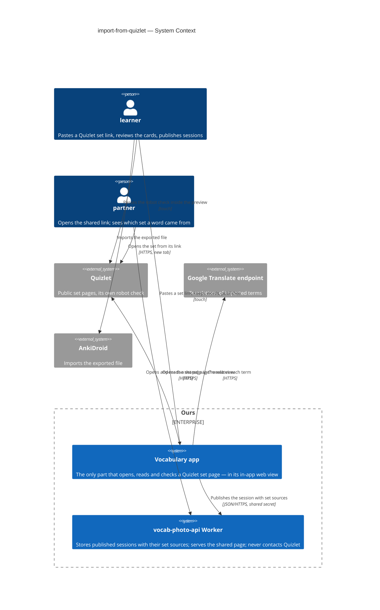
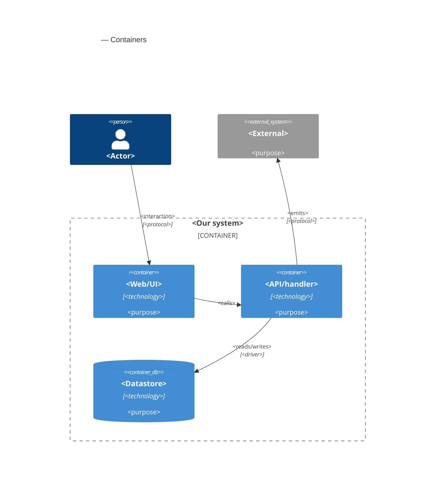

# Software Architecture Document — import-from-quizlet


## 1. Introduction and goals

**Intent.** Let a learner turn a public Quizlet set into reviewed words of the current session from its link, without typing a word (spec §2). The phone opens the set's page in an in-app web view behind a progress dialog with a small live preview, reads the set's name and cards from that page itself — no server step, no AI — and proposes them in the existing results dialog: the card's term as the word, the app's usual translation of the term, the card's back side (and example) as the definition. Kept words join the session linked to a new **set source**; on the shared page a set source is one more page of the existing source pager, showing the set's name and its plain Quizlet link, and one "Include sources" switch publishes or hides photos and sets together. The Screenshot item, its capture code and the `screenshot` package are removed (spec §1 decision).

**Top-3 quality goals (1-liners; full scenarios in §10):**

1. **A set is read whole, or the gap is named** — every card of a public set of up to 500 cards, in set order; a shortfall always shows as "Read X of Y"; from Start to the results dialog p95 ≤ 10 s for a 100-card set.
2. **The third-party page is contained** — the in-app page never opens a page that is not Quizlet's own and reads words only from the pasted set; every failure ends no later than 30 s after the page loaded (paused during Quizlet's own robot check) with the session unchanged.
3. **Imported words are ordinary, publishable words** — ≤ 500 characters per field, same History / export / lightning behaviour as any word; set sources are published or hidden by the one switch.

**Stakeholders.**

| Role | Interest | Sign-off owner? |
|---|---|---|
| learner | Pastes a Quizlet set link, reviews the cards, keeps words in the session; publishes the session with or without its sources | No |
| partner | Sees on the shared page which Quizlet set a word came from and opens the set | No |
| Tech Lead (Maksym) | SAD approval | Yes |
| Security Lead (Maksym) | Security review of the in-app third-party page and the new published field (spec §6.1 "Security review: Required") | Yes |

<!-- Decision overrides (¶4) — populated by the critic resolution loop, empty otherwise. -->

## 2. Constraints

**Technical.**
- App: Flutter 3.35.1, Dart SDK `>=3.0.0 <4.0.0`; iOS deployment target 15.0; Android `minSdk = flutter.minSdkVersion` (24 on Flutter 3.35). `flutter_riverpod` / `riverpod_annotation` 2.6.x with `riverpod_generator`; `go_router` typed routes; `isar_community` **pinned exactly to `3.3.0-dev.1`** ([`docs/architecture.md`](../../architecture.md) rule 6) — any new field on `Session` / `WordPair` needs a `build_runner` regeneration and committed `.g.dart`; `http` is the only HTTP client.
- **No web view in the app today.** Exactly one new package for showing a web page inside the app is approved (spec §1 decision); its platform implementations come with it transitively.
- Proposed words already have a path: `VocabWord` → `showVocabResultDialog` → `wordPairFromPhoto(w, sourceId:)` (`lib/features/word_input/word_input_screen.dart:52`), which stores `description` as the definition and sets `definitionMarkedFilled` when it is non-empty — exactly what spec AC-17 asks of a card's back side. Translation is `GoogleTranslateService.translateWord` (one `translate_a/single` request per word, part-of-speech rule, dictionary block).
- Import precedent: `lib/features/word_input/subtitle_import_flow.dart` — import dialog → non-dismissible loading dialog → results dialog, with the late-result rule (`startedIn` vs `currentSessionId()`, spec AC-16).
- Red + menu: `word_input_speed_dial.dart` — Take Photo (blue), From subtitles (orange), Screenshot (green, `onScreenshot`); the capture code is `_takeScreenshot()` and a `Screenshot` wrapper in `word_input_screen.dart`, the only users of `screenshot`.
- Models: `WordPair.sourceId` links a row to a `SourcePhoto` (`id`, `fileName`, `takenAt`) in `Session.sources`; `Session` also holds `publishedId` + `editToken` (good-looking-web ADR-0008).
- Publish: `session_publish_service.dart` sends `{detail, entries, sources: [{id, order}], publishedId?, editToken?}`; `maxSources = 10`; photo bytes follow in the background (`photo_upload_service.dart`, good-looking-web ADR-0006).
- Worker (`vocab-photo-api/`): TypeScript 5.6, `wrangler` 4, **no runtime npm dependencies**. Sessions, rows and photo slots live in D1 (`migrations/0001_sessions.sql`, table `sources`); `SessionSource` in `src/session/types.ts` is a tagged union designed for "another `kind`", photo the only member today. Limits: `MAX_ENTRIES` 500, `MAX_FIELD_CHARS` 500, `MAX_SESSION_JSON_BYTES` 256 KB, `MAX_SOURCES` 10. The shared page is server-rendered HTML (`page.ts`) plus one plain-JavaScript file (`client/page.js`, good-looking-web ADR-0002).
- Worker verification: `npm test` (`node --test` against a local `wrangler dev`, with a SQLite-backed D1 stand-in) and `npm run typecheck` (also covering the browser script).

**Organisational.**
- One owner (Maksym) builds, reviews and deploys; no deadline; the Worker deploy is a manual `wrangler deploy`, the app ships through the usual store build.
- Size kept at M by the spec's decision override (spec §1): three small extensions of existing paths.

**Conventions.**
- [`CLAUDE.md`](../../../CLAUDE.md) rules 1–6 and [`docs/architecture.md`](../../architecture.md) §2: typed routes only (dialogs are not routes); services via providers in `lib/core/providers.dart`; screen data in a `@riverpod` notifier; controllers, focus and loading flags — and here the web-view controller — in widget `State`; files of about one thing each.
- Overrides approved in the spec (§1 decisions), carried out as part of this feature's tasks: CLAUDE.md rule 3 and architecture.md rule 4 stop listing `screenshot`, which is removed with the Screenshot item; rule 5 / architecture.md rule 6 gain the one web-view package; the set source is an approved new domain model; the 10-source limit of good-looking-web is lifted (its OQ-3 closed). Tracked in §11 until the rule texts are updated.
- Verification per [`docs/tasks/README.md`](../../tasks/README.md): `dart run build_runner build --delete-conflicting-outputs`, `flutter analyze`, `flutter test`, the CLAUDE.md greps, and `npm test` + `npm run typecheck` in `vocab-photo-api/`.

**Regulatory / external.**
- Quizlet's terms of use and bot protection: whether reading a public set's page inside the app is allowed is open (spec §8 OQ-1; default: proceed for personal use and accept that Quizlet may block it) — tracked in §11.
- A set's name and plain link become public for 30 days only when "Include sources" is on (spec §6.1); the sharing extras of the pasted link, which may point back to the learner's Quizlet account, are never stored or published.
- No new device permissions (spec §6): the web view needs only network access, which the app already has.

## 3. Context and scope

The learner keeps word lists as Quizlet sets and wants them in the app's sessions without retyping. The app opens a set's public page inside itself — where the learner can pass Quizlet's robot check — reads the set's name and cards on the phone, and proposes them as words; the app's usual translation service translates each term. Kept words travel with the session to the shared page, where the partner sees the set as a source with a link back to Quizlet.

<!-- brownfield: Flutter app (feature folders, Riverpod providers, Isar sessions with source photos, typed go_router routes, a subtitle import flow with the late-result rule; no web view) + the vocab-photo-api Worker (D1 sessions/rows/photo slots, R2 photo bytes, server-rendered shared page with one plain-JS file, node --test harness). No architecture-map.md; scanned 2026-10-06. -->

**External systems (in / out):**

| Actor or system | Type | Interaction |
|---|---|---|
| learner | Person | Pastes a Quizlet set link, passes Quizlet's robot check if shown, reviews and keeps words, publishes with or without sources |
| partner | Person | Opens the shared link; sees a set source's name and link in the source pager; opens the set on Quizlet |
| Quizlet (quizlet.com) | System (external) | **New.** Serves the set's public page, read inside the app's web view; may show its own robot check; never written to, never logged into |
| Google Translate endpoint (`translate.googleapis.com/translate_a/single`) | System (external) | Translates each imported term, exactly as for a typed word — unchanged |
| vocab-photo-api Worker | System (internal) | Accepts set sources in a publish and shows them on the shared page — extended; **never contacts Quizlet** (owner, design 2026-10-06) |
| AnkiDroid | System (external) | Imports the exported file — unchanged; imported words export like any word |

**Trust boundary.** Everything that comes out of the Quizlet page — the set's name, the card count, every term, back side and example — is untrusted text produced by a third-party page and its scripts. **Only the app opens, reads and checks the Quizlet page** (owner, design 2026-10-06): it checks the text came from the pasted set, cleans and cuts it to the field limit before the results dialog, and never runs or renders it as markup; the web view is a sandbox the learner looks into and may open only Quizlet's own pages. The Worker never contacts Quizlet; at publish it keeps only a format check on what reaches the public page — a set source's link must be a plain `quizlet.com` set address and its name within the field limit (spec §6.1) — and the shared page shows them only as text and a plain outbound link.

**C4 Context (L1):**



## 4. Solution strategy

**Top strategic choices (the seeds for ADRs):**

1. **Three surfaces: the app, the Worker and the shared page** ([ADR-0001](adr/0001-change-the-app-the-worker-and-the-shared-page-as-three-surfaces.md)) — `target_surfaces: [mobile-app, backend-service, web-frontend]`. The import runs entirely in the app; the Worker accepts, checks and stores set sources but never contacts Quizlet (sad §3); the shared page shows them in the source pager and the phone sources dialog. UI architecture is unchanged on both UI surfaces: the app stays Flutter (cross-platform), the page stays server-rendered HTML enhanced by one plain-JavaScript file (good-looking-web ADR-0002).
2. **The set page opens in `webview_flutter`** ([ADR-0002](adr/0002-show-the-set-page-with-webview-flutter.md)) — the one approved new package: a navigation hook to cancel non-Quizlet pages, a way to run a script and get its result, and a plain widget the progress dialog can show small and grow to full size for Quizlet's robot check (AC-02, AC-05). Quality goals 1 and 2.
3. **A thin script reads raw page data; Dart parses it** ([ADR-0003](adr/0003-read-the-page-data-with-a-thin-script-and-parse-it-in-dart.md)) — the script returns the page's embedded data (or, failing that, the visible term list), the set's name, id and stated card count; a pure Dart parser turns it into the set, tested with fixtures saved from real pages. Quality goal 1: when Quizlet changes, a new fixture and a parser fix restore it.
4. **Only Quizlet pages, only the pasted set** ([ADR-0004](adr/0004-allow-only-quizlet-pages-of-the-pasted-set-in-the-web-view.md)) — top-level navigation is allowed only to `https://quizlet.com` and its subdomains and never to another set; no new windows; read results count only when the page's set id equals the pasted one. Sub-resources and embedded frames are not blocked, so Quizlet's own robot check works. Quality goal 2.
5. **Photos and sets in one source list with a `kind`** ([ADR-0005](adr/0005-keep-photos-and-sets-in-one-source-list-with-a-kind.md)) — the app's embedded source type gains `kind` (photo | set) and optional set fields (Quizlet set id, name, plain link); `Session.sources` stays one ordered list; `WordPair.sourceId` links a row to either. A set source's id is `quizlet-<setId>`, so a re-import finds it and updates its name (AC-13b). Quality goal 3.
6. **Set sources travel in the same publish `sources` list** ([ADR-0006](adr/0006-publish-set-sources-in-the-sources-list-with-a-kind.md)) — `{id, order, kind: "set", name, url}` beside photos; D1 `sources` gains `kind`, `name`, `url`; `MAX_SOURCES` is removed (a source is declared only with a linked row, so at most 500); the Worker keeps a format check on the link and name (spec §6.1). Quality goal 3.

**Tactical decisions that follow (inline, no ADR):**

- **Link parsing (AC-02, AC-06)** — a pure Dart function finds the first Quizlet set link in the pasted text (bare, with or without `https://` / `www.`, with a language part, with sharing extras, a study-mode link, or inside Quizlet's share text) and yields the set id and the plain address `https://quizlet.com/<id>/<slug>/` (AC-13). Text without one is refused in the link dialog and kept. The same set-id rule is used by the navigation check (ADR-0004).
- **Waiting, the robot check and the 30 s (AC-05, AC-07)** — the 30 s clock starts at the first "page finished loading"; about once a second the reader asks the page for cards or for signs of a robot check. A robot check is recognised by known markers of Quizlet's challenge page on quizlet.com (title, challenge elements); while one is on screen the clock is paused and the preview is full size, and it shrinks back when the check is gone. No connection, a load error or the clock running out ends the import with the AC-07 message. An unrecognised new kind of check simply runs the clock out — the safe side (§11).
- **Translation (AC-02, AC-17)** — every kept-able term goes through `GoogleTranslateService.translateWord`, as a typed word does, at most 6 requests at a time, before the results dialog opens; a term that fails to translate arrives with an empty translation and shows the translation lightning, like a typed word. The p95 ≤ 10 s target (100 cards) includes this step.
- **Card → proposed word (AC-09, AC-10, AC-04b, AC-08)** — a pure Dart step: drop cards with no text term; turn line breaks into "; "; cut term and back side to 500 characters with "…" last; definition = back side, plus a new line and the example when present; drop terms equal to a session word or an earlier card (ignoring case, outer spaces and one closing ".", "!" or "?"); count skipped cards for their own line; compare cards found (before skipping) with the page's stated count for "Read X of Y".
- **Into the session** — the results dialog and `wordPairFromPhoto(w, sourceId:)` are reused unchanged, so a non-empty back side marks the definition filled (AC-17); Done adds the kept words and, only if at least one was kept, adds or updates the set source (AC-03, AC-04, AC-04b); the late-result rule is the subtitle import's `startedIn` check (AC-16).
- **Screenshot removal** — the green item becomes "Import from Quizlet"; `_takeScreenshot`, the `Screenshot` wrapper and the `screenshot` package go (spec §1).

Each tactical decision in later sections should trace to one of these seeds. Tactical decisions that *contradict* a strategic choice are red flags — surface them in §11.

## 5. Building block view

<!-- 🎯 Why: INTERNAL DECOMPOSITION — modules, containers, datastores. The static topology: who
     may talk to whom. Without §5, §6 (the flows) has no vocabulary of participants.
     📋 Write: 1 ¶ on the style (layered / hexagonal / clean / event-driven) + a folder tree + a
     C4Container block.
     📌 Draw ONE Container per declared `target_surface` (frontmatter): a fullstack
     [backend-service, web-frontend] = a backend-API container + a web/SPA container; a
     [backend-service, mobile-app] = the API + the mobile app. The Container(web, …) line below is
     just one surface's container — swap/add per what was declared in §4. → _shared/surfaces.md
     📌 e.g. «web app, content API, media worker, datastore, object store, CDN». -->

<One paragraph: layered / hexagonal / clean / event-driven, and why.>

**Internal decomposition:**

```
<e.g. modules/<feature>/>
├── domain/       <entities + sentinel errors>
├── app/          <use cases / services>
├── infra/        <repository + integration impl>
├── ports/        <handlers, DTOs, error mapping>
└── wiring        <self-wiring entry point>
```

**C4 Container (L2):** <!-- syntax → references/c4-mermaid-syntax.md. Real names, no <placeholder> stubs. ONE Container per declared target_surface (frontmatter); the web container below is one example surface. -->



## 6. Runtime view

<!-- 🎯 Why: the RUNTIME FLOW of 1–2 critical scenarios — who talks to whom, when, in what order.
     Without §6, §5 is just boxes with no life.
     📋 Write: a Mermaid sequenceDiagram. Participants are names from §5 (don't invent new ones).
     Messages are semantic («saves a draft»), NO HTTP verbs / paths / status codes — endpoint-level
     sequences arrive at the `api` stage.
     📌 e.g. «author → web: composes draft → web → content API: save». Seed the primary flow(s) here;
     the `sequences` stage then covers every §5 AC (no cap). Never N/A for M+; XS/S keeps ≥1 happy-path flow. -->

**Critical flow 1: <flow name>**

```mermaid
sequenceDiagram
    actor Actor
    participant Web
    participant Service
    participant Store
    Actor->>Web: <action>
    Web->>Service: <call>
    Service->>Store: <write>
    Store-->>Service: ok
    Service-->>Web: result
    Web-->>Actor: confirmation
```

**Critical flow 2: <e.g. async event propagation>** — <if applicable, otherwise N/A>.

## 7. Deployment view

<!-- 🎯 Why: the TOPOLOGY DevOps must know without reading the deploy charts — how many replicas,
     where the background worker lives, AT WHAT NUMBERS we scale.
     📋 Write: 2–3 sentences on topology + monitoring + concrete threshold numbers.
     📌 e.g. «500 authors → partition by quarter» (not «we'll think about scale later»).
     🎯 N/A allowed for XS/S that reuses an existing deployment unit with no change.
     Deployment-diagram scaffold → templates/deployment.md. -->

<Topology in 2–3 sentences. Where it runs, replicas, scaling thresholds.>

**Monitoring:**
- <Metrics — e.g. `<metric_name>`>
- <Alerts — e.g. «worker lag > 10 min → page on-call»>
- <Tracing — e.g. spans on the request boundary>

**Scaling thresholds:**
- <e.g. comfortable in one table up to N rows/year>
- <e.g. partition by quarter above N rows/year>

<!-- For XS/S with no deployment change: <!-- N/A: reuses existing deployment unit, no infra change --> -->

## 8. Crosscutting concepts

<!-- 🎯 Why: CROSS-CUTTING PATTERNS spanning several modules: logging, errors, authorization, ID
     strategy, events, caching. ⭐ The second-densest section. A pattern inside one module is NOT
     here; a project-wide convention belongs in the convention file.
     📋 Write: a table — concept / convention / where defined. One row per concept.
     📌 e.g. «sortable time-based IDs generated in the app layer» as a default from the convention file. -->

| Concept | Convention | Where defined |
|---|---|---|
| Logging | <e.g. structured, fields `module=<name>`> | <convention file §X or here> |
| Authentication | <e.g. token-based via middleware> | <convention file §X> |
| Error handling | <e.g. domain sentinel → ports error mapping → JSON> | <convention file §X> |
| ID strategy | <e.g. sortable time-based ID in the app layer> | <convention file §X> |
| Internationalisation | <e.g. N/A, single language> | — |
| Observability | <e.g. tracing on the request boundary> | — |
| Events | <module-specific patterns, if any> | <here> |

## 9. Architecture decisions

<!-- 🎯 Why: the REVERSE INDEX onto the adr/ folder. `ls adr/` gives the files; §9 gives the
     semantics — why they exist, which SAD section they attach to, what status.
     📋 Write: a 4-column table, one row per ADR. Mixed status is fine.
     📌 e.g. «0001 | Store content as a table of typed blocks | Accepted | §4». -->

| # | Title | Status | Section |
|---|---|---|---|
| <NNNN> | <imperative — e.g. "Use a sliding-window counter for rate limiting"> | Accepted | §<N> |
| <NNNN> | <imperative — e.g. "Co-locate the worker in the API process"> | Accepted | §<N> |

ADR files live under `docs/features/<slug>/adr/NNNN-<title>.md`.

## 10. Quality requirements

<!-- 🎯 Why: the QUALITY TREE — take a goal from §1 and break it into concrete leaves: tests,
     metrics, configs, drills. ⭐ Without §10, §1 is a manifesto. With §10 each declaration maps
     to something PROVABLE.
     📋 Write: per §1 goal — When / Then / How-verify. Numbers from spec §6 NFR VERBATIM (don't
     round ≤250ms to ≤300ms — that's a critic F6 hit).
     📌 e.g. «p95 ≤ 500 ms on a block update, verified by a 100 req/s load test». -->

Each top-3 goal from §1 expanded into a full scenario:

**QG-1. <quality attribute>**
- **When:** <trigger condition>
- **Then:** <expected behaviour with numbers from spec §6 NFR>
- **How verify:** <test / chaos drill / load test / metric>

**QG-2. <quality attribute>**
- **When:** <trigger>
- **Then:** <expected>
- **How verify:** <how>

**QG-3. <quality attribute>**
- **When:** <trigger>
- **Then:** <expected>
- **How verify:** <how>

## 11. Risks and technical debt

<!-- 🎯 Why: ⭐ collects EVERYTHING that can break — not only the technical. Without §11 risks get
     discussed at standups and lost; debt lives only in the head of whoever accepted it.
     📋 Write: a risk/debt table — severity — mitigation — owner. Accepted debt in its own block.
     📌 The first risk is often a product risk, not a technical one. That's normal. -->

<!-- Severity literals: Low / Medium / High for regular risks; "Open question" for rows created by
     a Save-as-OQ resolution during the Socratic walk (see references/socratic.md). -->

| Risk / debt | Severity | Mitigation | Owner |
|---|---|---|---|
| <e.g. Worker lag may reach hours during a downstream outage> | Medium | <alert >10 min, on-call playbook, retry backoff> | <DevOps> |
| <e.g. No event-schema versioning in v1> | Medium | <ADR-NNNN planned for v2, tolerate unknown fields> | <Backend> |
| Open architectural decision: <decision-headline> | Open question | Resolve before <stage trigger or YYYY-MM-DD>; <inline rationale from the Save-as-OQ> | <owner> |

**Accepted debt (acceptable in v1, plan to fix later):**
- <e.g. the entity is immutable / unversioned — OK for v1, may need audit versioning in v2>

## 12. Glossary

<!-- 🎯 Why: ⭐ the DOMAIN GLOSSARY that ends arguments a year later («checkpoint — weekly or
     biweekly? quarter — calendar or fiscal?»).
     📋 Write: a term / meaning table. Business + technical terms mixed.
     📌 e.g. «Lesson | a unit inside a course made of blocks (text, video)». -->

| Term | Meaning |
|---|---|
| <e.g. domain object A> | <its meaning in this domain> |
| <e.g. domain object B> | <its meaning> |
| <e.g. domain invariant name> | <the rule, in plain language> |
