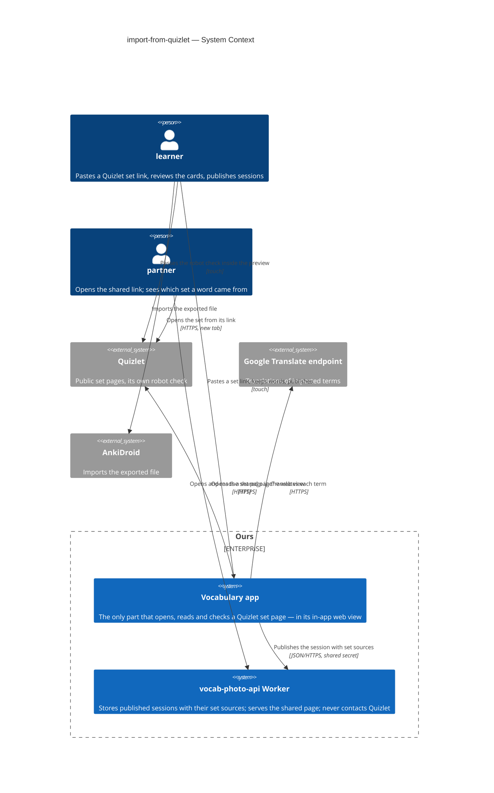
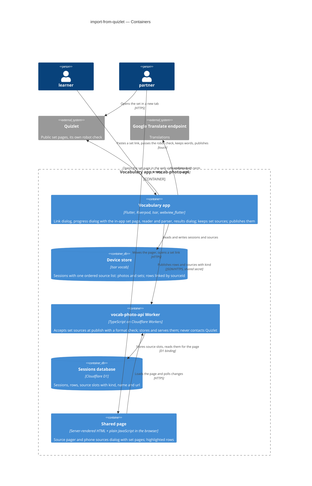
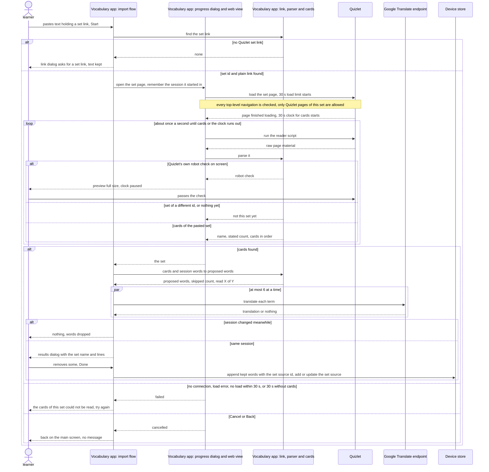
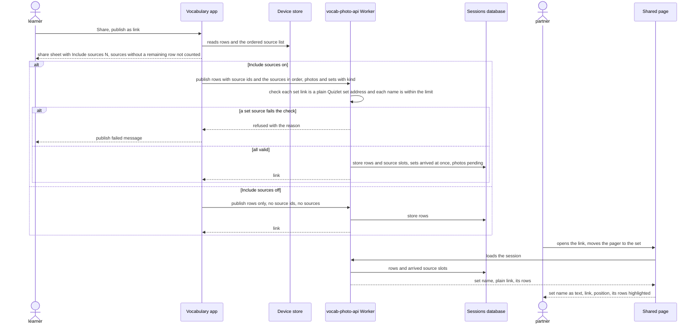
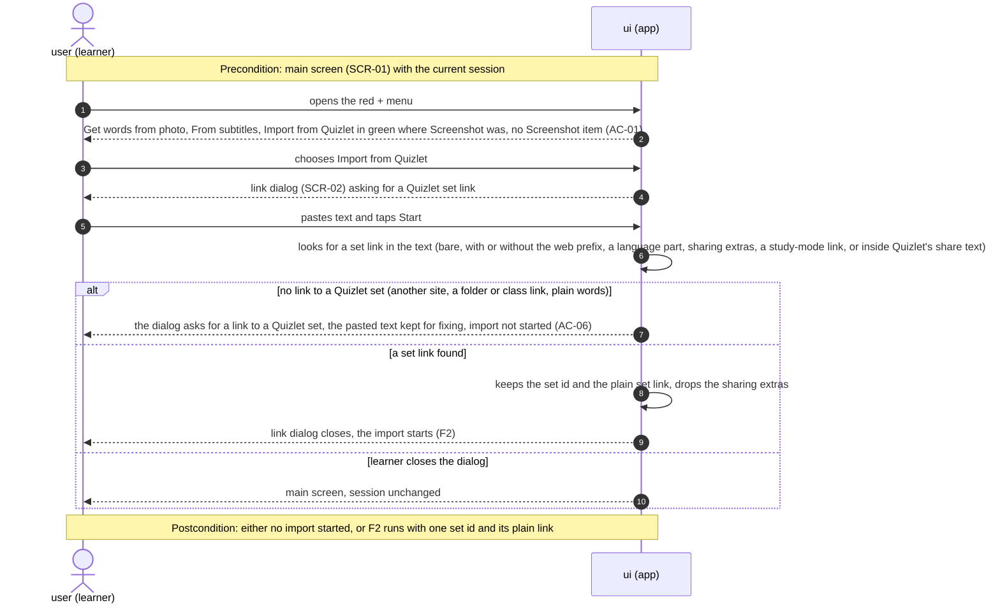
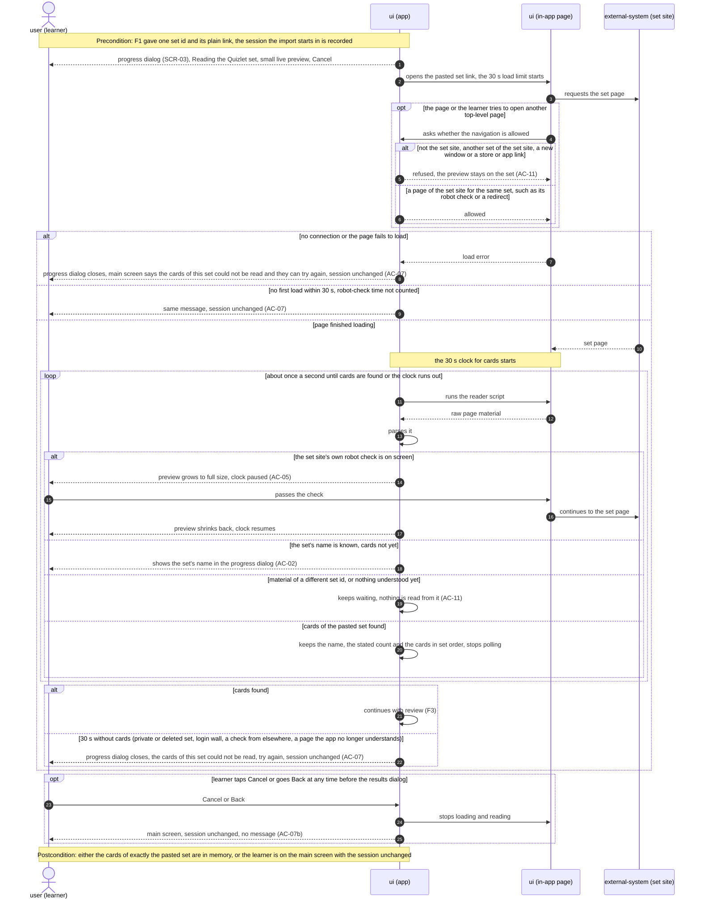
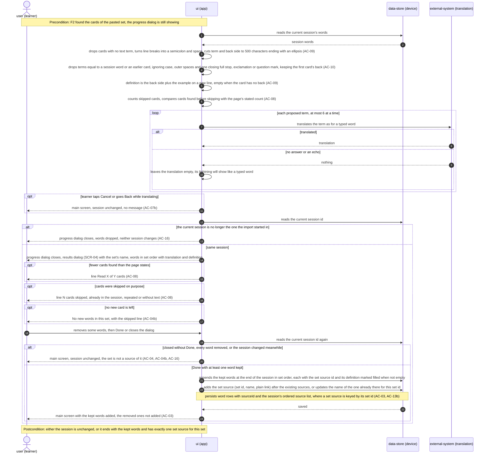
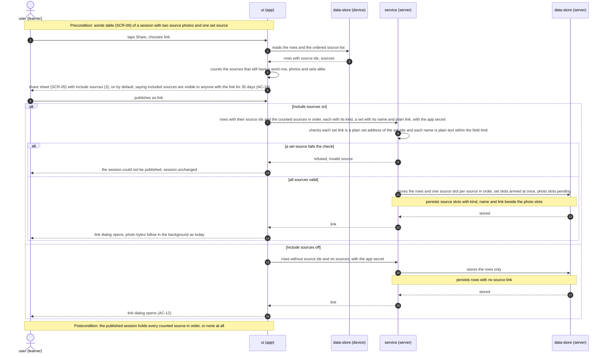
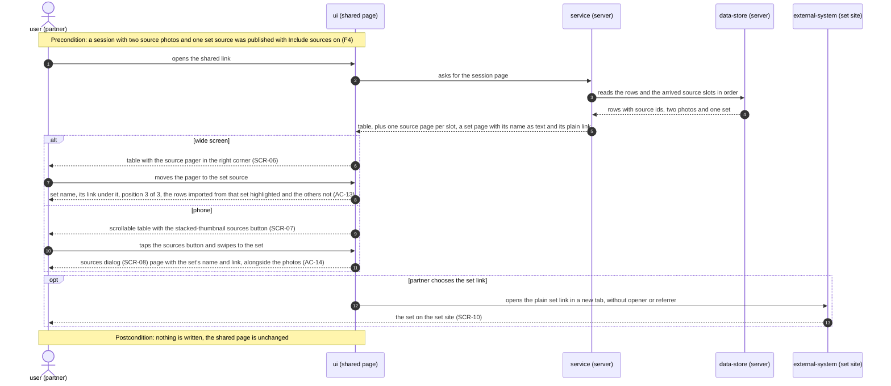
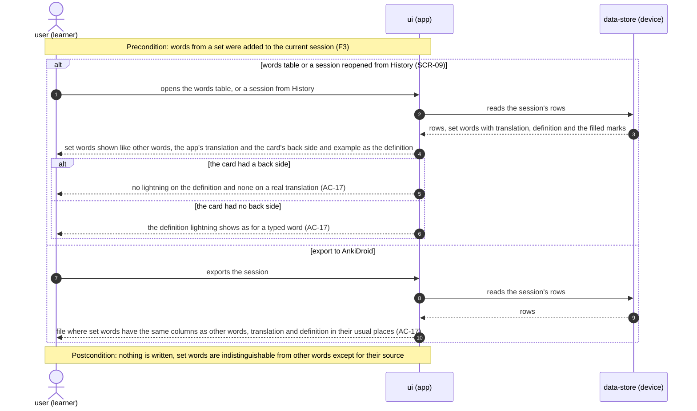

# Software Architecture Document — import-from-quizlet


## 1. Introduction and goals

**Intent.** Let a learner turn a public Quizlet set into reviewed words of the current session from its link, without typing a word (spec §2). The phone opens the set's page in an in-app web view behind a progress dialog with a small live preview, reads the set's name and cards from that page itself — no server step, no AI — and proposes them in the existing results dialog: the card's term as the word, the app's usual translation of the term, the card's back side (and example) as the definition. Kept words join the session linked to a new **set source**; on the shared page a set source is one more page of the existing source pager, showing the set's name and its plain Quizlet link, and one "Include sources" switch publishes or hides photos and sets together. The Screenshot item, its capture code and the `screenshot` package are removed (spec §1 decision).

**Top-3 quality goals (1-liners; full scenarios in §10):**

1. **A set is read whole, or the gap is named** — every card of a public set of up to 500 cards, in set order; a shortfall always shows as "Read X of Y"; from Start to the results dialog p95 ≤ 10 s for a 100-card set.
2. **The third-party page is contained** — the in-app page never opens a page that is not Quizlet's own and reads words only from the pasted set; every failure ends no later than 30 s after the page loaded (paused during Quizlet's own robot check) with the session unchanged.
3. **Imported words are ordinary, publishable words** — ≤ 500 characters per field, same History / export / lightning behaviour as any word; set sources are published or hidden by the one switch.

**Stakeholders.**

| Role | Interest | Sign-off owner? |
|---|---|---|
| learner | Pastes a Quizlet set link, reviews the cards, keeps words in the session; publishes the session with or without its sources | No |
| partner | Sees on the shared page which Quizlet set a word came from and opens the set | No |
| Tech Lead (Maksym) | SAD approval | Yes |
| Security Lead (Maksym) | Security review of the in-app third-party page and the new published field (spec §6.1 "Security review: Required") | Yes |

**Critic resolutions (2026-10-06):** no overrides — the five findings were resolved by amendment: the reader script is a Dart constant (ADR-0003 aligned with §5); the first load is bounded by the same 30 s (§4, §6); spec OQ-1 is closed as an accepted risk (§2, §11, spec §8); ADR-0003 no longer lists the out-of-scope internal-API option; the §11 repo-text row names every text this design outdates.

## 2. Constraints

**Technical.**
- App: Flutter 3.35.1, Dart SDK `>=3.0.0 <4.0.0`; iOS deployment target 15.0; Android `minSdk = flutter.minSdkVersion` (24 on Flutter 3.35). `flutter_riverpod` / `riverpod_annotation` 2.6.x with `riverpod_generator`; `go_router` typed routes; `isar_community` **pinned exactly to `3.3.0-dev.1`** ([`docs/architecture.md`](../../architecture.md) rule 6) — any new field on `Session` / `WordPair` needs a `build_runner` regeneration and committed `.g.dart`; `http` is the only HTTP client.
- **No web view in the app today.** Exactly one new package for showing a web page inside the app is approved (spec §1 decision); its platform implementations come with it transitively.
- Proposed words already have a path: `VocabWord` → `showVocabResultDialog` → `wordPairFromPhoto(w, sourceId:)` (`lib/features/word_input/word_input_screen.dart:52`), which stores `description` as the definition and sets `definitionMarkedFilled` when it is non-empty — exactly what spec AC-17 asks of a card's back side. Translation is `GoogleTranslateService.translateWord` (one `translate_a/single` request per word, part-of-speech rule, dictionary block).
- Import precedent: `lib/features/word_input/subtitle_import_flow.dart` — import dialog → non-dismissible loading dialog → results dialog, with the late-result rule (`startedIn` vs `currentSessionId()`, spec AC-16).
- Red + menu: `word_input_speed_dial.dart` — Take Photo (blue), From subtitles (orange), Screenshot (green, `onScreenshot`); the capture code is `_takeScreenshot()` and a `Screenshot` wrapper in `word_input_screen.dart`, the only users of `screenshot`.
- Models: `WordPair.sourceId` links a row to a `SourcePhoto` (`id`, `fileName`, `takenAt`) in `Session.sources`; `Session` also holds `publishedId` + `editToken` (good-looking-web ADR-0008).
- Publish: `session_publish_service.dart` sends `{detail, entries, sources: [{id, order}], publishedId?, editToken?}`; `maxSources = 10`; photo bytes follow in the background (`photo_upload_service.dart`, good-looking-web ADR-0006).
- Worker (`vocab-photo-api/`): TypeScript 5.6, `wrangler` 4, **no runtime npm dependencies**. Sessions, rows and photo slots live in D1 (`migrations/0001_sessions.sql`, table `sources`); `SessionSource` in `src/session/types.ts` is a tagged union designed for "another `kind`", photo the only member today. Limits: `MAX_ENTRIES` 500, `MAX_FIELD_CHARS` 500, `MAX_SESSION_JSON_BYTES` 256 KB, `MAX_SOURCES` 10. The shared page is server-rendered HTML (`page.ts`) plus one plain-JavaScript file (`client/page.js`, good-looking-web ADR-0002).
- Worker verification: `npm test` (`node --test` against a local `wrangler dev`, with a SQLite-backed D1 stand-in) and `npm run typecheck` (also covering the browser script).

**Organisational.**
- One owner (Maksym) builds, reviews and deploys; no deadline; the Worker deploy is a manual `wrangler deploy`, the app ships through the usual store build.
- Size kept at M by the spec's decision override (spec §1): three small extensions of existing paths.

**Conventions.**
- [`CLAUDE.md`](../../../CLAUDE.md) rules 1–6 and [`docs/architecture.md`](../../architecture.md) §2: typed routes only (dialogs are not routes); services via providers in `lib/core/providers.dart`; screen data in a `@riverpod` notifier; controllers, focus and loading flags — and here the web-view controller — in widget `State`; files of about one thing each.
- Overrides approved in the spec (§1 decisions), carried out as part of this feature's tasks: CLAUDE.md rule 3 and architecture.md rule 4 stop listing `screenshot`, which is removed with the Screenshot item; rule 5 / architecture.md rule 6 gain the one web-view package; the set source is an approved new domain model (with `source_photo.dart` generalised to `session_source.dart`, sad §5); the 10-source limit of good-looking-web is lifted (its OQ-3 closed); "Include photos" becomes "Include sources". `docs/architecture.md` §1/§3 describe the old shapes and are updated with the code. Tracked in §11 until the texts are updated.
- Verification per [`docs/tasks/README.md`](../../tasks/README.md): `dart run build_runner build --delete-conflicting-outputs`, `flutter analyze`, `flutter test`, the CLAUDE.md greps, and `npm test` + `npm run typecheck` in `vocab-photo-api/`.

**Regulatory / external.**
- Quizlet's terms of use and bot protection (spec §8 OQ-1): accepted by the owner at design, 2026-10-06 — proceed for personal study and accept that Quizlet may block it; tracked as a risk in §11.
- A set's name and plain link become public for 30 days only when "Include sources" is on (spec §6.1); the sharing extras of the pasted link, which may point back to the learner's Quizlet account, are never stored or published.
- No new device permissions (spec §6): the web view needs only network access, which the app already has.

## 3. Context and scope

The learner keeps word lists as Quizlet sets and wants them in the app's sessions without retyping. The app opens a set's public page inside itself — where the learner can pass Quizlet's robot check — reads the set's name and cards on the phone, and proposes them as words; the app's usual translation service translates each term. Kept words travel with the session to the shared page, where the partner sees the set as a source with a link back to Quizlet.

<!-- brownfield: Flutter app (feature folders, Riverpod providers, Isar sessions with source photos, typed go_router routes, a subtitle import flow with the late-result rule; no web view) + the vocab-photo-api Worker (D1 sessions/rows/photo slots, R2 photo bytes, server-rendered shared page with one plain-JS file, node --test harness). No architecture-map.md; scanned 2026-10-06. -->

**External systems (in / out):**

| Actor or system | Type | Interaction |
|---|---|---|
| learner | Person | Pastes a Quizlet set link, passes Quizlet's robot check if shown, reviews and keeps words, publishes with or without sources |
| partner | Person | Opens the shared link; sees a set source's name and link in the source pager; opens the set on Quizlet |
| Quizlet (quizlet.com) | System (external) | **New.** Serves the set's public page, read inside the app's web view; may show its own robot check; never written to, never logged into |
| Google Translate endpoint (`translate.googleapis.com/translate_a/single`) | System (external) | Translates each imported term, exactly as for a typed word — unchanged |
| vocab-photo-api Worker | System (internal) | Accepts set sources in a publish and shows them on the shared page — extended; **never contacts Quizlet** (owner, design 2026-10-06) |
| AnkiDroid | System (external) | Imports the exported file — unchanged; imported words export like any word |

**Trust boundary.** Everything that comes out of the Quizlet page — the set's name, the card count, every term, back side and example — is untrusted text produced by a third-party page and its scripts. **Only the app opens, reads and checks the Quizlet page** (owner, design 2026-10-06): it checks the text came from the pasted set, cleans and cuts it to the field limit before the results dialog, and never runs or renders it as markup; the web view is a sandbox the learner looks into and may open only Quizlet's own pages. The Worker never contacts Quizlet; at publish it keeps only a format check on what reaches the public page — a set source's link must be a plain `quizlet.com` set address and its name within the field limit (spec §6.1) — and the shared page shows them only as text and a plain outbound link.

**C4 Context (L1):**



## 4. Solution strategy

**Top strategic choices (the seeds for ADRs):**

1. **Three surfaces: the app, the Worker and the shared page** ([ADR-0001](adr/0001-change-the-app-the-worker-and-the-shared-page-as-three-surfaces.md)) — `target_surfaces: [mobile-app, backend-service, web-frontend]`. The import runs entirely in the app; the Worker accepts, checks and stores set sources but never contacts Quizlet (sad §3); the shared page shows them in the source pager and the phone sources dialog. UI architecture is unchanged on both UI surfaces: the app stays Flutter (cross-platform), the page stays server-rendered HTML enhanced by one plain-JavaScript file (good-looking-web ADR-0002).
2. **The set page opens in `webview_flutter`** ([ADR-0002](adr/0002-show-the-set-page-with-webview-flutter.md)) — the one approved new package: a navigation hook to cancel non-Quizlet pages, a way to run a script and get its result, and a plain widget the progress dialog can show small and grow to full size for Quizlet's robot check (AC-02, AC-05). Quality goals 1 and 2.
3. **A thin script reads raw page data; Dart parses it** ([ADR-0003](adr/0003-read-the-page-data-with-a-thin-script-and-parse-it-in-dart.md)) — the script returns the page's embedded data (or, failing that, the visible term list), the set's name, id and stated card count; a pure Dart parser turns it into the set, tested with fixtures saved from real pages. Quality goal 1: when Quizlet changes, a new fixture and a parser fix restore it.
4. **Only Quizlet pages, only the pasted set** ([ADR-0004](adr/0004-allow-only-quizlet-pages-of-the-pasted-set-in-the-web-view.md)) — top-level navigation is allowed only to `https://quizlet.com` and its subdomains and never to another set; no new windows; read results count only when the page's set id equals the pasted one. Sub-resources and embedded frames are not blocked, so Quizlet's own robot check works. Quality goal 2.
5. **Photos and sets in one source list with a `kind`** ([ADR-0005](adr/0005-keep-photos-and-sets-in-one-source-list-with-a-kind.md)) — the app's embedded source type gains `kind` (photo | set) and optional set fields (Quizlet set id, name, plain link); `Session.sources` stays one ordered list; `WordPair.sourceId` links a row to either. A set source's id is `quizlet-<setId>`, so a re-import finds it and updates its name (AC-13b). Quality goal 3.
6. **Set sources travel in the same publish `sources` list** ([ADR-0006](adr/0006-publish-set-sources-in-the-sources-list-with-a-kind.md)) — `{id, order, kind: "set", name, url}` beside photos; D1 `sources` gains `kind`, `name`, `url`; `MAX_SOURCES` is removed (a source is declared only with a linked row, so at most 500); the Worker keeps a format check on the link and name (spec §6.1). Quality goal 3.

**Tactical decisions that follow (inline, no ADR):**

- **Link parsing (AC-02, AC-06)** — a pure Dart function finds the first Quizlet set link in the pasted text (bare, with or without `https://` / `www.`, with a language part, with sharing extras, a study-mode link, or inside Quizlet's share text) and yields the set id and the plain address `https://quizlet.com/<id>/<slug>/` (AC-13). Text without one is refused in the link dialog and kept. The same set-id rule is used by the navigation check (ADR-0004).
- **Waiting, the robot check and the 30 s (AC-05, AC-07)** — the same 30 s also bound the first load: if the page has not finished loading 30 s after Start (paused while Quizlet's robot check is on screen), the import ends with the AC-07 message, so a load that hangs without an error cannot wait forever (critic resolution, 2026-10-06). After the first "page finished loading" the 30 s clock starts again for the cards; about once a second the reader asks the page for cards or for signs of a robot check. A robot check is recognised by known markers of Quizlet's challenge page on quizlet.com (title, challenge elements); while one is on screen the clock is paused and the preview is full size, and it shrinks back when the check is gone. No connection, a load error or the clock running out ends the import with the AC-07 message. An unrecognised new kind of check simply runs the clock out — the safe side (§11).
- **Translation (AC-02, AC-17)** — every kept-able term goes through `GoogleTranslateService.translateWord`, as a typed word does, at most 6 requests at a time, before the results dialog opens; a term that fails to translate arrives with an empty translation and shows the translation lightning, like a typed word. The p95 ≤ 10 s target (100 cards) includes this step.
- **Card → proposed word (AC-09, AC-10, AC-04b, AC-08)** — a pure Dart step: drop cards with no text term; turn line breaks into "; "; cut term and back side to 500 characters with "…" last; definition = back side, plus a new line and the example when present; drop terms equal to a session word or an earlier card (ignoring case, outer spaces and one closing ".", "!" or "?"); count skipped cards for their own line; compare cards found (before skipping) with the page's stated count for "Read X of Y".
- **Into the session** — the results dialog and `wordPairFromPhoto(w, sourceId:)` are reused unchanged, so a non-empty back side marks the definition filled (AC-17); Done adds the kept words and, only if at least one was kept, adds or updates the set source (AC-03, AC-04, AC-04b); the late-result rule is the subtitle import's `startedIn` check (AC-16).
- **Screenshot removal** — the green item becomes "Import from Quizlet"; `_takeScreenshot`, the `Screenshot` wrapper and the `screenshot` package go (spec §1).

Each tactical decision in later sections should trace to one of these seeds. Tactical decisions that *contradict* a strategic choice are red flags — surface them in §11.

## 5. Building block view

The feature extends the two existing codebases in their own styles; no new module. The app keeps its feature-folder layout (CLAUDE.md, [`docs/architecture.md`](../../architecture.md)), mirroring the subtitle import: **pure logic in `core/services/`** (like `subtitle_parser.dart`) so it is unit-tested without a device, the **flow in `features/word_input/`** (like `subtitle_import_flow.dart`), **dialogs in `features/word_input/widgets/`**, and the web-view controller in the progress dialog's `State` (CLAUDE.md rule 2). No new provider is needed: the pure functions are called directly, and translation goes through the existing `googleTranslateServiceProvider`. The Worker keeps its flat layout (`index.ts` routing → `session/` handlers → `store.ts`); the shared page is its third container, extended in `page.ts` and `client/page.js`.

**Internal decomposition:**

```
lib/ (Flutter app)
├── core/models/
│   ├── session_source.dart     was source_photo.dart: the embedded source gains kind (photo | set) and
│   │                           optional setId, name, url; class SessionSource, stored Isar name kept
│   │                           as "SourcePhoto" so existing sessions read unchanged; no kind = photo (ADR-0005)
│   └── session.dart            sources: List<SessionSource> — one ordered list of photos and sets
├── core/services/
│   ├── quizlet_link.dart       NEW, pure: pasted text → set id + plain link (AC-02, AC-06, AC-13);
│   │                           is-this-navigation-allowed for the web view (ADR-0004)
│   ├── quizlet_page_script.dart NEW: the thin reader script as a Dart string constant (ADR-0003)
│   ├── quizlet_set_parser.dart NEW, pure: raw page material → set (id, name, stated count, cards in
│   │                           order) | robot check | nothing yet (ADR-0003)
│   ├── quizlet_cards.dart      NEW, pure: cards + session words → proposed VocabWords, skipped count,
│   │                           "Read X of Y" (AC-04b, AC-08, AC-09, AC-10)
│   ├── session_publish_service.dart  sources carry kind; set sources with name + url; no 10-source cap
│   ├── photo_upload_service.dart     uploads only kind == photo
│   └── source_photo_store.dart       unchanged contract; called only for photo sources
└── features/
    ├── word_input/
    │   ├── quizlet_import_flow.dart        NEW: link dialog → progress dialog → translate → results
    │   │                                   dialog → add words + set source; late-result rule (AC-16)
    │   ├── word_input_screen.dart          − Screenshot wrapper and _takeScreenshot; + onImportFromQuizlet;
    │   │                                   adds or updates the set source on Done
    │   └── widgets/
    │       ├── word_input_speed_dial.dart  Screenshot item → "Import from Quizlet", same green (AC-01)
    │       ├── quizlet_link_dialog.dart    NEW: paste field, Start, refusal text (AC-06)
    │       ├── quizlet_progress_dialog.dart NEW: WebViewController + NavigationDelegate in State,
    │       │                               the 30 s clock, small / full-size preview, Cancel (AC-05, AC-07, AC-07b)
    │       └── vocab_result_dialog.dart    + set name title, "Read X of Y" and skipped lines (AC-04b, AC-08)
    └── words_table/
        └── words_table_screen.dart         "Include photos (N)" → "Include sources (N)"; set
                                            sources with no remaining row not counted (AC-15)

vocab-photo-api/
├── migrations/0003_set_sources.sql   sources: + kind (default 'photo'), name, url (written at data-model)
└── src/session/
    ├── types.ts      + SetSource {kind: "set", id, name, url}; DeclaredSource gets kind; MAX_SOURCES removed;
    │                 set-link format check (plain quizlet.com set address)
    ├── handlers.ts   publish stores set slots as arrived; upload route refuses non-photo slots
    ├── store.ts      reads / writes kind, name, url; photo-only queries filter kind
    ├── page.ts       set page in the pager / sources dialog: name as text, plain link (new tab)
    └── client/page.js pager and dialog treat a set slot like a photo slot without an image
```

**C4 Container (L2):**



## 6. Runtime view

Two flows are seeded here, one per strategic risk; the `sequences` stage adds the rest (every spec §5 AC as a flow or a branch). Participants are the §5 containers; inside the app, the flow, the progress dialog with its web view and the pure parser are shown separately because the risk lives between them.

**Critical flow 1: import a set from its link** (AC-02, AC-03, AC-05, AC-07, AC-07b, AC-11, AC-16 — ADR-0002, ADR-0003, ADR-0004)



**Critical flow 2: publish a session with a set source** (AC-12, AC-13, AC-13b, AC-15 — ADR-0005, ADR-0006)



### Flow F1: open the import and paste a set link (US-01, US-03)



### Flow F2: read the set in the in-app page (US-01, US-03)



### Flow F3: review and keep the cards (US-02)



### Flow F4: publish a session with or without its sources (US-05)



### Flow F5: a partner sees which set a word came from (US-04)



### Flow F6: words from a set behave like any other words (US-06)



### Coverage: user stories and acceptance criteria → flows

Participants map to the §5 containers: `ui (app)` and `ui (in-app page)` are the Vocabulary app (the in-app page is its web view), `data-store (device)` is the Device store, `service (server)` the vocab-photo-api Worker, `data-store (server)` the Sessions database, `ui (shared page)` the Shared page, `external-system (set site)` Quizlet and `external-system (translation)` the Google Translate endpoint. No participant outside §5 was needed.

| Spec item | Shown by |
|---|---|
| US-01 Import a set from its link | F1, F2 (and design flow 1) |
| US-02 Review the cards before adding | F3 |
| US-03 Understand what went wrong | F1 (AC-06), F2 (AC-07) |
| US-04 See which set a word came from | F5 |
| US-05 Decide what the shared page reveals | F4 |
| US-06 Quizlet words are ordinary words | F6 |
| AC-01 menu item where Screenshot was | F1 |
| AC-02 progress dialog, name, preview, results dialog contents | F2 (dialog, name, preview), F3 (results dialog) |
| AC-03 Done keeps the kept words in set order with their source | F3, Done branch |
| AC-04 every word removed, or closed without Done | F3, unchanged branch |
| AC-04b no new words in this set | F3, opt "no new card" + unchanged branch |
| AC-05 Quizlet's own robot check | F2, robot-check branch |
| AC-06 text without a set link | F1, first branch |
| AC-07 no connection, no load, 30 s without cards | F2, load-error, load-limit and 30 s branches |
| AC-07b Cancel or Back | F2 opt, F3 opt (during translation) |
| AC-08 "Read X of Y" and the skipped line | F3, counting step + two opt lines |
| AC-09 line breaks, length cut, empty back | F3, card-cleaning steps |
| AC-10 repeats and session words skipped | F3, duplicate step |
| AC-11 no page outside the set site, no other set | F2, navigation check + different-set-id branch |
| AC-12 sources off reveals nothing | F4, off branch |
| AC-13 wide pager set page and link | F5, wide branch + link opt |
| AC-13b one set, one source | F3, add-or-update step |
| AC-14 phone sources dialog set page | F5, phone branch |
| AC-15 "Include sources (N)", default on, 30-day notice, uncounted sets | F4, share sheet steps |
| AC-16 session changed | F3, both session checks |
| AC-17 no lightning on filled fields, export like other words | F6 |

**For `data-model`:** the persist notes in F3 and F4 are the only writes — on the device, word rows with `sourceId` and the session's ordered source list keyed by set id for a set source (no new index: the list is embedded in the session); on the server, source slots gain kind, name and link beside the photo slots, read per session as today (no new index expected). **Flags for design:** none — no new participant, no new ADR-worthy decision.

## 7. Deployment view

No new deployment unit. The existing `vocab-photo-api` Worker gains D1 migration `0003` (`kind`, `name`, `url` on `sources`; existing rows default to `kind = 'photo'`), applied with `wrangler d1 migrations apply --remote`; the shared page's script keeps being served by the Worker. The app ships through the usual store build with `webview_flutter` added and `screenshot` removed; the web view uses the system WebView (Android) / WKWebView (iOS), so nothing new is installed or permitted.

**Release order (each step backward compatible):**
1. Apply migration `0003` to D1.
2. Deploy the Worker — older app builds keep publishing photos as today (a source without `kind` is a photo).
3. Release the app build with the Quizlet import and "Include sources". (The reverse order fails: an old Worker refuses the `kind` field — ADR-0006.)

**Monitoring:**
- App: `debugPrint` lines with a `QUIZLET:` prefix, as the subtitle import does — cards read N of M, robot check shown, failure reason (no connection / load error / 30 s without cards), navigation blocked with its host only, translation failures counted. No card text, no set name and no pasted link extras in logs; read during the device pass with `flutter logs`.
- Worker: a structured log line when a publish is refused for a set source (code only, no content), read through Workers observability as today.
- KPIs: none (spec §7, owner decision). Alerts: none automated (one owner).

**Scaling thresholds:**
- Server: set sources are bounded by the existing session limits — a source is declared only with a linked row, so at most 500 per session, inside 256 KB; set slots carry no bytes, so R2 use does not change.
- Phone: one read pass of up to 500 cards crosses the script→Dart bridge as raw text a few times at most (the reader stops at the first success); translation is up to 500 requests, 6 at a time. Spec §6 targets p95 ≤ 10 s for 100 cards; larger sets are slower but within the "no card limit" decision.

## 8. Crosscutting concepts

Everything inherits the repo's conventions (CLAUDE.md, [`docs/architecture.md`](../../architecture.md), the Worker's `routing.ts` / `http.ts`, good-looking-web sad §8) except the rows marked **new**, which the in-app third-party page requires (spec §6.1).

| Concept | Convention | Where defined |
|---|---|---|
| App state + DI | Inherited. The `WebViewController`, its `NavigationDelegate`, the 30 s clock and the preview size live in the progress dialog's `State`; dialogs are not routes; no new provider — pure functions are called directly, translation through `googleTranslateServiceProvider`. | CLAUDE.md rule 2 |
| Web view boundary (**new**) | Top-level navigation only to `https://quizlet.com` and subdomains, never to another set; no new windows; read results only for the pasted set id (ADR-0004). JavaScript is enabled (Quizlet needs it), but **no `JavaScriptChannel` is registered** — the page cannot call into the app; the app only pulls results with `runJavaScriptReturningResult`. The system web-view cookie store keeps Quizlet's cookies so a passed robot check is remembered; it belongs to this app only, holds no Quizlet login, and the learner is never asked to log in. | ADR-0002, ADR-0004; here |
| Untrusted page text (**new**) | Everything read from the page is plain text: checked for the pasted set id, cleaned in `quizlet_cards` (line breaks → "; ", cut to 500 characters with "…" last) before the results dialog, shown only through `Text` widgets, never as markup or a link in the app. | ADR-0003; here |
| Error handling | App: message constants in the `SubtitleImportMessages` style — "paste a link to a Quizlet set" (AC-06, in the link dialog), "the cards of this set couldn't be read, try again" (AC-07, snack bar on the main screen); Cancel/Back shows nothing (AC-07b). Worker: `jsonResponse({ error, code: "invalid_source" }, status)` for a set source failing the format check; status fixed at `api`. | `subtitle_import_flow.dart`; `src/http.ts` |
| ID strategy | Set source id `quizlet-<setId>` — stable per Quizlet set (AC-13b) and inside the Worker's `ID_PATTERN` `[A-Za-z0-9-]{1,64}`; photo ids stay app-generated UUIDs (good-looking-web ADR-0006). | ADR-0005 |
| Output escaping on the page | Set name rendered with `escapeHtml` server-side and `textContent` in `client/page.js`; the link `href` is only the checked plain set address, opened with `target="_blank" rel="noopener noreferrer"`; the page's Content-Security-Policy is unchanged (an outbound link needs no new source). | `src/session/page.ts`; good-looking-web sad §8 |
| Logging | App `debugPrint` with the `QUIZLET:` prefix, no card text, set name or link extras; Worker structured lines with codes only (§7). | §7 |
| Internationalisation | Interface text stays English, as today; card text is data. | — |

## 9. Architecture decisions

| # | Title | Status | Section |
|---|---|---|---|
| 0001 | Change the app, the Worker and the shared page as three surfaces | Accepted | §4 |
| 0002 | Show the set page with webview_flutter | Accepted | §4 |
| 0003 | Read the page data with a thin script and parse it in Dart | Accepted | §4 |
| 0004 | Allow only Quizlet pages of the pasted set in the web view | Accepted | §4, §8 |
| 0005 | Keep photos and sets in one source list with a kind | Accepted | §4, §5 |
| 0006 | Publish set sources in the sources list with a kind | Accepted | §4, §5 |

ADR files live under `docs/features/import-from-quizlet/adr/NNNN-<title>.md`. Earlier decisions this feature extends: good-looking-web ADR-0006 (declared sources — now with a `kind`, and without the 10-source cap) and ADR-0002 (the shared page's UI architecture, unchanged).

## 10. Quality requirements

Each top-3 goal from §1 expanded into a full scenario. Numbers are spec §6 NFR verbatim. Anything that needs the live Quizlet page is verified in a device pass on the owner's phones (a dedicated task, as photo-from-gallery T6); everything that is pure logic is covered by `flutter test` and the Worker's `npm test`.

**QG-1. A set is read whole, or the gap is named**
- **When:** the learner imports a public set by its link.
- **Then:** time from starting the import to the results dialog, public 100-card set, Wi-Fi, no robot check, translations included: p95 ≤ 10 s; cards found: 100% of the set's cards for sets of up to 500 cards; when fewer are found than the page states, "Read X of Y" is shown (AC-08).
- **How verify:** on the phone, 5 runs on each of 3 sets; device pass: sets of 10, 50, 200 and 500 cards — no "Read X of Y" line appears; `flutter test` of `quizlet_set_parser` against fixtures saved from real set pages (every card in set order, the stated count, examples, image-only cards, the visible-list fallback when the embedded data is missing) and of `quizlet_cards` for the "Read X of Y" and skipped-cards lines.

**QG-2. The third-party page is contained**
- **When:** the page loads, shows Quizlet's robot check, shows no cards, or tries to go elsewhere.
- **Then:** wait for cards after the page has loaded: 30 s, then the AC-07 message; paused while Quizlet's robot check is on screen; new device permissions: 0; a top-level page that is not Quizlet's own, or another set's page, is never opened, and words come only from the pasted set (AC-11).
- **How verify:** device pass — a set link whose page shows no cards ends with the AC-07 message 30 ± 2 s after loading; fresh install on iPhone and Android: no new permission prompt; tapping an advert or an outside link in the full-size preview opens nothing; `flutter test` of the navigation check (other hosts, `http:`, `intent:` / store schemes, another set id, a language part and a study-mode path of the same set) and of the set-id lock in the parser.

**QG-3. Imported words are ordinary, publishable words**
- **When:** cards with long, multi-line or missing text are imported, kept, and the session is published with and without sources.
- **Then:** field length ≤ 500 characters per word and per definition, the "…" included (AC-09); sources per published session: no limit (owner decision 2026-10-06) — every source photo and set source with a remaining word row is published; with "Include sources" off nothing reveals the set (AC-12); an imported word shows no lightning on a filled definition (AC-17).
- **How verify:** automated check on the proposed words before the results dialog opens (`flutter test` of `quizlet_cards` with long and multi-line terms and backs); Worker `node --test`: publish test with 12 photos and 3 sets — the pager shows all 15; a set source with a non-Quizlet or query-bearing link is refused with `invalid_source`; a publish with sources off has no source on the page; widget test: a word added from a card with a back has `definitionMarkedFilled` and no definition lightning, one without a back shows it.

## 11. Risks and technical debt

<!-- Severity literals: Low / Medium / High for regular risks; "Open question" for rows created by
     a Save-as-OQ resolution during the Socratic walk (see references/socratic.md). -->

| Risk / debt | Severity | Mitigation | Owner |
|---|---|---|---|
| Quizlet changes its set page (embedded data or term list) and the parser stops finding cards, or finds only part | High | Embedded data first, visible list as fallback (ADR-0003); a total miss ends as AC-07, a partial read shows "Read X of Y" (AC-08), never a silent short set; `QUIZLET:` logs name the stage that failed; the fix is "save a new fixture, fix the Dart parser" with no Worker change | Maksym |
| Quizlet's terms of use or bot protection forbid or block reading set pages in the app (spec §8 OQ-1, due "before `sdd:design`") — **accepted by the owner at design, 2026-10-06**: personal study, reading public pages as a person in a browser would | Medium | A block ends as AC-07 and nothing else breaks; no server ever contacts Quizlet (sad §3), no login is held. Spec OQ-1's checkbox is the owner's to close in `spec.md` | Maksym |
| A new kind of Quizlet robot check is not recognised, so the 30 s clock is not paused and the preview stays small | Medium | Fails safe: the clock runs out and AC-07 shows; the markers live in one place in the parser and are extended from the device-pass logs | Maksym |
| Regression in the finished photo path from generalising `SourcePhoto` into `SessionSource` with a `kind` (ADR-0005) | Medium | Stored Isar name kept with `@Name('SourcePhoto')`; a test that a session saved before the change reads back with its photos as `kind == photo`; every photo-only use checks `kind`; the existing photo tests run unchanged apart from the rename | Maksym |
| The free translation endpoint throttles a large import (up to 500 terms, 6 at a time) | Low | A term that fails arrives with an empty translation and the translation lightning, as a typed word; the import itself does not fail | Maksym |
| The "plain Quizlet set address" rule lives twice — Dart link parser and the Worker's format check — and drifts | Low | The same table of link shapes (spec AC-02, AC-06, AC-13) is used as test cases on both sides | Maksym |
| A new app build publishes to a Worker without migration `0003` and is refused | Low | Release order in §7: migration, Worker, then app | Maksym |
| Repo texts lag behind this design until updated: CLAUDE.md rule 3 and `docs/architecture.md` rules 4 and 6 (`screenshot` out, `webview_flutter` in), and `docs/architecture.md` §1/§3 (`source_photo.dart` → `session_source.dart` and the new set-source model, "declares up to 10 photos" → no source cap, "Include photos (N)" → "Include sources (N)", the new `quizlet_*` files and flow) | Low | The tasks that make each change update the matching text in the same commit: the Screenshot-removal task for the rules, the model rename task and the publish/share-sheet tasks for architecture.md | Maksym |
| Adverts and third-party scripts run inside the preview | Low | Accepted: they cannot navigate the page away from Quizlet or open windows (ADR-0004), and no `JavaScriptChannel` exposes the app (§8) | Maksym |

**Accepted debt (acceptable in v1, plan to fix later):**
- No automated test runs against the live Quizlet page; the parser is tested on saved fixtures and the live behaviour in the device pass (§10).
- Robot-check recognition is marker-based and will need occasional updates.
- App diagnostics are `debugPrint` lines read during the device pass, not collected anywhere.

## 12. Glossary

Terms from [feature CONTEXT](./CONTEXT.md) (canonical), [good-looking-web CONTEXT](../good-looking-web/CONTEXT.md) and the root [CONTEXT](../../../CONTEXT.md), plus terms this SAD introduces (marked *new* — candidates for `/sdd:glossary import-from-quizlet`).

| Term | Meaning |
|---|---|
| learner | The app's user: collects words into sessions and publishes them. |
| partner | Anyone holding a shared link; reads and edits the shared page. |
| Quizlet set | A named list of cards on Quizlet, opened by its link; only read, never changed. NOT a session. |
| card | One entry of a Quizlet set: term, back side, optional example sentence; becomes a word row only when kept. NOT a word row. |
| source photo | A photo a session's rows were recognised from (good-looking-web). |
| set source | A Quizlet set, kept as its name and plain link, that at least one word row of the session came from. NOT any set the learner opened. |
| source | A source photo or a set source; in code, `SessionSource` with a `kind` (ADR-0005). NOT where a translation or definition came from. |
| plain link *(new)* | A set's address as `https://quizlet.com/<id>/<slug>/` — no language part, no sharing extras; the only form stored and published (AC-13). |
| stated count *(new)* | The number of cards the set's page says it has; compared with the cards found for "Read X of Y" (AC-08). |
| robot check *(new)* | Quizlet's own "I'm not a robot" page on quizlet.com; while it shows, the preview is full size and the 30 s clock is paused (AC-05). One served from elsewhere is never opened. |
| reader script *(new)* | The short script the app runs on the set page to return its raw material — embedded data or term list, name, set id, stated count (ADR-0003). |
| Include sources | The share-sheet switch (was "Include photos") that publishes or hides all sources together (AC-12, AC-15). |
| One set, one source | Domain invariant: re-importing the same Quizlet set, from any link shape or after a rename, reuses its set source (AC-13b). |
| A set is read whole or the gap is named | Domain invariant: fewer cards than stated always shows "Read X of Y" (AC-08). |
| Every imported word is a publishable word | Domain invariant: line breaks become "; ", text over 500 characters is cut with "…" (AC-09). |
| No word enters a session twice through an import | Domain invariant: equal words (case, outer spaces, one closing ".", "!", "?") are skipped (AC-10). |
