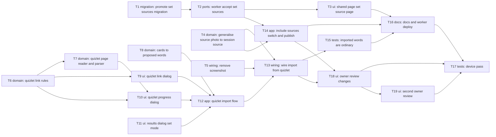

# Epic — import-from-quizlet

> **Spec:** [spec.md](../spec.md) · **Design:** [sad.md](../sad.md) · **Data model:** [data-model.md](../data-model.md) · **UX flows:** [ux-flows.md](../ux-flows.md) · **ADRs:** [adr/](../adr/)
>
> No `contracts/openapi.yaml` and no `screens.md`: the `api` and `screens` stages were not run. The publish contract change (sources with `kind`, `name`, `url`; the `invalid_source` refusal) is specified by [ADR-0006](../adr/0006-publish-set-sources-in-the-sources-list-with-a-kind.md), [sad §6 F4](../sad.md) and [data-model.md](../data-model.md); T2 and T14 must agree on it exactly.

## Goal

A learner turns a public Quizlet set into reviewed words of the current session from its link, read on the phone with no server step; kept words remember the set, and the partner sees the set as a source on the shared page behind one "Include sources" switch (spec §2). The Screenshot item and package go.

## Scope

- **In:** the app (link dialog, progress dialog with the in-app page, parser, results dialog lines, flow, source model, share sheet, publish), the Worker (migration, publish validation and storage), the shared page (set page in the pager and dialog), docs and the device pass.
- **Out (spec §3):** sharing from the Quizlet app, private or login-only sets, images and audio, re-import to pick up changes, folders and classes, translating the back side, writing to Quizlet.

## Task map

Three branches start together: the Worker (T1 → T2 → T3), the app's pure logic (T6, T7, T8) and the app's model and clean-up (T4, T5); they meet in the flow (T12) and the wiring (T13).

## Tasks

See [tracker.md](./tracker.md) for status. Machine contract: [tasks.json](../tasks.json).

| # | Task | Layer | Blocked by | DoD (short) |
|---|---|---|---|---|
| T1 | Promote the set-sources migration into the Worker | migration | — | The staged pair is promoted as `<next>_set_sources.sql` (+ `down/`, `<next>` replaced in its last statement), applies … |
| T2 | Accept, store and load set sources in the Worker publish path | ports | T1 | A publish with photos and sets stores every source in order (sets arrived at once, photos pending), the session loads … |
| T3 | Show a set source as a page of the source pager and the phone sources dialog | ui | T2 | On a session published with two photos and one set, the wide pager shows the set's name as text with its plain link … |
| T4 | Generalise SourcePhoto into SessionSource with a kind, name and link | domain | — | `SessionSource` (stored name `SourcePhoto`) has `@enumerated SourceKind kind` with `photo` first, `String? name`, … |
| T5 | Remove the Screenshot item, its capture code and the screenshot package | wiring | — | The red + menu no longer has Screenshot, `_takeScreenshot` and the `Screenshot` wrapper are gone, `screenshot` is … |
| T6 | Find a Quizlet set link in pasted text and decide which navigations the web view may follow | domain | — | `QuizletLink.find(text)` returns the set id and plain link for every link shape in AC-02 (bare, with/without `https://` … |
| T7 | Write the reader script and parse raw set-page material into a set | domain | T6 | `quizlet_page_script.dart` holds the reader script; `parseQuizletPage(raw, setId)` returns the set (name, stated count, … |
| T8 | Turn cards into proposed words with the text rules, repeats and counts | domain | — | `proposeWords(cards, sessionWords, statedCount)` drops image-only cards, turns line breaks into "; ", cuts term and … |
| T9 | Build the Quizlet link dialog that refuses text without a set link | ui | T6 | The dialog asks for a Quizlet set link, Start with text holding no set link shows the refusal and keeps the text, Start … |
| T10 | Build the progress dialog that loads and reads the set in a web view | ui | T6, T7 | The dialog shows "Reading the Quizlet set…", the name once known and a small live preview; it refuses non-allowed … |
| T11 | Show the set name, "Read X of Y", skipped cards and "No new words" in the results dialog | ui | — | `showQuizletResultDialog` reuses the results dialog with the set's name on top, the "Read X of Y cards" line only when … |
| T12 | Run a Quizlet import from link to kept words, with translation and the late-result rule | app | T8, T9, T10, T11 | `runQuizletImport` opens the link dialog, the progress dialog, proposes words, translates terms through `translateWord` … |
| T13 | Add "Import from Quizlet" to the red + menu and keep the set as the words' source | wiring | T4, T5, T12 | The red + menu shows "Import from Quizlet" in green where Screenshot was and starts `runQuizletImport`; Done appends … |
| T14 | Publish photos and sets behind one "Include sources (N)" switch | app | T4, T2 | The share sheet reads "Include sources (N)" counting photos and sets that still have a word row, on by default with the … |
| T15 | Prove words from a set behave like typed words in the table, History and export | tests | T13 | Tests show a word kept from a card with a back has a filled definition and no definition lightning, one without a back … |
| T16 | Update the architecture docs and deploy the Worker with the migration | docs | T3, T14, T15 | `docs/architecture.md` describes `session_source.dart`, the source cap removal, "Include sources", the `quizlet_*` … |
| T17 | Run the device pass for the spec §6 targets on real Quizlet sets | tests | T16, T18 | `_audit/device-pass.md` records, on iPhone and Android: p95 time to the results dialog for 3 public 100-card sets (5 … |
| T18 | Apply the owner review: Include photos, + menu icons, link how-to, cards pager, photo source cards | ui | T13, T14 | Words screen back to "Include photos (N)" (sets always sent); dark grey "From subtitles" with a Settings icon; white "Q" … |
| T19 | Apply the second owner review: link field style, back side to the right field, captions icon, Settings button with the SnackBar | ui | T18 | The link field looks like the Word field and stays in sight with the keyboard up; a Ukrainian back fills the translation … |

## Risks / Hard rules

- CLAUDE.md rules 1–2: dialogs are not routes; services through providers; the web-view controller in widget `State`.
- No new package except `webview_flutter` (T10) and no new permission (spec §6); `screenshot` is removed (T5).
- The web view registers no `JavaScriptChannel` and allows only Quizlet pages of the pasted set (ADR-0004, sad §8).
- No card text, set name or link extras in logs (sad §7, §8).
- Release order: migration → Worker → app (sad §7; T16 before the app ships).
- The parser depends on Quizlet's page (sad §11, High): T7 fixtures from real pages; T17 confirms on live sets.
