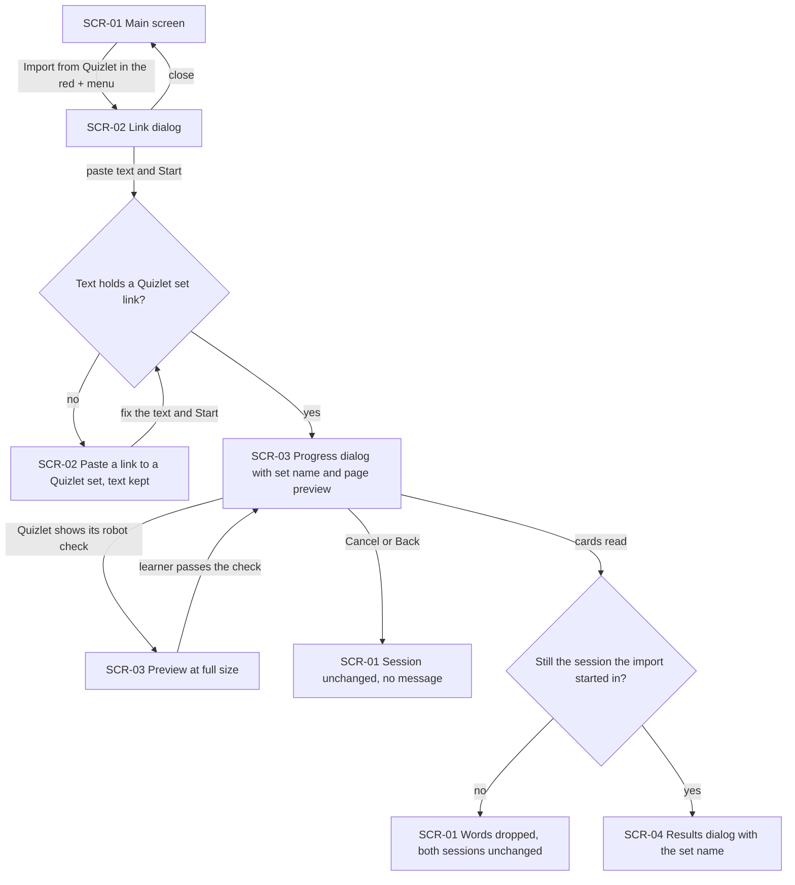
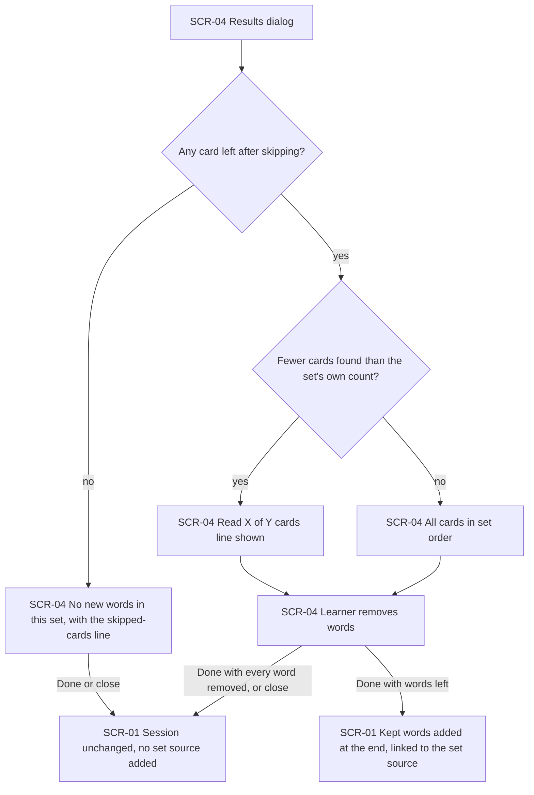
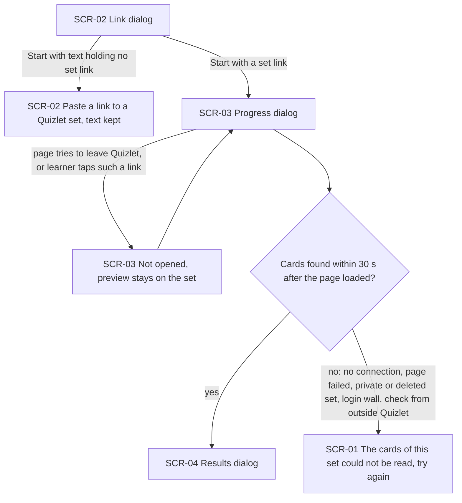
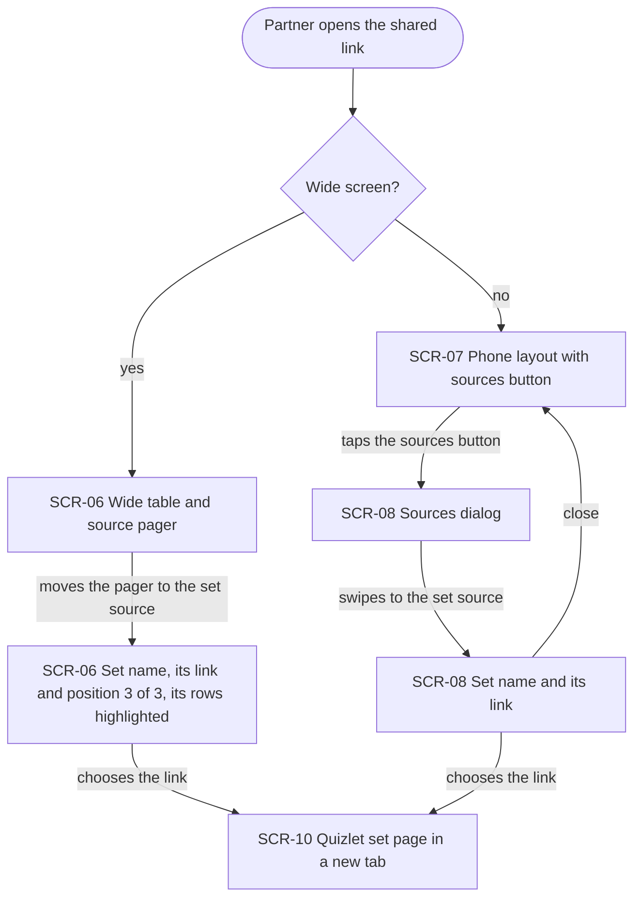
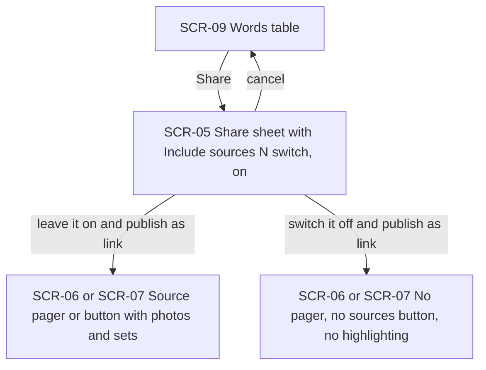
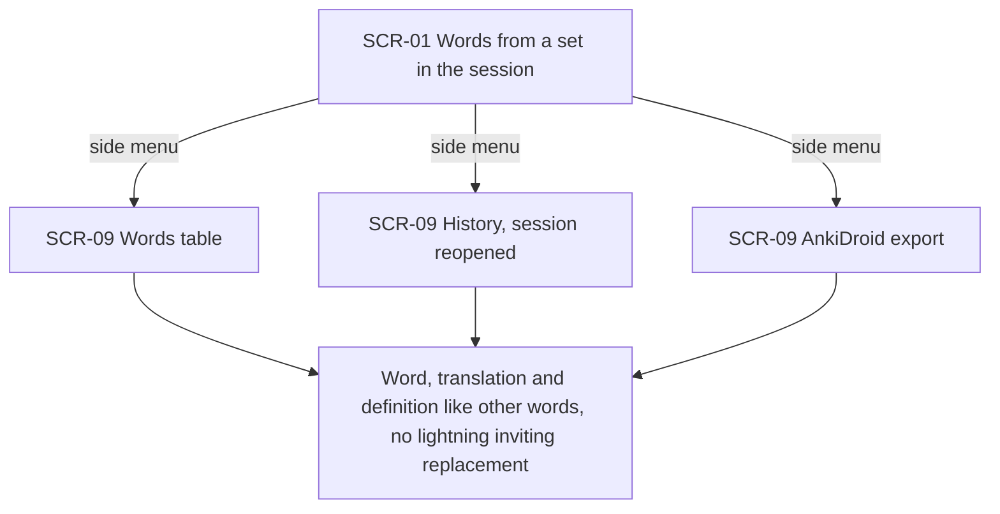

# UX flows — import-from-quizlet

> User flows for every UI-touching §4 user story of [spec.md](./spec.md), produced by `ux-flows` (after `clarify`, before `design`) and read by `design` (evidence for the target-surface + UI-architecture decisions), `sequences` (UI-driven flows align on SCR ids), `screens` (details every inventory row) and `plan-tests` (the e2e-through-UI paths). **Always markdown + mermaid `flowchart`**, whatever the design tool — this artifact is flow-altitude, not visual design.

## Platform decisions

- **Posture:** the import is phone-app only, like the subtitle import; the set source on the shared page reuses good-looking-web's two existing layouts — wide (source pager in the right corner) and phone (stacked-thumbnail button opening a swipeable dialog). Owner's choice, 2026-10-06. There is no `docs/design-system.md` yet.
- **Everything in the app happens in dialogs over the main screen.** "Import from Quizlet" in the red + menu opens the link dialog; Start closes it and shows the progress dialog; the cards arrive in the existing results dialog. There is no import screen.
- **The progress dialog carries a small live preview of the Quizlet page** so the learner can see it is the right set (spec AC-02). When Quizlet shows its own "I'm not a robot" check, the preview grows to full size inside the same dialog and shrinks back once it is passed (AC-05).
- **The progress dialog can be cancelled** (Cancel or Back), quietly, with the session unchanged (AC-07b). While it shows, the learner cannot switch sessions; a session change that still happens is caught by the late-result rule (AC-16).
- **Errors after Start close the progress dialog and show a message on the main screen** with the session unchanged (AC-07). A pasted text without a set link is refused inside the link dialog, before Start, and the text is kept (AC-06).
- **Trying again means opening "Import from Quizlet" again** from the red + menu.
- **On the shared page the set source is one more page of the existing source pager / sources dialog**, next to the photos. Choosing its link leaves the shared page for Quizlet in a new browser tab.
- **Design input flagged, not decided here:** how the app reads the page it shows in the preview, and how the 30-second wait is paused during Quizlet's robot check.

## Screen inventory

| ID | Screen | Purpose | Entry | Exit |
|---|---|---|---|---|
| SCR-01 | Main screen (word input) | The current session's words; the red + menu shows "Import from Quizlet" in green where Screenshot was; messages after a failed import appear here | App launch; any app dialog below closing | SCR-02 from the red + menu; SCR-09 from the side menu |
| SCR-02 | Quizlet link dialog | Paste text holding a Quizlet set link, then Start; refuses text without a set link and keeps it | "Import from Quizlet" in the SCR-01 red + menu | SCR-03 on Start; closed back to SCR-01 |
| SCR-03 | Progress dialog with page preview | "Reading the Quizlet set…", the set's name once known and a small live preview of the set's page; grows to full size for Quizlet's own robot check; Cancel | Start in SCR-02 | SCR-04 when the cards are read; SCR-01 on cancel (quiet) or failure (message) |
| SCR-04 | Results dialog | The set's name, the proposed words (word, translation, definition), the "Read X of Y" and skipped-cards lines when they apply, each word removable; Done adds the rest | Cards read while SCR-03 shows | Done or close → SCR-01 |
| SCR-05 | Words screen share sheet | Choose file or link; the "Include sources (N)" switch with its 30-day notice | Share on the words table (SCR-09) | The link dialog / shared link on publish; back to SCR-09 |
| SCR-06 | Shared page, wide layout | The word table with the source pager in the right corner; the pager has a page per source photo and per set source; rows from the current source highlighted | Opening the shared link on a wide screen | SCR-10 through a set source's link; SCR-07 when the window narrows |
| SCR-07 | Shared page, phone layout | The scrollable word table with the stacked-thumbnail sources button | Opening the shared link on a narrow screen | SCR-08 from the sources button; SCR-06 when the screen widens |
| SCR-08 | Sources dialog (phone) | Swipe between the source photos and the set sources; a set page shows its name and link | The sources button on SCR-07 | Closed back to SCR-07; SCR-10 through a set source's link |
| SCR-09 | Words table, History and AnkiDroid export | Existing places where a session's words are viewed, reopened and exported | Side menu on SCR-01 | Back to SCR-01; SCR-05 through Share; the exported file |
| SCR-10 | Quizlet set page (outside the app) | The set on Quizlet, opened from the shared page in a new browser tab | A set source's link on SCR-06 or SCR-08 | Closing the tab |

## Flows

### Flow: US-01 — Import a set from its link

The learner opens the red + menu, where "Import from Quizlet" sits in green in Screenshot's old place, and the link dialog opens (AC-01). Closing it changes nothing. If the pasted text holds no Quizlet set link, the dialog says to paste one and keeps the text to fix (AC-06). Any text holding a set link starts the import: the progress dialog shows "Reading the Quizlet set…", the set's name once known and a small live preview of the page (AC-02). If Quizlet shows its own robot check, the preview grows to full size until the learner passes it, then shrinks back (AC-05). Cancel or Back returns to the main screen quietly (AC-07b). When the cards are read and the session is still the one the import started in, the results dialog opens; if the session changed meanwhile, the words are dropped (AC-16). The failure branches are drawn in the US-03 flow.

### Flow: US-02 — Review the cards before adding

The results dialog lists the cards in set order, each as word, translation and definition (AC-02); cards with no text term and duplicates are already left out and named in one skipped-cards line (AC-09, AC-10). If every card was skipped, the dialog says "No new words in this set." and Done changes nothing (AC-04b). If fewer cards were found than the set says it has, a "Read X of Y cards" line shows (AC-08). The learner removes the words they don't want; Done adds the rest at the end of the current session in set order, each linked to the set source, and a set imported before stays one source with the newer name (AC-03, AC-13b). Removing every word, or closing the dialog, leaves the session unchanged with no set source (AC-04).

### Flow: US-03 — Understand what went wrong

A pasted text without a Quizlet set link is refused before the import starts, with the text kept (AC-06). While the progress dialog shows, a page outside Quizlet — an advert, a store, another site or a robot check served by another company — is never opened, and moving to another Quizlet set reads nothing from it (AC-11). If no cards are found within 30 seconds after the page has loaded (the wait is paused while Quizlet's own check is on screen), the progress dialog closes and the main screen says the cards of this set couldn't be read and the learner can try again, with the session unchanged (AC-07).

### Flow: US-04 — See which set a word came from

On a wide screen the partner moves the source pager to the set source and sees the set's name with its plain Quizlet link under it and its position ("3 of 3"); the rows imported from that set are highlighted and the others are not (AC-13). Choosing the link opens the set on Quizlet in a new tab. On a phone the partner taps the stacked-thumbnail sources button and swipes the dialog to the set's page, which shows the same name and link (AC-14).

### Flow: US-05 — Decide what the shared page reveals

From the words table, Share opens the share sheet. Its switch reads "Include sources (N)", counting the source photos and set sources that still have a word in the session, is on by default and says included sources are public for 30 days (AC-15). Publishing with it on gives the shared page its pager (wide) or sources button (phone) with photos and sets; switched off, the page shows no pager, no sources button and no highlighting, and nothing reveals the set's name or link (AC-12).

### Flow: US-06 — Quizlet words are ordinary words

Words imported from a set show up in the words table, in the session reopened from History and in the AnkiDroid export like any other words: the app's translation, and the card's back side (and example) as the definition. Neither field shows a lightning inviting the learner to replace it; a word whose card had no back shows the definition lightning as a typed word would (AC-17).

## AC coverage

| AC | Shown by | Notes |
|---|---|---|
| AC-01 | Flow US-01 → SCR-01 to SCR-02 | Menu item in green where Screenshot was |
| AC-02 | Flow US-01 → SCR-03 progress with preview → SCR-04 | Word / translation / definition per card |
| AC-03 | Flow US-02 → Done with words left | |
| AC-04 | Flow US-02 → every word removed, or close | |
| AC-04b | Flow US-02 → no card left after skipping | |
| AC-05 | Flow US-01 → preview at full size | Quizlet's own check only; outside checks → AC-07 |
| AC-06 | Flows US-01 and US-03 → SCR-02 text kept | |
| AC-07 | Flow US-03 → no cards within 30 s | Message on SCR-01 |
| AC-07b | Flow US-01 → Cancel or Back | Quiet |
| AC-08 | Flow US-02 → Read X of Y cards line | |
| AC-09 | Flow US-02 → SCR-04 skipped-cards line | The text rules (line breaks, length) are content, not movement |
| AC-10 | Flow US-02 → SCR-04 skipped-cards line | Matching rule is content, not movement |
| AC-11 | Flow US-03 → not opened, preview stays on the set | |
| AC-12 | Flow US-05 → switched off | |
| AC-13 | Flow US-04 → wide pager set page | |
| AC-13b | Flow US-02 → Done, set imported before stays one source | |
| AC-14 | Flow US-04 → SCR-08 set page | |
| AC-15 | Flow US-05 → SCR-05 switch | |
| AC-16 | Flow US-01 → session changed | |
| AC-17 | Flow US-06 | |
