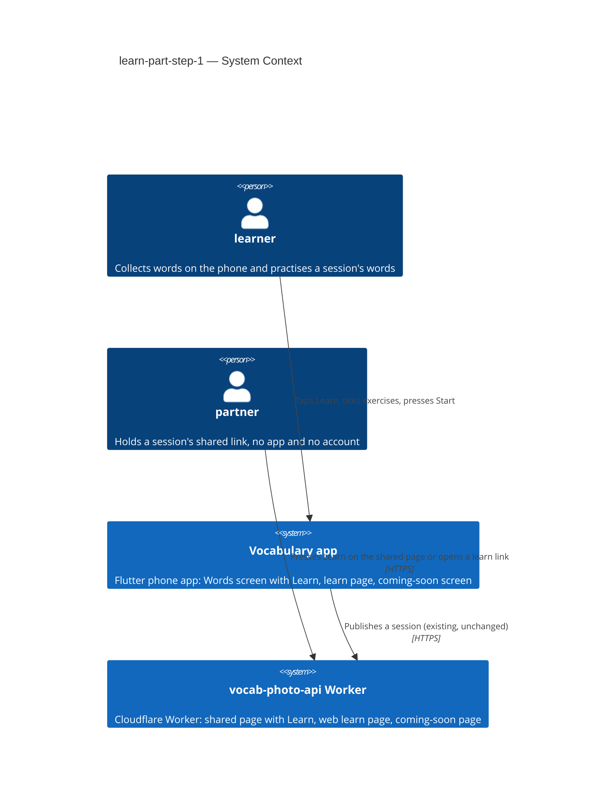
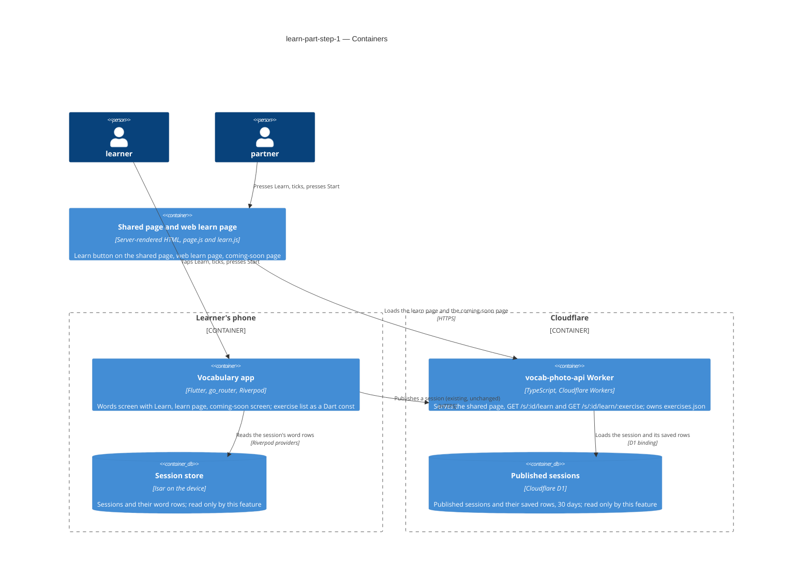
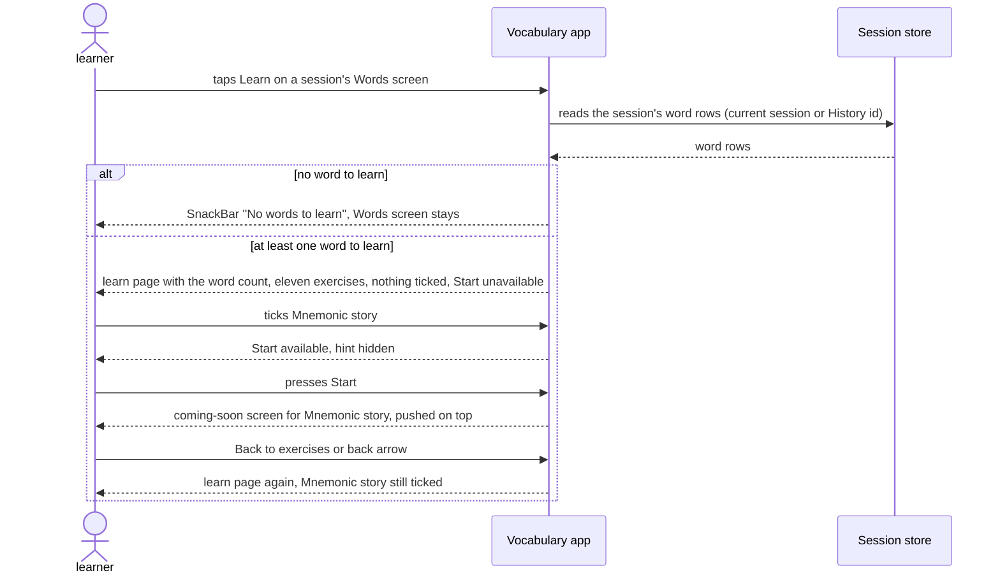
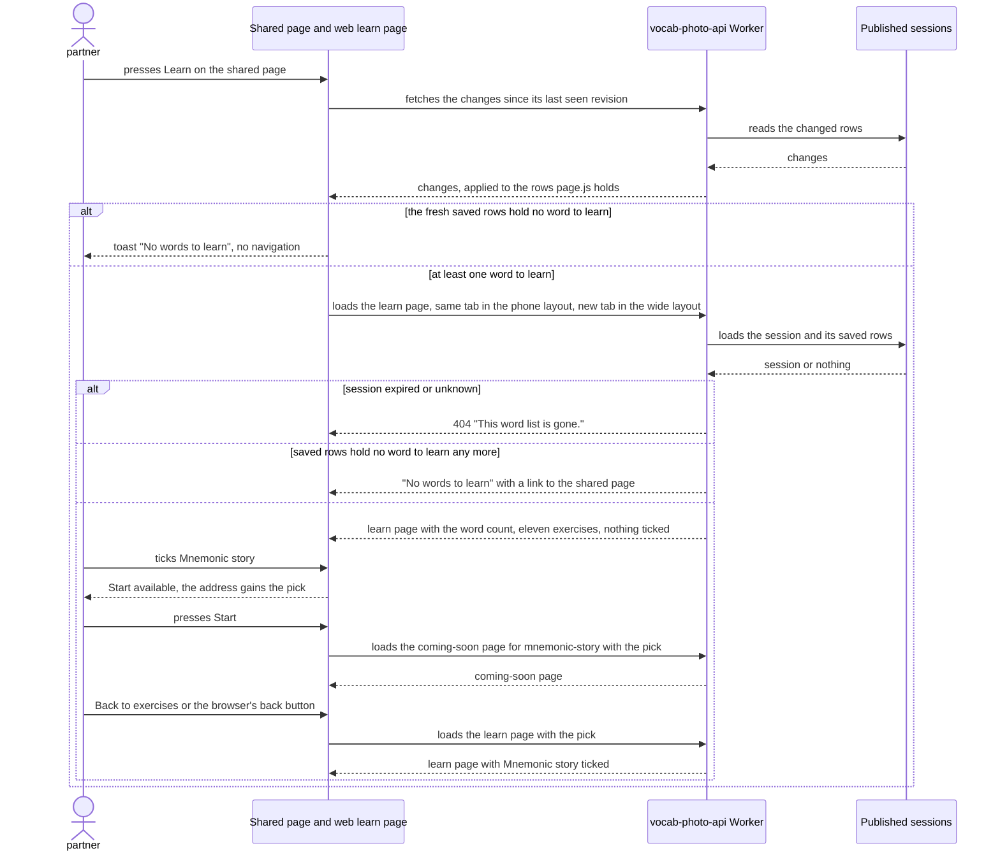

# Software Architecture Document — learn-part-step-1

## 1. Introduction and goals

**Intent.** Build the way into the app's new learning part, before any exercise exists behind it (spec §1, §2). In the app, a Learn button on the Words screen's top bar opens a **learn page** for that session. On the web, a Learn button on the **shared page** opens the same learn page at its own link. The learn page shows the session's count of **words to learn** and the whole plan: eleven **exercises** in three **stages**. Only Mnemonic story can be ticked, and Start opens an honest **coming-soon** screen with a way back. Nothing is stored: ticks last for one visit. Later steps ship each exercise by switching it on, not by redesigning the page. Adding Learn must not cost the Words top bar anything on a narrow phone.

**Top-3 quality goals (1-liners; full scenarios in §10):**

1. **One plan, two pages** — the app's and the web's learn pages list 11 of 11 exercises with the same name, stage, order and state (spec §6 "Same plan on app and web"; CONTEXT invariant).
2. **Quick to open** — ≤ 300 ms from tapping Learn to the app's learn page; ≤ 1.5 s to the web learn page on a phone over 4G, with no sideways scrolling at 320 px.
3. **The Words top bar stays usable on a narrow phone** — the layout is chosen by measuring the space actually available. Nothing is cut off and nothing overflows at 320 dp (100 % and 130 % text), and each top-bar button is ≥ 48 × 48 dp.

**Stakeholders.**

| Role | Interest | Sign-off owner? |
|---|---|---|
| learner | Opens the learn page from a session's Words screen (current or from History), ticks Mnemonic story, presses Start | No |
| partner | Opens the learn page from the shared page or from its own link, without the app | No |
| Tech Lead (Maksym) | SAD approval | Yes |

Security review is N/A by the spec (§6.1: no new data, no new permission, no new way to change a session), so there is no Security Lead sign-off row.

**Critic resolutions (2026-10-06):** no overrides. The four findings were resolved by amendment. Learn on the shared page fetches fresh changes before deciding, so AC-10 holds (§4, §6, §11). Size S is kept, with the reason given (§2). The CLAUDE.md rule-5 override is listed in §2. `learn.d.ts` and the `tsconfig.client.json` include are in §5.

## 2. Constraints

**Technical.**
- App: Flutter 3.35.1, Dart SDK `>=3.0.0 <4.0.0`, phone only. `go_router` typed routes (`lib/router/routes.dart`: `WordInputRoute` `/` with `table`, `history`, `settings` nested). `flutter_riverpod` / `riverpod_annotation` 2.6.x. `isar_community` pinned to `3.3.0-dev.1`, which this feature does not touch, because nothing is stored.
- The Words screen is `lib/features/words_table/words_table_screen.dart`. Its `AppBar` has the title `Words` and one action: Share, an `ElevatedButton.icon` with a white background, inside `Padding(right: 16)`. Its rows are `session.words.where((p) => p.isFilled)`. The source is `wordInputNotifierProvider` when `sessionId` is null (the current session) and `sessionByIdProvider(sessionId)` for a History row, read-only either way. Share answers `No words to share` in a `SnackBar` when no row is filled.
- `WordPair.isFilled` (`lib/core/models/word_pair.dart:129`) is `word.trim()` non-empty AND (`translation.trim()` OR `definition.trim()` non-empty). This is exactly the CONTEXT rule "word to learn".
- Worker (`vocab-photo-api/`): TypeScript 5.6, `wrangler` 4, no runtime npm dependencies. Routes are a table of `RouteDefinition`s, each declaring `public` (`src/routing.ts`). `GET /s/:id` is server-rendered HTML (`src/session/page.ts`), enhanced by one plain-JavaScript file (`src/session/client/page.js`, served at `/assets/page-<hash>.js` by `src/session/assets.ts`; good-looking-web ADR-0002). The page's `.actions` row holds `<a class="btn">Download for AnkiDroid</a>` and the phone layout's photo button.
- The shared page switches between its phone layout and its wide layout at `min-width: 900px` (`WIDE` in `page.js`, mirrored in `style.ts`).
- Every page answer carries a strict CSP (`pageHeaders()`): `script-src 'self'` (no inline script), the single inline `<style>` allowed by its hash, `form-action 'none'`, `frame-ancestors 'none'`. HTML answers are `cache-control: no-store` (`htmlResponse`).
- An unknown or expired id gets the "This word list is gone" page with status 404 (`renderNotFoundPage`, the same body for both). Sessions live 30 days in D1. This feature only reads them: no table, column or migration changes.
- Verification: `dart run build_runner build --delete-conflicting-outputs`, `flutter analyze`, `flutter test`, the CLAUDE.md greps; `npm test` (a local `wrangler dev` with a SQLite D1 stand-in) and `npm run typecheck` in `vocab-photo-api/`.

**Organisational.**
- One owner (Maksym) builds, reviews and deploys. There is no deadline. The Worker is deployed by hand (`wrangler deploy`), and the app ships through the usual store build.
- Size S (`.size`), route quick (`.route`). Kept at S on purpose after the critic pass (owner, 2026-10-06), although the feature adds two feature folders (`lib/features/learn/`, `vocab-photo-api/src/learn/`) and two public routes. The folders only place the code by the repo's conventions and are not a new subsystem. The routes only read and return HTML, with no JSON and no write, and there is no migration. That still fits 2–5 PRs and about a week.

**Conventions.**
- [`CLAUDE.md`](../../../CLAUDE.md) rules 1–6 and [`docs/architecture.md`](../../architecture.md) §2. Navigation goes only through typed routes, and dialogs/SnackBars are not routes. Services come from providers in `lib/core/providers.dart`. Screen data lives in a `@riverpod` notifier, and transient UI state stays in widget `State`. A feature is a folder under `lib/features/`, and features don't import each other's screens. One file ≈ one thing.
- Spec-approved overrides, which this feature carries out:
  - CLAUDE.md rule 3 / architecture.md rule 4 ("do not change how anything looks") gives way for exactly two visible changes: the Words top bar gains Learn, with the compact and icon-only layouts on narrow phones (AC-01, AC-11, AC-11b, AC-12); and the shared page gains one Learn button (spec §3 Non-goals).
  - The roadmap's "Own learning … outsourced to AnkiDroid" line was removed by the spec (2026-10-06).
  - CLAUDE.md rule 5 ("no new domain models — ask first"): the one new type `Exercise` (id, name, stage, available), approved by the owner on 2026-10-06 during this design ([ADR-0003](adr/0003-keep-the-exercise-list-as-json-in-the-worker-and-test-the-app-copy-against-it.md)). The text update is tracked in §11.
- The app/Worker precedent for "two implementations, one shape" is `anki_export.dart` + `vocab-photo-api/README.md` § "AnkiDroid file format": both sides are tested against one written shape.

**Regulatory / external.**
- Data classification: public. The web learn page shows only exercise names and the session's word count, which the shared page already shows (spec §6.1). No personal data, nothing new stored on the device or on the web.
- A link is the only credential. A dead or unknown learn link answers exactly like a dead shared-page link (AC-09), so nothing reveals whether a session existed.
- Reads are not rate-limited, as on the shared page today (spec §6.1, accepted on purpose).

## 3. Context and scope

The learner collects words on the phone and can publish a session as a shared page that anyone with the link can read and edit for 30 days. This feature adds a learn page on both sides. In the app, it is opened from a session's Words screen and reads that session from the device. On the web, it is opened from the shared page or from its own link and reads the published session's saved rows from the Worker. The two learn pages never talk to each other. The web follows the shared page's saved rows, not the app (AC-10).

<!-- brownfield: Flutter app (lib/, go_router + Riverpod, Isar on device) + Cloudflare Worker (vocab-photo-api/, TypeScript, D1, server-rendered shared page with one plain-JS file); read from docs/architecture.md and the code — no docs/architecture-map.md exists -->

**External systems (in / out):**

| Actor or system | Type | Interaction |
|---|---|---|
| learner | Person | Taps Learn on a session's Words screen, ticks Mnemonic story, presses Start, goes back |
| partner | Person | Presses Learn on the shared page or opens a learn link in a phone or desktop browser |
| Vocabulary app | System (ours) | Shows the Learn button, the learn page and the coming-soon screen from the session on the device |
| vocab-photo-api Worker | System (ours) | Serves the shared page (now with Learn), the web learn page and the coming-soon page from the published session |
| External services | — | None added. No AI call, no translation call and no third-party page in this feature |

**C4 Context (L1):**



The context shows two people and two of our own systems, with no external system added. The learner uses the phone app, whose learn page reads the session stored on the device. The partner uses a browser against the Worker, which serves the shared page and now the web learn page from the published copy. The only link between the two systems is the existing publish. Nothing about learning crosses it.

## 4. Solution strategy

**Top strategic choices (the seeds for ADRs):**

1. **Three surfaces: the app, the Worker and the shared page** ([ADR-0001](adr/0001-change-the-app-the-worker-and-the-shared-page-as-three-surfaces.md)). `target_surfaces: [mobile-app, backend-service, web-frontend]`. The app gains the Learn button, the learn page and the coming-soon screen. The Worker gains two public read-only routes, `GET /s/:id/learn` and `GET /s/:id/learn/:exercise`, with the shared page's dead-link answer. The shared page gains a Learn button, and the browser gets the web learn page and coming-soon page. This is the same split as good-looking-web and import-from-quizlet. It serves quality goals 1 and 2, because each side's open time and each side's copy of the plan is a surface of its own.

2. **The web learn page is server-rendered by the Worker, with its own small script, and keeps ticks in its link** ([ADR-0002](adr/0002-render-the-web-learn-page-on-the-worker-and-keep-ticks-in-its-link.md)). The Worker renders the learn page and the coming-soon page as complete HTML, the way it renders the shared page (good-looking-web ADR-0002). A separate plain-JavaScript file, `learn.js`, served at `/assets/learn-<hash>.js` under the unchanged CSP, enables Start and the hint and mirrors every tick into the page's own address (`/s/:id/learn?pick=mnemonic-story`, via `history.replaceState`). The browser's back button then returns to an address the server renders ticked, with no reliance on the browser's cache, which `no-store` usually defeats (AC-05). The Learn button links to the bare `/s/:id/learn`, so a new visit starts unticked (AC-05b). A `pick` that names a coming-soon or unknown exercise is ignored (AC-06). This serves quality goal 2: a small HTML page plus a few kilobytes of script, against the 1.5 s on 4G.

3. **One exercise list: JSON in the Worker, a Dart copy in the app, a test that compares them** ([ADR-0003](adr/0003-keep-the-exercise-list-as-json-in-the-worker-and-test-the-app-copy-against-it.md)). `vocab-photo-api/src/learn/exercises.json` holds the eleven `{id, name, stage, available}` entries in plan order and is the source of truth. The app keeps a `const` list of a new small type `Exercise` in `lib/features/learn/exercises.dart`, so the learn page needs no network. A Flutter test reads the JSON from disk and compares it entry by entry. Ids are stable kebab-case (`mnemonic-story`, …): they appear in web links and will key future progress. **Override of CLAUDE.md rule 5 ("no new domain models — ask first"), approved by the owner on 2026-10-06 for `Exercise` only.** This serves quality goal 1.

**Decided inline (below the ADR gate):**

- **Mobile UI architecture: unchanged.** The app stays a Flutter phone app, and the existing stack excludes any alternative. The learn page and the coming-soon screen are two full screens (ux-flows platform decision), declared as typed routes nested under `table` in `lib/router/routes.dart` and opened with `push`, so the back arrow returns to the Words screen and then to the learn page (CLAUDE.md rule 1). Ticks live in the learn page's widget `State` (architecture.md rule 2: transient UI state). The coming-soon screen is pushed on top, so the ticks survive the round trip (AC-05). A fresh push from Learn is a fresh `State` with nothing ticked (AC-05b). No provider and no notifier holds ticks, and nothing is stored.
- **Which session the app's learn page reads.** The route carries the same optional `sessionId` as `WordsTableRoute`: none for the current session (`wordInputNotifierProvider`), an id for a History row (`sessionByIdProvider`, read-only). The count is the `isFilled` rows, the same rule the Words screen and Share use. A History session is only read, never made current (AC-13).
- **No words to learn.** The app's Learn checks the same filled rows the Words screen already holds and answers `No words to learn` in a `SnackBar` when there are none, as Share does (AC-03). On the shared page, pressing Learn makes `page.js` first fetch the changes since its last seen revision, through the same `GET /s/:id/changes` it already polls (good-looking-web ADR-0005). It does this because its polling runs only every 5 s and stops after 5 idle minutes, so its own rows can be stale. It then decides from the fresh saved rows. With no word to learn, it shows the same text in the page's existing toast and does not navigate (AC-10). Otherwise it opens `/s/:id/learn`, in the same tab in the phone layout and in a new tab in the wide layout (`WIDE`, 900 px; AC-08). In the wide layout, the tab is opened empty during the click itself, because browsers block a tab opened after waiting for a request. It then either receives the address or is closed again and the toast is shown. If the fetch fails (no connection), `page.js` falls back to the rows it holds. The Worker checks again on every learn-page load and shows "No words to learn" with a link to the shared page when the saved rows hold none (AC-08b). It is also what a learn link opened directly, or the link without JavaScript, gets.
- **The narrow Words top bar is fitted by measuring.** A small widget in `lib/features/words_table/widgets/` measures the available width at the phone's text scale and picks one of three layouts: normal (today's Share, untouched, with Learn matching it; AC-12), compact (smaller padding, labels kept; AC-11) or icon-only (labels dropped, `Tooltip` names "Learn" and "Share" on long press; AC-11b). Each button stays at least 48 × 48 dp. It does not use fixed width breakpoints (spec §6).
- **Persistence: none.** No Isar field, no D1 column, no migration, no new preference (spec §3 Non-goals "Learning progress").

## 5. Building block view

The feature follows the repo's existing shapes. Nothing new is invented. In the app, the learn feature is a new folder under `lib/features/`, reached only through typed routes (architecture.md rule 3: features don't import each other's screens). The Words screen gains one widget for the fitted Learn + Share pair. In the Worker, the learn pages are a new `src/learn/` module beside `src/session/`. It reuses the session module's `loadSession`, gone page, `pageHeaders` and `STYLE`, and registers its routes in the same route table with `public: true`. On the shared page, the only change is one link in `.actions` plus a click handler in `page.js`.

**Internal decomposition:**

```
lib/
├── router/routes.dart                    + LearnRoute (path 'learn', under 'table', optional sessionId)
│                                         + ComingSoonRoute (path 'soon', under 'learn', exercise id)
└── features/
    ├── learn/                            NEW feature folder
    │   ├── exercises.dart                Exercise type + the const list of eleven (ADR-0003)
    │   ├── learn_screen.dart             word count, three stages, tick boxes, hint, Start; ticks in State
    │   └── coming_soon_screen.dart       exercise name, "Coming soon — …", "Back to exercises" → pop
    └── words_table/
        ├── words_table_screen.dart       AppBar: back arrow, Learn, "Words", Share; Learn → SnackBar or LearnRoute.push
        └── widgets/learn_share_bar.dart  NEW: measures the space, picks normal / compact / icon-only

vocab-photo-api/src/
├── index.ts                              + learnRoutes in the route table
├── learn/                                NEW module
│   ├── exercises.json                    the eleven entries, source of truth (ADR-0003)
│   ├── exercises.ts                      typed view of the JSON + isWordToLearn(row) (= the app's isFilled)
│   ├── page.ts                           renderLearnPage / renderNoWordsPage / renderComingSoonPage (escaped HTML)
│   ├── routes.ts                         GET /s/:id/learn, GET /s/:id/learn/:exercise (public, read-only)
│   └── client/
│       ├── learn.js                      ticks → Start + hint + ?pick= in the address; "Back to exercises"
│       └── learn.d.ts                    the Text-module import's type, like session/client/page.d.ts
└── session/
    ├── page.ts                           + <a class="btn learn" href="/s/:id/learn">Learn</a> after Download
    ├── client/page.js                    + Learn click: fresh changes fetch, then toast or open (new tab in the wide layout)
    ├── assets.ts                         + serves /assets/learn-<hash>.js beside page-<hash>.js
    └── style.ts                          + the learn pages' rules (one stylesheet, one CSP hash)

vocab-photo-api/tsconfig.client.json     + include src/learn/client/*.js, so npm run typecheck checks learn.js
test/learn_exercises_test.dart            Dart list == vocab-photo-api/src/learn/exercises.json
vocab-photo-api/test/learn.test.mjs       routes, pick handling, no-words, gone answers
```

**C4 Container (L2):**



There are three containers, one for each declared surface. The **Vocabulary app** on the phone reads the session from the on-device **Session store** and draws the learn page from its own copy of the exercise list. The **web pages in the browser** (the shared page's Learn, the web learn page and the coming-soon page) are fetched from the **Worker**. The Worker loads the published session's saved rows from **D1** and renders each page from `exercises.json`. Neither store gets a new field, and the publish between app and Worker is unchanged.

## 6. Runtime view

Two seed flows, one per side, with the empty and dead-link branches inline. The `sequences` stage then covers every §5 AC.

**Critical flow 1: learn page in the app (US-01, US-02, US-03)**



**Critical flow 2: learn page on the web (US-04)**



## 7. Deployment view

<!-- N/A: reuses existing deployment units, no infra change -->

No new deployment unit, binding, secret, cron or migration. The Worker's new routes and assets ship with the usual `wrangler deploy`, and the app's screens with the usual store build. Either can go first. The shared page's Learn depends only on the Worker, and the app's learn page only on the app. Once the Worker is deployed, every live published session shows Learn without a republish, which the spec accepts (§6.1).

## 8. Crosscutting concepts

The repo's defaults are inherited. The rows below only say how each one applies here.

| Concept | Convention | Where defined |
|---|---|---|
| Navigation (app) | `LearnRoute` and `ComingSoonRoute` are typed routes nested under `table`, opened with `push` and left with `pop`. The SnackBar is not a route | CLAUDE.md rule 1; architecture.md §2 rule 1 |
| State (app) | Ticks are in the learn page's widget `State`. The session comes from the existing `wordInputNotifierProvider` / `sessionByIdProvider`. No new provider, nothing persisted | architecture.md §2 rule 2; sad §4 |
| Empty and error answers | App: `SnackBar` "No words to learn" (as "No words to share"). Shared page: the existing `.toasts` toast. Learn link with no word to learn: the page's own "No words to learn" plus a link to `/s/:id`. Dead session, unknown or unavailable exercise: the existing 404 gone page, same body | spec AC-03, AC-08b, AC-09, AC-10; `renderNotFoundPage` |
| Web security | Routes are `public: true` and read-only. The CSP comes from the unchanged `pageHeaders()`. Every value from storage goes through `escapeHtml`. Reads are not rate-limited (same as the shared page) | `src/routing.ts`; `src/session/assets.ts`; spec §6.1 |
| Caching | HTML pages are `no-store` (`htmlResponse`). `learn.js` is served at a hashed, one-year immutable URL, like `page.js` | `src/http.ts`; `src/session/assets.ts` |
| IDs | Exercise ids are stable kebab-case strings from `exercises.json` and appear in links. Session ids keep `ID_PATTERN` | ADR-0003; `src/session/types.ts` |
| Rules shared by app and Worker | "Word to learn" is `isFilled` in Dart and `isWordToLearn` in TypeScript, with the same trim rule. The exercise list is pinned by the parity test | sad §2; ADR-0003 |
| Accessibility | Icon-only Learn and Share carry a `Tooltip` (long press names them). Every top-bar button is ≥ 48 × 48 dp. Web tick boxes are real `<input type="checkbox">` with a `<label>`. Coming-soon ones are `disabled`. The hint sits in an `aria-live` region | spec AC-11b, §6; sad §4 |
| Internationalisation | N/A: the UI is English, as elsewhere. The exercise names are the spec's labels | — |
| Logging / observability | No new log events. The Worker's existing observability covers the new routes | `wrangler.jsonc` `observability` |

## 9. Architecture decisions

| # | Title | Status | Section |
|---|---|---|---|
| 0001 | Change the app, the Worker and the shared page as three surfaces | Accepted | §4 |
| 0002 | Render the web learn page on the Worker and keep ticks in its link | Accepted | §4 |
| 0003 | Keep the exercise list as JSON in the Worker and test the app's copy against it | Accepted | §4 |

ADR files live under `docs/features/learn-part-step-1/adr/NNNN-<title>.md`.

## 10. Quality requirements

**QG-1. One plan, two pages**
- **When:** the app and the Worker are built from the same commit and both learn pages are opened for a session.
- **Then:** 11 of 11 exercises match in name, stage, order and state.
- **How verify:** `test/learn_exercises_test.dart` compares the Dart list with `vocab-photo-api/src/learn/exercises.json` entry by entry. `vocab-photo-api/test/learn.test.mjs` checks that the rendered learn page lists `exercises.json` in order with its states. At release, both pages are compared by eye (spec §6: "a check at release comparing both pages, plus a test that compares the app's and the web page's exercise lists").

**QG-2. Quick to open**
- **When:** the learner taps Learn on a Words screen with words to learn, or a partner opens the web learn page on a phone.
- **Then:** app: ≤ 300 ms from tapping Learn to the page shown. Web: ≤ 1.5 s to the page shown on a phone over 4G, and no sideways scrolling at 320 px viewport width.
- **How verify:** app: a stopwatch / frame timeline on the owner's phone, 5 runs, at release. Web: 5 loads in a phone browser at release, plus browser device emulation at 320 px at release.

**QG-3. The Words top bar stays usable on a narrow phone**
- **When:** the Words screen is shown at 360 dp / 100 %, 320 dp / 100 % and 320 dp / 130 % text size.
- **Then:** the layout is chosen by measuring the space actually available, not by fixed width thresholds. At 360 dp and 100 % text size, labels are shown (normal or smaller padding). At 320 dp, at 100 % and at 130 %, there is no cut-off and no overflow in whichever layout is chosen. Each top-bar button is ≥ 48 × 48 dp, also in the compact and icon-only layouts. Where everything fits with today's padding, Share looks exactly as it does today (AC-12).
- **How verify:** widget tests at 360 dp/100 %, 320 dp/100 % and 320 dp/130 % (layout chosen, no `RenderFlex` overflow, title "Words" whole, each button's size ≥ 48 × 48 dp at 320 dp), plus a device or emulator pass at release.

**QG-4. A dead link opens nothing**
- **When:** a learn link or a coming-soon link names an expired or unknown session, or an exercise that is unknown or not available.
- **Then:** the answer is the shared page's 404 "This word list is gone." page with the same body, and nothing reveals whether the session ever existed (AC-09).
- **How verify:** `learn.test.mjs` requests each case and compares status and body with `GET /s/<unknown id>`.

## 11. Risks and technical debt

| Risk / debt | Severity | Mitigation | Owner |
|---|---|---|---|
| The shared page's `.actions` row (Download for AnkiDroid, Learn, the phone layout's photo button) may wrap or crowd on a 320 px phone. The spec pins 320 px only for the learn page | Medium | The `screens` stage draws the row at 320 px in the phone layout. Checked in the release 320 px emulation pass | Maksym |
| An older app from the store can show an exercise as coming soon after the Worker has switched it on (ADR-0003) | Low | Switch an exercise on in one change for both lists (the parity test enforces it), and release the app before deploying the Worker when it matters | Maksym |
| Learn's fresh changes fetch can fail (no connection), so `page.js` falls back to its own possibly stale rows and may open the learn page for a session that has just lost its last word to learn. In the wide layout, the case with no word to learn briefly opens and closes an empty tab | Low | The Worker re-checks on every load and shows "No words to learn" with a link back (AC-08b) | Maksym |
| Measuring the top bar depends on text metrics that differ by device font | Low | Widget tests at the three spec sizes, a device pass at release, and icon-only as the last-resort layout | Maksym |
| Repo texts this design outdates: `docs/architecture.md` §1/§3 (no `features/learn/`, no learn routes, no `src/learn/`), CLAUDE.md rule 5 (`Exercise` approved) and rule 3 (the two approved visible changes), `vocab-photo-api/README.md` (the new public routes) | Low | Update them with the code in the implementing tasks | Maksym |
| Product: roadmap step 8 ("mark one memorized") overlaps the planned "Remember or not" exercise (spec §8) | Low | Untouched by this feature. The owner decides before `sdd:specify` of "Remember or not" | Maksym |

**Accepted debt (acceptable in v1, plan to fix later):**
- Start on the web needs JavaScript, like editing on the shared page.
- Start opens the coming-soon screen for the first ticked exercise in plan order. A real sequence of several exercises is designed when a second exercise becomes available.
- Exercise ids are frozen from now on. Renaming one later needs a mapping once progress is stored.
- No learning progress is stored anywhere (spec §3). The progress feature will add its own storage keyed by exercise id.

## 12. Glossary

| Term | Meaning |
|---|---|
| learner | The phone owner who collects words into sessions; opens the app's learn page from a Words screen (repo-root CONTEXT) |
| partner | A person holding a session's shared link, with no app and no account; opens the web learn page (repo-root CONTEXT) |
| session | A set of words collected together on the learner's device; the learn page practises one session's words (repo-root CONTEXT) |
| shared page | The public web page of a published session; it now carries a Learn button (repo-root CONTEXT) |
| word row | One line of a session: an English word with its details (repo-root CONTEXT) |
| exercise | One kind of activity for practising a session's words; listed on the learn page, available or coming soon (feature CONTEXT) |
| learn page | The app screen and the matching web page where exercises are ticked and Start is pressed (feature CONTEXT) |
| stage | One of the three groups of exercises, shown as "Step 1", "Step 2", "Step 3"; not a roadmap step (feature CONTEXT) |
| available exercise | An exercise that can be ticked and started; only Mnemonic story in this feature (feature CONTEXT) |
| coming soon | The state of an exercise that cannot be ticked yet, and the screen Start opens while the picked exercise is not built (feature CONTEXT) |
| word to learn | A word row with an English word plus a translation or a definition; on the web, only saved rows count (feature CONTEXT; `isFilled` / `isWordToLearn`) |
| mnemonic story | The exercise that links a session's words into one story, one frame per word; built in a later feature (feature CONTEXT) |
| exercise list | The eleven `{id, name, stage, available}` entries in plan order: `exercises.json` in the Worker and its Dart copy in the app (ADR-0003). *Not yet in CONTEXT, so flagged for `/sdd:glossary`* |
| pick | One ticked exercise carried in the web learn page's address (`?pick=<exercise id>`), so the browser's back button returns with ticks kept (ADR-0002). *Not yet in CONTEXT, so flagged for `/sdd:glossary`* |
| normal / compact / icon-only bar | The three layouts of the Words top bar, chosen by measuring the space available (AC-11, AC-11b, AC-12) |
