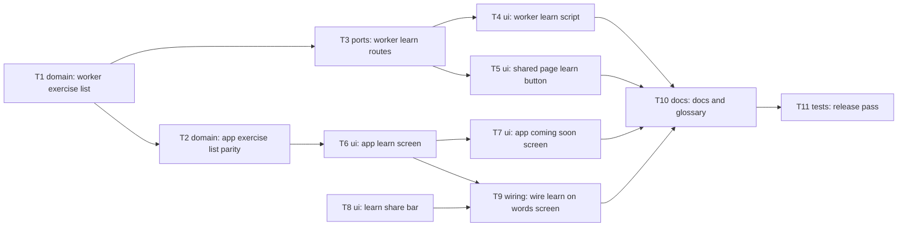

# Epic — learn-part-step-1

> **Spec:** [spec.md](../spec.md) · **Design:** [sad.md](../sad.md) · **UX flows:** [ux-flows.md](../ux-flows.md) · **Screens:** [screens.md](../screens.md) · **API:** [openapi.yaml](../contracts/openapi.yaml) · **ADRs:** [adr/](../adr/)
>
> No `data-model.md`: legal fast-lane skip — nothing is stored, no migration ([sad §2](../sad.md), [api-sync-report.md](../contracts/api-sync-report.md)).

## Goal

The learner reaches a learn page from any Words screen with words, and a partner reaches the same page from the shared link (spec §2). The page shows the whole plan — three stages, eleven exercises — honestly: only Mnemonic story can be ticked, and Start lands on a coming-soon screen. The Words top bar stays readable and tappable on a narrow phone.

## Scope

- **In:** the Worker (exercise list, two public read-only learn routes, `learn.js`), the shared page (one Learn button + its fresh check), the app (exercise list, learn page, coming-soon screen, `LearnShareBar`, Words screen wiring), repo docs, the release pass. Surfaces: `mobile-app`, `backend-service`, `web-frontend` ([ADR-0001](../adr/0001-change-the-app-the-worker-and-the-shared-page-as-three-surfaces.md)).
- **Out (spec §3):** the mnemonic story itself, the other ten exercises, learning progress of any kind, spaced repetition, any other change to the shared page's table, photos or download.

## Task map

Two branches start together: the Worker exercise list (T1, which also unblocks the app's parity test T2) and the app's top bar (T8, no dependencies). The Worker side runs T1 → T3 → T4 / T5; the app side runs T2 → T6 → T7 and T6 + T8 → T9. Everything meets in the docs (T10) and the release pass (T11).

## Tasks

See [tracker.md](./tracker.md) for status. Machine contract: [tasks.json](../tasks.json).

| # | Task | Layer | Blocked by | ACs |
|---|---|---|---|---|
| T1 | Add the exercise list and the word-to-learn rule to the Worker | domain | — | AC-04, AC-08b |
| T2 | Add the Exercise type and its const list to the app, pinned to the Worker's JSON | domain | T1 | AC-04 |
| T3 | Serve the web learn page, the no-words page and the coming-soon page from the Worker | ports | T1 | AC-04, AC-06, AC-08, AC-08b, AC-09 |
| T4 | Add learn.js: Start, the hint, the pick in the address and Back to exercises | ui | T3 | AC-05, AC-05b, AC-07 |
| T5 | Add Learn to the shared page with a fresh check before opening | ui | T3 | AC-08, AC-10 |
| T6 | Add the app's learn page and LearnRoute | ui | T2 | AC-04, AC-06, AC-07, AC-13 |
| T7 | Add the app's coming-soon screen and make Start open it | ui | T6 | AC-05, AC-05b |
| T8 | Add LearnShareBar that fits Learn and Share by measuring the space | ui | — | AC-01, AC-11, AC-11b, AC-12 |
| T9 | Put Learn on the Words screen: SnackBar when empty, otherwise open the learn page | wiring | T6, T8 | AC-01, AC-02, AC-03, AC-13 |
| T10 | Update the repo docs this design outdates | docs | T4, T5, T7, T9 | — |
| T11 | Deploy the Worker and run the release checks on device and in the browser | tests | T10 | AC-08, AC-11, AC-11b, AC-12 |

**Lanes (overlapping `files_hint`, serialized by `implement`):** T3 → T4 (`src/learn/page.ts`, `test/learn.test.mjs`); T3 → T5 (`src/session/style.ts`); T6 → T7 (`lib/router/routes.dart`, `learn_screen.dart`).

## Risks / Hard rules

- **CLAUDE.md rule 1:** app navigation only through `LearnRoute` / `ComingSoonRoute` in `lib/router/routes.dart` (T6, T7, T9).
- **CLAUDE.md rule 3:** Share must look exactly as today where it fits (AC-12); cut-and-paste, don't restyle (T8). The only approved visible changes are the Learn button + narrow layouts and the shared page's Learn ([sad §2](../sad.md)).
- **CLAUDE.md rule 5:** `Exercise` is the one approved new type (T2). No new packages.
- **AC-09 / QG-4:** every dead-link answer must be byte-identical to `GET /s/<unknown id>` (T3).
- **CSP unchanged:** no inline script; one stylesheet, one hash (T3, T4, T5).
- **Open item:** OQ-1 in [api-sync-report.md](../contracts/api-sync-report.md) (coming-soon page for a session with no word to learn) — T3 builds the provisional 200 unless the owner resolves it first.
- **Nothing persisted** — no Isar field, D1 column, migration or preference (spec §3).
