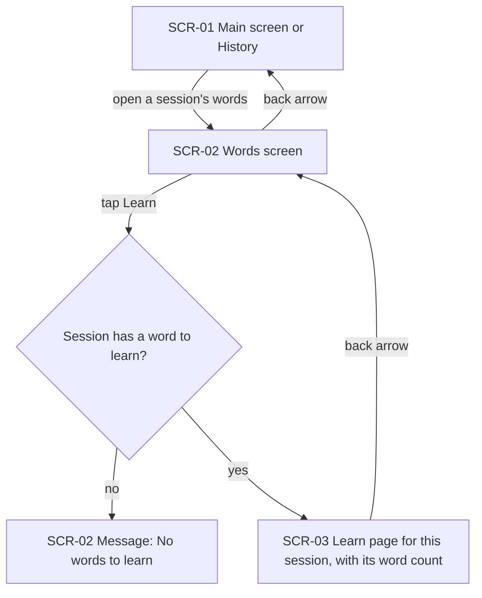
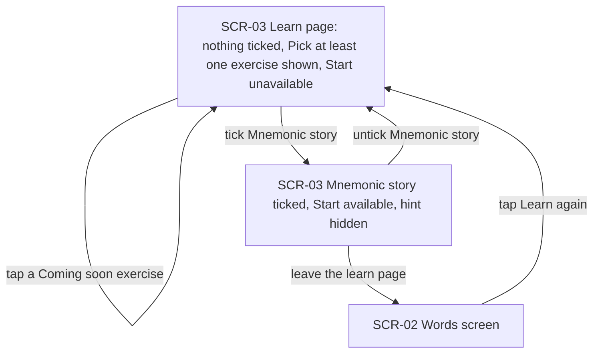
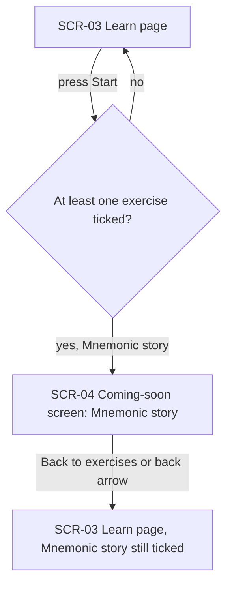
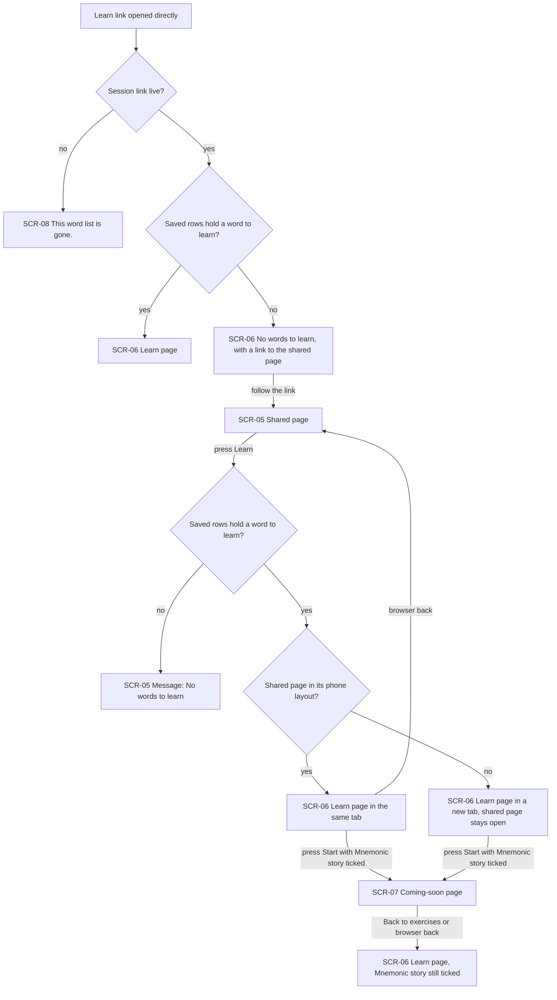
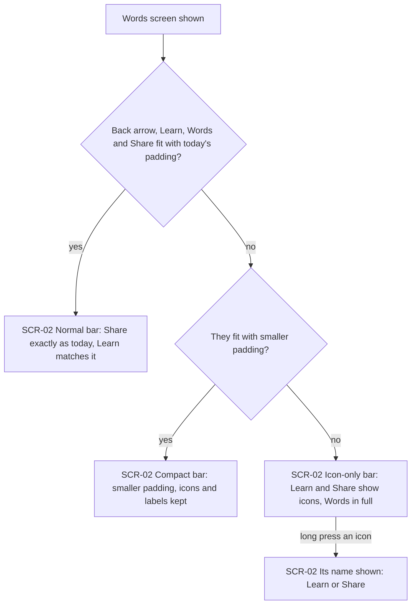

# UX flows — learn-part-step-1

> User flows for every UI-touching §4 user story of [spec.md](./spec.md), produced by `ux-flows` (after `clarify`, before `design`) and read by `design` (evidence for the target-surface + UI-architecture decisions), `sequences` (UI-driven flows align on SCR ids), `screens` (details every inventory row) and `plan-tests` (the e2e-through-UI paths). **Always markdown + mermaid `flowchart`**, whatever the design tool — this artifact is flow-altitude, not visual design.

## Platform decisions

- **Posture:** the app is phone-only. The web learn page is responsive, one page for phone and computer. It follows the shared page's own switch between its phone layout and its wide layout. Owner's choice, 2026-10-06. There is no `docs/design-system.md` yet.
- **In the app, the learn page and the coming-soon screen are full screens, not dialogs.** Each is opened on top of the previous one, and the back arrow returns to it (spec AC-02, AC-05).
- **On the web, the learn page has its own link.** In the phone layout it opens in the same tab, and the browser's back button returns to the shared page. In the wide layout it opens in a new tab, and the shared page stays open in its own tab, including any cell not saved yet (AC-08).
- **"No words to learn" in the app is a short message on the Words screen.** The learn page does not open (AC-03), the same way Share answers "No words to share". On the shared page it is the same kind of short message (AC-10). Only a learn link opened directly shows it as the learn page's own content, with a link to the shared page (AC-08b).
- **Ticks last for one visit of the learn page.** A return from the coming-soon screen keeps them, and opening the learn page again from Learn clears them (AC-05, AC-05b).
- **The coming-soon screen is the same on both surfaces:** the exercise's name as the heading, "Coming soon — this exercise is not ready yet." and a "Back to exercises" button (AC-05).
- **Design input flagged, not decided here:** how the web learn page and the coming-soon screen share one link scheme so that the browser's back button keeps the ticks (AC-05 on the web), and how the app's and the web's exercise lists are kept equal (spec §6, a test that compares both).

## Screen inventory

| ID | Screen | Purpose | Entry | Exit |
|---|---|---|---|---|
| SCR-01 | Main screen or History (app) | Existing ways to the Words screen: the current session's words table, or a session picked in History | App launch; side menu | SCR-02 |
| SCR-02 | Words screen (app) | The session's words. The top bar holds back arrow, Learn, "Words" and Share. Learn and Share use smaller padding, or icons only, when the bar is too narrow. "No words to learn" appears here as a short message | A session's words table from SCR-01 | SCR-03 through Learn; back to SCR-01 |
| SCR-03 | Learn page (app) | The session's word count, three stages with eleven exercises, tick boxes (only Mnemonic story can be ticked), "Pick at least one exercise" while nothing is ticked, and Start | Learn on SCR-02 when the session has a word to learn | SCR-04 through Start; back to SCR-02 |
| SCR-04 | Coming-soon screen (app) | "Mnemonic story", "Coming soon — this exercise is not ready yet." and "Back to exercises" | Start on SCR-03 | Back to SCR-03 with its ticks kept |
| SCR-05 | Shared page (web) | The existing word table, phone or wide layout. "Learn" sits right of "Download for AnkiDroid". "No words to learn" appears here as a short message | Opening the session's shared link | SCR-06 through Learn: same tab in the phone layout, new tab in the wide layout |
| SCR-06 | Learn page (web) | The same content as SCR-03 for the published session's saved rows, at its own link. Opened directly for a session with no word to learn, it shows "No words to learn" and a link to the shared page | Learn on SCR-05; the learn link opened directly | SCR-07 through Start; back to SCR-05 (phone layout); the tab stays open (wide layout) |
| SCR-07 | Coming-soon page (web) | The same content as SCR-04 | Start on SCR-06 | Back to SCR-06 with its ticks kept |
| SCR-08 | "This word list is gone." page (web) | The shared page's existing answer to an expired or unknown link, also given for a learn link | A learn link of an expired or unknown session | None |

## Flows

### Flow: US-01 — Open the learn page in the app

The learner opens a session's Words screen, either for the current session or for a session picked in History. Tapping Learn checks whether the session has at least one word to learn: a word with a translation or a definition. If not, the Words screen stays and shows the short message "No words to learn". If so, the learn page opens for that session, showing its own word count, and the back arrow returns to the same Words screen. Opening the learn page from a History session never makes that session current and never changes the current session.

### Flow: US-02 — See the learning plan and pick exercises

The learn page opens with nothing ticked. The line "Pick at least one exercise" is shown and Start is unavailable. Tapping any of the ten coming-soon exercises, on its tick box or its label, changes nothing. Ticking Mnemonic story makes Start available and hides the line, and unticking it brings both back. Leaving the learn page and pressing Learn again opens it with nothing ticked, because ticks last only for one visit.

### Flow: US-03 — Start the picked exercises

Pressing Start with nothing ticked does nothing: Start stays unavailable and the hint stays. With Mnemonic story ticked, Start opens the coming-soon screen. It has the heading "Mnemonic story", the text "Coming soon — this exercise is not ready yet." and a "Back to exercises" button. Either that button or the back arrow returns to the learn page, where Mnemonic story is still ticked.

### Flow: US-04 — Learn from a shared link

The partner presses Learn, right of "Download for AnkiDroid" on the shared page. The page checks the session's saved rows. If none holds a word to learn, for example because every row was deleted on the shared page, the shared page shows "No words to learn". It does so even if the learner's app still has words. Otherwise the learn page opens at its own link. In the shared page's phone layout it opens in the same tab, and the browser's back button returns to the shared page. In the wide layout it opens in a new tab, so the shared page and any cell not saved yet stay open. From there it works as in the app: Start with Mnemonic story ticked opens the coming-soon page, and "Back to exercises" or the browser's back button returns with the tick kept. A learn link opened directly behaves the same way. An expired or unknown session shows the shared page's "This word list is gone." and reveals nothing more. A live session with no word to learn shows "No words to learn" and a link to the shared page.

### Flow: US-05 — Keep the Words top bar usable on a narrow phone

Each time the Words screen is shown, the bar is fitted to the space actually available at the phone's system text size, not to a fixed screen width. If the back arrow, Learn, the title "Words" and Share fit with today's padding, the bar looks as it does today, and Learn matches Share. If not, both buttons get smaller padding and keep their icons and labels. If even that does not fit, both buttons show only their icons. The title "Words" always stays whole, and a long press on an icon shows its name. In every layout each button stays at least 48 × 48 dp.

## AC coverage

| AC | Shown by | Notes |
|---|---|---|
| AC-01 | Flow US-01 → SCR-02 Words screen; Flow US-05 → normal bar | Top-bar order and the Learn button's look live in `screens` |
| AC-02 | Flow US-01 → yes branch to SCR-03, back arrow to SCR-02 | Current and History sessions alike |
| AC-03 | Flow US-01 → no branch, "No words to learn" | |
| AC-04 | Flow US-02 → SCR-03 initial state | Word count, stages and exercise list are SCR-03 content |
| AC-05 | Flow US-03 → SCR-04 and back with tick kept; Flow US-04 → SCR-07 and back | |
| AC-05b | Flow US-02 → leave, Learn again, nothing ticked | |
| AC-06 | Flow US-02 → tap a Coming soon exercise, self-loop | |
| AC-07 | Flow US-02 → initial and untick states; Flow US-03 → no branch | |
| AC-08 | Flow US-04 → phone-layout same tab / wide-layout new tab | No sideways scroll at 320 px is a `screens` / NFR check |
| AC-08b | Flow US-04 → learn link opened directly, live session branches | |
| AC-09 | Flow US-04 → link not live, SCR-08 | |
| AC-10 | Flow US-04 → no branch, "No words to learn" on SCR-05 | Follows the saved rows, not the app |
| AC-11 | Flow US-05 → compact bar | |
| AC-11b | Flow US-05 → icon-only bar and long press | |
| AC-12 | Flow US-05 → normal bar | |
| AC-13 | Flow US-01 → SCR-03 shows this session's word count | The current session is not changed |
