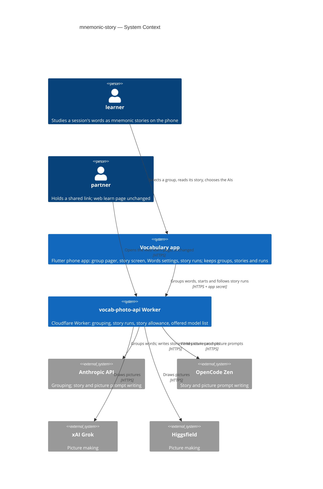

# Software Architecture Document — mnemonic-story

## 1. Introduction and goals

**Intent.** Ship the first real exercise behind the learn page's Start: a **mnemonic story** with one picture, written by AI from one **word group** of the session's words to learn (spec §1, §2). A session with more than 19 words to learn is first split by a fixed AI on the Worker into topical groups of 7 to 19 words. The learner selects one group on a pager at the top of the learn page. Each group gets one story made by three AIs in turn, the **story writer**, the **picture prompt writer** and the **picture maker**, chosen by the learner on a new Words settings screen. The story is kept on the phone and made again only when the learner asks. Every **story run** is kept as a record with each AI's result, price and time, so the owner can pick the best AIs for the money. Everything happens in the app. The web learn page does not change, and a daily **story allowance** caps what the whole app can spend.

**Top-3 quality goals (1-liners; full scenarios in §10):**

1. **Spending is bounded and never doubled.** ≤ 20 story runs start per UTC day across the whole app. A finished step is never paid again, even when the app is closed mid-run, and nothing reachable from a shared link can start a run (spec §6 "Story allowance", AC-10, AC-18, AC-19).
2. **A story run finishes on its own.** ≤ 3 min from start to the picture shown with the default AI choice, and the run carries on while the learner is away (spec §6 "Story run time", AC-10).
3. **A saved story opens at once.** ≤ 500 ms from Start to the picture and text shown, from the phone's own storage, with no network (spec §6 "Saved story open time", AC-07).

**Stakeholders.**

| Role | Interest | Sign-off owner? |
|---|---|---|
| learner | Selects a word group, reads its mnemonic story, chooses the AI choice, compares story runs, makes a story again | No |
| partner | Unchanged: the web learn page still leads to coming soon, and nothing on the web can start a run (AC-18) | No |
| Tech Lead (Maksym) | SAD approval | Yes |
| Security Lead | Required by spec §6.1: a new paid server capability reached with a secret that ships in the app | Yes |

**Decision overrides.**
- Decision override: story run results are held on the Worker for up to 7 days — rationale: spec §6.1 says stories, pictures and run records stay on the learner's device. To meet AC-10 (a step in progress when the app closes is collected later, not paid again), the Worker must hold each step's result until the app collects it. The device keeps the only lasting copy. The Worker's copy is deleted by the daily clean-up after 7 days ([ADR-0002](adr/0002-run-each-story-run-as-a-cloudflare-workflow.md), §11). Owner, 2026-10-07.

## 2. Constraints

**Technical.**
- App: Flutter 3.35.1, Dart SDK `>=3.0.0 <4.0.0`, phone only. Typed routes in `lib/router/routes.dart` (`go_router` 17 + `go_router_builder`). Under `/` the tree is `table` → `learn` → `soon`, plus `history` and `settings`. State uses `flutter_riverpod` / `riverpod_annotation` 2.6.x.
- App storage: `isar_community` pinned to `3.3.0-dev.1` (architecture.md §2 rule 6). One collection today, `Session`, opened in `lib/core/services/session_store.dart` (`Isar.open([SessionSchema], …, name: 'vocab')`). `WordPair` and `SessionSource` are `@embedded`. `WordPair` has no stable id. Preferences use `shared_preferences`, and files live under the documents directory from `path_provider` (as in `source_photo_store.dart`).
- App packages already present that this feature reuses: `http` (Worker calls with the `x-app-secret` header, as `vocab_photo_service.dart` does), `flutter_image_compress` (picture size), `shared_preferences` and `path_provider`. `InteractiveViewer` (Flutter SDK) is already used for zoom in `lib/features/words_table/photo_viewer.dart`. The project has no background-execution package, so the app does nothing while it is closed.
- Worker (`vocab-photo-api/`): TypeScript 5.6, `wrangler` 4, `@cloudflare/workers-types`, no runtime npm dependencies, `compatibility_date` `2025-01-01`. Routes are a table of `RouteDefinition`s, each declaring `public` (`src/routing.ts`, `src/index.ts`). Every non-public route needs `x-app-secret` = `APP_SHARED_SECRET` and passes `RATE_LIMITER`: 20 requests per 60 s per `cf-connecting-ip`.
- Worker storage: D1 `DB` (`vocab-sessions`, migrations `migrations/000N_*.sql` with hand-applied `migrations/down/`), KV `SESSIONS` and `DEFINITIONS`, and R2 `SOURCES` (optional binding: when it is absent, the photo routes answer 503). One cron, `0 3 * * *`, runs the daily clean-up.
- Worker AI today: Anthropic only (`ANTHROPIC_API_KEY`), with an allow-listed model set in `src/subtitles/prompt.ts`. Subtitle imports cap the AI call at 225 s and let tests point `ANTHROPIC_API_URL` at a local stub.
- The daily allowance pattern exists: `src/subtitles/allowance.ts` `takeSubtitleImport` takes one unit from `all_subtitle_imports(utc_day, used)` (≤ 20 per UTC day) in one D1 batch before the AI call. A unit is not given back when the call fails.
- Verification: `dart run build_runner build --delete-conflicting-outputs`, `flutter analyze`, `flutter test`, the CLAUDE.md greps. In `vocab-photo-api/`: `npm test` (`scripts/test.mjs` runs `wrangler dev` with a SQLite D1 stand-in and stub providers) and `npm run typecheck`.

**Organisational.**
- One owner (Maksym) builds, reviews and deploys. There is no deadline. The Worker is deployed by hand (`wrangler deploy`, D1 migrations with `wrangler d1 migrations apply`), and the app ships through the usual store build.
- Size M (`.size`), route standard (`.route`): two surfaces, a new Worker module, a D1 migration, an Isar schema change and five new app screens or parts of screens.
- Provider accounts and keys for OpenCode Zen, xAI and Higgsfield must exist before the Worker can offer their models. Until then, `models.json` lists only Anthropic models (ADR-0004).

**Conventions.**
- [`CLAUDE.md`](../../../CLAUDE.md) rules 1–6 and [`docs/architecture.md`](../../architecture.md) §2. Navigation goes only through typed routes, and dialogs/SnackBars are not routes. Services come from providers in `lib/core/providers.dart`. Screen data lives in a `@riverpod` notifier, and transient UI state stays in widget `State`. A feature is a folder, features don't import each other's screens, and one file ≈ one thing.
- Spec-approved overrides, which this feature carries out:
  - CLAUDE.md rule 3 / architecture.md rule 4 ("do not change how anything looks") gives way for the visible parts spec §1 lists: the Words screen's settings button, Words settings, Story runs and a run's details, the group pager on the learn page, the story screen in place of coming soon for Mnemonic story in the app, and the "Make a new story" confirmation.
  - CLAUDE.md rule 5 ("no new domain models — ask first"): `WordGroup` (embedded in `Session`), `StoryRun` with its `StoryStep`s (a new collection) and `WordPair.rowId`. Approved by the owner on 2026-10-07 in this design ([ADR-0003](adr/0003-keep-word-groups-in-the-session-and-story-runs-in-their-own-collection.md)). The text update is tracked in §11.
  - learn-part-step-1's invariant "the learn page saves nothing" is narrowed (spec §1). Ticks still last one visit, but word groups, the selected group, mnemonic stories and story runs are kept.
- The precedent for one shape shared by the app and the Worker is learn-part-step-1 ADR-0003: JSON in the Worker as the source of truth, read by the app. Here the app fetches it instead of copying it (ADR-0004).

**Regulatory / external.**
- Data classification: internal (spec §6.1). The words of a word group go to the chosen AI providers, as photo words go to Anthropic today. No personal data is added.
- Security review: required (spec §6.1). The Security Lead signs off §8 "Spending control" and ADR-0002 before release (§11).
- Provider terms: each provider is used only through its paid API with a key held as a Worker secret. Pictures that a provider refuses are a failed picture (AC-09), never retried with altered words.

## 3. Context and scope

The learner collects words on the phone. The learn page from learn-part-step-1 lists eleven exercises, and Mnemonic story is the only one that can be ticked. This feature makes it real in the app. The app asks the Worker to group the session's words and to run each group through three AIs, and keeps the groups, stories, pictures and run records on the phone. The Worker holds the provider keys, the offered model list and the daily allowance, and calls four AI providers. The partner's web learn page is not changed: Mnemonic story there still leads to coming soon, and no public route can start a run.

<!-- brownfield: Flutter app (lib/, go_router + Riverpod, Isar on device) + Cloudflare Worker (vocab-photo-api/, TypeScript, D1 + KV + R2, x-app-secret on app routes, per-address rate limiter, daily subtitle allowance in D1, Anthropic as the only AI); read from docs/architecture.md, CLAUDE.md and an explorer scan — no docs/architecture-map.md exists -->

**External systems (in / out):**

| Actor or system | Type | Interaction |
|---|---|---|
| learner | Person | Selects a word group, reads its story, chooses the AIs, compares story runs, makes a story again — all in the app |
| partner | Person | Unchanged: opens the web learn page, where Mnemonic story still leads to coming soon (AC-18) |
| Vocabulary app | System (ours) | Groups and stories on the phone; calls the Worker with the app secret |
| vocab-photo-api Worker | System (ours) | Groups words, runs story runs, keeps the allowance and the offered model list, holds results until collected |
| Anthropic API | System (external) | Grouping (fixed model); story writer and picture prompt writer (Sonnet 5.5, Opus 5.5) |
| OpenCode Zen | System (external, new) | Story writer and picture prompt writer for the OpenCode Zen models on the list; OpenAI-compatible API |
| xAI (Grok) | System (external, new) | Picture maker for the Grok picture models on the list |
| Higgsfield | System (external, new) | Picture maker for the Higgsfield picture models on the list; credits under a plan |

**C4 Context (L1):**

The context has two people and two of our own systems. The learner uses only the phone app. The app talks only to our Worker, with the app secret, and never to an AI provider directly, so no provider key ships in the app. The Worker calls four AI providers: Anthropic, which it already uses, plus three new ones. The partner's web learn page sits on the Worker as before. It gains nothing, so nothing on the web can spend money.

## 4. Solution strategy

**Top strategic choices (the seeds for ADRs):**

1. **Two surfaces: the app and the Worker** ([ADR-0001](adr/0001-change-the-app-and-the-worker-as-two-surfaces.md)). `target_surfaces: [mobile-app, backend-service]`. The app gains the group pager, the story screen, Words settings, Story runs and a run's details, plus the storage behind them. The Worker gains app-secret routes for the offered model list, grouping, starting a story run, following runs, redoing a step and fetching a picture. It also gains the story allowance, the run orchestration and four provider adapters. The web learn page is not a surface of this feature: it does not change. AC-18 is kept by giving the Worker no public story route, and a test pins that. This serves quality goal 1.

2. **Each story run is a Cloudflare Workflow on the Worker; the app starts it and collects it** ([ADR-0002](adr/0002-run-each-story-run-as-a-cloudflare-workflow.md)). Starting a run checks the AI choice against the offered list and takes one unit of the story allowance. It then creates a Workflow instance named by the app-generated run id, so a repeated start finds the same run and takes nothing more. The Workflow runs the story writer, checks every word (AC-08), runs the picture prompt writer and runs the picture maker. Each is a durable step with no automatic retry, so a finished step is never run, or paid, again. Each step's result, price and time go to D1, and the picture goes to R2 under `story-runs/`. The app follows runs that are not yet collected with one status call for all of them, every 5 s while the learn page or the story screen is open, and once on app start. It then copies the results to the phone. "Try again" for the picture prompt and "Draw again" are new Workflow instances for that step of the same counted run. Draw again takes one unit, and a step for an unknown or uncounted run is refused. This serves quality goals 1 and 2.

3. **Word groups live in the session; story runs are their own collection** ([ADR-0003](adr/0003-keep-word-groups-in-the-session-and-story-runs-in-their-own-collection.md)). `WordPair` gains a stable `rowId` (a UUID, filled in for older rows on first read), so a group follows its words through edits (AC-17). `Session` gains its `groups` (embedded `WordGroup`: id, name, the `rowId`s, the English words as they were when its story was made, and the id of the run that made its story), the selected group's id and the grouped-words key that tells whether grouping must run again (AC-03). `StoryRun` is a new Isar collection, listed app-wide and never removed (AC-14, AC-15). A run holds embedded `StoryStep`s, one per attempt, with the AI, the result, the price, the time and the outcome. The picture is a compressed file under `mnemonic_pictures/`. A group's **mnemonic story** is the run its `storyRunId` names, replaced only when a newer run finishes with a picture (AC-16). **Override of CLAUDE.md rule 5, approved by the owner on 2026-10-07.** This serves quality goal 3.

4. **The offered AI list, with prices, is JSON in the Worker that the app fetches** ([ADR-0004](adr/0004-serve-the-offered-ai-list-with-prices-from-the-worker.md)). `vocab-photo-api/src/story/models.json` lists each offered model: id, name, provider, role (`text` for the story writer and the picture prompt writer, `picture` for the picture maker), list price (per million input and output tokens, or per picture), the "≈" estimate for a group of 15 words, and the default for each step. The Worker serves it to the app and refuses any run or step with a model not on it (spec §6.1, AC-13). The Worker prices every step from the provider's reported token use × list price, or from the price per picture, and returns that price with the step. The app shows the JSON's estimate until the learner's own runs give an average (AC-12). This serves quality goal 1.

5. **The app owns the grouping rules; the AI only splits words** ([ADR-0005](adr/0005-let-the-app-own-the-grouping-rules-and-the-ai-only-split-words.md)). The app decides what needs grouping. With ≤ 19 words to learn and no group with a story, it makes one "All words" group locally (AC-02). Words added beside a story group in a small session become their own group locally (AC-02b). With > 19 words, it sends to the Worker the words outside every group with a story, together with the groups without a story (AC-05). The Worker asks a fixed AI (Haiku 4.5) for a split and returns it unchanged. The app then validates the answer: every word exactly once, and 7 to 19 words per group above 19 (AC-04). It also keeps groups without a story stable, and holds back fewer than 7 leftover words as waiting (AC-05). Grouping is a plain request, not stored on the Worker and not counted against the allowance. This serves quality goal 1 (no paid chain behind grouping) and keeps every group invariant testable in Dart.

**Decided inline (below the ADR gate, from the assumptions ledger the owner accepted on 2026-10-07):**

- **Mobile UI architecture: unchanged.** The app stays a Flutter phone app, and the existing stack rules out any alternative. New full screens are typed routes: the story screen under `learn` (`StoryRoute`, replacing `ComingSoonRoute` for `mnemonic-story` only), and Words settings under `table`, with Story runs and a run's details under it. All are opened with `push`. The confirmation before "Make a new story" is a dialog, not a route. The pager is part of the learn page. Zoom and pan use `InteractiveViewer` in place on the story screen (AC-06), as `photo_viewer.dart` does.
- **AI choice and model list on the phone.** The fetched `models.json` is cached in `shared_preferences`, with the learner's three choices beside it. A choice that is no longer on the list falls back to that step's default and shows "<AI name> is no longer available" (AC-13). The Worker refuses it anyway.
- **Story allowance.** A new D1 table `all_story_runs(utc_day, used)`, taken the way `takeSubtitleImport` takes `all_subtitle_imports`: one unit when a new run's story step starts and one for each Draw again. It is not given back on failure (AC-19). There is no per-address window: the spec caps the whole app, and the per-address rate limiter already applies.
- **Word check (AC-08)** runs on the Worker, inside the Workflow, between the story step and the picture prompt step. It returns the missed words.
- **Timeouts.** Each provider call is aborted at 90 s (story writer and picture prompt writer) or 120 s (picture maker, including Higgsfield's submit-and-poll) (AC-08b). A timed-out step is failed, with its time and with the price shown as unknown, because no usage came back.
- **New providers.** Each provider gets one adapter file in `src/story/providers/` behind a common `writeText` / `drawPicture` shape. The keys are new Worker secrets, and each provider's base URL can be overridden for the test stubs (`*_API_URL`, as `ANTHROPIC_API_URL` today).
- **Spec §8 open questions, resolved:** Higgsfield's price is shown as "≈ $X" per picture, the plan price divided by the credits one picture takes, fixed in `models.json`. The defaults are Sonnet 5.5 for the story writer and the picture prompt writer, and the Grok picture model for the picture maker.
- **Pictures on the phone** are compressed with `flutter_image_compress` to ≤ 3 MB and kept under `mnemonic_pictures/` in the documents directory, beside `source_photos/`.
