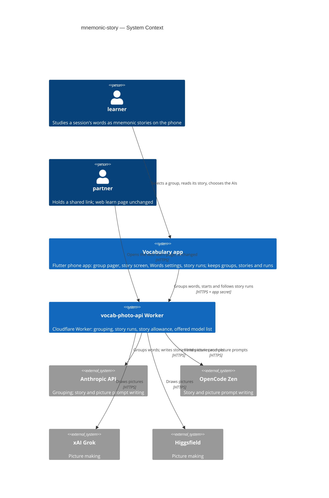
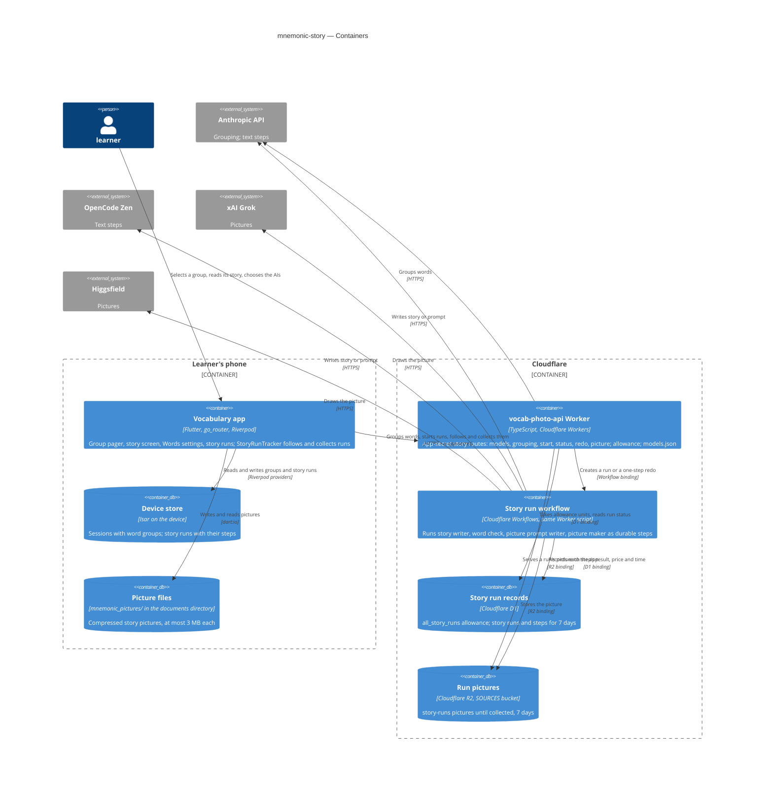
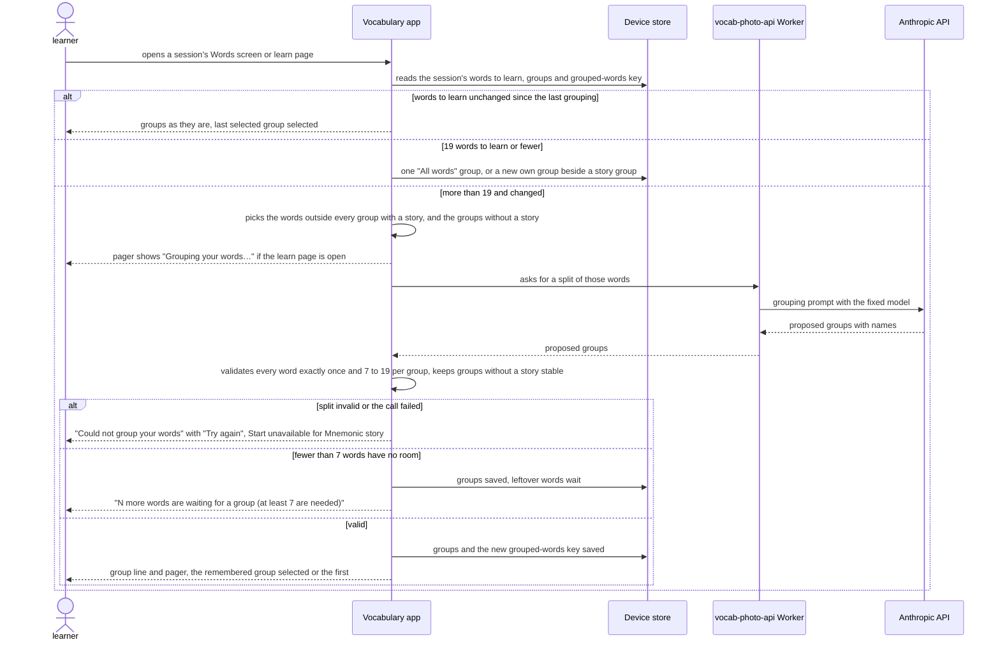

# Software Architecture Document — mnemonic-story

## 1. Introduction and goals

**Intent.** Ship the first real exercise behind the learn page's Start: a **mnemonic story** with one picture, written by AI from one **word group** of the session's words to learn (spec §1, §2). A session with more than 19 words to learn is first split by a fixed AI on the Worker into topical groups of 7 to 19 words. The learner selects one group on a pager at the top of the learn page. Each group gets one story made by three AIs in turn, the **story writer**, the **picture prompt writer** and the **picture maker**, chosen by the learner on a new Words settings screen. The story is kept on the phone and made again only when the learner asks. Every **story run** is kept as a record with each AI's result, price and time, so the owner can pick the best AIs for the money. Everything happens in the app. The web learn page does not change, and a daily **story allowance** caps what the whole app can spend.

**Top-3 quality goals (1-liners; full scenarios in §10):**

1. **Spending is bounded and never doubled.** ≤ 20 story runs start per UTC day across the whole app. A finished step is never paid again, even when the app is closed mid-run, and nothing reachable from a shared link can start a run (spec §6 "Story allowance", AC-10, AC-18, AC-19).
2. **A story run finishes on its own.** ≤ 3 min from start to the picture shown with the default AI choice, and the run carries on while the learner is away (spec §6 "Story run time", AC-10).
3. **A saved story opens at once.** ≤ 500 ms from Start to the picture and text shown, from the phone's own storage, with no network (spec §6 "Saved story open time", AC-07).

**Stakeholders.**

| Role | Interest | Sign-off owner? |
|---|---|---|
| learner | Selects a word group, reads its mnemonic story, chooses the AI choice, compares story runs, makes a story again | No |
| partner | Unchanged: the web learn page still leads to coming soon, and nothing on the web can start a run (AC-18) | No |
| Tech Lead (Maksym) | SAD approval | Yes |
| Security Lead | Required by spec §6.1: a new paid server capability reached with a secret that ships in the app | Yes |

**Decision overrides.**
- Decision override: story run results are held on the Worker for up to 7 days — rationale: spec §6.1 says stories, pictures and run records stay on the learner's device. To meet AC-10 (a step in progress when the app closes is collected later, not paid again), the Worker must hold each step's result until the app collects it. The device keeps the only lasting copy. The Worker's copy is deleted by the daily clean-up after 7 days ([ADR-0002](adr/0002-run-each-story-run-as-a-cloudflare-workflow.md), §11). Owner, 2026-10-07.

## 2. Constraints

**Technical.**
- App: Flutter 3.35.1, Dart SDK `>=3.0.0 <4.0.0`, phone only. Typed routes in `lib/router/routes.dart` (`go_router` 17 + `go_router_builder`). Under `/` the tree is `table` → `learn` → `soon`, plus `history` and `settings`. State uses `flutter_riverpod` / `riverpod_annotation` 2.6.x.
- App storage: `isar_community` pinned to `3.3.0-dev.1` (architecture.md §2 rule 6). One collection today, `Session`, opened in `lib/core/services/session_store.dart` (`Isar.open([SessionSchema], …, name: 'vocab')`). `WordPair` and `SessionSource` are `@embedded`. `WordPair` has no stable id. Preferences use `shared_preferences`, and files live under the documents directory from `path_provider` (as in `source_photo_store.dart`).
- App packages already present that this feature reuses: `http` (Worker calls with the `x-app-secret` header, as `vocab_photo_service.dart` does), `flutter_image_compress` (picture size), `shared_preferences` and `path_provider`. `InteractiveViewer` (Flutter SDK) is already used for zoom in `lib/features/words_table/photo_viewer.dart`. The project has no background-execution package, so the app does nothing while it is closed.
- Worker (`vocab-photo-api/`): TypeScript 5.6, `wrangler` 4, `@cloudflare/workers-types`, no runtime npm dependencies, `compatibility_date` `2025-01-01`. Routes are a table of `RouteDefinition`s, each declaring `public` (`src/routing.ts`, `src/index.ts`). Every non-public route needs `x-app-secret` = `APP_SHARED_SECRET` and passes `RATE_LIMITER`: 20 requests per 60 s per `cf-connecting-ip`.
- Worker storage: D1 `DB` (`vocab-sessions`, migrations `migrations/000N_*.sql` with hand-applied `migrations/down/`), KV `SESSIONS` and `DEFINITIONS`, and R2 `SOURCES` (optional binding: when it is absent, the photo routes answer 503). One cron, `0 3 * * *`, runs the daily clean-up.
- Worker AI today: Anthropic only (`ANTHROPIC_API_KEY`), with an allow-listed model set in `src/subtitles/prompt.ts`. Subtitle imports cap the AI call at 225 s and let tests point `ANTHROPIC_API_URL` at a local stub.
- The daily allowance pattern exists: `src/subtitles/allowance.ts` `takeSubtitleImport` takes one unit from `all_subtitle_imports(utc_day, used)` (≤ 20 per UTC day) in one D1 batch before the AI call. A unit is not given back when the call fails.
- Verification: `dart run build_runner build --delete-conflicting-outputs`, `flutter analyze`, `flutter test`, the CLAUDE.md greps. In `vocab-photo-api/`: `npm test` (`scripts/test.mjs` runs `wrangler dev` with a SQLite D1 stand-in and stub providers) and `npm run typecheck`.

**Organisational.**
- One owner (Maksym) builds, reviews and deploys. There is no deadline. The Worker is deployed by hand (`wrangler deploy`, D1 migrations with `wrangler d1 migrations apply`), and the app ships through the usual store build.
- Size M (`.size`), route standard (`.route`): two surfaces, a new Worker module, a D1 migration, an Isar schema change and five new app screens or parts of screens.
- Provider accounts and keys for OpenCode Zen, xAI and Higgsfield must exist before the Worker can offer their models. Until then, `models.json` lists only Anthropic models (ADR-0004).

**Conventions.**
- [`CLAUDE.md`](../../../CLAUDE.md) rules 1–6 and [`docs/architecture.md`](../../architecture.md) §2. Navigation goes only through typed routes, and dialogs/SnackBars are not routes. Services come from providers in `lib/core/providers.dart`. Screen data lives in a `@riverpod` notifier, and transient UI state stays in widget `State`. A feature is a folder, features don't import each other's screens, and one file ≈ one thing.
- Spec-approved overrides, which this feature carries out:
  - CLAUDE.md rule 3 / architecture.md rule 4 ("do not change how anything looks") gives way for the visible parts spec §1 lists: the Words screen's settings button, Words settings, Story runs and a run's details, the group pager on the learn page, the story screen in place of coming soon for Mnemonic story in the app, and the "Make a new story" confirmation.
  - CLAUDE.md rule 5 ("no new domain models — ask first"): `WordGroup` (embedded in `Session`), `StoryRun` with its `StoryStep`s (a new collection) and `WordPair.rowId`. Approved by the owner on 2026-10-07 in this design ([ADR-0003](adr/0003-keep-word-groups-in-the-session-and-story-runs-in-their-own-collection.md)). The text update is tracked in §11.
  - learn-part-step-1's invariant "the learn page saves nothing" is narrowed (spec §1). Ticks still last one visit, but word groups, the selected group, mnemonic stories and story runs are kept.
- The precedent for one shape shared by the app and the Worker is learn-part-step-1 ADR-0003: JSON in the Worker as the source of truth, read by the app. Here the app fetches it instead of copying it (ADR-0004).

**Regulatory / external.**
- Data classification: internal (spec §6.1). The words of a word group go to the chosen AI providers, as photo words go to Anthropic today. No personal data is added.
- Security review: required (spec §6.1). The Security Lead signs off §8 "Spending control" and ADR-0002 before release (§11).
- Provider terms: each provider is used only through its paid API with a key held as a Worker secret. Pictures that a provider refuses are a failed picture (AC-09), never retried with altered words.

## 3. Context and scope

The learner collects words on the phone. The learn page from learn-part-step-1 lists eleven exercises, and Mnemonic story is the only one that can be ticked. This feature makes it real in the app. The app asks the Worker to group the session's words and to run each group through three AIs, and keeps the groups, stories, pictures and run records on the phone. The Worker holds the provider keys, the offered model list and the daily allowance, and calls four AI providers. The partner's web learn page is not changed: Mnemonic story there still leads to coming soon, and no public route can start a run.

<!-- brownfield: Flutter app (lib/, go_router + Riverpod, Isar on device) + Cloudflare Worker (vocab-photo-api/, TypeScript, D1 + KV + R2, x-app-secret on app routes, per-address rate limiter, daily subtitle allowance in D1, Anthropic as the only AI); read from docs/architecture.md, CLAUDE.md and an explorer scan — no docs/architecture-map.md exists -->

**External systems (in / out):**

| Actor or system | Type | Interaction |
|---|---|---|
| learner | Person | Selects a word group, reads its story, chooses the AIs, compares story runs, makes a story again — all in the app |
| partner | Person | Unchanged: opens the web learn page, where Mnemonic story still leads to coming soon (AC-18) |
| Vocabulary app | System (ours) | Groups and stories on the phone; calls the Worker with the app secret |
| vocab-photo-api Worker | System (ours) | Groups words, runs story runs, keeps the allowance and the offered model list, holds results until collected |
| Anthropic API | System (external) | Grouping (fixed model); story writer and picture prompt writer (Sonnet 5.5, Opus 5.5) |
| OpenCode Zen | System (external, new) | Story writer and picture prompt writer for the OpenCode Zen models on the list; OpenAI-compatible API |
| xAI (Grok) | System (external, new) | Picture maker for the Grok picture models on the list |
| Higgsfield | System (external, new) | Picture maker for the Higgsfield picture models on the list; credits under a plan |

**C4 Context (L1):**



The context has two people and two of our own systems. The learner uses only the phone app. The app talks only to our Worker, with the app secret, and never to an AI provider directly, so no provider key ships in the app. The Worker calls four AI providers: Anthropic, which it already uses, plus three new ones. The partner's web learn page sits on the Worker as before. It gains nothing, so nothing on the web can spend money.

## 4. Solution strategy

**Top strategic choices (the seeds for ADRs):**

1. **Two surfaces: the app and the Worker** ([ADR-0001](adr/0001-change-the-app-and-the-worker-as-two-surfaces.md)). `target_surfaces: [mobile-app, backend-service]`. The app gains the group pager, the story screen, Words settings, Story runs and a run's details, plus the storage behind them. The Worker gains app-secret routes for the offered model list, grouping, starting a story run, following runs, redoing a step and fetching a picture. It also gains the story allowance, the run orchestration and four provider adapters. The web learn page is not a surface of this feature: it does not change. AC-18 is kept by giving the Worker no public story route, and a test pins that. This serves quality goal 1.

2. **Each story run is a Cloudflare Workflow on the Worker; the app starts it and collects it** ([ADR-0002](adr/0002-run-each-story-run-as-a-cloudflare-workflow.md)). Starting a run checks the AI choice against the offered list and takes one unit of the story allowance. It then creates a Workflow instance named by the app-generated run id, so a repeated start finds the same run and takes nothing more. The Workflow runs the story writer, checks every word (AC-08), runs the picture prompt writer and runs the picture maker. Each is a durable step with no automatic retry, so a finished step is never run, or paid, again. Each step's result, price and time go to D1, and the picture goes to R2 under `story-runs/`. The app follows runs that are not yet collected with one status call for all of them, every 5 s while the learn page or the story screen is open, and once on app start. It then copies the results to the phone. "Try again" for the picture prompt and "Draw again" are new Workflow instances for that step of the same counted run. Draw again takes one unit, and a step for an unknown or uncounted run is refused. This serves quality goals 1 and 2.

3. **Word groups live in the session; story runs are their own collection** ([ADR-0003](adr/0003-keep-word-groups-in-the-session-and-story-runs-in-their-own-collection.md)). `WordPair` gains a stable `rowId` (a UUID, filled in for older rows on first read), so a group follows its words through edits (AC-17). `Session` gains its `groups` (embedded `WordGroup`: id, name, the `rowId`s, the English words as they were when its story was made, and the id of the run that made its story), the selected group's id and the grouped-words key that tells whether grouping must run again (AC-03). `StoryRun` is a new Isar collection, listed app-wide and never removed (AC-14, AC-15). A run holds embedded `StoryStep`s, one per attempt, with the AI, the result, the price, the time and the outcome. The picture is a compressed file under `mnemonic_pictures/`. A group's **mnemonic story** is the run its `storyRunId` names, replaced only when a newer run finishes with a picture (AC-16). **Override of CLAUDE.md rule 5, approved by the owner on 2026-10-07.** This serves quality goal 3.

4. **The offered AI list, with prices, is JSON in the Worker that the app fetches** ([ADR-0004](adr/0004-serve-the-offered-ai-list-with-prices-from-the-worker.md)). `vocab-photo-api/src/story/models.json` lists each offered model: id, name, provider, role (`text` for the story writer and the picture prompt writer, `picture` for the picture maker), list price (per million input and output tokens, or per picture), the "≈" estimate for a group of 15 words, and the default for each step. The Worker serves it to the app and refuses any run or step with a model not on it (spec §6.1, AC-13). The Worker prices every step from the provider's reported token use × list price, or from the price per picture, and returns that price with the step. The app shows the JSON's estimate until the learner's own runs give an average (AC-12). This serves quality goal 1.

5. **The app owns the grouping rules; the AI only splits words** ([ADR-0005](adr/0005-let-the-app-own-the-grouping-rules-and-the-ai-only-split-words.md)). The app decides what needs grouping. With ≤ 19 words to learn and no group with a story, it makes one "All words" group locally (AC-02). Words added beside a story group in a small session become their own group locally (AC-02b). With > 19 words, it sends to the Worker the words outside every group with a story, together with the groups without a story (AC-05). The Worker asks a fixed AI (Haiku 4.5) for a split and returns it unchanged. The app then validates the answer: every word exactly once, and 7 to 19 words per group above 19 (AC-04). It also keeps groups without a story stable, and holds back fewer than 7 leftover words as waiting (AC-05). Grouping is a plain request, not stored on the Worker and not counted against the allowance. This serves quality goal 1 (no paid chain behind grouping) and keeps every group invariant testable in Dart.

**Decided inline (below the ADR gate, from the assumptions ledger the owner accepted on 2026-10-07):**

- **Mobile UI architecture: unchanged.** The app stays a Flutter phone app, and the existing stack rules out any alternative. New full screens are typed routes: the story screen under `learn` (`StoryRoute`, replacing `ComingSoonRoute` for `mnemonic-story` only), and Words settings under `table`, with Story runs and a run's details under it. All are opened with `push`. The confirmation before "Make a new story" is a dialog, not a route. The pager is part of the learn page. Zoom and pan use `InteractiveViewer` in place on the story screen (AC-06), as `photo_viewer.dart` does.
- **AI choice and model list on the phone.** The fetched `models.json` is cached in `shared_preferences`, with the learner's three choices beside it. A choice that is no longer on the list falls back to that step's default and shows "<AI name> is no longer available" (AC-13). The Worker refuses it anyway.
- **Story allowance.** A new D1 table `all_story_runs(utc_day, used)`, taken the way `takeSubtitleImport` takes `all_subtitle_imports`: one unit when a new run's story step starts and one for each Draw again. It is not given back on failure (AC-19). There is no per-address window: the spec caps the whole app, and the per-address rate limiter already applies.
- **Word check (AC-08)** runs on the Worker, inside the Workflow, between the story step and the picture prompt step. It returns the missed words.
- **Timeouts.** Each provider call is aborted at 90 s (story writer and picture prompt writer) or 120 s (picture maker, including Higgsfield's submit-and-poll) (AC-08b). A timed-out step is failed, with its time and with the price shown as unknown, because no usage came back.
- **New providers.** Each provider gets one adapter file in `src/story/providers/` behind a common `writeText` / `drawPicture` shape. The keys are new Worker secrets, and each provider's base URL can be overridden for the test stubs (`*_API_URL`, as `ANTHROPIC_API_URL` today).
- **Spec §8 open questions, resolved:** Higgsfield's price is shown as "≈ $X" per picture, the plan price divided by the credits one picture takes, fixed in `models.json`. The defaults are Sonnet 5.5 for the story writer and the picture prompt writer, and the Grok picture model for the picture maker.
- **Pictures on the phone** are compressed with `flutter_image_compress` to ≤ 3 MB and kept under `mnemonic_pictures/` in the documents directory, beside `source_photos/`.

## 5. Building block view

The feature follows the repo's existing shapes. In the app, pure rules (grouping, the grouped-words key) are plain Dart files with unit tests. Storage stays in `SessionStore` plus one new store for runs and pictures. Worker calls go through one service reached from `lib/core/providers.dart`, and screens read `@riverpod` notifiers. A long-lived `StoryRunTracker` notifier (`keepAlive`, like `photoUploadServiceProvider`) follows the runs that are not yet collected and writes their results to Isar. Screens watch Isar, so they show a run's current step whenever they open (AC-06, AC-10). In the Worker, the story feature is a new `src/story/` module beside `src/subtitles/`, with routes in the same route table, all `public: false`. Its Workflow class is exported from `src/index.ts`, and its D1 tables come in one new migration.

**Internal decomposition:**

```
lib/
├── router/routes.dart                       + StoryRoute (under 'learn', sessionId?, groupId)
│                                            + WordsSettingsRoute (under 'table') → StoryRunsRoute → StoryRunRoute (runId)
├── core/
│   ├── models/
│   │   ├── word_pair.dart                   + rowId (UUID, filled in for older rows on read) — ADR-0003
│   │   ├── word_group.dart                  NEW @embedded WordGroup: id, name, rowIds, storyRunId?, storyWords (English words when its story was made)
│   │   ├── session.dart                     + groups, selectedGroupId, groupedWordsKey
│   │   ├── story_run.dart                   NEW @collection StoryRun: runId, sessionId, groupId, groupName, words, startedAt, models, steps, outcome, collected
│   │   │                                    + @embedded StoryStep: role, attempt, modelId, modelName, outcome, text / picturePath, missedWords, priceUsd?, ms
│   │   └── offered_ai.dart                  NEW OfferedAi + AiChoice (read from the Worker's models.json) — ADR-0004
│   ├── services/
│   │   ├── session_store.dart               + opens StoryRunSchema beside SessionSchema; rowId fill-in on read
│   │   ├── story_api_service.dart           NEW Worker calls: models, grouping, start run, runs status, redo step, picture bytes
│   │   ├── story_run_store.dart             NEW StoryRun reads/writes (newest first, by id, uncollected), never removes
│   │   └── story_picture_store.dart         NEW mnemonic_pictures/ files, compressed ≤ 3 MB (flutter_image_compress)
│   └── providers.dart                       + storyApiService, storyRunStore, storyPictureStore, offeredAis, aiChoice (persisted)
└── features/
    ├── learn/
    │   ├── word_grouping.dart               NEW pure rules: what to regroup, local "All words" / small groups, validate a split, grouped-words key — ADR-0005
    │   ├── learn_groups_notifier.dart       NEW per-session groups, grouping state, selection; starts a run for a selected group without a story
    │   ├── widgets/group_pager.dart         NEW the pager of group cards (tap selects, swipe browses)
    │   └── learn_screen.dart                + group line, pager, grouping/waiting/limit messages; Start → StoryRoute for mnemonic-story
    ├── mnemonic_story/                      NEW feature folder
    │   ├── story_run_tracker.dart           keepAlive notifier: start, follow (one status call / 5 s while visible), collect, redo
    │   ├── story_screen.dart                running step, picture (InteractiveViewer) over text, errors, "Words changed", Make a new story
    │   └── widgets/new_story_dialog.dart    the confirmation before a new run
    ├── words_settings/                      NEW feature folder
    │   ├── words_settings_screen.dart       three AI choices with prices, "no longer available", Story runs
    │   ├── story_runs_screen.dart           all runs, newest first
    │   └── story_run_screen.dart            one run's steps: AI, result, price, time, failed attempts
    └── words_table/words_table_screen.dart  + settings button (as the main screen's); starts grouping quietly when needed (AC-03)

vocab-photo-api/
├── wrangler.jsonc                           + workflows: STORY_RUN → StoryRunWorkflow
├── migrations/0004_story_runs.sql           NEW all_story_runs, story_runs, story_run_steps (+ down/)
└── src/
    ├── index.ts                             + storyRoutes; export StoryRunWorkflow; cron also cleans story runs > 7 days
    ├── env.ts                               + STORY_RUN, OPENCODE_ZEN_API_KEY, XAI_API_KEY, HIGGSFIELD_API_KEY, *_API_URL overrides
    └── story/                               NEW module
        ├── models.json                      offered AIs, roles, list prices, 15-word estimates, defaults — ADR-0004
        ├── models.ts                        typed view + isOffered(role, id) + price(step usage)
        ├── allowance.ts                     takeStoryRun: one unit per new run / Draw again from all_story_runs
        ├── grouping.ts                      grouping prompt + Haiku 4.5 call + JSON parse
        ├── prompts.ts                       story writer and picture prompt writer prompts
        ├── word-check.ts                    AC-08 rule: whole word, any case, phrase in order, -s/-es/-ed/-ing
        ├── providers/                       anthropic.ts, opencode-zen.ts, xai.ts, higgsfield.ts (writeText / drawPicture, abort at 90 s / 120 s)
        ├── workflow.ts                      StoryRunWorkflow: story → word check → prompt → picture; redo of one step
        ├── store.ts                         D1 runs/steps, R2 story-runs/<runId>/<attempt>, 7-day clean-up
        └── routes.ts                        models, grouping, start, status, redo, picture (all public: false)

test/word_grouping_test.dart, test/story_*_test.dart          rules, stores, tracker with a fake service
vocab-photo-api/test/story-*.test.mjs (+ zen/xai/higgsfield stubs)  routes, allowance, word check, workflow, AC-18
```

**C4 Container (L2):**



There is one container per declared surface, plus their stores. The **Vocabulary app** (mobile-app) keeps everything lasting on the phone: sessions with their word groups and the story runs in the **Device store**, and the pictures as **Picture files**. It talks only to the **Worker** (backend-service). The Worker answers grouping itself, calling Anthropic. For a story run, it takes an allowance unit in **D1** and hands the run to the **Story run workflow**, which ships in the same Worker script. The workflow calls the chosen text provider (Anthropic or OpenCode Zen) and picture provider (xAI or Higgsfield), records each step in D1 and stores the picture in **R2**. The app polls the Worker for status and downloads the picture, after which the phone holds the only lasting copy.

## 6. Runtime view

Two seed flows: the story run, the paid and critical one, with its failure and leave-and-return branches, and grouping. The `sequences` stage then covers every §5 AC.

**Critical flow 1: a story run, from selecting a group to the picture shown (US-02, US-06; AC-06 – AC-10, AC-19)**

```mermaid
sequenceDiagram
    actor Learner as learner
    participant App as Vocabulary app
    participant Store as Device store
    participant Worker as vocab-photo-api Worker
    participant Flow as Story run workflow
    participant D1 as Story run records
    participant AI as AI providers
    Learner->>App: selects a group without a story, or opens the learn page with it selected
    App->>Store: saves a new story run in progress (new run id, group words, AI choice)
    App->>Worker: starts the run with its run id, words and AI choice
    Worker->>Worker: checks the three AIs are on the offered list
    Worker->>D1: takes one unit of today's story allowance, once per run id
    alt allowance used up
        Worker-->>App: refused, today's limit reached
        App-->>Learner: "Today's story limit is reached. Try again tomorrow."
    else unit taken
        Worker->>Flow: creates the run's workflow
        Worker-->>App: run started
        Flow->>AI: story writer writes the story (90 s limit)
        Flow->>Flow: checks every group word appears
        alt a word is missing, or the story writer failed
            Flow->>D1: story step failed, with missed words, price and time
        else story complete
            Flow->>AI: picture prompt writer writes the prompt (90 s limit)
            Flow->>AI: picture maker draws the picture (120 s limit)
            Flow->>D1: each step's result, price and time; the picture goes to R2
        end
        loop every 5 s while the learn page or story screen is open, and on app start
            App->>Worker: status of every run not yet collected
            Worker->>D1: reads their steps
            Worker-->>App: steps so far
            App->>Store: records finished steps
        end
        opt the learner closed the app mid-run
            Note over App,Flow: the workflow carries on, nothing is redone or paid again, results are collected on return
        end
        App->>Worker: fetches the finished picture
        App->>Store: compressed picture file, run finished, becomes the group's story
        App-->>Learner: story screen shows the picture over the story text, zoom and pan
    end
```

The learner selects a group that has no story. The app records a new run locally and asks the Worker to start it. The Worker checks that the AI choice is on the offered list and takes one unit of the day's allowance. If none is left, the learner sees the daily-limit message and nothing is paid. Otherwise the Worker hands the run to its workflow and answers at once. The workflow has the story written and checks that every word is present. If a word is missing or the story writer fails, the run stops at the story step. Otherwise it has the picture prompt written and the picture drawn, recording each step's result, price and time. Meanwhile the app asks for the status of every unfinished run every 5 s while a story-related screen is open, and once on app start, and copies each finished step to the phone. If the app was closed, the workflow simply carried on, and the app collects the results when it next opens. When the picture is ready, the app downloads it, compresses it, stores it and makes this run the group's story.

**Critical flow 2: grouping a session with more than 19 words to learn (US-01; AC-01, AC-03 – AC-05)**



When a session's Words screen or learn page opens, the app compares the current words to learn with the key stored at the last grouping. If nothing changed, the groups stay as they are. A session with 19 or fewer words to learn is grouped on the phone, as "All words", or with a new group of its own beside a story group. Above 19, the app sends the words outside any story group, and the groups without a story, to the Worker, which asks the fixed AI for a split. The app checks the answer. A broken split, or a failed call, shows "Could not group your words" with Try again and keeps Start unavailable for Mnemonic story. Leftover words that cannot form a group of 7 wait, with the waiting message. A good split is saved, and the pager appears with the remembered group selected.

## 7. Deployment view

The Worker stays one script and one deployment. It gains a Workflow binding (`STORY_RUN` → `StoryRunWorkflow`, exported from `src/index.ts`), one D1 migration (`0004_story_runs.sql`) and three secrets (`OPENCODE_ZEN_API_KEY`, `XAI_API_KEY`, `HIGGSFIELD_API_KEY`). It uses a `story-runs/` prefix in the existing R2 `SOURCES` bucket and a longer daily cron job: the same `0 3 * * *` trigger also deletes story run rows and pictures older than 7 days. The app ships through the usual store build.

**Deploy order:** apply `0004` (`wrangler d1 migrations apply`), put the new secrets, `wrangler deploy` the Worker, then release the app. The Worker change is additive: an older app never calls the new routes. The app shows the AI choice only from the fetched list, so a provider without a secret is simply left out of `models.json` until its key exists.

**Monitoring:**
- Metrics: the Worker's existing observability (`wrangler.jsonc` `observability.enabled`) covers the new routes and the workflow. No new log events (repo default).
- Spend: the D1 `all_story_runs` row per UTC day is the day's count, and the story runs screen's totals are the month's spend. The owner compares them with the invoices after the first month (spec §6 "Price accuracy").
- Workflow failures: each failed step is recorded in `story_run_steps` with its outcome, so a stuck or failing provider shows on the story runs screen.

**Scaling thresholds:**
- At most 20 runs, plus Draw again units, start per UTC day for the whole app (AC-19). That bounds R2 to about 20 × 7 = 140 pictures and D1 to a few hundred step rows at any time.
- The per-address rate limit (20 requests / 60 s) caps polling. One status call every 5 s is 12 a minute, which leaves room for grouping, starts and picture fetches.
- On the phone, story runs are never removed. At about 3 MB a run and a few runs a week, that is about 100 MB a year (spec §1 assumption), to revisit if the list grows large (§11).

## 8. Crosscutting concepts

The repo's defaults are inherited (assumptions ledger A12, accepted 2026-10-07). The rows below say how each one applies here.

| Concept | Convention | Where defined |
|---|---|---|
| Navigation (app) | `StoryRoute`, `WordsSettingsRoute`, `StoryRunsRoute` and `StoryRunRoute` are typed routes opened with `push`. The new-story confirmation is a dialog, and messages are on-screen text, not routes | CLAUDE.md rule 1; architecture.md §2 rule 1; sad §4 |
| State (app) | Groups and selection come from a `@riverpod` notifier over `Session`. Runs come from `StoryRunTracker` (`keepAlive`) over `StoryRun`. Screens watch Isar, and transient state (pager page, zoom) stays in widget `State` | architecture.md §2 rule 2; sad §5 |
| Persistence (app) | Isar `Session` (+ groups) and `StoryRun`. `shared_preferences` holds the AI choice and the cached model list. Pictures are files in `mnemonic_pictures/`. Nothing is ever removed from story runs | ADR-0003; ADR-0004 |
| Identity | `WordPair.rowId` and the group id are UUIDs (`_uuidV4`). The run id is a UUID made by the app, used as the Workflow instance id and as the key of the allowance take, so a repeated start is free | ADR-0002; ADR-0003 |
| Authentication | Every story route is `public: false`: `x-app-secret` plus the per-address rate limiter. No story route is public, so the shared link cannot reach them (AC-18) | `src/index.ts`; ADR-0001 |
| Spending control | Server side only: the model must be on `models.json`, one `all_story_runs` unit per new run and per Draw again (≤ 20 per UTC day), and a redo is accepted only for a failed step of a run already in `story_runs`. Paid workflow steps have retries off | spec §6.1, AC-19; ADR-0002; ADR-0004 |
| Errors | Provider failures, refusals and timeouts (90 s / 120 s) are recorded as a failed step with its price (unknown on a timeout) and time. The app shows the spec's messages ("Could not write the story", "The picture could not be drawn", …). Worker errors are JSON `{ error, code }`, as `/subtitles/words` answers | spec AC-04, AC-08, AC-08b, AC-09, AC-16, AC-19 |
| Prices and times | Priced on the Worker from the reported token use × list price, or the price per picture. Time is each step's own wall-clock time on the Worker, and a run's total is the sum of its steps (AC-14) | ADR-0004 |
| Word check | One TypeScript function (`word-check.ts`) implements AC-08's rule. The app only shows the missed words it returns | spec AC-08; sad §4 |
| Privacy | The group's English words, and the story, go to the chosen providers, as photo words go to Anthropic today. The Worker keeps run results for 7 days at most | spec §6.1; sad §1 decision override |
| Accessibility | Group cards are tappable at ≥ 48 × 48 dp with the group's name as their label. The running step is announced as text. The picture has a semantic label | Flutter defaults; learn-part-step-1 sad §8 |
| Internationalisation | The UI stays English, as elsewhere. The story itself is Ukrainian with the English words embedded (CONTEXT "mnemonic story") | CONTEXT |
| Logging / observability | No new log events. The Worker's existing observability, plus the D1 step records | `wrangler.jsonc` `observability` |

## 9. Architecture decisions

| # | Title | Status | Section |
|---|---|---|---|
| 0001 | Change the app and the Worker as two surfaces | Accepted | §4 |
| 0002 | Run each story run as a Cloudflare Workflow | Accepted | §4 |
| 0003 | Keep word groups in the session and story runs in their own collection | Accepted | §4 |
| 0004 | Serve the offered AI list with prices from the Worker | Accepted | §4 |
| 0005 | Let the app own the grouping rules and the AI only split words | Accepted | §4 |

ADR files live under `docs/features/mnemonic-story/adr/NNNN-<title>.md`.

## 10. Quality requirements

**QG-1. Spending is bounded and never doubled**
- **When:** story runs are started on any one UTC day, from any copy of the app or with a leaked app secret, including repeated starts of the same run id, Try again, Draw again and redoing the picture prompt.
- **Then:** ≤ 20 story runs started per UTC day across the whole app, one unit per run start or "Draw again" (AC-19). A repeated start of the same run id and a prompt redo take none. A model not on `models.json`, and a redo for an unknown or not-failed step, are refused. No public route starts a run (AC-18).
- **How verify:** spec §6: "server-side count, one unit per run start or "Draw again" (AC-19); a test that the 21st of a day is refused". In `vocab-photo-api/test/story-allowance.test.mjs`: 20 starts are accepted and the 21st is refused, a repeated run id takes no unit, Draw again takes one, a prompt redo takes none, an unlisted model and an uncounted redo are refused. `story-routes.test.mjs` checks that every story route answers 401 without the secret and that the web learn page and coming-soon link are unchanged.

**QG-2. A story run finishes on its own**
- **When:** the learner starts a story run with the default AI choice, then stays, or leaves, locks the phone or closes the app.
- **Then:** ≤ 3 min from start to the picture shown, with the default AI choice. A finished step is never redone or paid again, and a step in progress when the app closed is collected on return (AC-10).
- **How verify:** spec §6: "the total times (sum of step times) on the story runs screen, median of the first 10 runs". Plus a Worker test that runs a workflow against stub providers, interrupts the client after the story step and checks that each stub was called exactly once. Plus an app test where `StoryRunTracker` with a fake service, restarted mid-run, collects the run without a second start.

**QG-3. A saved story opens at once**
- **When:** the learner presses Start for a group that already has a mnemonic story, in this visit or after restarting the app.
- **Then:** ≤ 500 ms from Start to the picture and text shown, with no network call and no new run (AC-07).
- **How verify:** spec §6: "5 runs on the owner's phone at release". Plus an app test that opening the story screen of a group with a story calls no Worker method.

**QG-4. Grouping is quick and safe**
- **When:** a session with 60 words to learn is grouped.
- **Then:** ≤ 30 s for a 60-word session. An invalid split is never shown (AC-04), and a group with a story never changes its words (AC-05).
- **How verify:** spec §6: "5 runs on the owner's phone at release". Plus `test/word_grouping_test.dart` covering AC-02, AC-02b, AC-03's change rule, AC-04's rejections and AC-05's waiting and stability rules.

**QG-5. Prices can be trusted**
- **When:** the owner reads the story runs after the first month.
- **Then:** the month's sum of run prices within ±25 % of the providers' invoices.
- **How verify:** spec §6: "owner compares the story runs total with the invoices after the first month". Plus a Worker unit test of the price rule for each provider's usage shape.

**QG-6. The picture is sharp and small**
- **When:** a finished picture is stored and viewed on the story screen.
- **Then:** zoom up to at least 4× with pan, no visible blur at 2× on the owner's phone, and ≤ 3 MB on the device per story run (picture included).
- **How verify:** spec §6: "device check at release" and "check app storage after 10 runs". Plus an app test that `story_picture_store.dart` writes ≤ 3 MB for an oversized input.
