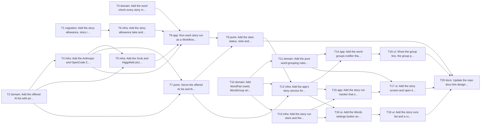

# Epic — mnemonic-story

> **Spec:** [spec.md](../spec.md) · **Design:** [sad.md](../sad.md) · **UX flows:** [ux-flows.md](../ux-flows.md) · **ADRs:** [adr/](../adr/)
> `data-model.md`, `contracts/openapi.yaml` and `screens.md` do not exist: those stages were skipped. Tasks derive the schema from sad §4/§6 (T1), the contract from the Worker routes (T7, T9 → T12) and the screen states from ux-flows + the ACs (T16–T19).

## Goal

A learner with any number of words studies them as mnemonic stories: one readable story with a picture per word group, made by three AIs the learner chooses (spec §2). The owner compares the AIs from the app's own record of story runs. Spending stays bounded by a server-side daily allowance and never doubles, even when the app closes mid-run.

## Scope

- **In:** the Worker's `src/story/` module (offered AI list, grouping, allowance, story run workflow, four provider adapters, D1 migration 0004) and the app (`WordPair.rowId`, `WordGroup`, `StoryRun`, `lib/core/story/`, the learn page's group pager, the story screen, Words settings, story runs). Surfaces: `mobile-app`, `backend-service` (sad frontmatter).
- **Out:** Mnemonic story on the web, automatic quality grading, other exercises and progress, the grouping cost, and exact billing (spec §3).

## Task map

Two lanes start at once: the Worker (T1, T2, T3) and the app's models (T10). The app's network-facing work (T12) waits for the Worker routes (T7, T9). Grouping rules (T11) and stores (T13) run in parallel.

## Tasks

See [tracker.md](./tracker.md) for status. Machine contract: [tasks.json](../tasks.json).

| # | Task | Layer | Blocked by | ACs |
|---|---|---|---|---|
| T1 | Add the story allowance, story run and step tables to D1 | migration | — | AC-10, AC-15, AC-19 |
| T2 | Add the offered AI list with prices and the step pricing rule to the Worker | domain | — | AC-12, AC-13 |
| T3 | Add the word check every story must pass to the Worker | domain | — | AC-08 |
| T4 | Add the Anthropic and OpenCode Zen text adapters with a 90 s limit | infra | T2 | AC-08b |
| T5 | Add the Grok and Higgsfield picture adapters with a 120 s limit | infra | T2, T4 | AC-09, AC-08b |
| T6 | Add the story allowance take and the run store to the Worker | infra | T1 | AC-10, AC-15, AC-19 |
| T7 | Serve the offered AI list and the grouping split from the Worker | ports | T2, T4 | AC-03, AC-04, AC-12 |
| T8 | Run each story run as a Workflow on the Worker | app | T3, T4, T5, T6 | AC-08, AC-08b, AC-09, AC-10 |
| T9 | Add the start, status, redo and picture routes and the 7-day picture clean-up | ports | T7, T8 | AC-06, AC-09, AC-10, AC-13, AC-18, AC-19 |
| T10 | Add WordPair.rowId, WordGroup and the StoryRun collection to the app | domain | — | AC-11, AC-15, AC-17 |
| T11 | Add the pure word-grouping rules to the app | domain | T10 | AC-01, AC-02, AC-02b, AC-03, AC-04, AC-05, AC-17 |
| T12 | Add the app's story service for the Worker's story routes | infra | T10, T7, T9 | AC-12, AC-13, AC-19 |
| T13 | Add the story run store and the picture store to the app | infra | T10 | AC-07, AC-14, AC-15 |
| T14 | Add the word-groups notifier that groups a session and keeps its selection | app | T11, T12 | AC-01, AC-02, AC-02b, AC-03, AC-04, AC-05, AC-11 |
| T15 | Add the story run tracker that starts, follows and collects runs | app | T12, T13 | AC-06, AC-07, AC-08, AC-08b, AC-09, AC-10, AC-16, AC-19 |
| T16 | Show the group line, the group pager and grouping messages on the learn page | ui | T14 | AC-01, AC-02, AC-02b, AC-03, AC-04, AC-05, AC-19 |
| T17 | Add the story screen and open it from Start for Mnemonic story | ui | T15, T11 | AC-06, AC-07, AC-08, AC-08b, AC-09, AC-16, AC-17, AC-19 |
| T18 | Add the Words settings button and screen with the three AI choices | ui | T12, T13 | AC-12, AC-13 |
| T19 | Add the story runs list and a run's details screen | ui | T18 | AC-14, AC-15 |
| T20 | Update the repo docs this design outdates and run the release checks | docs | T9, T16, T17, T19 | AC-06, AC-07, AC-18 |

## Risks / Hard rules

- **CLAUDE.md:** typed routes only (rule 1); services from providers, screen data in `@riverpod` notifiers (rule 2); visible changes only those spec §1 lists (rule 3); the new models approved in ADR-0003 and no others, and no new packages (rule 5).
- **Spending:** no paid Workflow step is retried; a start or redo is checked on the server (offered list, allowance, counted run); no story route is public (sad §8, AC-18, AC-19).
- **Per-address limit 20 / 60 s:** one status call for all runs, every 5 s, only while a story-related screen is open (sad §11).
- **Isar** stays pinned to `3.3.0-dev.1`; the schema change is additive only (sad §2, §11).
- **NFRs** (spec §6): grouping ≤ 30 s for 60 words, story run ≤ 3 min with the default AI choice, saved story ≤ 500 ms, ≤ 20 story runs per UTC day, ≤ 3 MB per run, 4× zoom.
