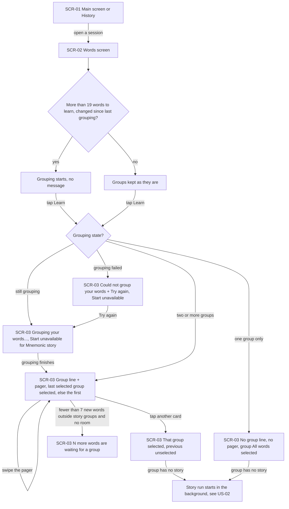
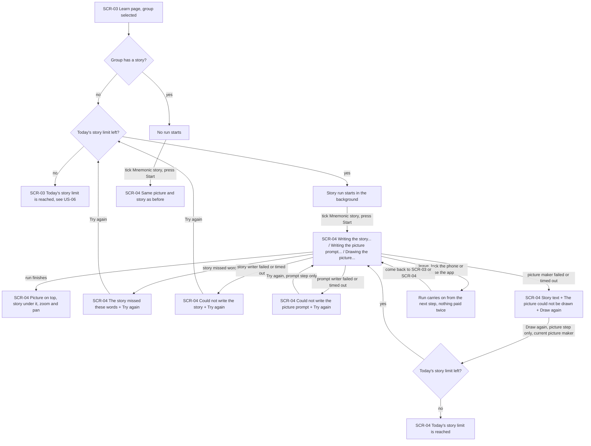
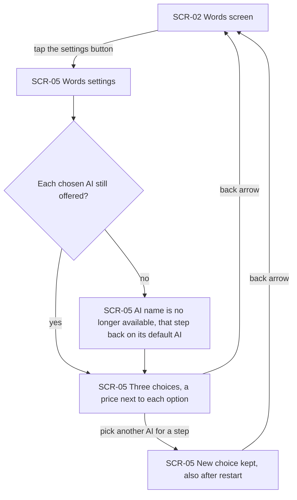
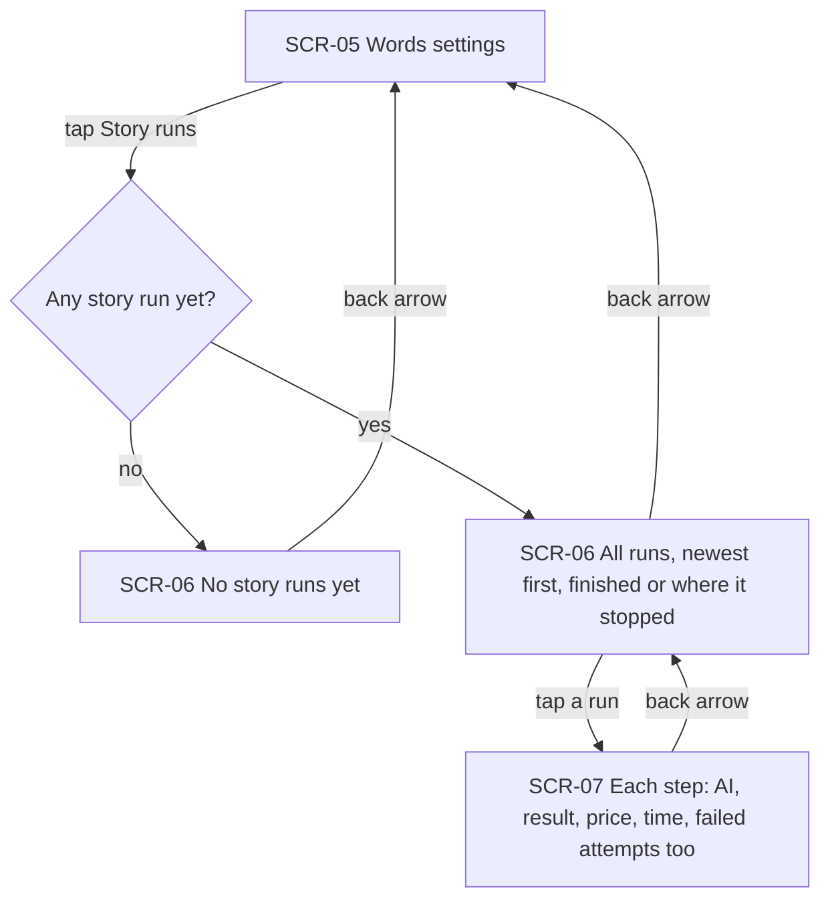
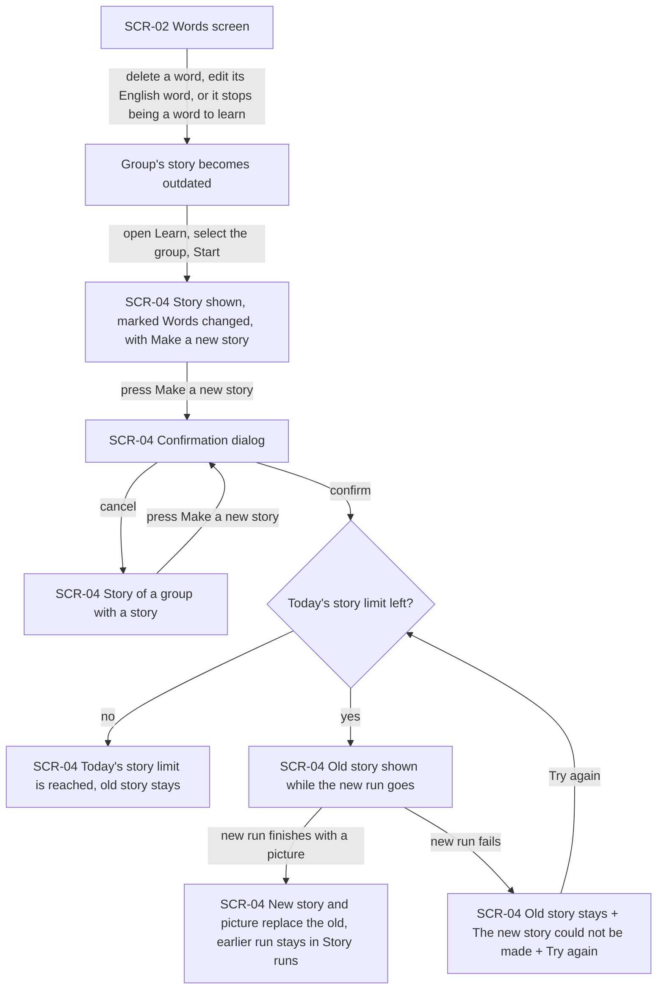
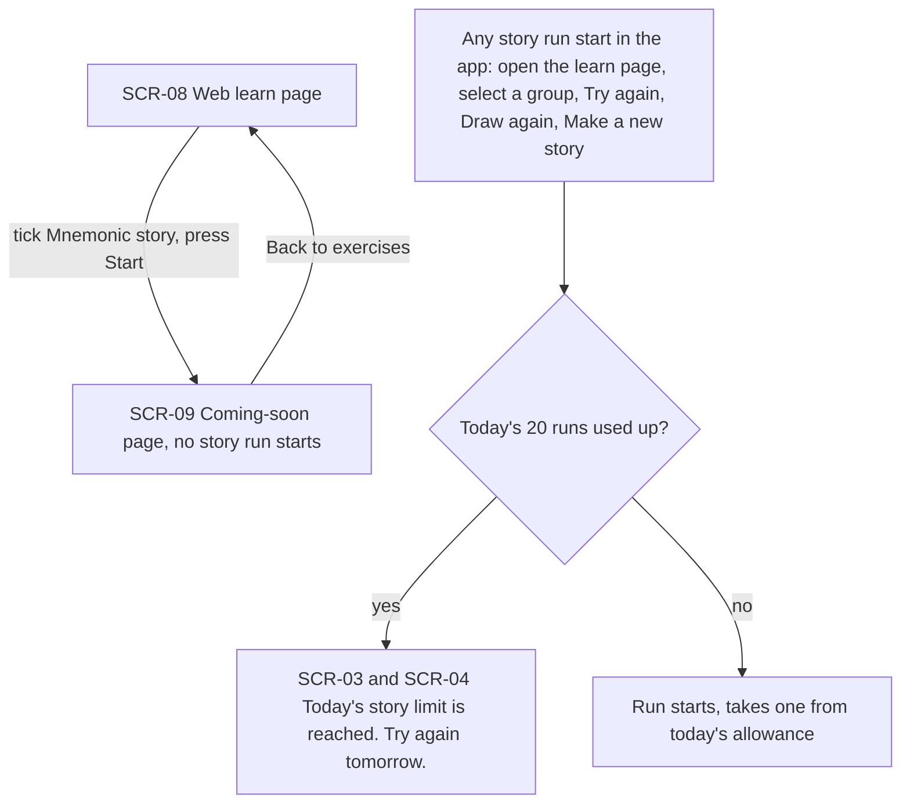

# UX flows — mnemonic-story

> User flows for every UI-touching §4 user story of [spec.md](./spec.md), produced by `ux-flows` (after `clarify`, before `design`) and read by `design` (evidence for the target-surface + UI-architecture decisions), `sequences` (UI-driven flows align on SCR ids), `screens` (details every inventory row) and `plan-tests` (the e2e-through-UI paths). **Always markdown + mermaid `flowchart`**, whatever the design tool — this artifact is flow-altitude, not visual design.

## Platform decisions

- **Posture:** the app is phone-only, as in learn-part-step-1. Owner's choice, 2026-10-07. There is no `docs/design-system.md` yet. The web learn page does not change (spec §1, §3), so the only web flow here is the unchanged one that AC-18 relies on.
- **New app screens are full screens, not dialogs:** Words settings, Story runs and a story run's details. Each opens on top of the previous one, and the back arrow returns to it. The story screen replaces the coming-soon screen for Mnemonic story and opens from Start the same way (AC-06).
- **The group pager is part of the learn page, not a separate screen.** Tapping a card selects that group; swiping only browses (AC-01). The learn page's states (grouping, could not group, words waiting, daily limit) are messages on the learn page itself.
- **The picture is zoomed and panned in place on the story screen** with two fingers. There is no separate full-screen picture viewer, so it needs no new screen (AC-06). Spec §1's list of new visible parts names the run details screen and the confirmation dialog (owner, 2026-10-07).
- **"Make a new story" asks for confirmation in a small dialog** on the story screen, because it spends money (AC-16).
- **Start for Mnemonic story stays unavailable while no group is selected:** while grouping is going, after grouping failed, or when every word is still waiting for a group (AC-03, AC-04, AC-05).
- **A story run carries on when the learner leaves its screen.** Every screen that shows the run reflects its current step when the learner returns (AC-06, AC-10).
- **Design input flagged, not decided here:** where a run's state lives so that it keeps going and is never paid twice after the app is closed (AC-10), and how the learn page and the story screen learn that a background run has moved on.

## Screen inventory

| ID | Screen | Purpose | Entry | Exit |
|---|---|---|---|---|
| SCR-01 | Main screen or History (app) | Existing ways to a session's Words screen: the current session, or an older session picked in History | App launch; side menu | SCR-02 |
| SCR-02 | Words screen (app) | The session's words. Gains a settings button that looks like the main screen's. Grouping starts here, without any message, when the words to learn changed | A session from SCR-01 | SCR-03 through Learn; SCR-05 through the settings button; back to SCR-01 |
| SCR-03 | Learn page (app) | Existing exercise list and Start, plus (only for sessions with more than one group) the line "We grouped your words into sets of up to 19 words. Please select one group to learn." and the group pager. Also shows "Grouping your words…", "Could not group your words" + "Try again", "N more words are waiting for a group (at least 7 are needed)" and "Today's story limit is reached. Try again tomorrow." | Learn on SCR-02 | SCR-04 through Start with Mnemonic story ticked; back to SCR-02 |
| SCR-04 | Story screen (app) | The selected group's mnemonic story: which step is running, then the picture (zoom and pan) over the story text. Shows the run's errors with "Try again" or "Draw again", the "Words changed" mark, "Make a new story" with its confirmation, and the daily limit message | Start on SCR-03 with Mnemonic story ticked | Back to SCR-03 |
| SCR-05 | Words settings (app) | The three AI choices (story writer, picture prompt writer, picture maker) with a price next to each option, "<AI name> is no longer available", and "Story runs" | Settings button on SCR-02 | SCR-06 through "Story runs"; back to SCR-02 |
| SCR-06 | Story runs (app) | Every story run, newest first: group name, date, the three AIs, total price, total time, and finished or where it stopped | "Story runs" on SCR-05 | SCR-07 by tapping a run; back to SCR-05 |
| SCR-07 | Story run details (app) | One run: each step's AI, its result (story, picture prompt, picture), price and time, including failed attempts | A run on SCR-06 | Back to SCR-06 |
| SCR-08 | Learn page (web) | Unchanged from learn-part-step-1 | Learn on the shared page; the learn link | SCR-09 through Start |
| SCR-09 | Coming-soon page (web) | Unchanged: Mnemonic story still leads here on the web | Start on SCR-08 | Back to SCR-08 |

## Flows

### Flow: US-01 — Select a word group to learn

The learner opens a session's Words screen, for the current session or an older one from History. History sessions keep their own words, groups and stories, and the current session is not changed (AC-11). If the session has more than 19 words to learn and they changed since the last grouping, grouping starts quietly. A change means an English word was added, deleted or edited, or a row became or stopped being a word to learn. Opening the learn page also starts grouping if it hasn't happened yet (AC-03).

On the learn page:
- **Grouping still going:** the pager shows "Grouping your words…" and fills in when grouping finishes.
- **Grouping failed:** "Could not group your words" with "Try again". Start stays unavailable for Mnemonic story (AC-04).
- **One group:** a session with 19 words or fewer shows no group line and no pager. All its words are one group, "All words" (AC-02).
- **Two or more groups:** the line and the pager appear (AC-01). This also happens when words added to a small session whose group has a story form their own small group (AC-02b).
  - The group selected last time is selected again, or the first group.
  - Swiping only browses. Tapping a card selects that group and unselects the other.
  - If fewer than 7 new words have no room in a group without a story, the page says "N more words are waiting for a group (at least 7 are needed)" (AC-05).
- **Selected group has no story:** selecting it, or opening the page with it selected, starts its story run in the background (US-02).

### Flow: US-02 — Read the mnemonic story with its picture

When a group is selected, the app checks whether it already has a story. If it has, no run starts. Start, with Mnemonic story ticked, shows the same picture and story as before, in this visit or after a restart (AC-07). If it has no story and today's limit is not used up, a story run starts in the background (AC-06). Pressing Start opens the story screen, which shows the running step: "Writing the story…", then "Writing the picture prompt…", then "Drawing the picture…". When the run finishes, the picture is on top and the story under it, and the picture can be zoomed and panned in place.

The run can stop at any step:
- **Missing words:** the story left out a word. The screen lists "The story missed these words: …". "Try again" starts a new run, which needs allowance (AC-08).
- **Story writer fails or times out:** "Could not write the story" with "Try again", which starts a new run (AC-08b).
- **Picture prompt writer fails or times out:** "Could not write the picture prompt" with "Try again". It redoes only that step in the same run and takes no allowance (AC-08b).
- **Picture maker fails or times out:** the story text is shown with "The picture could not be drawn" and "Draw again". It redraws only the picture in the same run with the picture maker chosen now, and takes one from the allowance (AC-09, AC-19).

If the learner leaves, locks the phone or closes the app mid-run, the run carries on from the next step. When they come back, either screen shows where it is, and nothing is paid twice (AC-10).

### Flow: US-03 — Choose the AIs that make stories

The learner taps the new settings button on the Words screen, which looks like the main screen's settings button. Words settings opens with three choices:
- **Story writer and picture prompt writer:** Sonnet 5.5, Opus 5.5 and the OpenCode Zen models on the app's offered list.
- **Picture maker:** the Grok and Higgsfield picture models on that list.

Each text AI shows "≈ $X (estimate)" until it has run, then "$X average · N runs". Each picture maker shows its fixed price per picture (AC-12).

If a chosen AI is no longer offered, the screen says "<AI name> is no longer available". That step goes back to its default AI, and no run starts with the missing one (AC-13). A new choice is kept after a restart and is used by every new run. The back arrow returns to the Words screen.

### Flow: US-04 — Compare story runs

"Story runs" in Words settings opens the list of every run, newest first (AC-14). Each row has the group's name, the date, the three AIs, the total price and the total time. The total time is the sum of the step times, so a closed app doesn't count. Each row also says whether the run finished or where it stopped.

Runs that stopped at a step, or whose story was later replaced, stay listed with what they finished (AC-15). Tapping a run opens its details: for each step the AI's name, its result (story, picture prompt, picture), its price and its time, including a failed picture attempt before "Draw again". Before any run exists, the list says "No story runs yet". That's a flow-level choice, because AC-14 only covers the case with runs.

### Flow: US-05 — Make a story again

If the learner deletes a word of a group with a story, edits its English word, or makes it stop being a word to learn, the story is marked "Words changed" next time it's opened (AC-17). Editing only a translation or a definition doesn't mark it. The group's card shows its current words, and nothing is made again on its own.

On the story screen of any group with a story, "Make a new story" opens a confirmation dialog. Cancel returns to the story. Confirm checks the daily limit. If it's used up, the limit message appears and the old story stays (AC-19). Otherwise a new run starts with the current AI choice, using the group's current words, and the old story stays on screen while it runs. Only a run that finishes with a picture replaces the story. If the new run fails, the old story stays with "The new story could not be made" and "Try again" (AC-16). Either way, the earlier run stays in Story runs.

### Flow: US-06 — Keep AI spending bounded

On the web nothing changes. A partner who ticks Mnemonic story and presses Start gets the same coming-soon page as before, and no story run starts (AC-18). In the app, every way a run can start is checked against the daily allowance of 20 for the whole app. That covers opening the learn page, selecting a group, "Try again", "Draw again" and "Make a new story". If the allowance is used up, nothing starts and nothing is paid, and the learn page and the story screen say "Today's story limit is reached. Try again tomorrow." Otherwise the run starts and takes one. Redoing only the picture prompt, and a run carrying on after the learner comes back, take none (AC-19).

## AC coverage

| AC | Shown by | Notes |
|---|---|---|
| AC-01 | Flow US-01 → two or more groups; swipe and tap branches | Last selected group remembered per session |
| AC-02 | Flow US-01 → one group only, "All words" | |
| AC-02b | Flow US-01 → two or more groups (a small added group) | Prose names the case |
| AC-03 | Flow US-01 → grouping starts on SCR-02 or SCR-03; still grouping | |
| AC-04 | Flow US-01 → grouping failed, Try again | Start unavailable for Mnemonic story |
| AC-05 | Flow US-01 → N more words waiting | Groups without a story keep their words, name and selection |
| AC-06 | Flow US-02 → run starts in the background, step labels, run finishes | Zoom and pan in place |
| AC-07 | Flow US-02 → group has a story, same picture and story | |
| AC-08 | Flow US-02 → story missed words, Try again | Word-match rule is in spec AC-08 |
| AC-08b | Flow US-02 → story writer / prompt writer failed or timed out | |
| AC-09 | Flow US-02 → picture maker failed, Draw again | Same run, current picture maker |
| AC-10 | Flow US-02 → leave, lock or close; run carries on | Where the run lives is flagged for `design` |
| AC-11 | Flow US-01 → SCR-01 History branch (prose) | The current session is not changed |
| AC-12 | Flow US-03 → three choices with prices; choice kept | |
| AC-13 | Flow US-03 → AI no longer available, default used | |
| AC-14 | Flow US-04 → list and run details | "No story runs yet" is a flow-level addition |
| AC-15 | Flow US-04 → stopped and replaced runs stay | |
| AC-16 | Flow US-05 → confirm, old story kept while running, success or failure | |
| AC-17 | Flow US-05 → Words changed | |
| AC-18 | Flow US-06 → web Start leads to the coming-soon page | |
| AC-19 | Flow US-02 / US-05 / US-06 → limit branches | |
