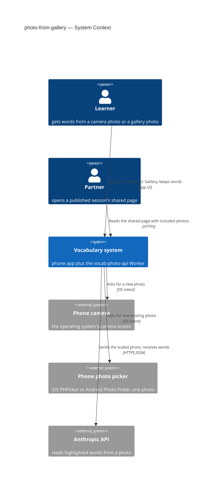
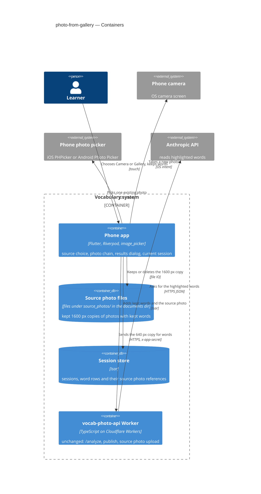
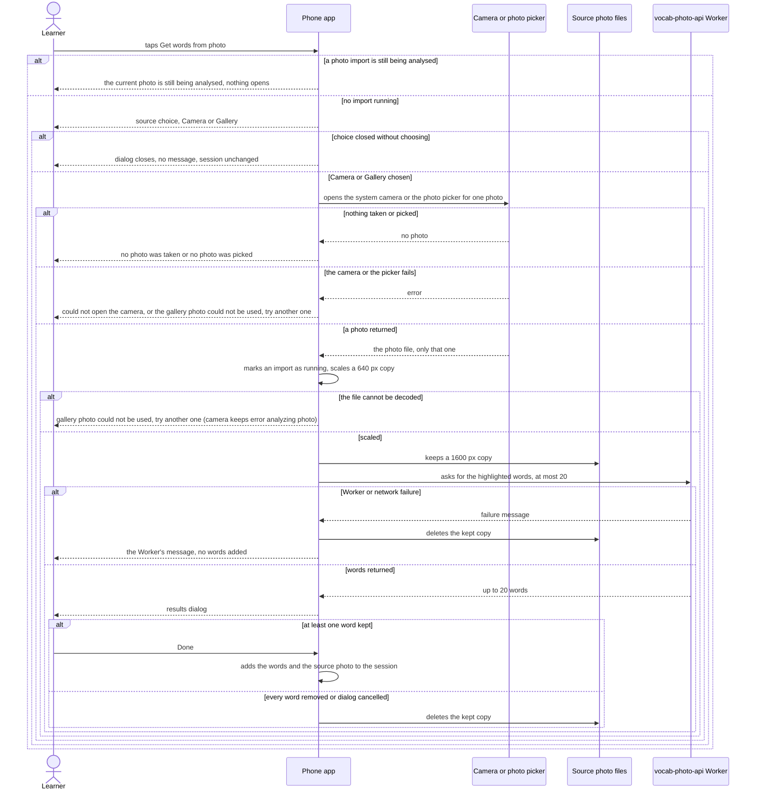

# Software Architecture Document — photo-from-gallery

## 1. Introduction and goals

**Intent.** Let the learner turn a page that is already in the phone's photo library into words in the current session. Tapping "Get words from photo" now opens a small source choice, Camera or Gallery. Camera opens the system camera as today. Gallery opens the phone's own photo picker for one photo. From the picked photo onward the import runs exactly as for a camera shot: recognition of the highlighted words with the same 20-word cap, the same results dialog, the kept words added to the current session, and the photo kept as a source photo that the "Include photos" switch publishes like any other (spec §2). Two behaviours are new for both sources: only one photo import runs at a time, and failure messages name the gallery when the photo came from it. Several photos per import, a remembered choice, an app-drawn camera or picker, and a separate publishing rule for gallery photos are out of scope (spec §3).

**Top quality goals (1-liners; full scenarios in §10):**

1. **A gallery photo is a camera photo after the pick.** It has the same recognition, cap, results dialog, source photo and publishing, and it reaches the results dialog about as fast (AC-03, AC-04, AC-11, AC-12, spec §6).
2. **Unusual images never break the app.** Unreadable, huge or very tall images end in the results dialog or a plain message, with no freeze, no crash and no photo kept when no words are kept (AC-07, AC-08, spec §6).
3. **Only the picked photo is touched.** There is no library-wide access and no new permission prompt, and the original in the library is never changed (AC-09, AC-13, spec §6.1).
4. **The camera stays one tap away.** The source choice is exactly one extra tap, and a second import cannot start while one is being analysed (AC-01, AC-02, AC-10, spec §6).

**Stakeholders.**

| Role | Interest | Sign-off owner? |
|---|---|---|
| learner | Picks Camera or Gallery, imports a photo's highlighted words into the current session, keeps or publishes the photo | No |
| partner | Sees a gallery photo beside its words on the shared page when the learner included photos, exactly like a camera photo (AC-12) | No |
| Tech Lead (Maksym) | SAD approval | Yes |
| Security Lead (Maksym) | The accepted "private gallery image published" case (spec §6.1); no new surface or permission | No |

## 2. Constraints

**Technical.**
- App: Flutter 3.35.1, Dart SDK `>=3.0.0 <4.0.0`. It uses `flutter_riverpod` / `riverpod_annotation` 2.6.x, `go_router` typed routes and `isar_community` pinned to `3.3.0-dev.1` ([`docs/architecture.md`](../../architecture.md) rule 6).
- Photo capture today is `image_picker` ^1.1.2, which resolves to `image_picker_android` 0.8.13+17 and `image_picker_ios` 0.8.13+3. It is called in `lib/features/word_input/word_input_screen.dart` `_takePhotoForVocabulary` as `pickImage(source: ImageSource.camera)`. The messages are "Could not open the camera: …" and "No photo was taken".
- The photo chain is `_processPickedPhoto(XFile)`:
  1. It sets `_isAnalyzingPhoto` in widget `State`.
  2. `PhotoScaler.instance.resizeFileToMinSide(path, minSide: 640, quality: 85)` makes the `/analyze` copy. The shorter side goes to 640 px and the longer side scales with it. The work runs on a background isolate with a 20 s timeout and a fallback.
  3. `_keepSourcePhoto` starts the 1600 px / JPEG 80 kept copy (`PhotoScaler.keptCopy`) into `sourcePhotoStoreProvider`, with `takenAt = DateTime.now()`.
  4. `vocabPhotoService.analyzePhoto(…, limit: 20)` sends the request.
  5. `showVocabResultDialog(…)` opens. If no word is kept, the kept copy is deleted.
  6. The failure paths show `VocabPhotoException.message` or "Error analyzing photo: $e" in a snackbar.
- Android lost-photo recovery: `_pollForLostPhoto` / `_recoverLostPhoto` call `ImagePicker().retrieveLostData()` on resume and feed the file to `_processPickedPhoto`. They skip while `_isAnalyzingPhoto` is set.
- `image_picker_android` 0.8.13 has `useAndroidPhotoPicker = false` by default. A gallery pick then sends `ACTION_GET_CONTENT` for `image/*`. With the flag on, it uses the system Photo Picker (`PickVisualMedia`). Neither path needs a permission.
- `image_picker_ios` uses `PHPickerViewController` for gallery picks on iOS 14+, which needs no photo-library permission. It asks for permission only on the iOS < 14 `UIImagePickerController` path with `requestFullMetadata: true`.
- Platform config: `ios/Runner/Info.plist` already has `NSCameraUsageDescription` and `NSPhotoLibraryUsageDescription`. `android/app/src/main/AndroidManifest.xml` declares only `INTERNET`, and `minSdk = flutter.minSdkVersion`.
- Worker `vocab-photo-api` (unchanged by this feature):
  - `POST /analyze` refuses bodies over `MAX_RAW_BYTES` = 7 MB with 413.
  - It sends the image to the Anthropic Messages API (`claude-sonnet-5`) and answers any AI failure with 502 "Failed to analyze photo, please try again".
  - Source-photo uploads share the 7 MB cap.
- The speed dial (`lib/features/word_input/widgets/word_input_speed_dial.dart`) has "Get words from photo" (`onTakePhoto`), "From subtitles" and "Screenshot".

**Organisational.**
- One owner (Maksym) builds, reviews and runs the device pass. There is no deadline.
- Size XS, route quick (`.size`, `.route`). App-only change, shipped in the next app build.

**Conventions.**
- [`CLAUDE.md`](../../../CLAUDE.md) rules 1–6 and [`docs/architecture.md`](../../architecture.md) §2:
  - Dialogs are `showDialog`, not routes.
  - Services come from providers.
  - Loading flags stay in widget `State`.
  - New UI pieces go in `lib/features/word_input/widgets/`, next to `vocab_result_dialog.dart`.
- Override of CLAUDE.md rule 3 ("do not change how anything looks"): that rule is scoped to structural refactors. This feature adds one dialog and new snackbar texts by spec intent (AC-01, AC-06, AC-07, AC-10). The speed dial, the results dialog and the camera path look unchanged.
- Override of CLAUDE.md rule 5 ("no new packages — ask first"): `image_picker_android` and `image_picker_platform_interface` become direct dependencies. The second is needed because the `ImagePickerAndroid` instance is reachable only through `ImagePickerPlatform.instance`, which `image_picker` 1.2.2 does not re-export. The owner approved both in the design walk on 2026-10-06 (ADR-0001, critic resolution). Both are already in the build as transitive dependencies of `image_picker`, so no new code ships.
- Verification per CLAUDE.md "Before finishing": `build_runner`, `flutter analyze`, `flutter test`, and the CLAUDE.md greps.

**Regulatory / external.**
- Gallery photos are classified internal, like camera photos. A gallery image can be wholly private, for example a chat screenshot (spec §6.1).
- There is no new stored field. The kept copy follows the good-looking-web source-photo rules, and publishing consent is the existing "Include photos (N)" switch with the 30-day public warning (good-looking-web AC-23).
- Anthropic API terms apply as for the camera import. There is no new provider.

## 3. Context and scope

The learner already gets words from a camera photo: the phone app scales the photo, the existing Cloudflare Worker reads its highlighted words through the Anthropic API, and the kept words and the photo join the current session. From there the shared page can publish them. This feature adds a second place the photo can come from, the phone's own photo picker. Everything after the pick is the existing path. The partner is affected only through the shared page, where a gallery photo shows exactly like a camera photo.

<!-- brownfield: Flutter app (Riverpod + go_router + Isar, feature folders; photo chain in word_input_screen.dart, PhotoScaler isolate, source_photos/ store) + Cloudflare Worker `vocab-photo-api` (/analyze, sessions, R2 sources) calling the Anthropic API; scanned 2026-10-06 at fcb2673 from docs/architecture.md and the code (no docs/architecture-map.md). -->

**External systems (in / out):**

| Actor or system | Type | Interaction |
|---|---|---|
| learner | Person | Chooses Camera or Gallery, picks one photo, reviews and keeps words |
| partner | Person | Opens the shared page and sees a gallery photo beside its words when photos were included (unchanged path) |
| Phone camera | System (external, OS) | Takes a new photo and returns it to the app (unchanged) |
| Phone photo picker | System (external, OS) | iOS PHPicker or the Android Photo Picker. Shows the photo library and returns only the one photo the learner picked (new) |
| Anthropic API | System (external) | Reads the highlighted words from the scaled photo, reached only through the Worker (unchanged) |

**C4 Context (L1):**



The learner uses the app, which asks either the phone camera or the phone photo picker for one photo. The app sends the scaled photo through the Worker to the Anthropic API. The partner only reads the shared page, as today. The photo picker is the one new external system.

## 4. Solution strategy

**Top strategic choices:**

1. **Change only the phone app** (`target_surfaces: [mobile-app]`). The Worker's `/analyze` and source-photo routes, the shared page and the session model already handle "a photo" without caring where it came from. Nothing in the request, the stored `SourcePhoto` or the published session says "gallery" (spec §6.1 "No new stored fields"). The UI architecture is the existing cross-platform Flutter app; the repo fixes it, so it is not a decision of this feature.
2. **One photo chain, two sources.** The source choice only decides which system screen opens. The picked `XFile` goes into the existing `_processPickedPhoto`, which now takes the source as a parameter that only selects failure-message texts. Scaling, the 20-word cap, the results dialog, keep-or-delete and publishing are shared code, so a gallery photo cannot drift from a camera photo (QG-1).
3. **Let the phone's own picker grant access to one photo.** iOS PHPicker and the Android Photo Picker hand the app only the picked file and need no permission. The app asks for no library access and never touches the original (QG-3). On Android the Photo Picker is turned on explicitly. → [ADR-0001](adr/0001-turn-on-the-android-photo-picker-for-gallery-picks.md).
4. **Send unusual images down the normal path.** A very tall screenshot or a huge original is scaled and sent like any photo. Whatever the Worker answers (words, no words, or its failure message) is shown, and the learner is never blocked or stuck. This resolves spec §8's open question. → [ADR-0002](adr/0002-send-very-tall-images-through-the-normal-photo-path.md).

**Tactical decisions (inline, below the ADR gate):**

- **Source choice.** `showPhotoSourceDialog(context)` in a new `lib/features/word_input/widgets/photo_source_dialog.dart` returns `ImageSource?`. It has two entries, Camera and Gallery. Tapping outside or going back returns `null`, and the app then does nothing, with no message (AC-05). It is a dialog, not a route (CLAUDE.md rule 1).
- **One import at a time.** The speed-dial callback first checks the existing `_isAnalyzingPhoto` flag in widget `State`. If it is set, the app shows "The current photo is still being analysed" and opens nothing (AC-10). The flag is set from the start of `_processPickedPhoto` until the results dialog opens. The results dialog is modal, so no second tap is possible after that. The lost-photo recovery already respects the same flag.
- **Gallery call.** `ImagePicker().pickImage(source: ImageSource.gallery, requestFullMetadata: false)`. No `maxWidth` or `imageQuality` is passed, because `PhotoScaler` does all scaling as for the camera. Without metadata, iOS never takes the permission-asking path (AC-09).
- **Failure messages by source.** The camera texts are unchanged. For a gallery pick:
  - Picker closed without a photo → "No photo was picked" (AC-06).
  - The picker throws, for example when an online-only photo fails to download, or `PhotoScaler` cannot decode the file → "The photo from the gallery could not be used. Try another one." (AC-07).
  - A `VocabPhotoException` (network, Worker or AI) keeps its own message, because it is not the photo's fault.
  - In every failure no words are added and the kept copy is deleted by the existing `finally`.
- **`takenAt` of a gallery source photo** is the time of import (`DateTime.now()`), as for the camera. The photo's own capture date is not read. Session sources stay in import order.
- **Android lost-photo recovery** is unchanged. A gallery pick lost to process death is recovered through the same `retrieveLostData` and processed with the camera-path messages (§11).

## 5. Building block view

The change stays inside the word-input feature folder, following the repo's layout: the screen file composes, widget files draw, and transient flags live in widget `State`. There is no new service, model, route or Worker code. One new provider, `imagePickerProvider` in `lib/core/providers.dart`, returns `ImagePicker()`. The photo chain reads the picker through it and the scaler through the existing `photoScalerProvider`, instead of `ImagePicker()` and `PhotoScaler.instance` inline, so tests can substitute both (CLAUDE.md rule 2; critic resolution). The one startup line that turns on the Android Photo Picker sits in `main.dart`, next to the existing `PhotoScaler.instance.start()`.

**Internal decomposition:**

```
lib/
├── main.dart                                + one line: useAndroidPhotoPicker = true on Android (ADR-0001)
├── core/providers.dart                      + imagePickerProvider → ImagePicker(); photoScalerProvider (existing) now used by the photo chain
├── core/services/photo_scaler.dart          unchanged — 640 px /analyze copy, 1600 px kept copy
├── core/services/source_photo_store.dart    unchanged — kept copies under source_photos/
└── features/word_input/
    ├── word_input_screen.dart               _takePhotoForVocabulary → guard (AC-10) + source choice + pick by source;
    │                                        _processPickedPhoto(file, {source}) picks the failure texts
    └── widgets/
        ├── photo_source_dialog.dart         NEW — showPhotoSourceDialog: Camera / Gallery → ImageSource?
        └── word_input_speed_dial.dart       unchanged — "Get words from photo" still calls onTakePhoto
pubspec.yaml                                 + image_picker_android: ^0.8.13, image_picker_platform_interface: ^2.11.1 (direct; were transitive)
```

**C4 Container (L2):**



The phone app is the one container this feature changes. It gets a photo from the camera or the photo picker, keeps its copy in the source-photo files, and stores the kept words and the source photo in the session store. It sends the small copy to the unchanged Worker, which asks the Anthropic API. Publishing and the partner's shared page go through the existing paths and are not drawn.

## 6. Runtime view

Seeded here. The `sequences` stage maps every §5 AC onto this flow or a branch of it.

**Critical flow 1: get words from a photo, Camera or Gallery, with its failure branches**



The learner taps "Get words from photo".
- If an import is still running, the app says so and opens nothing.
- Otherwise it shows the source choice. Closing the choice does nothing.
- Choosing a source opens the system camera or the photo picker. "Nothing picked" and "the picker failed" each give a plain message. The failure message names the gallery for a gallery pick.
- A returned photo is scaled. A file that can't be decoded gives the gallery message for a gallery photo and today's "Error analyzing photo" for a camera photo.
- The app keeps a large copy and asks the Worker for words. A Worker failure shows its message and deletes the copy.
- Words open the results dialog. Keeping at least one word adds the words and the photo to the session. Keeping none deletes the copy.

## 7. Deployment view

<!-- N/A: reuses existing deployment unit, no infra change -->

The feature ships in the next app build for iOS and Android. The Worker, its bindings and its limits are untouched, so there is no Worker deploy, no migration and no new monitoring. On the app side the `debugPrint` lines of the photo chain stay as they are.

## 8. Crosscutting concepts

| Concept | Convention | Where defined |
|---|---|---|
| Logging | `debugPrint('VOCAB: …')` in the photo chain as today, plus the picker failure. No photo content is logged | `word_input_screen.dart` |
| Authentication | None new. The Worker call keeps `x-app-secret`, and the photo picker grants access to the one picked file only | `vocab_photo_service.dart`; ADR-0001 |
| Error handling | Snackbars on the word-input screen. Source-aware texts for "nothing picked" and "this photo could not be used", and unchanged texts for camera, network, Worker and AI failures. Every failure leaves the session unchanged and deletes the kept copy | §4 tactical decisions |
| Concurrency | One photo import at a time through `_isAnalyzingPhoto` in widget `State`, checked before the source choice and by the lost-photo recovery | §4; `docs/architecture.md` rule 2 |
| Original photo | Read-only: the app scales from the picker's returned file and never writes, moves or deletes anything in the library (AC-13) | here |
| ID strategy | None new. A gallery source photo gets the same declared source id and `fileName` as a camera one | good-looking-web sad §5 |
| Internationalisation | UI texts in English as today | — |
| Observability | Device pass only (spec §6). No telemetry | — |

## 9. Architecture decisions

| # | Title | Status | Section |
|---|---|---|---|
| 0001 | Turn on the Android Photo Picker for gallery picks | Accepted | §4 |
| 0002 | Send very tall images through the normal photo path | Accepted | §4 |

ADR files live under `docs/features/photo-from-gallery/adr/NNNN-<title>.md`.

## 10. Quality requirements

**QG-1. A gallery photo is a camera photo after the pick**
- **When:** the learner picks, through Gallery, a photo stored on the phone of a printed page with highlighted words, and keeps at least one word.
- **Then:** the results dialog lists at most 20 words. Done adds the kept words, and the photo becomes a source photo that every added row points at (AC-03, AC-04). With "Include photos" on, the photo is counted and published (AC-12). From the photo being picked to the results dialog, the median is ≤ camera median + 2 s.
- **How verify:**
  - Widget tests that override `imagePickerProvider`, `photoScalerProvider` and `vocabPhotoServiceProvider` with fakes check that a gallery `XFile` reaches the same `analyzePhoto(limit: 20)` and keep-or-delete calls as a camera one.
  - Device pass: stopwatch from the moment the photo is picked (or the shutter confirmed) to the results dialog. 5 runs per path on the same printed page, with the gallery runs using one of those camera shots.

**QG-2. Unusual images never break the app**
- **When:** the learner picks each image of the fixed test set from the gallery: a JPEG page photo, a PNG screenshot, a HEIC photo, a 1080×20000 screenshot, a ≥48 MP original, a photo stored only online, a non-image-looking meme, and 3 page photos.
- **Then:** 10 of 10 test images end in the results dialog or a plain message within 60 s, with 0 crashes and 0 freezes. No photo is kept when no words are kept (AC-07, AC-08, AC-11).
- **How verify:**
  - Device pass on one iPhone and one Android phone with that set.
  - Widget tests with the same provider overrides: a picker that throws and a scaler that throws each produce the gallery failure text and keep no source photo.

**QG-3. Only the picked photo is touched**
- **When:** a learner who never granted photo-library access picks a photo through Gallery, and the import then succeeds, fails or is cancelled.
- **Then:** the app gets only that one photo, with 0 new permission prompts on iOS 15+ and Android at the app's current minimum SDK. The original in the library is unchanged (AC-09, AC-13).
- **How verify:**
  - Device pass on one iPhone and one Android phone, starting from a fresh install with library access never granted; check that no permission dialog appears and that the original is still in the library, unedited.
  - Code review check: the gallery call passes `requestFullMetadata: false`, and the Android manifest gains no storage or media permission.

**QG-4. The camera stays one tap away**
- **When:** the learner taps "Get words from photo" and chooses Camera, or taps it again while a photo is being analysed.
- **Then:** there is exactly 1 extra tap (the source choice) between "Get words from photo" and the camera (AC-01, AC-02). A second tap during analysis starts no second import and shows the "still being analysed" message (AC-10).
- **How verify:**
  - Device pass on the owner's phone at release.
  - A widget test holds the fake `vocabPhotoServiceProvider` call open, so the first import is still being analysed, then taps the speed-dial item again and checks that no dialog opens and the message shows.

## 11. Risks and technical debt

| Risk / debt | Severity | Mitigation | Owner |
|---|---|---|---|
| A private gallery image (chat screenshot, letter) is published through the share sheet. With four or more photos its thumbnail may never be on screen, and a published photo can't be deleted (spec §6.1, good-looking-web D4) | Medium | Accepted as the camera's existing risk, re-confirmed by the owner. The "Include photos (N)" switch, the thumbnails that open all photos, and the 30-day public warning stay as they are | Maksym (Security Lead) |
| A very tall screenshot gets the Worker's "Failed to analyze photo, please try again". Retrying cannot help, and one AI request is spent (ADR-0002) | Low | Accepted. AC-08 still holds. Revisit with a dimension check before the request if the device pass or real use shows it often | Maksym |
| HEIC files, ≥48 MP originals and online-only photos behave differently per phone (decoder support, memory, download failures) | Medium | `PhotoScaler`'s native codec, background isolate and 20 s timeout with fallback. Picker and decoder failures map to the AC-07 message. The fixed 10-image device pass on both platforms (QG-2) | Maksym |
| Android phones without the Photo Picker (no system module and no Play-services backport) fall back to the system document picker, which looks like a file browser (ADR-0001) | Low | Still no permission and still one photo. The backport manifest entry is not added in v1 and can be added if an older test phone shows the fallback | Maksym |
| A gallery pick lost to Android process death is recovered by `retrieveLostData` without knowing its source, so its failure texts are the camera-path ones | Low | Accepted. It is rare, and the import itself still works. Fix only if seen | Maksym |
| CLAUDE.md overrides: rule 3 (a new dialog and snackbar texts) and rule 5 (`image_picker_android` and `image_picker_platform_interface` as direct dependencies) (§2) | Low | Owner-approved in this design. Both are already in the build, and their versions are kept in step with `image_picker` | Maksym |

**Accepted debt (acceptable in v1, plan to fix later):**
- The same photo imported twice duplicates its words and its source photo, as on the camera path (spec §3).
- The source choice is asked every time. There is no remembered default (spec §3).
- `takenAt` of a gallery source photo is the import time, not the photo's own capture date.

## 12. Glossary

| Term | Meaning |
|---|---|
| gallery | The phone's own photo library, opened through the system photo picker, from which the learner picks one existing photo. Not the app's History |
| photo import | One run of getting words from one photo: choose Camera or Gallery, recognise the highlighted words, keep some in the results dialog. Not a subtitle import |
| source choice | The small dialog after tapping "Get words from photo" that offers Camera or Gallery. Asked every time, not a setting |
| source photo | A photo the learner took or picked from the gallery that at least one kept word row came from. Kept as a 1600 px copy and publishable with the session (widened from good-looking-web) |
| photo word cap | At most 20 words proposed per photo import, for both sources |
| system photo picker | The phone's own screen for choosing a photo: PHPicker on iOS, the Photo Picker on Android. It gives the app only the picked photo, without library permission |
| one photo import at a time | Invariant: while a photo is being analysed, tapping "Get words from photo" starts nothing and says the current photo is still being analysed |
