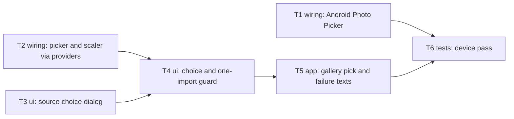

# Epic — photo-from-gallery

> **Spec:** [spec.md](../spec.md) · **Design:** [sad.md](../sad.md) · **Data model:** N/A (no schema change) · **API:** N/A (no contract change; the Worker is unchanged) · **ADRs:** [adr/](../adr/) · **Glossary:** [CONTEXT.md](../CONTEXT.md)

## Goal

Let the learner turn a page already in the phone's photo library into session words. "Get words from photo" opens a Camera/Gallery choice, and a gallery photo then runs through the same photo chain as a camera shot. Only one photo import runs at a time, and failure messages name the gallery ([spec §2](../spec.md)).

## Scope

- **In:**
  - The phone app only (`target_surfaces: [mobile-app]`): the word-input screen's photo chain, a new source-choice dialog, and a picker provider.
  - The Android Photo Picker switch, with two dependencies that were already transitive (ADR-0001).
  - The device pass.
- **Out:**
  - Several photos per import, a remembered choice, and an app-drawn camera or picker.
  - A separate publishing rule for gallery photos, and de-duplicating repeated imports ([spec §3](../spec.md)).
  - Any Worker, data-model or shared-page change.

## Task map

T1, T2 and T3 start in parallel. T2, T4 and T5 share `word_input_screen.dart`, so `implement` serializes them.

## Tasks

See [tracker.md](./tracker.md) for status. Machine contract: [tasks.json](../tasks.json).

| # | Task | Layer | Blocked by | DoD (short) |
|---|---|---|---|---|
| T1 | Turn on the Android Photo Picker for gallery picks | wiring | — | pubspec + main.dart, analyze clean, no new permission |
| T2 | Read the image picker and the photo scaler through providers in the photo chain | wiring | — | no inline ImagePicker()/PhotoScaler.instance in the screen; tests green |
| T3 | Add the Camera/Gallery source choice dialog | ui | — | two choices; null on dismiss; widget tests |
| T4 | Open the source choice from Get words from photo, behind the one-import-at-a-time guard | ui | T2, T3 | guard message, choice opens, Camera unchanged; widget tests |
| T5 | Pick one photo from the gallery and run it through the shared photo chain with gallery failure texts | app | T4 | gallery reaches the shared chain; gallery texts; no photo kept on failure; widget tests |
| T6 | Run the device pass for the spec §6 targets on one iPhone and one Android phone | tests | T1, T5 | _audit/device-pass.md filled for spec §6 |

## Risks / Hard rules

- CLAUDE.md rules 1–3:
  - Typed routes only. The source choice is a `showDialog`, not a route.
  - Services come through providers.
  - Loading flags stay in widget `State`.
  - Don't change how the speed dial, the results dialog or the camera path look.
- CLAUDE.md rule 5: only the two packages approved in ADR-0001. No others.
- Camera texts and the camera tap count stay as today, apart from the one source-choice tap (spec §6, sad §4).
- No new stored field and no origin tag on `SourcePhoto` ([spec §6.1](../spec.md), sad §4 choice 1).
- Before finishing each task, run the CLAUDE.md checks: `dart run build_runner build --delete-conflicting-outputs`, `flutter analyze`, and the `Navigator.push` / `static final … instance` grep.
