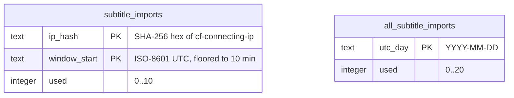

# Data model — words-from-subtitles

> **Inputs:** [spec](./spec.md) §5–§6.1 · [sad](./sad.md) §4–§8 · [ADR-0003](adr/0003-count-subtitle-imports-per-address-and-per-day-in-d1.md) · precedent `vocab-photo-api/migrations/0001_sessions.sql` (`page_autofill` / `all_pages_autofill`) and `src/autofill/meter.ts`.

The feature adds **one schema change**: the subtitle import allowance in the Worker's D1 database `vocab-sessions` (ADR-0003). Nothing else it stores is a schema:

- **Word rows on the phone (Isar) — unchanged.** Kept words are appended as ordinary word rows with no source photo (AC-03, AC-17; spec §3 "the row stays as it is today"). No Isar collection or field changes, so no `build_runner` schema bump for Isar.
- **Shared-page tables (D1 `sessions`, `rows`, `sources`) — unchanged.** Subtitle words reach them through the existing publish path (sad §5).
- **Import preferences (`shared_preferences`) — key/value, not a schema.** Listed under [Device preferences](#device-preferences-shared_preferences--no-migration) so `implement` uses fixed keys.
- **Subtitle text, session words and picked words are never stored on the Worker** (sad §8 Logging); they live only in the request.

## ER diagram

The two counter tables are independent roots with no foreign key between them (as with `page_autofill` / `all_pages_autofill`): one atomic D1 batch ties them together at write time, not a relation.



## Entities

Conventions followed from `0001_sessions.sql`: `snake_case` table and column names, `TEXT` keys, ISO-8601 UTC strings for times, `INTEGER ... DEFAULT 0 CHECK (used >= 0)` counters, composite natural primary keys, no audit columns on counter tables, hard delete by the daily cleanup.

### `subtitle_imports` — one address's imports in one 10-minute window

| Column | Type | Constraints | Notes |
|---|---|---|---|
| `ip_hash` | TEXT | NOT NULL, `CHECK (length(ip_hash) = 64)`, PK part 1 | Lowercase hex SHA-256 of `cf-connecting-ip`; never the address (spec §6.1). |
| `window_start` | TEXT | NOT NULL, PK part 2 | Start of the fixed 10-minute window, e.g. `2026-09-30T14:10:00.000Z`; same `toISOString()` format everywhere, so string comparison is time order. |
| `used` | INTEGER | NOT NULL DEFAULT 0, `CHECK (used >= 0)` | Imports taken in this window. The limit of 10 is a constant in `src/subtitles/allowance.ts` (ADR-0003 Neutral), not a CHECK. |

**Aggregate root:** root (per-address window).
**Access patterns:**
- Take a unit (F3 "takes one import from the address window…"): `INSERT OR IGNORE` then `UPDATE … WHERE ip_hash = ?1 AND window_start = ?2 AND changes() = 1`, and the window read inside the day-total `UPDATE` → primary key.
- Daily cleanup (sad §7, spec §6.1): `DELETE FROM subtitle_imports WHERE window_start < ?1`, where `?1` is the start of the **current** window. This removes every finished window on each 03:00 UTC run, so a row lives under 24 h → index `subtitle_imports_window_start_idx`.

**Constraints:** PK `(ip_hash, window_start)`; no FK (the address is not an entity).

### `all_subtitle_imports` — all subtitle imports of one UTC day

| Column | Type | Constraints | Notes |
|---|---|---|---|
| `utc_day` | TEXT | PK | `YYYY-MM-DD`, from `utcDay()` in `src/autofill/meter.ts` (reuse, don't copy). |
| `used` | INTEGER | NOT NULL DEFAULT 0, `CHECK (used >= 0)` | Imports taken today from any address; limit 20 is a constant in `allowance.ts`. |

**Aggregate root:** root (daily cap).
**Access patterns:** take a unit, then read both counts to choose the refusal (F3): `WHERE utc_day = ?` → primary key.
**Constraints:** PK `utc_day`. Holds no address data, so it is **not** cleaned up (one row a day), matching `all_pages_autofill`.

### The take — one D1 batch (ADR-0003), mirroring `takeAutofillUnit`

```sql
INSERT OR IGNORE INTO all_subtitle_imports (utc_day, used) VALUES (?3, 0);
INSERT OR IGNORE INTO subtitle_imports (ip_hash, window_start, used) VALUES (?1, ?2, 0);
UPDATE all_subtitle_imports SET used = used + 1
 WHERE utc_day = ?3 AND used < 20
   AND (SELECT used FROM subtitle_imports WHERE ip_hash = ?1 AND window_start = ?2) < 10;
UPDATE subtitle_imports SET used = used + 1
 WHERE ip_hash = ?1 AND window_start = ?2 AND changes() = 1;
```

Taken ⇔ the last `UPDATE` changed one row. Either refusal returns the AC-14 response before any AI call; a taken unit is not returned when the AI call fails (sad §8 Abuse bounds). Checked in SQLite during this stage: twelve takes in one window leave both counters at 10.

## Indexes

| Index | Columns | Query it serves |
|---|---|---|
| PK of `subtitle_imports` | `(ip_hash, window_start)` | F3 take: insert, raise and read one address window |
| `subtitle_imports_window_start_idx` | `(window_start)` | Daily cleanup `DELETE … WHERE window_start < ?` (sad §7, spec §6.1 "deletes it within a day"); query plan checked: `SEARCH … USING INDEX` |
| PK of `all_subtitle_imports` | `(utc_day)` | F3 take: insert, raise and read today's total |

No foreign keys, so no FK indexes are needed.

## Migrations (staged)

| Ordinal | Up | Down | Promotes to |
|---|---|---|---|
| 01 | [`migrations/01_create_subtitle_imports.up.sql`](migrations/01_create_subtitle_imports.up.sql) | [`migrations/01_create_subtitle_imports.down.sql`](migrations/01_create_subtitle_imports.down.sql) | `vocab-photo-api/migrations/<next>_subtitle_imports.sql` + `vocab-photo-api/migrations/down/<next>_subtitle_imports.sql` (next is `0002` today) |

A new table only: no expand/backfill/contract, no seeds. Apply with `npx wrangler d1 migrations apply DB --remote` before the Worker deploy (sad §7).

## Device preferences (`shared_preferences`) — no migration

One `@riverpod` notifier, following the `WordDetailModeNotifier` pattern: `snake_case` keys, enums stored as `.name`. Settings holds **one** set of import values and an "Update with each import" switch. With the switch on, Start overwrites the values with the ones used; with it off, they stay as set until edited in Settings. There is no separate "last used" store (owner decision in the sad §6 sequences notes; the spec amendment is still pending, see below). A missing or unknown value reads as the first-launch default, so no migration is needed and a removed model id falls back safely.

| Key | Stored as | First-launch default | Source |
|---|---|---|---|
| `subtitle_purpose` | String (enum `.name`) | understand this film | F1, F2 |
| `subtitle_level` | String (`A1`…`C2`) | `B2` | F1, F2 |
| `subtitle_maximum` | int, 1–100 | 20 | F1, F2, AC-09 |
| `subtitle_update_each_import` | bool | `true` | F2, F3 `opt`, AC-05 / AC-05b (as amended) |
| `subtitle_model` | String (enum `.name`) | Sonnet 5 | F2, AC-21, ADR-0004 |

The file is never stored (spec §1). **Pending upstream:** spec §1, US-03, AC-05, CONTEXT "remembered choices" and sad §8 *Preferences* still describe defaults, last-used values and a "remember my last choices" switch. They are to be amended through `/sdd:clarify` (sad §6 notes), and this table already follows the amended model.

## Test fixtures

In the Worker's existing form: SQL seeded through `d1()` in `test/helpers.mjs` against the throwaway `wrangler dev` state, as `test/autofill.test.mjs` does. Nothing goes in `migrations/`.

- **Window almost full:** `INSERT OR REPLACE INTO subtitle_imports (ip_hash, window_start, used) VALUES (<sha256 of the test address>, <current window start>, 10)` → the next import is refused and the stub AI is not called (sad §10 QG-3).
- **Day almost full:** `INSERT OR REPLACE INTO all_subtitle_imports (utc_day, used) VALUES (<today>, 20)` → an import from a fresh address is refused.
- **Cleanup:** one row in a past window and one in the current window → after the scheduled run only the current one remains.
- Addresses in fixtures are test values only (`203.0.113.x`, the documentation range); no real addresses.
