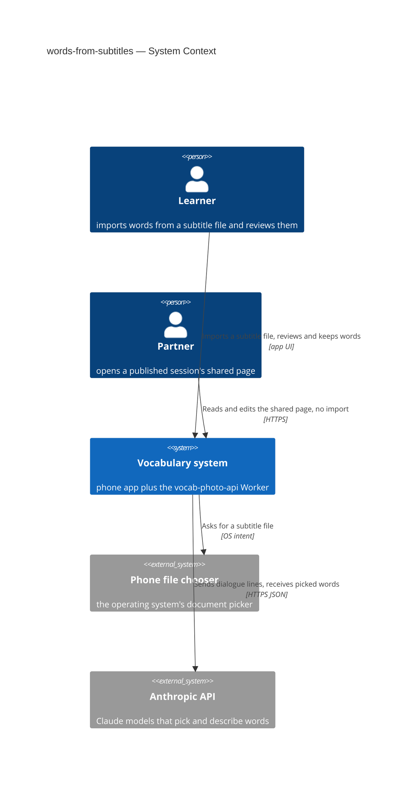
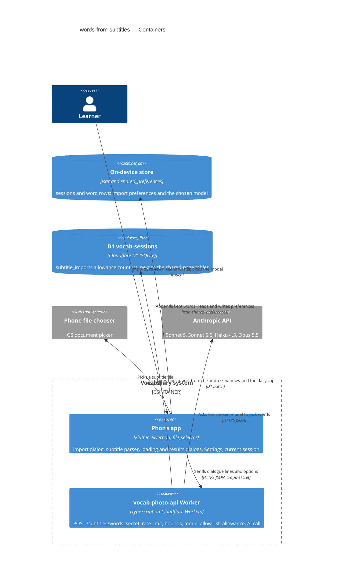
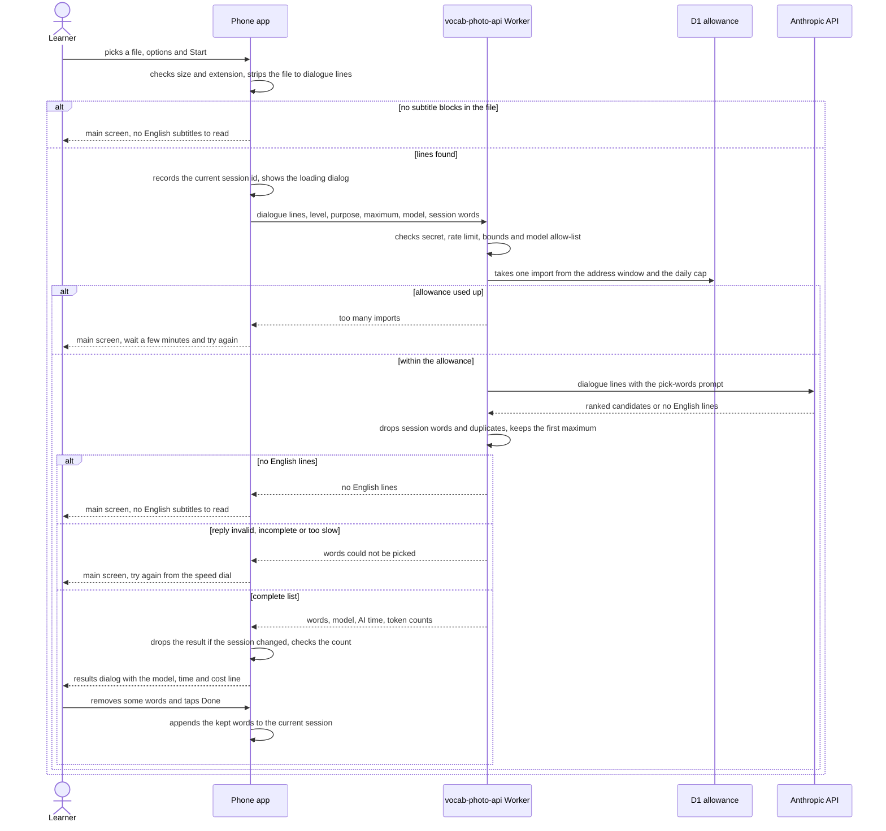
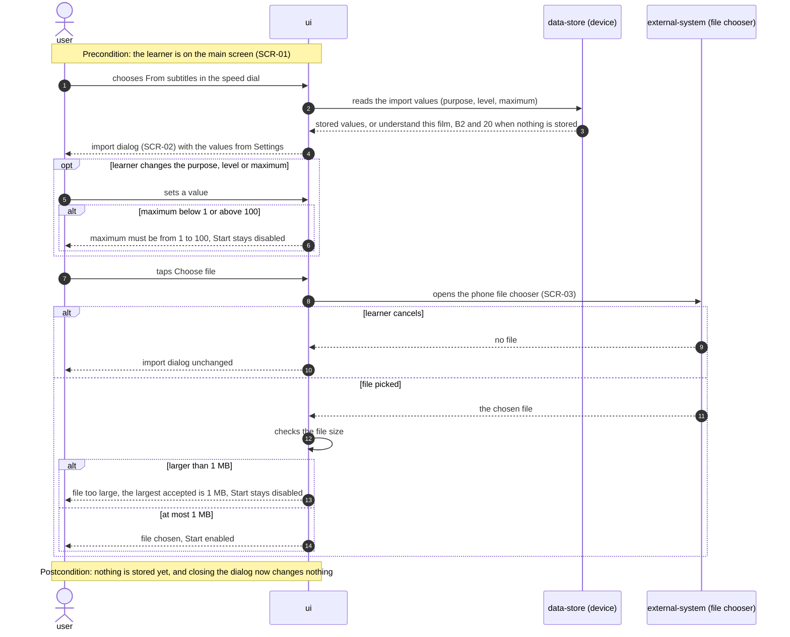
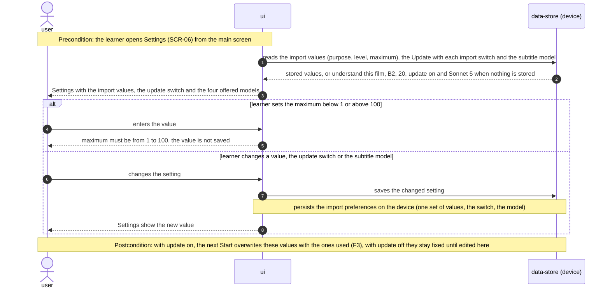
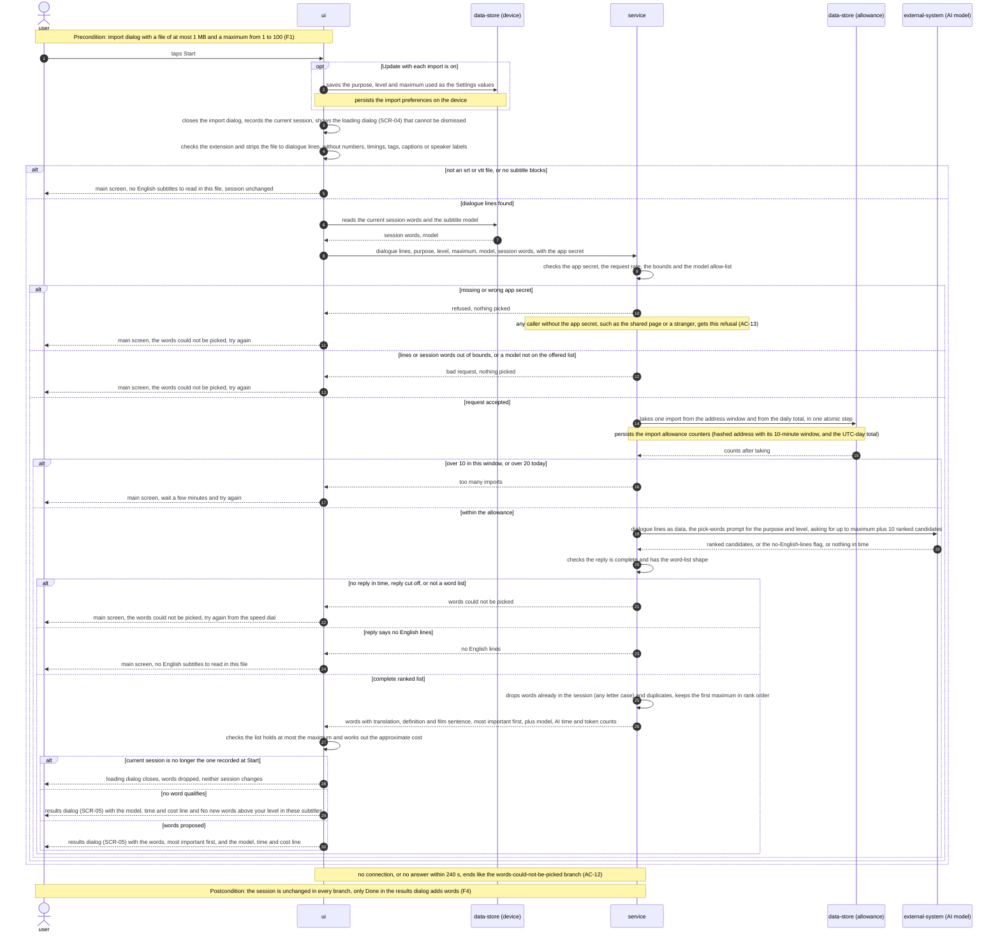
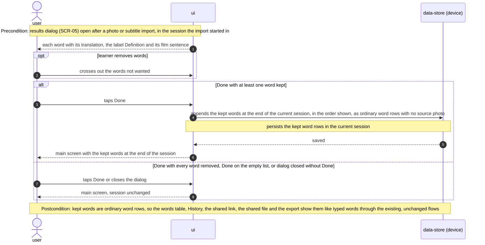

# Software Architecture Document — words-from-subtitles

## 1. Introduction and goals

**Intent.** Let the learner turn a film's or episode's subtitle file into a reviewed word list in the current session without typing a word. From the speed dial the learner opens an import dialog, picks a subtitle file and the import purpose, English level and word maximum; the app reads the file on the phone, sends only its dialogue lines to the Worker, and the Worker asks the AI model chosen in Settings to pick words above that level which fit the purpose, most important first, never more than the maximum. The words open in the same results dialog as a photo import, now with a line naming the model, the time taken and the approximate cost, and Done appends the kept words to the current session as ordinary word rows (spec §2). Searching subtitles by film name, playing video and remembering known words across sessions stay out (spec §3).

**Top-3 quality goals (1-liners; full scenarios in §10):**

1. **The list is exactly what was asked for** — above the chosen level, fitting the purpose, never over the word maximum, never a word already in the session, never a name or caption, most important first (AC-06, AC-07, AC-08, AC-15, AC-19).
2. **Complete or nothing, in bounded time** — the results dialog shows the whole list or a plain message, never a partial list; a 20-word import with the default model reaches the dialog within the spec's p95 target (AC-12, spec §6).
3. **A bounded AI cost surface** — only the learner's app can start an import, only with an offered model, only within the per-address allowance and size limits, so a leaked app secret cannot turn the route into a general-purpose AI (AC-13, AC-14, spec §6.1).

**Stakeholders.**

| Role | Interest | Sign-off owner? |
|---|---|---|
| learner | Imports words from a subtitle file, reviews them, keeps them in the session; compares the offered models from Settings | No |
| partner | Sees subtitle words on the shared page exactly like any other words; gets no import of their own (AC-13, AC-17) | No |
| Tech Lead (Maksym) | SAD approval | Yes |
| Security Lead (Maksym) | Review of the new AI-backed, secret-gated route and its allowance (spec §6.1 "Security review: Required") | Yes |

**Decision overrides (owner, design 2026-09-30 — spec amended the same day):**

- Decision override: a per-feature model picker in Settings (Sonnet 5 default, Sonnet 5.5, Haiku 4.5, Opus 5.5) — rationale: the owner wants to compare models after release. Spec §1, AC-21 (ADR-0004).
- Decision override: the subtitle results dialog shows a model · time · cost line — rationale: the comparison needs it in front of the learner; replaces "no timing line" in the AC-20 decision.
- Decision override: no time target for a 100-word import; the 20-word target (p95 ≤ 30 s) applies to the default model — rationale: the owner accepts waits over a minute, which lets one AI call serve the whole import (§4).
- Decision override: ADR-0001 keeps "also change the shared page" and ADR-0004 keeps "model set in Worker configuration" as considered options although the critic flagged them as excluded by the spec — rationale: both were live options when the owner decided; the spec's §3 non-goal and AC-21 record the outcome of those decisions, not a prior constraint (critic resolution 2026-09-30).
- Decision override: the app strips the subtitle file and the Worker checks a bounded list of short lines instead of the subtitle format — rationale: owner's choice; the weaker shape check is tracked in §11 (ADR-0002).

## 2. Constraints

**Technical.**
- App: Flutter, Dart SDK `>=3.0.0 <4.0.0`; `flutter_riverpod` / `riverpod_annotation` 2.6.x with `riverpod_generator`; `go_router` typed routes; `http` ^1.2.2 is the only HTTP client; `shared_preferences` ^2.5.5 holds preferences; `isar_community` pinned exactly to `3.3.0-dev.1` ([`docs/architecture.md`](../../architecture.md) rule 6). No file-picking package today; one is approved by the owner (spec §1) — `file_selector` (§4).
- App photo import today (`lib/features/word_input/word_input_screen.dart` `_processPickedPhoto`): `vocabPhotoService.analyzePhoto(...)` with a 60 s timeout and `limit: 20`, then `showVocabResultDialog(context, words, compressDuration:, requestDuration:, aiDuration:)`, which returns the words not crossed out; Done appends them via the notifier's `addAll`. The dialog prints "Description:" and the photo timing lines. There is no loading dialog: a spinner flag in widget `State`.
- Speed dial (`lib/features/word_input/widgets/word_input_speed_dial.dart`): two items, "Take Photo" and "Screenshot".
- Settings (`lib/features/settings/settings_screen.dart`): drag mode (in memory) and the word detail mode, persisted by `WordDetailModeNotifier` in `lib/core/providers.dart` under a `shared_preferences` key — the pattern the new preferences follow.
- Worker (`vocab-photo-api/`): TypeScript 5.6, `wrangler` 4, no runtime npm dependencies; calls the Anthropic Messages API with `fetch` and `x-api-key` (`src/index.ts` `callClaude`: model `claude-sonnet-5`, `max_tokens` 1536, cached system prompt, JSON parsed from text and shape-checked, no explicit timeout).
- Worker routing (`src/index.ts` `ROUTES`): every non-public route checks `x-app-secret` against `APP_SHARED_SECRET` and then `RATE_LIMITER` — 20 requests / 60 s per IP, shared by all secret-gated routes. Cloudflare's rate-limit binding supports only 10 s or 60 s periods, so it cannot express spec §6's "10 imports per 10 minutes".
- Worker bindings: `DB` (D1, `migrations/` with paired `down/`), `SESSIONS` and `DEFINITIONS` (KV), `SOURCES` (R2), `RATE_LIMITER`, `PAGE_WRITE_LIMITER`; a daily cron at 03:00 UTC runs `src/session/cleanup.ts`. The autofill allowance (`src/autofill/meter.ts`) is a D1 counter taken atomically in one batch — the precedent for the import allowance.
- Worker tests: `node --test` files under `vocab-photo-api/test/` against `wrangler dev` (`npm test`); app tests under `test/` with `flutter_test`, `ProviderContainer` and mocked `SharedPreferences`.
- Model prices used by the cost line (Anthropic list prices, 2026-09): Sonnet 5 and Sonnet 5.5 $2 / $10, Haiku 4.5 $1 / $5, Opus 5.5 $4 / $20 per million input / output tokens.

**Organisational.**
- One owner (Maksym) builds, reviews and deploys; no deadline; Worker deploys are a manual `wrangler deploy`, D1 migrations a manual `wrangler d1 migrations apply`.
- Size S, route quick (`.size`, `.route`).

**Conventions.**
- [`CLAUDE.md`](../../../CLAUDE.md) rules 1–6 and [`docs/architecture.md`](../../architecture.md) §2: typed routes only (dialogs are not routes); services via providers in `lib/core/providers.dart`; screen data in a `@riverpod` notifier, controllers, focus and loading flags in widget `State`; features don't import each other's screens.
- Override — CLAUDE.md rule 3 ("do not change how anything looks"): scoped to structural refactors. This feature adds a speed dial item, two dialogs, Settings controls, renames "Description" to "Definition" and adds the model · time · cost line — all by spec intent. Tracked in §11.
- Override — CLAUDE.md rule 5 ("no new packages / domain models — ask first"): `file_selector` approved by the owner (spec §1); the import purpose, English level and model are small value types plus a preferences object, no change to `Session` or `WordPair`. Tracked in §11.
- Verification per [`docs/tasks/README.md`](../../tasks/README.md) and CLAUDE.md "Before finishing": `build_runner`, `flutter analyze`, `flutter test`, the CLAUDE.md greps, and in `vocab-photo-api/` `npm run typecheck` + `npm test`.

**Regulatory / external.**
- Subtitle text is published film dialogue, classified internal (spec §6.1); it goes to the Worker and on to Anthropic and is never stored or logged.
- The import allowance keys on the caller's address; the Worker stores only a hash of it, for at most one day (§8).
- Anthropic API terms apply as for the photo import; no new provider.

## 3. Context and scope

The learner already builds word sessions on the phone from typing and from photos; this feature adds a subtitle file as a third source. The phone app reads the file, the existing Cloudflare Worker picks the words through the Anthropic API, and the words land in the current session, from where History, the shared page and the AnkiDroid export treat them like any other words. The partner is untouched: the shared page offers no import and shows subtitle words as ordinary rows.

<!-- brownfield: Flutter app (Riverpod + go_router + Isar, feature folders) + Cloudflare Worker `vocab-photo-api` (TypeScript, D1/KV/R2, secret-gated routes, per-IP rate limiter) calling the Anthropic API; scanned 2026-09-30 at d367505. -->

**External systems (in / out):**

| Actor or system | Type | Interaction |
|---|---|---|
| learner | Person | Picks a subtitle file and options, reviews the proposed words, chooses the model in Settings |
| partner | Person | Opens the shared page; sees subtitle words as ordinary rows; no import (unchanged) |
| Phone file chooser | System (external, OS) | Returns the file the learner picked (SCR-03) |
| Anthropic API | System (external) | Picks and describes words from the dialogue lines with the chosen model |

**C4 Context (L1):**



## 4. Solution strategy

**Top strategic choices (the seeds for ADRs):**

1. **Change the app and the Worker as two surfaces** (`target_surfaces: [mobile-app, backend-service]`) — the app owns the dialogs, the file, the preferences and the session; the Worker owns the secret, the allowance, the model allow-list and the AI call, because the Anthropic key cannot ship in the app. The shared page (web-frontend) does not change: subtitle words are ordinary rows (AC-17). → [ADR-0001](adr/0001-change-the-app-and-the-worker-as-two-surfaces.md).
2. **The app strips the subtitle file; the Worker receives dialogue lines** — a pure-Dart parser turns SRT/VTT into spoken lines (no numbers, timings, tags, captions or speaker labels, AC-08) and rejects a file with no subtitle blocks before any request (AC-10). The Worker accepts a new secret-gated route that takes a bounded list of short lines plus the options, and validates only those bounds. → [ADR-0002](adr/0002-strip-subtitles-in-the-app-and-send-dialogue-lines.md).
3. **Count subtitle imports per address and per day in D1** — two counters taken together in one atomic D1 batch before the AI call: a fixed 10-minute window per address (spec §6 "≤ 10 per 10 minutes") and a UTC-day total across all addresses ("≤ 20 per UTC day"), both answered with the AC-14 message. The rate-limit binding cannot express either window. → [ADR-0003](adr/0003-count-subtitle-imports-per-address-and-per-day-in-d1.md).
4. **Let the learner pick the model from a Worker allow-list** — Settings offers four models; the app sends the choice; the Worker accepts only the listed ids and falls back to nothing (an unknown id is refused). The response carries the model, AI time and token counts for the cost line. → [ADR-0004](adr/0004-let-the-learner-pick-the-subtitle-model-from-a-worker-allow-list.md).

**Tactical decisions (inline, below the ADR gate):**

- **UI architecture (mobile-app):** the existing cross-platform Flutter app; no new route — the import dialog, the non-dismissible loading dialog and the results dialog are `showDialog` calls over the main screen ([`docs/architecture.md`](../../architecture.md) rule 1). State follows the repo: preferences in a `@riverpod` notifier, dialog controllers and the loading flag in widget `State`.
- **File package:** `file_selector` (first-party, no extra permissions); the chooser opens without a type filter because `.srt` has no reliable MIME type on Android, and the app checks the extension (`.srt`, `.vtt`) and the size (≤ 1 MB, AC-11) after picking.
- **One AI call per import:** with no 100-word time target, the Worker makes a single call that returns the ranked words with translation, definition and film sentence, and a flag for "no English lines". `max_tokens` 16,000 leaves room for 100 entries plus reasoning. Splitting into parallel calls was considered and dropped with the time target.
- **Ranking, exclusion and the limit:** the model ranks words most important first for the purpose (AC-19) and returns up to `maximum + 10` candidates; the Worker drops words already in the session (case-insensitive, AC-15), drops duplicates, and keeps the first `maximum` (AC-06). The app checks the count again before opening the dialog (spec §6 "Word maximum respected").
- **Level and purpose judgement:** by the model, from the prompt — no word-frequency list on the server (spec §1 "The AI picks words above that level").
- **Timeouts:** the app waits up to 240 s (the slowest offered model at 100 words, with margin); the Worker aborts its Anthropic call at 225 s so it answers before the app gives up. Either timeout is the AC-12 message.

Each tactical decision in later sections traces to one of these seeds. Tactical decisions that contradict a strategic choice are red flags — surfaced in §11.

## 5. Building block view

The app keeps its feature-folder layout: the new service and the subtitle parser sit in `lib/core/services/` behind providers, the dialogs sit with the input screen that opens them, and the preferences extend the existing Settings pattern. The Worker gets one new module folder next to `session/` and `autofill/`, registered in `ROUTES` like the others, with its counter in D1 and one new migration.

**Internal decomposition:**

```
lib/
├── core/
│   ├── providers.dart                     + subtitleWordsServiceProvider, subtitleImportPrefsProvider
│   ├── models/
│   │   └── subtitle_import_options.dart   import purpose, English level, word maximum, subtitle model (+ prices)
│   └── services/
│       ├── subtitle_parser.dart           SRT/VTT → dialogue lines; strips tags, captions, speaker labels (pure Dart)
│       └── subtitle_words_service.dart    POST lines + options to the Worker; 240 s timeout; error mapping
├── features/
│   ├── word_input/
│   │   ├── word_input_screen.dart         + the "From subtitles" flow: session id at Start, drop late results
│   │   └── widgets/
│   │       ├── word_input_speed_dial.dart   + "From subtitles" item
│   │       ├── subtitle_import_dialog.dart  SCR-02: file, purpose, level, maximum, Start
│   │       ├── import_loading_dialog.dart   SCR-04: cannot be dismissed
│   │       └── vocab_result_dialog.dart     + optional info line and empty message; "Definition" label
│   └── settings/
│       └── settings_screen.dart           + default purpose / level / maximum, remember switch, subtitle model
vocab-photo-api/
├── src/subtitles/
│   ├── routes.ts                          POST /subtitles/words: bounds check, allow-list, allowance, AI call
│   ├── prompt.ts                          system prompt per purpose and level; reply shape check
│   └── allowance.ts                       D1 counters: per-address 10-minute window + UTC-day total (ADR-0003)
├── src/session/cleanup.ts                 + delete allowance rows older than a day
└── migrations/0002_subtitle_imports.sql   (+ down/) the counter table — staged by data-model
```

**C4 Container (L2):**



The shared page and its routes are unchanged and not drawn; subtitle words reach it through the existing publish path as ordinary rows.

## 6. Runtime view

Seeded here; the `sequences` stage covers every §5 AC.

**Critical flow 1: subtitle import, with its failure branches**



**Critical flow 2:** N/A at design — Settings and the remembered choices are local reads and writes with no second participant; `sequences` decides whether they need a diagram.

### Flow F1: prepare a subtitle import (US-01, US-02, US-03)



### Flow F2: set the import values, the update switch and the subtitle model in Settings (US-03, US-02)



### Flow F3: run a subtitle import (US-01, US-02, US-04, US-05, US-06)



### Flow F4: review and keep the proposed words (US-04, US-07)



**Coverage (sequences 2026-09-30).** All flows are synchronous — no queue, webhook or scheduled step, so no idempotency, retry or dead-letter branch.

| User story | Flows |
|---|---|
| US-01 | F1, F3, F4 |
| US-02 | F1, F2, F3 |
| US-03 | F1, F2, F3 (values written at Start) |
| US-04 | F3, F4 |
| US-05 | F3 |
| US-06 | F1 (too large), F3 |
| US-07 | F4 (postcondition) |

| AC | Shown by |
|---|---|
| AC-01 | F1 — dialog opens with the Settings values |
| AC-02 | F3 `else` words proposed |
| AC-03 | F4 `alt` Done with words kept |
| AC-04 | F4 `else` everything removed or closed |
| AC-05 | F3 `opt` Update with each import on, then F1 — *see spec amendment below* |
| AC-05b | F2 update off, then F1 |
| AC-06 | F3 — model asked for words above the level only, service keeps the first maximum |
| AC-07 | F3 — pick-words prompt per purpose |
| AC-08 | F3 — the app strips tags, captions and speaker labels, the prompt excludes names |
| AC-09 | F1 `alt` maximum out of range, F2 `alt` maximum out of range |
| AC-10 | F3 `alt` not srt/vtt or no blocks, and `else` no English lines |
| AC-11 | F1 `alt` larger than 1 MB |
| AC-12 | F3 `alt` no reply in time, cut off or not a list, plus the no-connection note |
| AC-13 | F3 `alt` missing or wrong app secret. The shared page having no import is non-runtime (no UI exists) — N/A |
| AC-14 | F3 `alt` over the window or the day |
| AC-15 | F3 — service drops session words before the cut |
| AC-16 | F3 — non-dismissible loading dialog, `alt` session changed |
| AC-17 | F4 postcondition — ordinary rows through the existing, unchanged flows |
| AC-18 | F4 — label Definition |
| AC-19 | F3 — ranked candidates, first maximum kept in rank order |
| AC-20 | F3 `else` no word qualifies, F4 Done on the empty list |
| AC-21 | F2 model choice, F3 allow-list refusal and the model, time and cost line. The photo import keeping its model is unchanged code — N/A |

**Notes and flags (sequences 2026-09-30).**

- **Spec amendment needed — Settings values (owner decision, 2026-09-30).** Settings holds **one** set of import values (purpose, level, maximum) plus an **"Update with each import"** switch, on by default: with it on, Start overwrites the Settings values with the ones used; with it off, they stay fixed until edited in Settings. There is no separate "last used" store. First-launch values: "understand this film", B2, 20, update on, Sonnet 5. This changes AC-05's Then ("Settings still shows the default C1" becomes "Settings shows B1"), the spec §1 remember-switch decision, US-03 wording, the CONTEXT term "remembered choices", §8 *Preferences* and §12 here, and ux-flows US-03. Route through `/sdd:clarify words-from-subtitles` or a manual edit before `tasks`.
- **Seed flow above.** "Critical flow 1" was drawn at `design` with concrete participant names and is left untouched (additive rule). F3 supersedes it in detail: it moves the size check before Start (F1) and runs the extension check and stripping after the loading dialog shows. "Critical flow 2: N/A" is superseded by F2.
- **Participant labels** are written without angle brackets (`ui`, `service`, `data-store (…)`), because the renderers drop `<ui>` as an unknown HTML tag.
- **Persist steps for `data-model`:** server — the import allowance counters (hashed address with its 10-minute window, and the UTC-day total, taken in one atomic step, F3) — a new table, so a schema change. Device — the import preferences (key-value, F2/F3) and the kept word rows (existing rows, no new field, F4).
- **No new participants** beyond §3/§5. No ADR-worthy decision surfaced; the Settings change sits below the ADR gate (local preference shape, reversible).

## 7. Deployment view

The only infrastructure change is one D1 migration (`0002_subtitle_imports`) applied with `wrangler d1 migrations apply` before the Worker deploy; the daily 03:00 UTC cron already exists and gains one delete. Monitoring stays `wrangler tail`: the route logs one line per import (model, input and output tokens, AI time, word count, outcome) and never the dialogue text. Spend is watched in the Anthropic console; one owner means no alerting.

## 8. Crosscutting concepts

| Concept | Convention | Where defined |
|---|---|---|
| Logging | Worker: `logEvent` one line per import — model, tokens, AI ms, words returned, outcome; never dialogue lines or session words. App: `debugPrint` as the photo flow | `vocab-photo-api/src/log.ts`; here |
| Authentication | `x-app-secret` against `APP_SHARED_SECRET` on the non-public route, then the shared `RATE_LIMITER`; the shared page cannot reach the route (AC-13) | `src/index.ts` `ROUTES` |
| Abuse bounds | Dialogue lines of ≤ 200 characters each (the parser splits longer ones) totalling ≤ 1 MB, so every file the app accepts (≤ 1 MB, AC-11) fits and nothing is refused for size after Start; ≤ 500 session words; `maximum` 1–100; level and purpose from fixed sets; model on the allow-list (ADR-0004); 10 imports / 10 min per address and 20 imports per UTC day across all addresses (ADR-0003), both counted before the AI call, failed calls included | here |
| Address privacy | The allowance stores SHA-256 of `cf-connecting-ip`, never the address; rows older than a day are deleted by the daily cleanup | here; `src/session/cleanup.ts` |
| Error handling | Worker answers JSON `{error}` with distinct statuses for bad input, too large, too many imports, no English lines and AI failure; the app maps each to the AC-10 / AC-11 / AC-12 / AC-14 message, closes the loading dialog and leaves the session unchanged | `vocab_photo_service.dart` pattern; the `api` stage fixes the codes |
| Complete or nothing | The Worker returns words only after the whole reply parses and passes the shape check; the app opens the dialog only for a full response (AC-12) | here |
| Late results | Session id captured at Start; a result for another session is dropped; the loading dialog is non-dismissible (`barrierDismissible: false`, `PopScope(canPop: false)`) (AC-16) | here |
| Preferences | One `@riverpod` notifier persisted in `shared_preferences`: default purpose / level / maximum, remember switch (on by default), last used purpose / level / maximum, subtitle model (default Sonnet 5); the file is never remembered | `WordDetailModeNotifier` pattern in `lib/core/providers.dart` |
| Prompt injection | Dialogue lines go in the user turn as data under a system prompt that asks only for a word list; the Worker accepts only the list shape and drops anything else (spec §6.1) | `src/subtitles/prompt.ts` |
| ID strategy | None new — imported words become ordinary `WordPair` rows with no `sourceId` (AC-17) | `docs/architecture.md` |
| Internationalisation | UI in English as today; translations Ukrainian as the photo import | — |

## 9. Architecture decisions

| # | Title | Status | Section |
|---|---|---|---|
| 0001 | Change the app and the Worker as two surfaces | Accepted | §4 |
| 0002 | Strip subtitles in the app and send dialogue lines | Accepted | §4 |
| 0003 | Count subtitle imports per address and per day in D1 | Accepted | §4 |
| 0004 | Let the learner pick the subtitle model from a Worker allow-list | Accepted | §4 |

ADR files live under `docs/features/words-from-subtitles/adr/NNNN-<title>.md`.

## 10. Quality requirements

**QG-1. The list is exactly what was asked for**
- **When:** a feature-length film is imported with any offered model, level and purpose, maximum 20 and 100, and a session that already holds some of the film's words.
- **Then:** 100% of imports propose ≤ the maximum (spec §6); no proposed word is already in the session (AC-15); no name, caption or formatting mark appears (AC-08); raising the maximum from 20 to 30 keeps the same 20 at the top (AC-19) — a ranking property of the model, tracked as a risk in §11.
- **How verify:** Worker tests with a stubbed Anthropic reply (over-long list, session words, duplicates) assert the filter and the cut; a Dart unit test asserts the app's count check; parser unit tests over SRT/VTT fixtures with tags, `[captions]`, `(captions)`, `NAME:` labels and ♪; the device pass on 5 test films checks level fit and ordering by eye, and imports one film at maximum 20 and 30 per model to compare the top 20.

**QG-2. Complete or nothing, in bounded time**
- **When:** the learner taps Start on a feature-length film (≤ 2 h of subtitles).
- **Then:** with maximum 20 and the default model, the results dialog opens at p95 ≤ 30 s with the default model (Sonnet 5); with maximum 100 there is no hard target and the time is measured per model and shown in the results dialog (AC-21); across 5 test films at maximum 100, each dialog shows the full list or the AC-12 message — 0 partial lists shown.
- **How verify:** device pass, from tapping Start to the dialog opening, over 5 test films, once per offered model; Worker tests with a stubbed reply that is truncated, malformed or late (abort at 225 s) all return the failure status.

**QG-3. A bounded AI cost surface**
- **When:** a request arrives without the app secret, with a model not on the list, over the size bounds, as the 11th import from one address within 10 minutes, or as the 21st import of a UTC day from any address.
- **Then:** it is refused before any AI call — ≤ 10 subtitle imports per 10 minutes per app address and ≤ 20 subtitle imports per UTC day across all addresses (spec §6, AC-14); a 1 MB file imports and a 1 MB + 1 byte file gets the AC-11 message naming 1 MB (spec §6).
- **How verify:** Worker tests: no secret → refused; unknown model → refused; lines totalling 1 MB + 1 byte → refused; a 201-character line → refused; the stripped lines of a 1 MB fixture file → accepted; 11 imports in a window → the 11th refused and the stub AI was called 10 times; 21 imports in a day from 3 addresses → the 21st refused; app test with 1 MB and 1 MB + 1 byte fixtures.

## 11. Risks and technical debt

| Risk / debt | Severity | Mitigation | Owner |
|---|---|---|---|
| With a leaked app secret, the route accepts any text dressed as short lines, so it can be used for word picking on arbitrary text (weaker than a subtitle-format check, ADR-0002) | Medium | The reply is only a word list; the daily cap of 20 imports across all addresses bounds the worst case at about $26 a day (Opus 5.5 with a full 1 MB of lines and 16,000 output tokens, about $1.30 an import); the per-address window, the size bounds and the model allow-list sit under it | Maksym (Security Lead) |
| Level and purpose are judged by the model, so a word at or below the chosen level can slip through (AC-06, AC-07) | Medium | Prompt states the level scale and the purpose; the learner removes words in the results dialog; the model picker is how the owner compares accuracy | Maksym |
| Four models differ in request rules (reasoning settings, output limits), and the Anthropic price list can change, making the cost line stale | Low | One request builder with per-model settings covered by Worker tests; the price table lives in one app file with its date | Maksym (Tech Lead) |
| A 100-word import can take minutes on the slower models; the app gives up at 240 s | Low | Owner accepted no 100-word target; failures show the AC-12 message; tune the timeout from measured times | Maksym |
| Fixed 10-minute windows allow up to 20 imports across a window boundary (ADR-0003) | Low | Accepted; the daily cap still bounds the day | Maksym (Security Lead) |
| The daily cap is shared, so whoever abuses a leaked secret also blocks the owner's own imports until the next UTC day | Medium | Accepted: the cap trades availability for a bounded bill; rotating the secret (new app build) ends the abuse | Maksym (Security Lead) |
| The model ranks words afresh on every call, so importing the same film at maximum 20 and then 30 may not keep exactly the same 20 on top (AC-19, CONTEXT invariant 4) | Medium | The prompt fixes the ranking rule per purpose; the device pass imports one film at 20 and 30 with each model and compares the top 20; if it drifts, rank a fixed longer list once and cut it on the phone | Maksym |
| A heavy day of model comparison (4 models × 5 films) reaches the 20-a-day cap exactly | Low | Spread comparisons over two days or raise the constant in `allowance.ts` | Maksym |
| The allowance stores a hash of the caller's address in D1 — the first address-derived data the Worker keeps | Low | Hash only, deleted within a day by the daily cleanup; noted for the security review | Maksym (Security Lead) |
| CLAUDE.md overrides — rule 3 (new dialogs, Settings controls, the "Definition" label, the cost line) and rule 5 (`file_selector`, small option types) (§2) | Low | Scoped to this feature; the photo flow changes only its label | Maksym |
| `.srt` files have no reliable MIME type on Android, so the chooser shows every file | Low | Extension and size checked after picking, with the AC-10 / AC-11 messages | Maksym |

**Accepted debt (acceptable in v1, plan to fix later):**
- No streaming or progress beyond the loading dialog during a long import.
- Prices for the cost line are hard-coded in the app.
- The photo import keeps its fixed model; only subtitle imports use the picker.

## 12. Glossary

| Term | Meaning |
|---|---|
| subtitle file | A text file with a film's or episode's spoken lines and their timings, opened from the phone; not a video file |
| subtitle import | One run of picking words from a subtitle file, from the import dialog to the results dialog; not a photo import |
| dialogue lines | The spoken lines left after the app strips numbers, timings, tags, captions and speaker labels from a subtitle file — what the Worker receives |
| import purpose | "understand this film" or "frequent words for the future"; decides which words are picked and their order |
| English level | The learner's level A1–C2; words at or below it are treated as known |
| word maximum | The most words one import may propose, 1–100; a limit, not a target |
| subtitle model | The AI model chosen in Settings for subtitle imports: Sonnet 5 (default), Sonnet 5.5, Haiku 4.5 or Opus 5.5 — *new term, flag for `/sdd:glossary`* |
| import allowance | At most 10 subtitle imports per 10 minutes per app address and 20 per UTC day across all addresses, counted by the Worker — *new term, flag for `/sdd:glossary`* |
| remembered choices | The purpose, level and maximum used last time, which the import dialog opens with while "remember my last choices" is on |
| import dialog / loading dialog / results dialog | The three dialogs over the main screen (SCR-02, SCR-04, SCR-05) |
| session | A set of words collected together on the learner's device; the current session receives the kept words |
