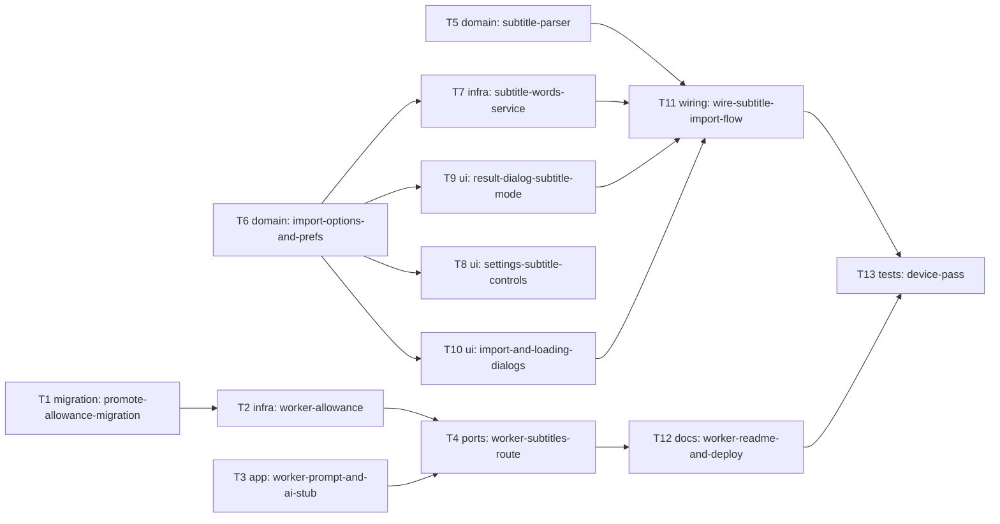

# Epic — words-from-subtitles

> **Spec:** [spec.md](../spec.md) · **Design:** [sad.md](../sad.md) · **UX flows:** [ux-flows.md](../ux-flows.md) · **Data model:** [data-model.md](../data-model.md) · **API:** [openapi.yaml](../contracts/openapi.yaml) · **ADRs:** [adr/](../adr/)

## Goal

The learner turns a subtitle file into a reviewed word list in the current session without typing a word. The words are above the chosen level, fit the purpose, never exceed the maximum, and afterwards behave exactly like photo or typed words (spec §2).

## Scope

- **In:** the Worker (the allowance migration and counters, the prompt and model allow-list, `POST /subtitles/words`, README) and the phone app (the subtitle parser, option types and preferences, the service, Settings, the import, loading and results dialogs, the speed-dial flow), plus a device pass. Surfaces: `[mobile-app, backend-service]` (sad frontmatter).
- **Out:** searching subtitles by film name, playing video, storing the film sentence or name on the word row, remembering known words across sessions (spec §3), and any change to the shared page (ADR-0001).

## Task map

The Worker lane (T1 → T2, with T3 alongside, then T4) and the app lane (T5 and T6 first, then T7 to T10) start in parallel. They meet at T11 through the contract, not through code.

## Tasks

See [tracker.md](./tracker.md) for status. Machine contract: [tasks.json](../tasks.json).

| # | Task | Layer | Blocked by | ACs |
|---|---|---|---|---|
| T1 | Promote the subtitle allowance migration into the Worker | migration | — | AC-14 |
| T2 | Take one subtitle import from the address window and the daily cap, and clean up old windows | infra | T1 | AC-14 |
| T3 | Build the pick-words prompt, the per-model request and the reply check, with a local AI stub for tests | app | — | AC-06, AC-07, AC-08, AC-19, AC-21 |
| T4 | Serve POST /subtitles/words per the contract and register it behind the app secret | ports | T2, T3 | AC-06, AC-10, AC-12, AC-13, AC-14, AC-15, AC-19, AC-20, AC-21 |
| T5 | Strip SRT and VTT files to dialogue lines in pure Dart | domain | — | AC-08, AC-10 |
| T6 | Add the import option types, the price table and the import preferences notifier | domain | — | AC-01, AC-05, AC-05b, AC-09, AC-21 |
| T7 | Call POST /subtitles/words from the app and map every answer to its message | infra | T6 | AC-10, AC-12, AC-14, AC-21 |
| T8 | Add the subtitle import controls and the model picker to Settings | ui | T6 | AC-05, AC-05b, AC-09, AC-21 |
| T9 | Rename Description to Definition and add the info line and empty message to the results dialog | ui | T6 | AC-18, AC-20, AC-21 |
| T10 | Add file_selector and build the import dialog and the loading dialog | ui | T6 | AC-01, AC-09, AC-11 |
| T11 | Wire the From subtitles speed-dial item through parse, request, results and Done | wiring | T5, T7, T9, T10 | AC-01, AC-02, AC-03, AC-04, AC-05, AC-05b, AC-06, AC-10, AC-12, AC-14, AC-16, AC-17 |
| T12 | Document the subtitle route, its migration and the AI stub in the Worker README | docs | T4 | AC-13, AC-14 |
| T13 | Run the device pass for the spec §6 targets on 5 films and every model | tests | T11, T12 | AC-02, AC-06, AC-12, AC-17, AC-19, AC-21 |

## Risks / Hard rules

- **CLAUDE.md:** dialogs only, with no new route (rule 1); services come from providers and state lives in a `@riverpod` notifier (rule 2). Rule 3 has overrides scoped to this feature (sad §11): the new dialogs and Settings controls, the "Definition" label and the cost line; the photo flow otherwise must not change. Rule 5: `file_selector` is the only new package (T10). If any task can't be done as written, stop and note it (rule 6).
- **Spec amendment still pending.** Preferences follow the amended model: one set of values plus "Update with each import", first launch B2 (sad §6 notes, data-model.md). Spec §1, US-03, AC-05 and CONTEXT still carry the old wording, so run `/sdd:clarify words-from-subtitles` before T6, T8 and T11 are reviewed against AC-05.
- **No `screens.md`.** The `screens` stage was skipped, so the `ui` tasks build to the ux-flows SCR ids and reuse the existing Settings controls and the results dialog.
- **Contract constants shared across lanes.** 1 MB = 1,048,576 bytes in T4, T5 and T10; line ≤ 200 chars in T4 and T5; the model ids in T3 and T6 (contracts/openapi.yaml).
- **Spend.** Worker tests never call the real Anthropic API (T3 stub). The device pass (T13) is spread over two UTC days because of the 20-a-day cap.
- **Before finishing any app task:** `dart run build_runner build --delete-conflicting-outputs`, `flutter analyze`, and the CLAUDE.md grep.
