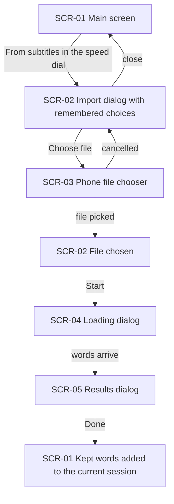
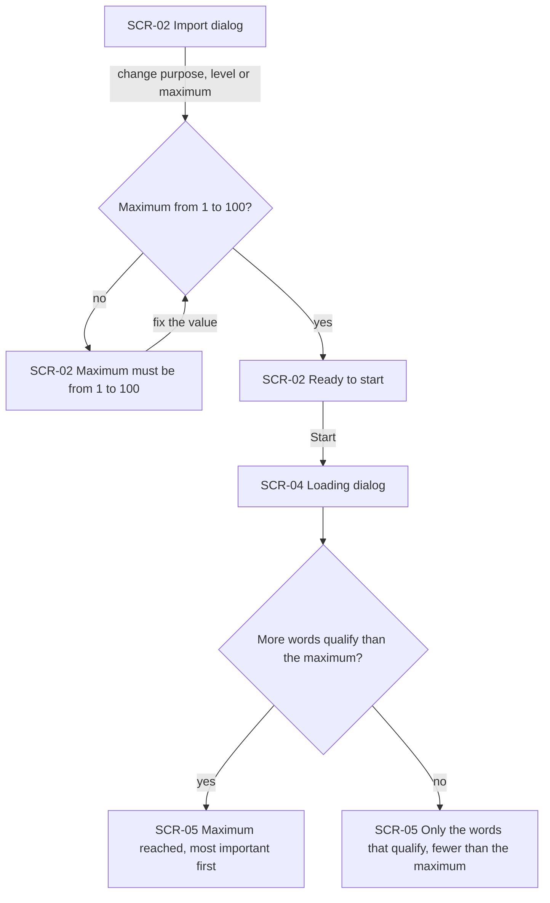
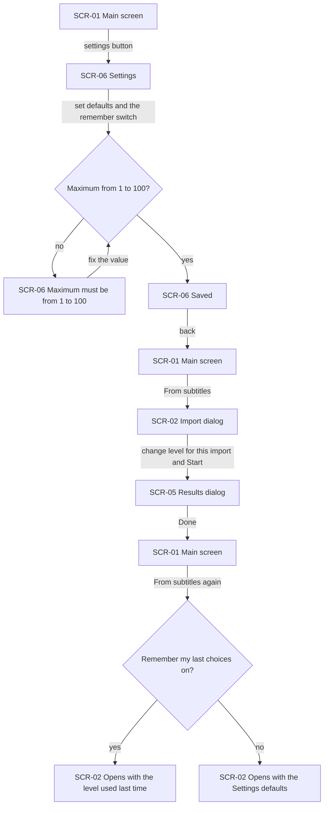
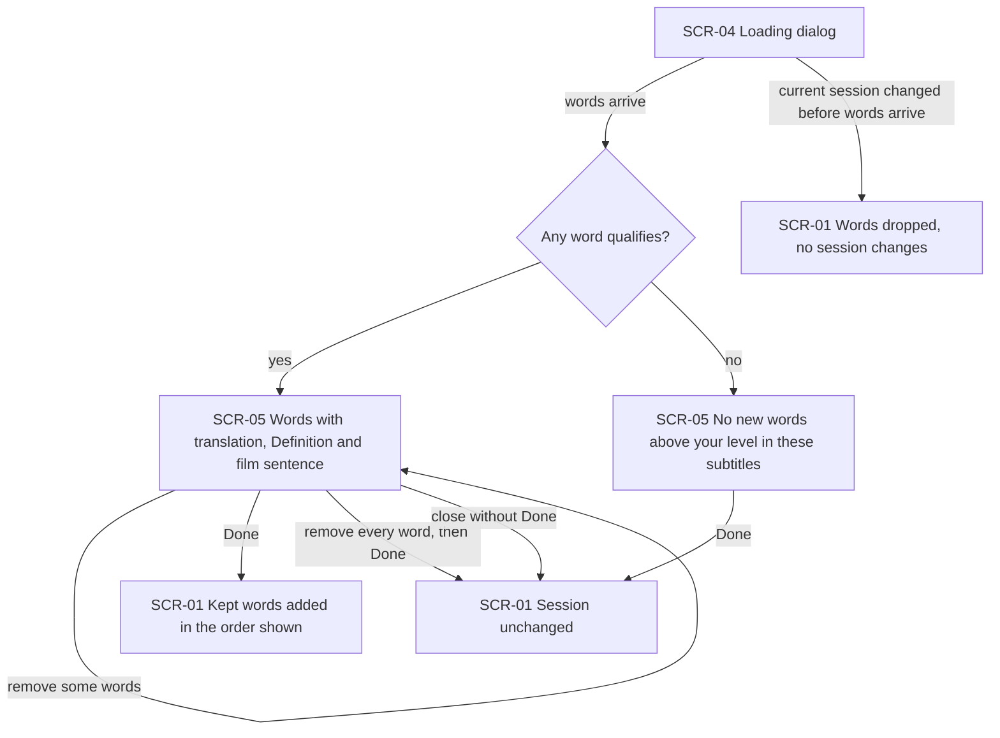
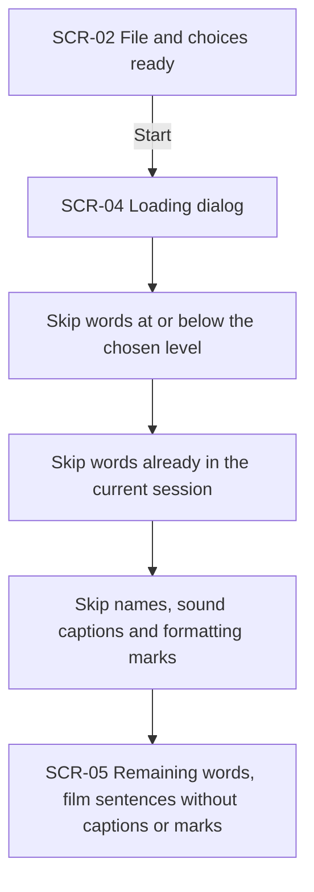
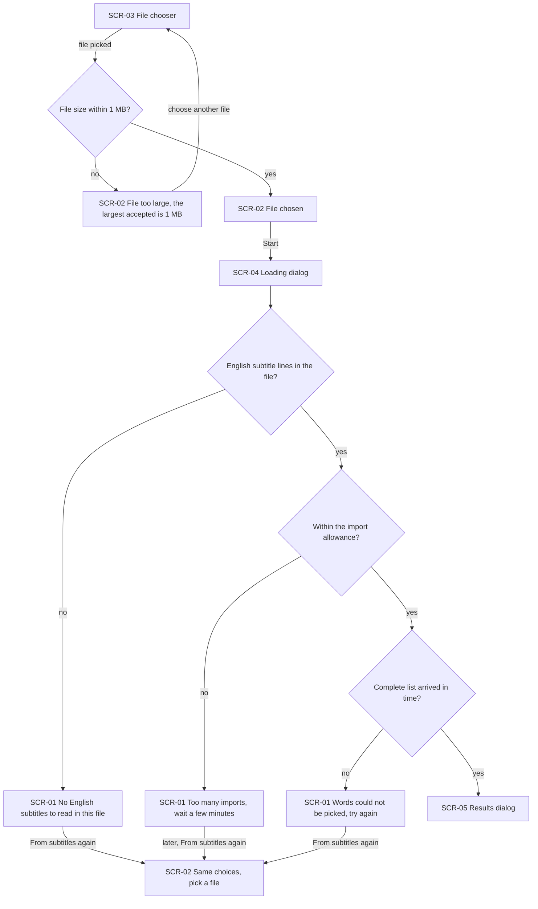
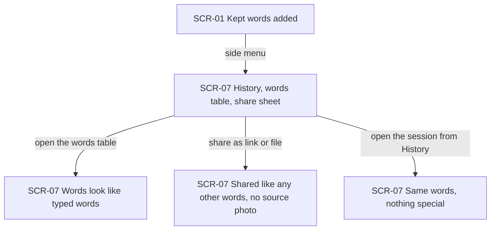

# UX flows — words-from-subtitles

> User flows for every UI-touching §4 user story of [spec.md](./spec.md), produced by `ux-flows` (after `clarify`, before `design`) and read by `design` (evidence for the target-surface + UI-architecture decisions), `sequences` (UI-driven flows align on SCR ids), `screens` (details every inventory row) and `plan-tests` (the e2e-through-UI paths). **Always markdown + mermaid `flowchart`**, whatever the design tool — this artifact is flow-altitude, not visual design.

## Platform decisions

- **Posture:** mobile-only — the owner's choice (2026-09-30). There is no `docs/design-system.md` yet. The feature lives only in the phone app; the shared page has no subtitle import (AC-13).
- **Everything happens in dialogs over the main screen** (owner, 2026-09-30). The speed dial's "From subtitles" item opens the import dialog; Start closes it and shows a loading dialog; the words arrive in the results dialog. There is no import screen and nothing to navigate back from.
- **Trying again means opening the import dialog again** from the speed dial. It opens with the remembered choices (or the Settings defaults when remembering is off); the subtitle file has to be picked again.
- **The loading dialog cannot be dismissed.** It ends only when the words arrive or an error is shown, so the learner cannot switch sessions while an import runs (AC-16).
- **Errors after Start close the loading dialog and show a message on the main screen** with the session unchanged. A file over the size limit is refused inside the import dialog, before Start.
- **Settings gains the default purpose, level and maximum plus a "remember my last choices" switch** (on by default), on the existing Settings screen.
- **Design input flagged, not decided here:** a 100-word list may need to be fetched in parts. Which package opens files is decided in `design`, per the owner's approval.

### Assumptions ledger (easy depth)

- Assumed: the subtitle file is not remembered between imports, only the purpose, level and maximum — a different film is the usual next import.
- Assumed: the remember switch is on by default — the owner expects the level and maximum to change rarely.
- Assumed: closing the results dialog without Done, or Done with every word removed, returns to the main screen with the session unchanged.

## Screen inventory

| ID | Screen | Purpose | Entry | Exit |
|---|---|---|---|---|
| SCR-01 | Main screen (word input) | The current session's words; the speed dial has a "From subtitles" item next to "take photo"; error messages after a failed import appear here | App launch; any dialog below closing | SCR-02 from the speed dial; SCR-06 from the settings button; SCR-07 from the side menu |
| SCR-02 | Import dialog | Pick the subtitle file, purpose, English level and word maximum, then Start | "From subtitles" in the SCR-01 speed dial; back from SCR-03 | SCR-03 to pick a file; SCR-04 on Start; closed back to SCR-01 |
| SCR-03 | Phone file chooser | The phone's own screen for picking a file | "Choose file" in SCR-02 | Back to SCR-02, with or without a file |
| SCR-04 | Loading dialog | Shows that words are being picked; cannot be dismissed | Start in SCR-02 | SCR-05 when the words arrive; SCR-01 with an error message |
| SCR-05 | Results dialog | The proposed words with translation, definition and film sentence, each removable; Done adds the rest | Words arrive while SCR-04 shows | Done or close → SCR-01 |
| SCR-06 | Settings screen | Existing settings plus the default purpose, level, maximum and the "remember my last choices" switch | The settings button on SCR-01 | Back to SCR-01 |
| SCR-07 | History, words table and share sheet | Existing screens where the session and its words are viewed and shared | Side menu on SCR-01 | Back to SCR-01; the shared link or file |

## Flows

### Flow: US-01 — Import words from a subtitle file

The learner taps "From subtitles" in the speed dial and the import dialog opens over the main screen with the purpose, level and maximum already chosen (AC-01). "Choose file" opens the phone's file chooser; cancelling returns to the dialog unchanged. With a file chosen, Start closes the import dialog and shows the loading dialog (AC-02). When the words arrive the results dialog opens, and Done leaves the learner on the main screen with the kept words at the end of the current session. Closing the import dialog without Start changes nothing.

### Flow: US-02 — Say what I need from this film

In the import dialog the learner can change the purpose, the level or the maximum. A maximum below 1 or above 100 is not accepted, and the dialog says it must be from 1 to 100 until it is fixed (AC-09). After Start, if more words qualify than the maximum, the results dialog shows exactly the maximum, with the most important words for the chosen purpose first (AC-19, AC-07). If fewer qualify, it shows only those and never pads the list with easier words (AC-06).

### Flow: US-03 — Keep my usual choices

In Settings the learner sets the default purpose, level and maximum and the "remember my last choices" switch; a maximum outside 1–100 is refused with the same message as in the import dialog (AC-09). The import dialog opens with the chosen values (AC-01). After an import where the learner changed the level, the next import dialog opens with that changed level while the switch is on (AC-05), or with the Settings default again while it is off (AC-05b). Settings keeps its defaults either way.

### Flow: US-04 — Review before adding

When the words arrive, the results dialog lists each one with its translation, its definition under the label "Definition", and the sentence from the film (AC-02, AC-18). The learner removes the words they don't want; Done adds the rest at the end of the current session in the order shown (AC-03). Removing every word and tapping Done, or closing the dialog without Done, leaves the session unchanged (AC-04). If nothing qualifies, the dialog opens without the photo timing line, says "No new words above your level in these subtitles.", and Done changes nothing (AC-20). The loading dialog blocks switching sessions, and if the current session is no longer the one the import started in, the words are dropped (AC-16).

### Flow: US-05 — Only useful words

While the loading dialog shows, the words the learner doesn't need are left out: anything at or below the chosen level (AC-06), anything already in the current session, so another qualifying word can take its place within the maximum (AC-15), and names, sound captions and formatting marks (AC-08). The film sentences in the results dialog show only the spoken line. These are rules the learner sees in the result, not extra screens.

### Flow: US-06 — Understand what went wrong

A file over 1 MB is refused inside the import dialog with a message naming 1 MB, and the learner picks another (AC-11). Every failure after Start closes the loading dialog and leaves the learner on the main screen with the session unchanged and a plain message: "no English subtitles to read" for a file that is empty, isn't a subtitle file or has no English lines (AC-10); "wait a few minutes and try again" when the import allowance is used up (AC-14); "the words couldn't be picked, try again" for no connection, too long a wait or an incomplete list, and no partial list is ever shown (AC-12). To try again, the learner opens "From subtitles" again and finds the same purpose, level and maximum.

### Flow: US-07 — Share subtitle words as usual

After an import, the subtitle words are ordinary words of the current session. The words table, the share sheet (link or file) and History show them exactly like words typed by hand, with no source photo, and the shared page offers no subtitle import (AC-17, AC-13).

## Out of scope (considered, not drawn)

- AC-13 (authorization): the refusal of anyone who is not the learner's app is a service rule with no screen. The only visible part — the shared page offers no subtitle import — is noted under Flow US-07.
- AC-07 (the two purposes give different lists): a property of the result, shown by the purpose choice in Flow US-02; no separate path.

## AC coverage

| AC | Shown by | Notes |
|---|---|---|
| AC-01 | Flow US-01 → B; Flow US-03 → B | Import dialog opens with the chosen values |
| AC-02 | Flow US-01 → L → D; Flow US-04 → D | Loading dialog, then results with translation, definition, film sentence |
| AC-03 | Flow US-04 → Done → A | Kept words appended in the order shown |
| AC-04 | Flow US-04 → A0 | Remove all + Done, or close without Done: session unchanged |
| AC-05 | Flow US-03 → M → B2 | Remember on: opens with the level used last time; Settings default unchanged |
| AC-05b | Flow US-03 → M → B3 | Remember off: opens with the Settings default |
| AC-06 | Flow US-02 → D2; Flow US-05 → F1 | Never padded with easier words |
| AC-07 | Flow US-02 → R (purpose chosen on B) | Result property, see Out of scope |
| AC-08 | Flow US-05 → F3 → D | No names, captions, marks; clean sentences |
| AC-09 | Flow US-02 → E1; Flow US-03 → E | Maximum 1–100 in the dialog and in Settings |
| AC-10 | Flow US-06 → E2 | No English subtitles in the file |
| AC-11 | Flow US-06 → E1 | File over 1 MB refused in the import dialog |
| AC-12 | Flow US-06 → E4 | No partial list; try again from the speed dial |
| AC-13 | Flow US-07 prose; Out of scope | Service refusal has no screen; the shared page has no import |
| AC-14 | Flow US-06 → E3 | Import allowance reached |
| AC-15 | Flow US-05 → F2 | Words already in the current session skipped |
| AC-16 | Flow US-04 → X; platform decision | Loading dialog blocks switching; late words dropped |
| AC-17 | Flow US-07 → T, S, O | Like typed words, no source photo |
| AC-18 | Flow US-04 → D | Label "Definition" (photo dialog too) |
| AC-19 | Flow US-02 → D1 | Most important first, per purpose |
| AC-20 | Flow US-04 → N | "No new words above your level in these subtitles." |
