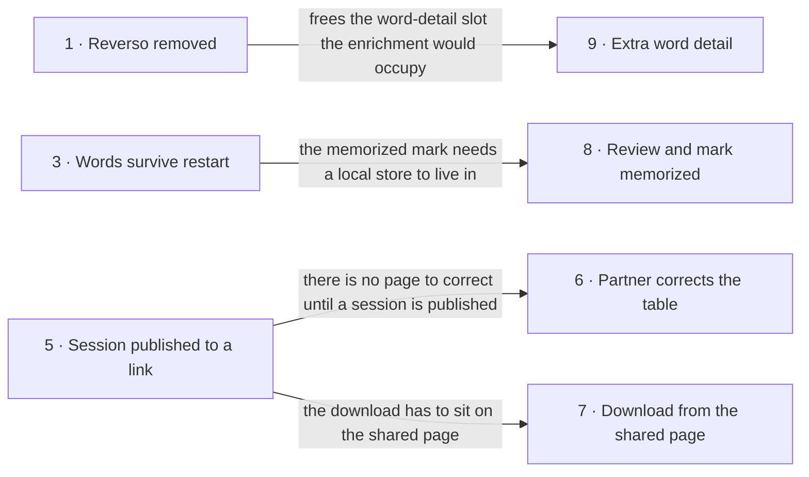

# Roadmap — flutter_vocabulary_app

> **A decomposition, not a promise.** The overall idea broken into incremental steps: what each
> step is, where it comes from, how big it is — or that nobody has looked at it yet — and in which
> order, and parallel lanes, we walk them. **No dates** (except shipped history), **no scores** —
> order is the prioritization. The *solution* for any step lives in its `docs/features/<slug>/`
> spec, not here.

## Destination

A learner photographs a highlighted page, gets exactly the marked words with translation and
pronunciation into a list they own on their device, shares that list live with the one or two
people across the table through a link, and leaves with an AnkiDroid-importable file.

## Steps

| # | Step | Source | Size | Status |
|---|---|---|:---:|---|
| 1 | Reverso is gone from the app and the Worker — no dead routes, no popup that can't answer | `idea-brief.md` §5 Out of scope | S | idea |
| 2 | The word limit is a cap, not a quota — the app never shows a word that wasn't highlighted | `idea-brief.md` §6 Risks | S | idea |
| 3 | Collected words survive an app restart | `idea-brief.md` §7 Recommendation | M | idea |
| 4 | Hear a word in UK and US pronunciation | `idea-brief.md` §7 Recommendation | S | idea |
| 5 | Publish a session to a durable shared link the partner can open and read | `idea-brief.md` §1 Raw idea | M | idea |
| 6 | The partner corrects the word table on the shared page | `idea-brief.md` §1 Raw idea | M | idea |
| 7 | Download the AnkiDroid file straight from the shared page | `idea-brief.md` §7 Recommendation | S | idea |
| 8 | Review collected words on the device and mark one memorized | `idea-brief.md` §5 Out of scope | S | idea |
| 9 | Extra word detail now that Reverso is out → see [Not yet specified](#not-yet-specified) | `idea-brief.md` §8 Open questions | fog | idea |

Steps 2 and 3 correct things the brief treats as already-solved ground. Two lookups during this
pass moved them: the padding guard step 2 pins is **already in the Worker prompt**, and the Worker
truncates server-side too (`vocab-photo-api/src/index.ts:81`, `:256`) — so step 2 is a
device-verified test plus the drop-rule decision (D2), not a repair. And the word list is
**in-memory only** today (`lib/screens/word_input_screen.dart:33`), which is why step 3 has to
precede step 8 rather than sitting beside it.

Photo capture with highlighted-word extraction, one-tap translation, and the TSV/AnkiDroid share
sheet already work (`lib/screens/words_table_screen.dart:56`); they are not steps here.

## Not yet specified

| Area | What we'd have to learn | Blocks | How it gets sharpened |
|---|---|:---:|---|
| Extra word detail after Reverso | What detail is actually worth showing in the word-detail slot Reverso used to fill, where it comes from, and whether it is fetched per word on demand or batched at capture time. The recon leg is half-done — `dictionaryapi.dev` is live, key-less and rate-limit-free — but nobody has looked at what its response contains for the kind of words this app collects, nor whether definition-in-English is the detail the owner wants at all. | 9 | Close D3 (one conversation about what the slot is for), then a recon pass over the candidate's real responses for a handful of collected words |

## Out of scope

- Own learning / spaced-repetition engine — learning is outsourced to AnkiDroid.
- Languages other than English↔Ukrainian — closed deliberately; a later migration is the accepted cost.
- Session → app sync-back — corrections on the shared page do not flow into the app; the file download is the only return path.
- Reverso as an information source — the free tier does not work.
- A dictionary for English→Ukrainian translation — no free one was found; machine translation stays the only translation source.
- Accounts, passwords, permissions on the shared page — a link is the only credential.
- Large groups — the shared page targets two, at most three people.
- The memorized mark in exported files — the mark stays on the device and is never exported.

## Open decisions

| # | Question | Type | Owner | Blocks |
|---|---|:---:|:---:|:---:|
| D3 | Whether an English-description dictionary is the right thing for the word-detail slot at all, and if so whether `dictionaryapi.dev` is accepted as the source | grilling | human | 9 |
| D7 | What the machine-translation source becomes for typed words once quality complaints appear — the photo path already uses a stronger context-aware translation than the typed path | research | agent | — |

## Decisions so far

- Learning stays in AnkiDroid; the app collects and exports, it does not teach → [`docs/idea-brief.md`](./idea-brief.md)
- English↔Ukrainian only in the first version; a later language migration is the accepted cost → [`docs/idea-brief.md`](./idea-brief.md)
- A link is the only credential on the shared page — no accounts, no permissions → [`docs/idea-brief.md`](./idea-brief.md)
- The shared session is designed source-agnostic from the start, so a future capture source is an addition rather than a rewrite → [`docs/idea-brief.md`](./idea-brief.md)
- Reverso is out; its Worker endpoints return a flat 403 from Cloudflare IPs and the device-direct path is unverified → [`vocab-photo-api/README.md`](../vocab-photo-api/README.md)
- **D1** — UK/US pronunciation is on-device TTS (`flutter_tts`, en-GB/en-US locale switch): offline, no key, UK+US always guaranteed → [`docs/tasks/task-04-uk-us-pronunciation.md`](./tasks/task-04-uk-us-pronunciation.md)
- **D2** — over the word limit, the Worker keeps the first N highlighted words in reading order and drops the rest; the prompt's "most useful/valuable" ranking clause is removed → [`docs/tasks/task-02-word-limit-is-a-cap.md`](./tasks/task-02-word-limit-is-a-cap.md)
- **D4** — a published session (and its photos) lives for a 30-day TTL via Cloudflare KV `expirationTtl`; no delete endpoint in v1 → [`docs/tasks/task-05-publish-session-link.md`](./tasks/task-05-publish-session-link.md)
- **D5** — the shared page renders one photo per session in v1; the session document stores `sources` as a list from day one so a second photo is an addition, not a migration → [`docs/tasks/task-05-publish-session-link.md`](./tasks/task-05-publish-session-link.md)
- **D6** — no per-visitor names on the shared page; identity carries no behaviour in v1 → [`docs/tasks/task-06-partner-corrects-table.md`](./tasks/task-06-partner-corrects-table.md)
- Architecture, simplified: one `lib/` with feature folders, go_router typed routes, Riverpod for services and the word list, `shared_preferences` for persistence; nothing else changes → [`architecture.md`](./architecture.md). The larger design (packages, Retrofit, Isar, ADRs) is parked on branch `chore/architecture-migration`.
- **D8** (2026-09-20) — words are stored as **Sessions** in `isar_community` (+ `isar_community_flutter_libs`, `isar_community_generator`, `path_provider` made direct); `shared_preferences` stays only for the `current_session_id` pointer and as the v1 migration source. A session older than 5 minutes is offered back through a snackbar, not restored silently. Reasoning is the parked ADR-0004 on `chore/architecture-migration`, applied without the repository layer → [`docs/tasks/task-03-words-survive-restart.md`](./tasks/task-03-words-survive-restart.md), [`task-10`](./tasks/task-10-side-menu-and-history.md)
- The Worker carries no KV/D1/R2/Durable-Object binding today, only a rate limiter — a persistent session store is a new binding → [`vocab-photo-api/wrangler.jsonc`](../vocab-photo-api/wrangler.jsonc)

## Dependency graph

Four edges, and that is all of them. Everything else in the execution path below is serialized by
**file conflict, not dependency** — `lib/screens/word_input_screen.dart` is 1282 lines and most
steps reach into it, so the zone column is doing more work here than the graph is.

## Execution path

| Wave | Steps | Zone per step (why parallel-safe) | Unlocks |
|:---:|---|---|---|
| 1 | 1 | `lib/widgets/reverso_info_popup.dart` + `lib/screens/word_input_screen.dart` + `vocab-photo-api/src/reverso.ts` — **alone**: the only step touching the app's word-detail UI and the Worker's route table in one change, so it collides with both 2 and 3 | 9's recon |
| 2 | 2 ∥ 3 | 2: `vocab-photo-api/src/index.ts` + `test/` · 3: `lib/services/` + `lib/screens/word_input_screen.dart` (disjoint — Worker vs app) | 8 |
| 3 | 4 ∥ 5 ∥ 8 | 4: `lib/widgets/synced_text_field_row.dart` · 5: `vocab-photo-api/src/session/` (new) + `lib/screens/words_table_screen.dart` · 8: a new screen in `lib/screens/` + `lib/main.dart` (three disjoint file sets) | 6, 7 |
| 4 | 6 | `vocab-photo-api/src/session/` (new) — same zone as 7, so the two cannot share a wave | 7 |
| 5 | 7 | `vocab-photo-api/src/session/` (new) | — |

Step 9 never enters a wave: it has no size and no shape yet, so what gets scheduled is its recon
pass, not the work.

The zones above are a **first cut** from reading the tree. **Wave 0 — `tasks/task-00-restructure.md`**
(`refactoring-plan.md`) runs right after step 1: after it the word list lives in one notifier and the
screen is split into widget files, so tasks stop colliding on one 1,300-line file. Rules for any
code change: [`architecture.md`](./architecture.md).

## Shipped

| Step | Shipped | Link |
|---|---|---|

Nothing from this roadmap has shipped yet.
