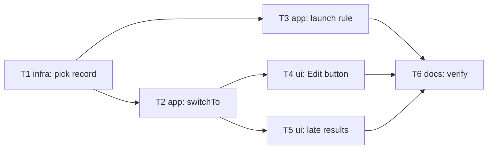

# Epic — edit-session-from-history

> **Spec:** [spec.md](../../../features/edit-session-from-history/spec.md) · **Design:** [sad.md](../../../features/edit-session-from-history/sad.md) · **ADRs:** [adr/](../../../features/edit-session-from-history/adr/) · Data model / API: N/A (no schema or contract change — quick route)

## Goal

The learner can carry on with any earlier session in two taps from History, never losing a word from either session, and History stays ordered by real edits ([spec §2](../../../features/edit-session-from-history/spec.md)).

## Scope

- **In:** `SessionStore` (pick record), `WordInputNotifier` (switchTo, launch rule), the History words screen (button + question), the main screen (late-result guard, restore snackbar).
- **Out:** editing on the History screen, merging sessions, shared-page changes, deleting sessions ([spec §3](../../../features/edit-session-from-history/spec.md)).

## Task map

T2 and T3 share `word_input_notifier.dart`, so `implement` runs them one after the other; T4 and T5 run in parallel.

## Tasks

See [tracker.md](./tracker.md) for status. Machine contract: [tasks.json](../../../features/edit-session-from-history/tasks.json).

| # | Task | Layer | Blocked by | DoD (short) |
|---|---|---|---|---|
| T1 | Store the pick record beside the current-session pointer | infra | — | record read back only for its own id |
| T2 | Add WordInputNotifier.switchTo | app | T1 | switch, save/drop left, fail cleanly |
| T3 | Let the launch rule honour a recent pick | app | T1 | two relaunches within 5 min reopen the pick |
| T4 | Add the red Edit button and question | ui | T2 | button rules, No/Yes, error snackbar |
| T5 | Drop late results and hide the restore snackbar | ui | T2 | late results never touch the picked session |
| T6 | Verify on the device and update the docs | docs | T3, T4, T5 | device checklist + gate clean |

## Risks / Hard rules

- CLAUDE.md rule 3: only the button and question may look new; guards are added lines, not rewrites.
- CLAUDE.md rule 1: navigation via `WordInputRoute().go`, no `Navigator.push`.
- ADR-0002: never stamp `updatedAt` / `lastLocalModifiedAt` on a switch.
- sad §11: every late-result path must be guarded (T5 enumerates them).
