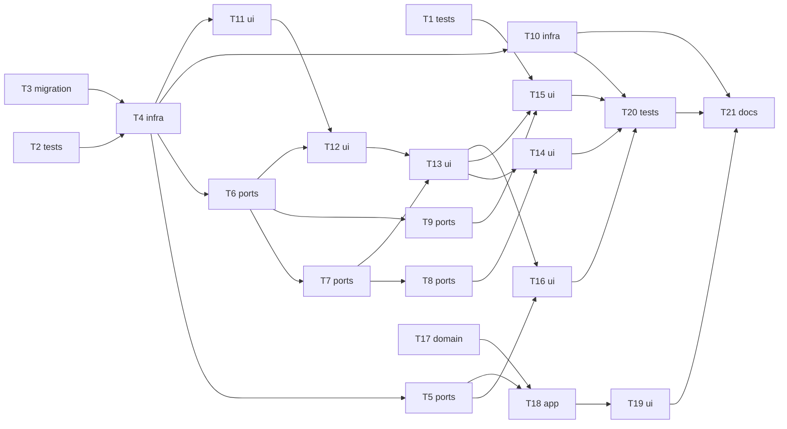

# Epic — good-looking-web

> **Spec:** [spec.md](../../../features/good-looking-web/spec.md) · **Design:** [sad.md](../../../features/good-looking-web/sad.md) · **UX flows:** [ux-flows.md](../../../features/good-looking-web/ux-flows.md) · **ADRs:** [adr/](../../../features/good-looking-web/adr/) · **Machine contract:** [tasks.json](../../../features/good-looking-web/tasks.json)
>
> `sequences`, `data-model`, `api` and `screens` were not run for this feature: the D1 schema is fixed in T3, the Worker contract in T5–T9, and the page layout (incl. spec OQ-5) in T11 with the owner's confirmation.

## Goal

The shared page becomes a working table a partner can read on any device, edit, extend and autofill, with the source photos beside the words they came from — and the file downloaded from it carries every correction to AnkiDroid (spec §2). The app keeps each source photo with its rows and publishes them behind an "include photos" switch.

## Scope

- **In:** the Worker (D1 store, edit API, change feed, metered autofill, publish contract, download, clean-up), the shared page (server-rendered two-layout table + plain-JS client), the app (photo keeping, publish payload, background upload, share-sheet switch). Surfaces: `mobile-app`, `backend-service`, `web-frontend` (ADR-0001).
- **Out (spec §3):** edits flowing back into the app; live keystroke co-editing; adding words from a photo on the page; deleting a session or photo before 30 days; row highlighting on a phone; per-visitor names or history.

## Task map

Three lanes can start at once: the translation spike (T1), the Worker (T2/T3 → …), and the app (T17). The browser script (`client/page.js`) is one file, so T12 → T13 → T14/T15/T16 run in that order.

## Tasks

See [tracker.md](tracker.md) for status.

| # | Task | Layer | Blocked by | DoD (short) |
|---|---|---|---|---|
| T1 | [Spike: get a translation from the free endpoint in the partner's browser](t1-spike-browser-translation.md) | tests | — | The spike page returns translations for ≥18 of 20 words in Chrome and Safari, or the blocking error is quoted |
| T2 | [Add a node:test harness that runs against wrangler dev](t2-worker-test-harness.md) | tests | — | `npm test` passes locally from a clean checkout (after `npm install`) |
| T3 | [Create the D1 schema for sessions, rows, cell revisions, photo slots and counters](t3-d1-schema.md) | migration | — | Staged migration is promoted to `vocab-photo-api/migrations/`, then `wrangler d1 migrations apply --local` applies it and the down file reverts it cleanly |
| T4 | [Move session storage to D1, with a lazy import of pre-feature KV links](t4-d1-store-and-legacy-import.md) | infra | T2, T3 | node test: publish → page shows the rows from D1 |
| T5 | [Accept declared photos, row photo ids and republish tokens in the publish contract](t5-publish-contract-photos-and-republish.md) | ports | T4 | node test: publish with 2 declared photos and linked rows → page data links rows to slots; typed rows have none (AC-25) |
| T6 | [Save cells with a per-cell revision check and limits](t6-save-cell-with-revision-check.md) | ports | T4 | node test: two saves from the same base revision → first lands, second gets `conflict` with the first value (AC-11) |
| T7 | [Add and delete rows, and rate-limit page writes](t7-add-delete-rows-and-write-limit.md) | ports | T6 | node test: add then save — row persists; a row never given text does not exist after reload (AC-13) |
| T8 | [Serve the change feed since a revision](t8-change-feed.md) | ports | T7 | node test: save then poll from the old revision returns exactly that cell; poll from the new revision returns nothing |
| T9 | [Meter definition autofill with the page allowance and the all-pages share](t9-metered-definition-autofill.md) | ports | T6 | node test: 51st lookup on one page → `autofill_paused` with the resume time (AC-18) |
| T10 | [Build the AnkiDroid file from D1 and clean up expired sessions daily](t10-download-and-daily-cleanup.md) | infra | T4 | node test: file contains edited values; empty-word and all-cleared rows absent (AC-30, AC-31) |
| T11 | [Render the two-layout table, photo markup and CSP on the server](t11-server-rendered-two-layout-page.md) | ui | T4 | node test: HTML escapes `<script>` in a cell (AC-33) and sends the CSP header |
| T12 | [Edit cells in place with save-on-leave, saved/not-saved states and conflict choice](t12-client-cell-editing-and-conflicts.md) | ui | T6, T11 | `npm run typecheck` checks the script |
| T13 | [Add rows with the plus button and delete rows with a 5-second Undo](t13-client-add-and-delete-with-undo.md) | ui | T7, T12 | Manual: add + type + reload keeps the row; add without text + reload → gone (AC-13) |
| T14 | [Poll for other partners' changes, pausing when hidden and stopping after 5 idle minutes](t14-client-polling-with-idle-stop.md) | ui | T8, T13 | Manual with two browsers: 20 edits in A each appear in B within 10 s (spec §6) |
| T15 | [Autofill a cell or a whole column, and open a collapsed column](t15-client-autofill.md) | ui | T1, T9, T13 | Manual: definition column with 8 empty and 4 filled → 8 looked up, 4 unchanged, report shown (AC-19) |
| T16 | [Show the photo pager with row highlighting and the phone photo dialog](t16-client-photo-pager-and-dialog.md) | ui | T5, T13 | Manual with a 3-photo session: pager position, highlighting and scroll-to-first behave per AC-05; typed rows never highlight (AC-06) |
| T17 | [Keep each source photo in the app and link recognised rows to it](t17-app-keep-source-photos.md) | domain | — | Unit test: a session saved before this change loads with no sources and null sourceIds (AC-26) |
| T18 | [Publish rows with photo links and upload declared photos in the background](t18-app-publish-photos-and-background-upload.md) | app | T5, T17 | MockClient test: payload with photos off has no `sources`/`sourceId` (AC-24) |
| T19 | [Add the include-photos switch and the republish warning to the share sheet](t19-app-share-sheet-include-photos.md) | ui | T18 | Widget test: switch shows with N and the 30-day note when photos exist, hidden otherwise (AC-23) |
| T20 | [Run the concurrency, limits and performance checks from sad §10](t20-nfr-verification.md) | tests | T10, T14, T15, T16 | Concurrency test green with 0 lost edits |
| T21 | [Update the docs and run the deploy checklist](t21-docs-and-deploy-checklist.md) | docs | T10, T19, T20 | README steps followed on the real account; R2 lifecycle rule confirmed (screenshot or dashboard note) |

## Risks / Hard rules

- 0 lost edits, cell save p95 ≤ 1.0 s, others' edits ≤ 10 s, 50 / 500 autofill caps, ≤ 500 rows / 500 chars / 256 KB / 10 photos (spec §6) — no task may relax these.
- T1 gates T15: if the browser cannot reach the translation endpoint, ADR-0007 is superseded before T15 starts.
- Release order (sad §7): D1 migration → Worker deploy (T5 before T18 reaches users) → app build.
- CLAUDE.md: no new packages (Worker tests use `node --test`); typed routes and providers only; the app's input screen and words table stay pixel-identical (sad §2 overrides cover the share sheet and the page only).
- sad §11: R2 lifecycle rule confirmed before release (T21); OQ-5 widths confirmed by the owner in T11.
